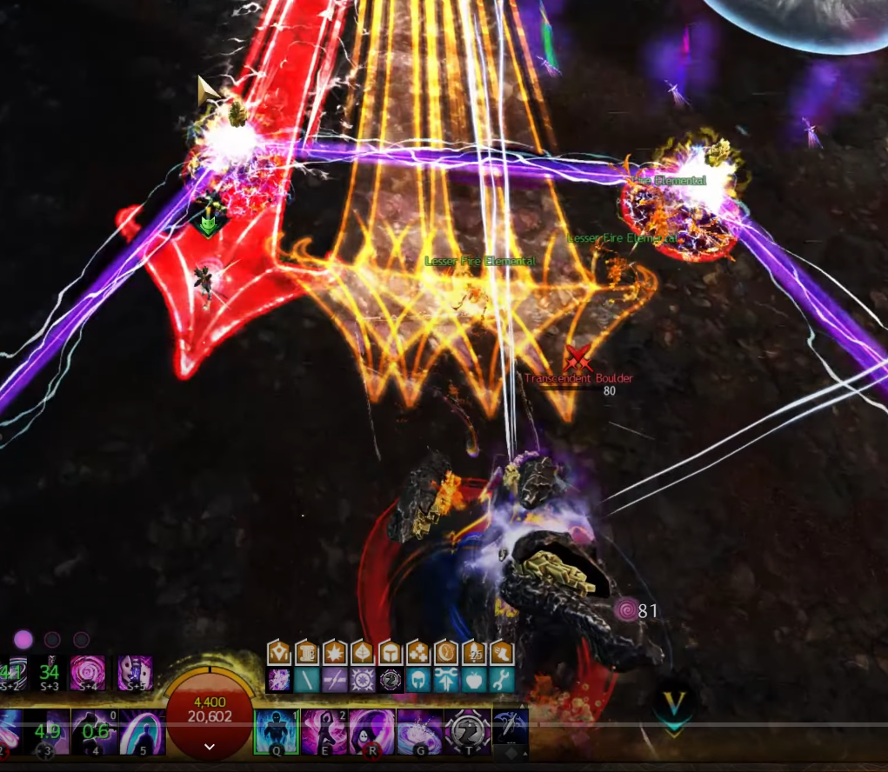
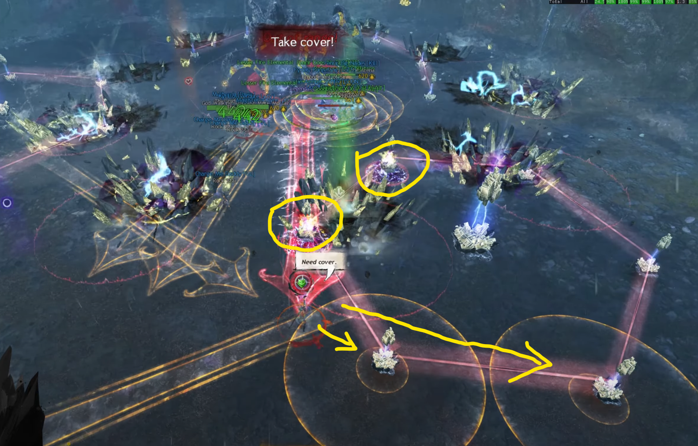

[Return to Home](../index.html){: .btn } [Return to Overview](./overview.html){: .btn } [Mechanical Reference](./mechanics.html){: .btn }

# Recommended Strategy

This strategy is a written version of this [PoV](https://www.youtube.com/watch?v=Qsf582waMDM) and uses Commander Markers from this pack:

```
eyJlbmFibGVkIjp0cnVlLCJuYW1lIjoiRGVjaW1hIENNIFN0cmF0ZWd5IiwiZGVzY3JpcHRpb24iOiJEZWNpbWEgQ00gc3RyYXRlZ3kgbWFya2VycyBwYWNrIGJ5IE1pa2UgW0NSU10iLCJtYXBJZCI6MTU2NCwidHJpZ2dlciI6eyJ4IjotMjc2LjU1NjEyMiwieSI6MjY1Ljc3OTU3MiwieiI6MTM4LjUxNjc2OX0sIm1hcmtlcnMiOlt7ImkiOjEsImQiOiJTb3V0aCBtYXJrZXIiLCJ4IjotMjU2Ljk5MDEsInkiOjMxNi40OTY0NiwieiI6MTM4LjUyMjM1NH0seyJpIjoyLCJkIjoiV2VzdCBtYXJrZXIiLCJ4IjotMjc3LjA4MzI4MiwieSI6MzM5LjE4OTk0MSwieiI6MTM4LjUyMjM1NH0seyJpIjozLCJkIjoiTm9ydGggbWFya2VyIiwieCI6LTI0OC41NDI3NCwieSI6MzQ3LjI0NDE0MSwieiI6MTM4LjUyMjM1NH0seyJpIjo3LCJkIjoiUm9sbCBvdXQgc3BvdCEgKHN0YXJ0aW5nIGxvY2F0aW9uKSIsIngiOi0yODIuNDU2MiwieSI6MjczLjQ2MDksInoiOjEzOC41MTY1fV19
```

The squad is separated in one ranged and one melee subgroup, each consisting of 5 players. The ranged group will spend a decent amount of time out of melee range and hence it is recommended to use approriate ranged builds. Both healers in either subgroup need to have one skill providing Stability and usually also bring a group Portal, which limits the typical Healers to Chronomancer, Scourge and Specter. However, in general this can also be played without a Portal. Other then that, you need to make sure to have enough Breakbar damage in your squad.

The fight starts by making use of Mount abilities to quickly enter the arena and get to Decima (Rollerbeetle, Raptor, ...).

## 100% - 80%

Decima starts with the attack pattern shown [here](https://silverhalf.github.io/mount-balrior/decima/mechanics.html#100---80). The [Foreshock & Mainshock] abilities are simply outhealed. Once you see Mainshock starting to cast (the 'pizza' attack), the ranged group needs to step away from the boss to bait the five [Fluxlances] and the Healer in the ranged group should bait the charging up of the conduits correctly. Correctly means to go to roughly the Arrow marker (see image below) in order to not charge up any of the outer conduits, because those are the ones encircling Decima in the split phase, which is why we don't want to charge them up.


Shortly after the bait, the [Fluxlances] will fire. Make sure to not hit any conduits and then quickly group up, heal up and rotate clock-wise to the Circle marker.

Next, give Stability to prevent the knockback from [Seismic Crash]. Immediately after, the ranged group has to bait the next set of [Fluxlances], while the melee group has to collect Greens. This set of [Fluxlances] contains the Red kiter Arrow, so make sure that the ranged Healer is the furthest player away. Use Blink/Shadowstep/Sandswell Portal to get outside behind a conduit, but make sure to not charge up one of the furthest away conduits to make the split phase easier.

After the Green collection and Fluxlances, the attack pattern starts from the beginning again, with [Foreshock & Mainshock]. Once the `pizza` attack starts, the ranged group needs to bait arrows again and in particular the ranged Healer needs to pay attention for baiting the conduit charges again, which can be baited at roughly the Heart marker.

Depending on dps, you may already phase now into the first split phase, or if not, you will get another Knockback that needs Stability.

## First Split Phase

For the split phase the ranged and melee group respectively stays together and walks to their respective closest [Transcendent Boulder] Add, which is usually ranged group to the Circle marker and melee group to the Arrow marker. The two healers can either preplace their portal before going to the Adds (Specter needs to do this because of the one-way Portal), or place it after playing the main mechanic during this split.

> Note that for the melee portal, the Healer needs to pay attention to not prepare the portal in front of Decima, but next to her, sideways. This is such that when melees take the portal later, they don't get hit by Decima's [Fluxlance] attacks, that may overlap with taking the portal.

While dps'ing the [Transcendent Boulder] adds down as fast as possible, it's important to not use any skills with Breakbar damage in order to skip their dangerous follow-up attacks. The main mechanic from Decima during this split will be a set of [Fluxlances] and [Thunders] (orange Circles) that need to be played. The ranged group will position themselves from the [Transcendent Boulder] add outward and the melee group inward, in order to bait the mechanics properly. The melee group can simply dodge their [Thunders], while the ranged group needs to pay attention to not charge any extra conduits; see the image below:



After the Fluxlances and Thunders, the two Healers can make their way to open the Portal to get everyone back to Decima. The ranged group should be ported outside the cage, while the melee group should optimally be ported into the cage.

## 80% - 70%

After taking the Portal, timing-wise, Decima usually uses [Seismic Crash] again, so make sure that Healers immediately provide Stability. The attack pattern is the same as usual, which means next in turn will be a set of [Fluxlances] and Green collection. Play the mechanics like before, heal everyone up and prepare your CC skills for when Decima hits 70%.

Decima will become immune to damage and jump into the middle of the arena. This is a knockback attack, so make sure to provide Stability again. Depending on dps, [Thunders] might also spawn, so be prepared to dodge them, while also paying attention to not dodge into any conduits. Afterward, Decima will gain a Breakbar of 7500, which needs to be broken as soon as possible. If broken quickly enough, there is no need to deal with any of the other mechanics (Green collection) and the only thing that'll happen next is a big incoming damage burst from [Fulminate]. Make sure that both groups are stacked up, use Barrier skills and time your strong healing skills to prevent any downs. If someone downs, everyone make sure to quickly ress.

## 70% - 50%

In this phase Decima repeats her attack pattern again, starting from [Foreshock & Mainshock] like in Phase 1. The melee group can stand near the Heart marker, while the ranged group can stand near the Arrow Marker.

The ranged group baits the conduit charges at Arrow and the [Fluxlances], spread apart without hitting any conduits and stack up quickly to heal up again. Afterward, the [Seismic Crash] attack will come again, so be prepared to provide Stability. Next, the melee group rotates toward Arrow to collect Greens, while ranged group baits left of Arrow the next set of [Fluxlances]. The ranged Healer needs to make sure they bait the Red Arrow again and to go/blink behind a conduit in order to survive. At the same time, [Thunders] may happend for the melee group, so be ready to dodge those. Next, Decima starts her attack pattern anew. The ranged group positions themselves between Arrow and Circle and the melee group can stand near Arrow. Either the boss will phase after the following set of [Fluxlance], or you may need to play another Green collection.

## Second Split Phase

Similar to before the two groups go to their closest [Transcendent Boulder] Add, while the Healers can prepare their Portal again. Usually, the melee group should go toward the Heart marker Add and the ranged group to the Add between Arrow and Circle. The split phase plays similar to before, no CC on the Add, ranged group positions themselves outward to bait [Fluxlances] and melee group inward to bait [Thunders]. The ranged group needs to pay attention again to not hit any conduits with [Fluxlances] and the melee group needs to time their dodge again. As soon as the [Transcendent Boulder] Add hits 1% and the two mechanics are done, use Portal again to quickly get back to Decima.

## 50% - 40%

This section plays similar to the 80% to 70% section. After taking portal, be ready to give Stability to prevent knockbacks. The melee group will be inside the cage collecting Greens, while the ranged group will be outside the cage baiting [Fluxlances]. Once Decima hits 40% again, be ready to dodge in case [Thunders] appear, while again not dodging into any conduits. Cast Stability when Decima jumps into the middle of the arena and be ready to CC again. Stack up into groups, use barrier skills and time your heal skills to heal through the big incoming damage of [Fulminate] again.

## 40% - 10%

Next, Decima will jump toward the edge of the arena. The jump is a [Seismic Crash] attack with a knockback, so make sure to provide Stability. The melee group can position themselves left of Decima when looking at Decima from the center of the Arena, while the ranged group just stays toward the center. She will start with her attack pattern from anew again, like at the start of Phase 1 and Phase 2. Once you see the pizza attack, bait the [Fluxlances]. The ranged Healer should move move toward the conduits on the right-hand side in order to bait the charging up of conduits there. In phase 3, the first set of five [Fluxlances] additionaly has the Green Arrow, which is located opposite of the furthest player (usually baited by the ranged Healer), but snapping to one of the larger centered conduits. If the ranged Healer baits correctly on the right-hand side, the Green Arrow spawns to the left of Decima and the melee group will already be at that side. Everyone in the melee group needs to go inside the Green Arrow. This can overlap with [Thunders], which can be solved by simply going into the Green Arrow and dodging [Thunders] backward, along the Green Arrow. This is important to not fail the Green Arrow mechanic.

Next, instead of using [Seismic Crash] on the spot, Decima will use it while jumping to a different location. Be ready to provide Stability and follow Decima to the new location. The melee group can position themselves to stand between Decima and the conduits that have been charged up already. In the example PoV, the charged conduits are to the right-hand side after Decima's jump. This means the melee group moves to the right side. After the jump, Decima will start with [Foreshock & Mainshock] again. Toward the end, once the pizza attack appears, the ranged Healer wants to make their way to bait conduits and the next Red Arrow close to the conduits that have been charged already, in order to make the Green collection come only from one side and be as easy as possible (see image below). The ranged Healer also needs to pay attention to the additional Orange arrows coming from two conduits in order to not charge any additional conduits.



After the [Fluxlances] the ranged Heal can blink back to the stack and Decima's attack pattern starts anew. Once you see the pizza attack, in addition to baiting the five [Fluxlance], the ranged Healer also needs to bait the Green Arrow again and the next set of charging up conduits. The bait for the Green arrow should this time go to the left-hand side, because the melee group is standing right of Decima, to minimize movement. In case [Thunders] happen on the melee group, dodge backward along the Green Arrow. At the same time, the ranged group needs to pay attention again to not hit any conduits with their own [Fluxlances].

Next, Decima will jump again, so have Stability provided. Decima will start with [Foreshock & Mainshock] and a Green collection again. The melee group needs to split into left and right in order to collect all Greens. After the pizza attack, the ranged group needs to bait [Fluxlances] with the ranged Healer kiting the Red Arrow again. Following, another set of [Foreshock & Mainshock] and [Fluxlances] with the Green Arrow and possibly [Thunders] will spawn. Play them similarly to before. At the latest after this Green Arrow, Decima should hit 10% and the final phase will start. Decima will become immune and jump into the center of the Arena, while resetting all conduits. The jump is a knockback, so have Stability up and at the same time Decima will cast any remaining [Thunders] so be ready to dodge. Depending on dps, it can happen that two subsequent [Thunder] casts happen. In that case be ready to dodge twice subsequently.

## 10% - 0%

The final phase is a burst phase, so you want to immediately deal as much damage as possible. Depending on the dps spec, it might be beneficial so safe some cooldowns for this phase (e.g. Weave Self). At the beginning, [Fluxlances] with a Red Arrow need to be baited and played again. Make sure to not hit any conduits, and the ranged Healer needs to make sure they bait the Red Arrow (be furthest away) and use blink behind a conduit to survive. After the [Fluxlances] exploded, stack up at the boss and dps. Throughout this phase, [Thunders] will spawn, which should be dodge into the boss. This is because around the boss, conduits will come closer and closer and dodging backward or sideways can hit and charge up conduits. Additionally, Green collections will spawn as well. Try to block them as good as you can, while focusing on dps and dodging [Thunders]. If 10 Greens move into Decima's hitbox, Decima will become immune and you will wipe. Hence it is important to block as many Greens as possible. Doing this successfully and keeping dps up will lead you to a successful clear.
