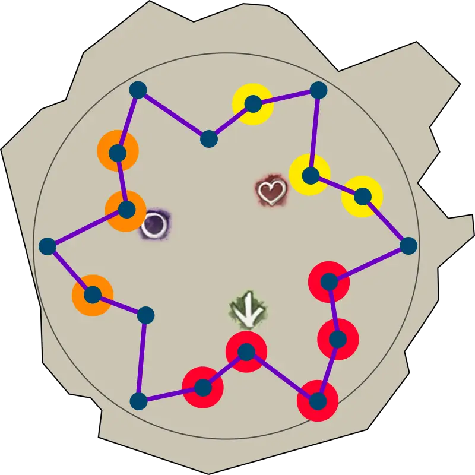
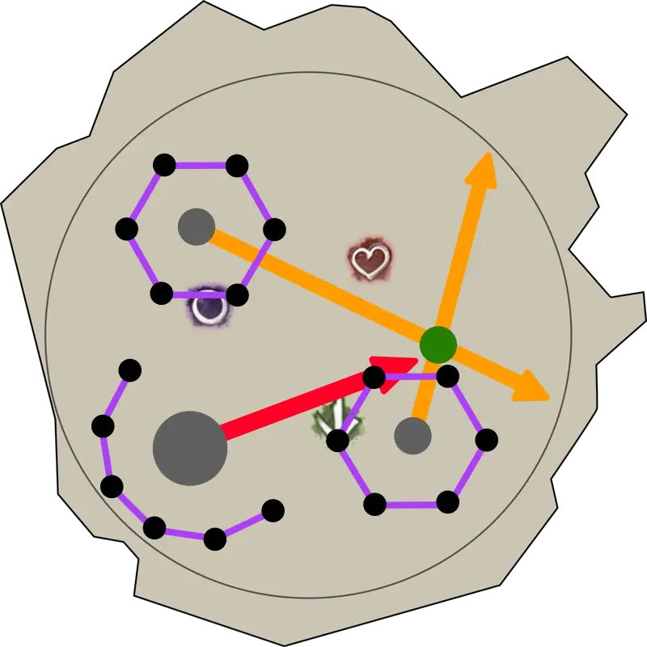

[Return to Home](../index.html){: .btn } [Return to Overview](./overview.html){: .btn } [Mechanical Reference](./mechanics.html){: .btn } [Strategy Guide](./strategy.html){: .btn }

# Fast Decima Guides

This page contains some simple guides for several roles in the Godsquall Decima encounter. If you want something more in-depth, please read the full [Strategy Guide](./strategy.html).

All markers referenced in this guide can be set up with the [Commander Markers](https://blishhud.com/modules/?module=Manlaan.CommanderMarkers) module for [Blish HUD](https://blishhud.com), using the marker pack provided below.

<details>
<summary>Click to view markers</summary>
<div markdown=block>

Paste the following code into Commander Markers to use this marker pack:
```
eyJlbmFibGVkIjp0cnVlLCJuYW1lIjoiRGVjaW1hIENNIFN0cmF0ZWd5IiwiZGVzY3JpcHRpb24iOiJEZWNpbWEgQ00gc3RyYXRlZ3kgbWFya2VycyBwYWNrIGJ5IE1pa2UgW0NSU10iLCJtYXBJZCI6MTU2NCwidHJpZ2dlciI6eyJ4IjotMjc2LjU1NjEyMiwieSI6MjY1Ljc3OTU3MiwieiI6MTM4LjUxNjc2OX0sIm1hcmtlcnMiOlt7ImkiOjEsImQiOiJTb3V0aCBtYXJrZXIiLCJ4IjotMjU2Ljk5MDEsInkiOjMxNi40OTY0NiwieiI6MTM4LjUyMjM1NH0seyJpIjoyLCJkIjoiV2VzdCBtYXJrZXIiLCJ4IjotMjc3LjA4MzI4MiwieSI6MzM5LjE4OTk0MSwieiI6MTM4LjUyMjM1NH0seyJpIjozLCJkIjoiTm9ydGggbWFya2VyIiwieCI6LTI0OC41NDI3NCwieSI6MzQ3LjI0NDE0MSwieiI6MTM4LjUyMjM1NH0seyJpIjo3LCJkIjoiUm9sbCBvdXQgc3BvdCEgKHN0YXJ0aW5nIGxvY2F0aW9uKSIsIngiOi0yODIuNDU2MiwieSI6MjczLjQ2MDksInoiOjEzOC41MTY1fV19
```
</div>
</details>

---

## What are you playing?
{: .center}

<div class="index-container">
    <a href="#melee-boondps-guide"
       class="guides-button"
       style="background-image: url(../images/decima/strategy/melee_dps.webp);">Melee Boon/DPS</a>
    <a href="#melee-healer-guide"
       class="guides-button"
       style="background-image: url(../images/decima/strategy/melee_heal.webp);">Melee Healer</a>
</div>
<div class="index-container">
    <a href="#ranged-boondps-guide"
       class="guides-button"
       style="background-image: url(../images/decima/strategy/ranged_dps.webp);">Ranged Boon/DPS</a>
    <a href="#kiter-guide"
       class="guides-button"
       style="background-image: url(../images/decima/strategy/kiter.webp);">Kiter</a>
</div>


# Melee Boon/DPS Guide

Your responsibilities (excluding basic damage and support as required by your role) consist in:
1. Being close to the boss so that you are targeted by [Spreads].
2. Intercepting [Greens] on their way to the boss.

#### General Information for all Phases
- Never linger inside the boss' hitbox: [Seismic Crash] or [Earthrend] will kill you.
- Never move out of melee range from the boss. If you are  hit by an [Arrow] you cannot collect [Greens].
- When you get [Spreads], dodge them <b>inwards</b> at the last second. You can stack spreads with other players, and dodge all of them at once.
- When you see [Greens], intercept them by standing on them. Make sure you do not move from the boss to do this: only intercept them when they are in melee range, while remaining on the edge of the boss's hitbox.

---

<details class=faq>
<summary>Phase 1</summary>
<div markdown='block'>

#### 100% - 80%
- Enter the arena using  [Roll Out] or  [Leap].
- Stack with your group on the side of the  marker and attack the boss.

#### First Split Phase
- Once Decima becomes  [Invulnerable], turn around 180° and walk into your cage.
- Start attacking the [add], taking care not to CC it.
- Make sure you are standing on the inside of the add, towards Decima, to bait [Spreads]. When you get your spread, dodge it towards the add.
- Once the add is dead, your healer should provide you with a portal. Take it to get back to the boss.

#### 80% - 70%
- Play this phase the same as 100%-80% in your new position.
- The first collection can be tricky: use your movement skills to get to [Greens] in time if necessary.

#### 70% Transition
- Save your DPS and CC skills once Decima hits 70%.
- Follow the boss when it jumps. Dodge any [Spreads].
- Use all your CC on the boss.
- Use your personal healing skills to offset the big damage attack when it starts.

</div>
</details>

<details class=faq>
<summary>Phase 2</summary>
<div markdown='block'>

#### 70% - 50%
- Start on the  marker. Repeat as in phase 1.
- Rotate towards  or  to collect [Greens] when they spawn.
- Run out to your cage towards  when the boss phases.

#### Second Split Phase
- Play it similarly to the first one.
- It is <b>extremely important</b> to not CC the [add] in this phase.

#### 50% - 40%
- Played identically to 80% - 70%.

#### 40% Transition
- Save your DPS and CC skills once Decima hits 40%.
- Follow the boss when it jumps. Dodge any [Spreads].
- Use all your CC on the boss.
- Use your personal healing skills to offset the big damage attack when it starts.

</div>
</details>

<details class=faq>
<summary>Phase 3</summary>
<div markdown='block'>

#### 40% - 10%
- Follow the boss whenever it jumps.
- Follow your commander's calls for which side of the boss to stack on.
- The [Green Arrow] is the most important mechanic: make sure you are always in it when it spawns.
- If you get [Spreads] during the [Green Arrow], dodge them while staying inside the arrow.
- You may have to split the group to cover [Greens] coming from multiple directions.

</div>
</details>

<details class=faq>
<summary>Phase 4</summary>
<div markdown='block'>

#### 10% - 0%
- Make sure to dodge the spreads at the beginning.
- Deal big damage.
- Dodge [Spreads] forward and try to intercept [Greens] as they come in.

</div>
</details>


# Melee Healer Guide

Your responsibilities (excluding basic healing and support as required by your role) consist in:
1. Being close to the boss so that you are targeted by [Spreads].
2. Intercepting [Greens] on their way to the boss.
3. Providing  [Stability] and CC at key moments.
4. Providing a portal in the split phases to simplify collecting [Greens].

#### General Information for all Phases
- Never linger inside the boss' hitbox: [Seismic Crash] or [Earthrend] will kill you.
- Never move out of melee range from the boss. If you are  hit by an [Arrow] you cannot collect [Greens].
- When you get [Spreads], dodge them <b>inwards</b> at the last second. You can stack spreads with other players, and dodge all of them at once.
- When you see [Greens], intercept them by standing on them. Make sure you do not move from the boss to do this: only intercept them when they are in melee range, while remaining on the edge of the boss's hitbox.
- After the first and every other set of [Arrows], you will have to provide  [Stability] for [Seismic Crash].

---

<details class=faq>
<summary>Phase 1</summary>
<div markdown='block'>

#### 100% - 80%
- Enter the arena using  [Roll Out] or  [Leap].
- Stack with your group on the side of the  marker.

#### First Split Phase
- Once Decima becomes  [Invulnerable], move to her new position and prepare your portal inside the cage, to the right of the boss.
- Use your mobility skills to get to your subgroup's [add], taking care not to CC it.
- Make sure you are standing on the inside of the add, towards Decima, to bait [Spreads]. When you get your spread, dodge it outwards, towards the add.
- Once the add is dead, open your portal back to the boss.

#### 80% - 70%
- Play this phase the same as 100%-80% in your new position.
- The first collection can be tricky: use your movement skills to get to [Greens] in time if necessary.

#### 70% Transition
- Save your CC and healing skills once Decima hits 70%.
- Follow the boss when it jumps. Dodge any [Spreads]. Provide  [Stability] for the jump.
- Use all your CC on the boss.
- Use all your healing to offset the big damage attack when it starts.

</div>
</details>

<details class=faq>
<summary>Phase 2</summary>
<div markdown='block'>

#### 70% - 50%
- Start on the  marker. Repeat as in phase 1.
- Rotate towards  or  to collect [Greens] when they spawn.

#### Second Split Phase
- Once Decima becomes  [Invulnerable], walk towards her new position and prepare your portal inside the cage, to the right of the boss.
- Use your mobility skills to get to your subgroup's [add].
- ***DO NOT CC THE ADD***.
- Once the add is dead, open your portal back to the boss.

#### 50% - 40%
- Played identically to 80% - 70%

#### 40% Transition
- Save your CC and healing skills once Decima hits 40%.
- Follow the boss when it jumps. Dodge any [Spreads]. Provide  [Stability] for the jump.
- Use all your CC on the boss.
- Use all your healing to offset the big damage attack when it starts.

</div>
</details>

<details class=faq>
<summary>Phase 3</summary>
<div markdown='block'>

#### 40% - 10%
- Follow the boss whenever it jumps. Provide  [Stability] for each jump.
- Follow your commander's calls for which side of the boss to stack on.
- The [Green Arrow] is the most important mechanic: make sure you are always in it.
- If you get [Spreads] during the [Green Arrow], make sure to dodge them while staying inside the arrow.
- Make sure to heal your subgroup members that are collecting [Greens] off-stack.

</div>
</details>

<details class=faq>
<summary>Phase 4</summary>
<div markdown='block'>

#### 10% - 0%
- Provide  [Stability] for the jump at the beginning.
- Make sure to dodge the spreads at the beginning.
- Dodge [Spreads] forward and try to intercept [Greens] as they come in.

</div>
</details>


# Ranged Boon/DPS Guide

Your responsibilities (excluding basic damage and support as required by your role) consist in:
1. Being far from the boss so that you are targeted by [Arrows].
2. Pointing [Arrows] away from [Conduits] and other players.

#### General Information for all Phases
- During damage phases, try to always stay on the limit of the [Thrumming Presence] AoE.
- When you get an [Arrow], spread out so you are not overlapping or pointing it at a [Conduit]. Being hit by multiple [Arrows] in succession will give you  [Exposed] and probably down you.
- Make sure you are closer to the boss than your kiter. This prevents you from baiting the [Red Arrow].
- Avoid standing in [Greens]: they will quickly kill you.

---

<details class=faq>
<summary>Phase 1</summary>
<div markdown='block'>

#### 100% - 80%
- Enter the arena using  [Roll Out] or  [Leap].
- Stack with your group on the side of the  marker and attack the boss.
- During the first pizza attack, move to  and be at range for the first set of [Arrows].
- Stay around  for the rest of the phase.

#### First Split Phase
- Once Decima becomes  [Invulnerable], turn around 180° and walk into your cage.
- Start attacking the [add], taking care not to CC it.
- Make sure you are standing on the outside of the add, towards Decima, to bait [Arrows].
- Once the add is dead, your healer should provide you with a portal. Take it to get back to the boss.

#### 80% - 70%
- Play this phase the same as 100%-80% in your new position.

#### 70% Transition
- Save your DPS and CC skills once Decima hits 70%.
- Follow the boss when it jumps. Dodge any [Spreads].
- Use all your CC on the boss.
- Use your personal healing skill to offset the big damage attack when it starts.

</div>
</details>

<details class=faq>
<summary>Phase 2</summary>
<div markdown='block'>

#### 70% - 50%
- Start on the  marker.
- Play as in phase 1, but now always bait arrows around .
- Avoid standing in any [Greens] that spawn behind you.
- Run out to your cage towards  when the boss phases.

#### Second Split Phase
- Play it similarly to the first one.
- It is <b>extremely important</b> to not CC the [add] in this phase.

#### 50% - 40%
- Played identically to 80% - 70%

#### 40% Transition
- Save your DPS and CC skills once Decima hits 40%.
- Follow the boss when it jumps. Dodge any [Spreads].
- Use all your CC on the boss.
- Use your personal healing skill to offset the big damage attack when it starts.

</div>
</details>

<details class=faq>
<summary>Phase 3</summary>
<div markdown='block'>

#### 40% - 10%
- Follow the boss whenever it jumps.
- Bait your [Arrows] between the two cages, just inside [Thrumming Presence].

</div>
</details>

<details class=faq>
<summary>Phase 4</summary>
<div markdown='block'>

#### 10% - 0%
- Make sure to dodge the spreads at the beginning.
- Deal big damage.
- Make sure to bait the [Arrows] at the beginning of the phase.
- Dodge [Spreads] forward as you get them.

</div>
</details>


# Kiter Guide

As the kiter, you control the flow and direction of the encounter.
Your responsibilities (excluding basic healing and support as required by your role) consist in:
1. Being far from the boss so that you are targeted by [Arrows].
2. Pointing [Arrows] away from [Conduits] and other players.
3. Baiting the [Red Arrow] by being the furthest player from the boss.
4. Controlling which conduits are charged by [Thunder].
5. Controlling the spawn position of the [Green Arrow].
6. Providing  [Stability] and CC at key moments.

#### General Information for all Phases
- Try to always stay just outside the [Thrumming Presence] AoE (except for the start of phase 1).
- Make sure your subgroup is full health and has  [Protection] before each set of arrows.
- When you get an [Arrow], spread out so you are not overlapping or pointing it at a [Conduit]. Being hit by multiple [Arrows] in succession will give you  [Exposed].
- After every odd set of [Arrows], you will have to provide  [Stability] for [Seismic Crash].
- Make sure you are always the furthest person from the boss for every even set of arrows, in order to bait the [Red Arrow].
- When you get the [Red Arrow], use a mobility skill to move behind a [Conduit] and block the arrow.
- Don't stand in [Greens] unless you're actively outhealing the damage.

---

<details class=faq>
<summary>Phase 1</summary>
<div markdown='block'>

#### 100% - 80%
- Enter the arena using  [Roll Out] or  [Leap].
- Stack with your group on the side of the  marker and attack the boss.
- During the pizza attack, move out towards  and be at range for the first set of [Arrows].
- Move towards your subgroup at  once you get your arrow.
- Play the second set of arrows (which includes a [Red Arrow]) on .
- During the next pizza, move to  to charge the final set of conduits.

{: .note}
> When played correctly, you should have charged just one of the outer conduits of Decima's formation. In the image below, the <font color=red>red</font> conduits will have been charged during the first set of arrows, the <font color=orange>orange</font> can be charged during the second, and the <font color=yellow>yellow</font> in the third.
> 

#### First Split Phase
- Once Decima becomes  [Invulnerable], move to her new position and prepare your portal outside the cage to the left of the boss.
- Use your mobility skills to get to the [add], taking care not to CC it.
- Make sure you are the furthest person from the boss. If you get a [Red Arrow], hide behind a conduit.
- Once the add is dead, open your portal back to the boss.

#### 80% - 70%
- Play this phase the same as 100%-80% in your new position.

#### 70% Transition
- Save your CC and healing skills once Decima hits 70%.
- Follow the boss when it jumps. Dodge any [Spreads]. Provide  [Stability] for the jump.
- Use all your CC on the boss.
- Use all your healing to offset the big damage attack when it starts.

</div>
</details>

<details class=faq>
<summary>Phase 2</summary>
<div markdown='block'>

#### 70% - 50%
- Start on the  marker.
- Play as in phase 1, but now always bait arrows and charge conduits around .
- Avoid standing in any [Greens] that spawn behind you.

#### Second Split Phase
- Once Decima becomes  [Invulnerable], move to her new position and prepare your portal outside the cage to the left of the boss.
- Use your mobility skills to get to the [add], ***DO NOT CC THE ADD***.
- Make sure you are the furthest person from the boss. If you get a [Red Arrow], hide behind a conduit.
- Once the add is dead, open your portal back to the boss.

#### 50% - 40%
- Played identically to 80% - 70%.

#### 40% Transition
- Save your CC and healing skills once Decima hits 40%.
- Follow the boss when it jumps. Dodge any [Spreads]. Provide  [Stability] for the jump.
- Use all your CC on the boss.
- Use all your healing to offset the big damage attack when it starts.

</div>
</details>

<details class=faq>
<summary>Phase 3</summary>
<div markdown='block'>

#### 40% - 10%
- Follow the boss whenever it jumps. Provide  [Stability] for each jump.
- Stack between the two cages to bait the [Arrows]. Be on the opposite side from the melee group to spawn the [Green Arrow] on top of them.
- For the second and every other set of arrows following, be the furthest player from the boss in order to bait the [Red Arrow].
- When you get the [Red Arrow], move into the position shown by the image in order to survive and not charge any conduits.



</div>
</details>

<details class=faq>
<summary>Phase 4</summary>
<div markdown='block'>

#### 10% - 0%
- Make sure to dodge the spreads at the beginning.
- Make sure to bait the [Red Arrow] at the beginning of the phase.
- Dodge [Spreads] forward as you get them.
- Try to intercept [Greens].

</div>
</details>


[Return to Home](../index.html){: .btn } [Return to Overview](overview.html){: .btn } [Return to Top](#fast-decima-guides){: .btn .fixed}
{: .center}

[Fluxlance]: mechanics.html#fluxlances
[Fluxlances]: mechanics.html#fluxlances
[Arrow]: mechanics.html#fluxlances
[Arrows]: mechanics.html#fluxlances
[Red Fluxlance]: mechanics.html#red-fluxlance
[Red Arrow]: mechanics.html#red-fluxlance
[Focused Fluxlance]: mechanics.html#focused-fluxlance
[Green Arrow]: mechanics.html#focused-fluxlance
[Thunders]: mechanics.html#chorus-of-thunder
[Thunder]: mechanics.html#chorus-of-thunder
[Spreads]: mechanics.html#chorus-of-thunder
[Fulminate]: mechanics.html#fulminate
[Greens]: mechanics.html#dancing-sparks
[Conduit]: mechanics.html#conduits
[Conduits]: mechanics.html#conduits
[Foreshock & Mainshock]: mechanics.html#foreshock--mainshock
[Seismic Crash]: mechanics.html#seismic-crash
[Seismic Reposition]: mechanics.html#seismic-crash
[Transcendent Boulder]: mechanics.html#trascendent-boulders
[add]: mechanics.html#trascendent-boulders
[Converging Fluxlances]: mechanics.html#converging-fluxlances
[Earthrend]: mechanics.html#earthrend
[Thrumming Presence]: mechanics.html#thrumming-presence

[Stability]: https://wiki.guildwars2.com/wiki/Stability
[Defiance Bar]: https://wiki.guildwars2.com/wiki/Defiance_bar
[Chronomancer]: https://wiki.guildwars2.com/wiki/Chronomancer
[Scourge]: https://wiki.guildwars2.com/wiki/Scourge
[Specter]: https://wiki.guildwars2.com/wiki/Specter
[Protection]: https://wiki.guildwars2.com/wiki/Protection
[Invulnerable]: https://wiki.guildwars2.com/wiki/Invulnerable
[Exposed]: https://wiki.guildwars2.com/wiki/Exposed

[Leap]: https://wiki.guildwars2.com/wiki/Leap_(Raptor)
[Roll Out]: https://wiki.guildwars2.com/wiki/Roll_Out