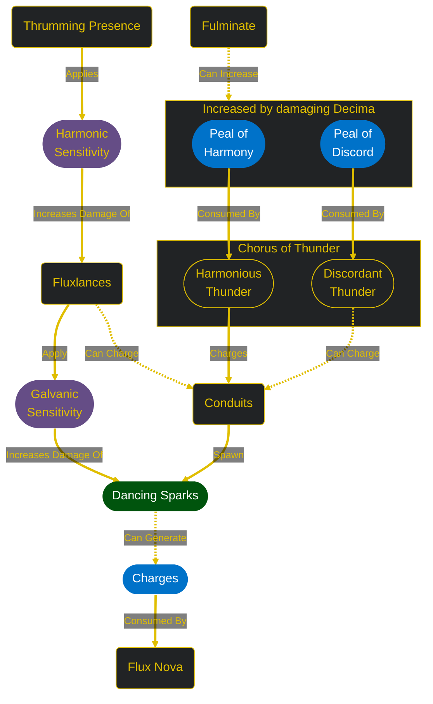
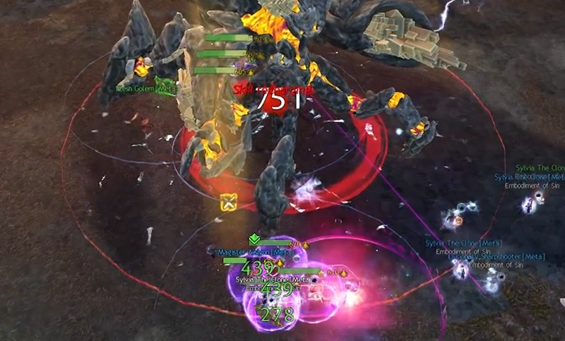
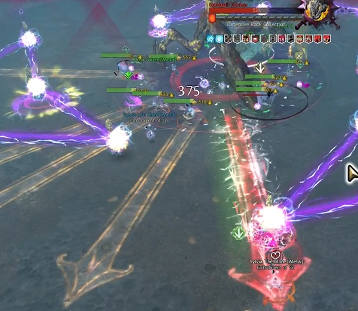
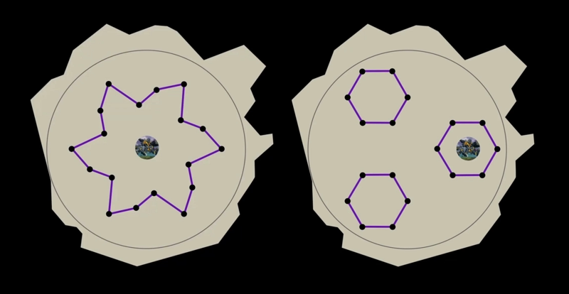
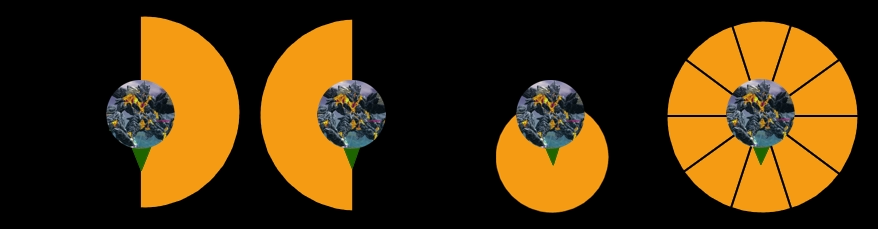
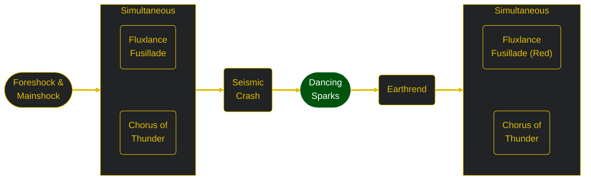
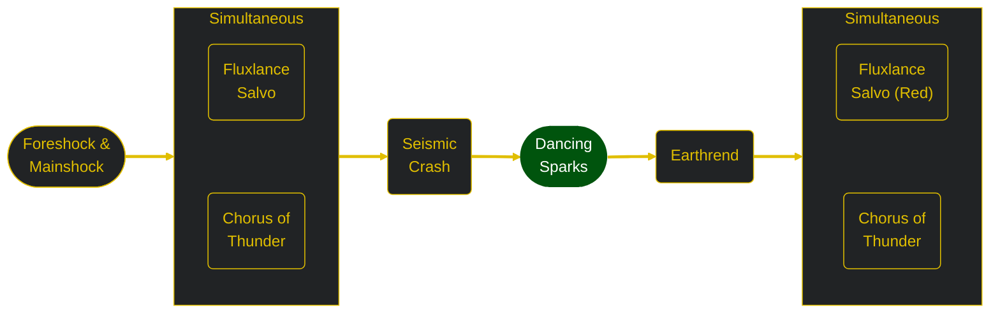
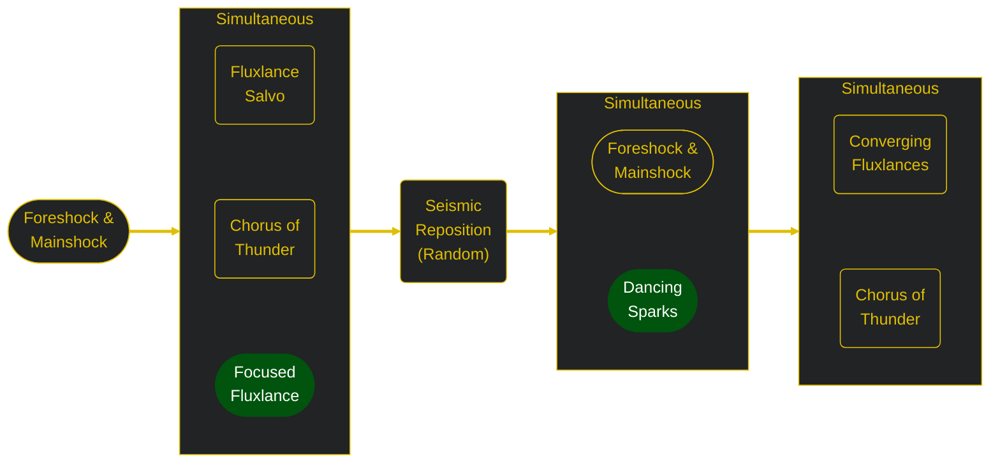

[Return to Home](../index.html){: .btn } [Return to Overview](./overview.html){: .btn } [Strategy Guide](./example-strategy.html){: .btn }

# Decima Mechanical Reference
{: .no_toc}

This section contains a detailed reference of the various attacks and mechanics present in the Godsquall Decima encounter. 

The rest of this page is structured into three sections:
1. **Mechanics** - a description of every attack and mechanic in the encounter.
2. **Phases** - a description of the structure of the fight, with transitions and differences between phases.
3. **Effects** - a list of all effects unique to the encounter, for reference purposes.

### Table of Contents
{: .no_toc}

1. TOC
{:toc}

---

## Mechanics

Decima's basic behaviour is centered around an attack loop: a series of skills that constantly repeat until the boss reaches certain health thresholds. This means that the encounter is extremely scripted: since the sequence is known, the squad can always predict and prepare for oncoming mechanics.

Several of Decima's attacks hit hard, requiring proper healing and mitigation to manage properly without destabilizing the squad. Apart from this, misplaying mechanics usually results in the boss acquiring  [Charge] stacks. This can be dangerous since the boss's damage scales with the number of stacks, additionally enraging and killing the entire group upon gaining 10 stacks. However, Decima resets her  [Charge] level twice, at 70%, 40% of her HP, and as a result the encounter is relatively forgiving.

### Mechanic Interaction Graph
{: .no_toc}
Decima can be a difficult boss to understand fully, as she has several unique mechanics, each one with its own particular interactions with the rest of the encounter. For convenience's sake, below you will find a simplified graph with the most important interactions: click on a mechanic to read more details, or continue reading below to view everything sequentially.

{: .center}

---

### Thrumming Presence

A 750-radius area-of-effect centered around Decima, outlined with a faint red circle. Constantly inflicts a small amount of damage to all players inside the area and applies  [Harmonic Sensitivity].

Decima gains her Thrumming Presence at the beginning of the encounter, and only loses it while casting [Seismic Reposition], when she has  [Nova Shield], while  [Stunned], and when she is under 10% health.

---

### Fluxlances

Also known as "Arrows" due to their indicator. Laser attacks originating from the boss. Once their indicator appears, after a brief delay, fluxlances will fire, applying an effect in a line according to their type. Fluxlances have infinite range, but can be blocked by [Conduits]. Any conduit hit by a lance will increase its charge level, but will prevent the lance from extending beyond the conduit itself. Fluxlances cannot be  [Blocked] or  [Evaded], and ignore  [Invulnerability].

#### Standard Fluxlance
{: .no_toc}
Also known as orange arrow. Targets the furthest player that is not targeted by another Fluxlance, dealing heavy damage to all allies, increased for players affected by  [Harmonic Sensitivity], and applying 30 seconds of  [Galvanic Sensitivity]. Additionally applies a stack of  [Exposed] to all allies hit except its target.

#### Red Fluxlance
{: .no_toc}
Also known as red arrow. Always targets the furthest player, and  [Defeats] all allies it hits. Must be aimed away from the squad and blocked using a [Conduit].

#### Focused Fluxlance
{: .no_toc}
Also known as green arrow. Targets the furthest conduit from the furthest player from the boss. Requires five people to be inside the arrow's line of fire to block the attack and prevent it from charging the conduit. Deals heavy damage, reduced based on the number of people in the arrow, and unaffected by  [Harmonic Sensitivity]. Focused Fluxlances are summoned as part of Decima's attack rotation from 40% to 10% hp.

Standard or red fluxlances are summoned whenever Decima casts one of the following skills as part of her attack loop:

#### Fluxlance Fusillade
{: .no_toc}
Targets the five furthest players with standard fluxlances. Targeted players will have a number above their head from one to five. After a brief delay, the lances will be fired in sequence based on their number. Every other time that Decima uses this skill, one of the fluxlances will be a red fluxlance.

#### Fluxlance Salvo
{: .no_toc}
Targets the five furthest players with fluxlances. After a brief delay, all lances are fired simultaneously. Every other time that Decima uses this skill, one of the fluxlances will be a red fluxlance.

#### Converging Fluxlances
{: .no_toc}
(Note: this skill does not have an official name, so this name is given for convenience.)
A combined attack performed by Decima and two [Trascendent Boulders]. This attack consists of:
- One [Red Fluxlance] cast by Decima and targeting the furthest player from her.
- Two [Standard Fluxlances] cast by Decima and targeting the next two furthest players.
- One [Standard Fluxlance] cast by each [Trascendent Boulder] and targeting the furthest player from Decima.
Similarly to both previous attacks, five fluxlances are summoned in total, but three of them (one red and two standard) will be targeting the same player.

---

### Chorus of Thunder

This attack has two components:

#### Harmonious Thunder
{: .no_toc}
Decima consumes all stacks of  [Peal of Harmony]. For each stack, she targets the closest uncharged, untargeted [Conduit] to the furthest player with Thunder.

#### Discordant Thunder
{: .no_toc}
Decima consumes all stacks of  [Peal of Discord]. For each stack, she targets the closest untargeted player with Thunder.

Thunders are tracking circular AoEs that fill and explode after a brief delay, dealing damage and charging all [Conduits] they hit. Damage increases with the number of overlapping AoEs, but can be  [Evaded],  [Blocked], or avoided with  [Invulnerability] . Single blocks will prevent one Thunder from hitting, but channeled blocks are necessary in case of multiple overlaps.

Players hit by any Thunder except their own will gain a stack of  [Exposed].

Chorus of Thunder is used regularly by Decima as part of her attack loop.

---

### Conduits
Conduits, or pylons, are structures that are manipulated by Decima and play a critical part in the encounter as a whole. Eighteen of them are summoned at the beginning of the fight, and they persist throughout all phases. Conduits are arrayed in shifting patterns around Decima, which vary based on the phase and the state of Decima's attack loop.

#### Conduit Charge
{: .no_toc}
Whenever a conduit is hit by by [Fluxlances] or [Thunder], it gains a level of Charge. When charged, a conduit gains *Fulgent Aura*: a red damaging AoE centered around the conduit that grows larger with each level of charge. Conduits cannot be charged more than three times: every time a level three conduit would gain a charge, it will instead [Fulminate].

#### Fulminate
{: .no_toc}
A charged conduit explodes, dealing damage based on its charge level in a large area. Level three conduits additionally apply a stack of  [Exposed], and grant Decima five stacks each of  [Peal of Harmony] and  [Peal of Discord]. Level three conduits will Fulminate whenever they would gain a charge, and all conduits Fulminate as part of [Flux Nova], during the transitions at 70% and 40% of Decima's health. 

#### Fulgent Fences
{: .no_toc}
Lasers periodically link all conduits together in a pattern. Whenever any player passes through them, they are affected by *Reverberating Impact*, which deals moderate damage and pushes the player out of the laser, preventing them from crossing it. This is also applied for movement skills such as dashes, but excludes player teleportation such as blinks or portals, and is not affected by  [Stability]. Players that are knocked into a fence by Decima's attacks are ejected at high speeds, possibly into other fences.

#### Dancing Sparks
{: .no_toc}
Also known as greens. Small AoEs that spawn from charged [Conduits] and start moving towards Decima. If they are allowed to reach the boss, they are consumed and grant her a stack of  [Charge].

Sparks deal damage to all players standing in their area, which is greatly increased towards players affected by  [Galvanic Sensitivity]. When enough players stand inside a spark, it will stop moving towards Decima and start draining health, disappearing once fully drained. The number of players required to achieve this effect is displayed above each spark, and is equal to the charge level of its originating conduit.

All charged conduits spawn sparks simultaneously as part of Decima's attack loop.

---

### Foreshock & Mainshock

#### Foreshock
{: .no_toc}
Decima stomps three times, dealing moderate damage in 3 large AoEs.

#### Mainshock
{: .no_toc}
Always cast after Foreshock:  a "pizza" attack centered on Decima. Deals significant damage and additionally inflicts 25  [Vulnerability]. Players hit by multiple "slices" will recieve multiple instances of this damage.

Foreshock and Mainshock are used regularly by Decima as part of her attack loop, and are always directed towards the closest player.

---

### Seismic Crash

Decima leaps up, then crashes down in a circular AoE centered on herself. This AoE has two components:
- An inner circle, with the same dimensions as Decima's hitbox, that  [Defeats] all players inside of it. This effect cannot be  [Evaded] or  [Blocked], and is not affected by  [Invulnerability].
- A larger circle centered on the hitbox deals damage (decreasing the further the player) and inflicts  [Knockback], launching players away from the boss. This part can be mitigated using all standard methods.

Seismic Crash is a critical ability, not due to its instant kill potential, but mainly because the  [Knockback] is especially dangerous when combined with [Chorus of Thunder], [Fluxlances] and [Fulgent Fences].

Decima casts this skill regularly as part of her attack loop. Furthermore, she also casts this skill as part of her Seismic Reposition, which is essentially identical but also has a movement component.

---

### Earthrend

Decima leaps up, then crashes down, generating AoE attacks in two components:
- An inner circle, corresponding with Decima's hitbox, that  [Defeats] all players inside of it. This effect cannot be  [Evaded] or  [Blocked], and is not affected by  [Invulnerability].
- A wide ring centered on the hitbox deals damage and inflicts  [Knockback], launching players towards the boss. This part can be mitigated using all standard methods.

While similar to [Seismic Crash], this skill is much less threatening since it usually does not affect the area where the squad is stacking. Decima casts this skill regularly as part of her attack loop.

---

### Flux Nova

A massive, arena-wide attack. This attack has two versions: a first one is used as part of the phase transitions at 70% and 40% of Decima's health total, while the second one is used whenever she reaches 10 stacks of  [Charge], or when the enrage timer runs out.

#### Transition Nova
{: .no_toc}
Upon reaching 70% or 40% health, Decima gains  [Nova Shield], then casts [Seismic Reposition] to the center of the arena, followed by [Chorus of Thunder]. She will then start channeling her main attack, gaining a large  [Defiance Bar]. During the channel, all charged [Conduits] will start summoning [Dancing Sparks]: if these are allowed to reach Decima, they will fully regenerate her  [Defiance] in addition to their other effects. Breaking this bar will shorten the channel (possibly despawning all [Dancing Sparks]) and apply  [Fractured Armor] to her.

When the channel ends, Decima will first [Fulminate] all conduits, and then cast her main attack, which consumes all stacks of  [Charge] to deal massive squad-wide damage. If she is affected by  [Fractured Armor], she will take backlash from her attack,  [Stunning] her for 10 seconds and applying  [Exposed] for the same duration.

#### Death Nova
{: .no_toc}
If Decima gains 10 stacks of  [Charge] or the enrage timer runs out, Decima will stop whatever attack she was doing, gain  [Nova Shield], and then cast a maximum power Nova after a short channel,  [Defeating] all players.

---

### Trascendent Boulders
Trascendend boulders are dangerous adds that spawn during the split phases at 80% and 50% of Decima's HP, and at the beginning of the third phase.

| **Health** | 1,533,636 	 |
| **Armor** |  2597 (standard) |
| **Hitbox** | 380 |
| **Defiance** | 1000 |

There will always be two of them alive at the same time: since they gain  [Linked], they must be killed within 10 seconds of each other.

Additionally, players who attack [Trascendent Boulders] from more than 750 range will be teleported to the boulder and gain a stack of  [Debilitated].

Boulders can use several different attacks:

#### Sparkling Reverberation
{: .no_toc}
The boulder smashes the ground continuously, dealing damage to all enemies and unlocking its  [Defiance Bar]. If the skill is allowed to complete after 19.75 seconds, it will apply 60 seconds of  [Debilitated] to all players in its area. Breaking the  [Defiance Bar] will interrupt this skill,  [Stunning] the boulder for 5 seconds and applying 10 seconds of  [Exposed].

#### Seismoelectricity
{: .no_toc}
The boulder jumps into the air, and then crashes down, releasing six arcs of electricity that spread out in a hexagonal shape, before returning to the add. These arcs will deal damage and remove boons from players they hit, and can be jumped or blocked.

#### Sparkwave
{: .no_toc}
Targets the fifth-furthest player from the boulder with a massive, 120° wide arc of lightning. Players hit by this wave will take damage and generate [Charged Ground] below them. This skill is extremely dangerous, and should be avoided or baited away from the group.

#### Charged Ground
{: .no_toc}

A circular damaging AoE that increases its damage over time, and applies  [Daze](https://wiki.guildwars2.com/wiki/Daze) and  [Vulnerability] on reaching maximum damage. Players who are hit by this skill will also generate an additional AoE below them, if they haven't already, resulting often in a fast spread of the damaging area.

---

## Phases
Decima's encounter has an articulate structure, with over eleven unique subphases. We can roughly divide these into four distinct parts of the encounter, which are described below.

### First Phase
Consists in two burn phases, with a simple split phase in between.

#### 100% - 80%
{: .no_toc}
Decima starts the fight in the center of the arena.
As soon as the encounter begins, she summons her [Conduits], then begins doing the following attacks in loop:

{: .center}

Decima's [Conduits] in this phase form a star shape, and maintain this shape, only slightly shifting inwards and outwards as the phase progresses. [Fulgent Fences] will be active during both [Fluxlance Salvo] attacks, and during [Seismic Crash] and [Earthrend]. The second [Fluxlance Salvo], and every other salvo afterwards, will have a [Red Fluxlance] targeting the furthest player.

#### 80% Split Phase
{: .no_toc}

As soon as Decima reaches 80% of her HP, she will finish whatever animation she is doing, and then transition into the split phase. The transition consists of these steps:
1. Decima despawns all [Fulgent Fences] and [Dancing Sparks] currently on the arena.
2. Decima's [Conduits] rearrange into a new pattern, made of three hexagonal formations (see the video below). Meanwhile, Decima uses [Seismic Reposition] to move inside of one of these hexagons.
3. [Fulgent Fences] reactivate, sealing off the formation, and a [Trascendent Boulder] spawns inside each of the two remaining unoccupied hexagons.

<video class="center" width="50%" controls muted>
  <source src="../videos/decima_conduits_1.mp4" type="video/mp4">
</video>

Of note is the fact that Decima will always reposition to the formation consisting of the [Conduits] that were formerly on the outermost ring (colored in blue in the video above).

Decima and the boulders will gain  [Linked], meaning that Decima becomes  [Invulnerable] and both boulders must be defeated within 10 seconds of each other in order to make her vulnerable again.

At the beginning of the phase, an updraft will spawn in the center of the arena, allowing players to glide into the hexagonal formations after they are locked down with [Fulgent Fences]. Similar updrafts will spawn on each [Trascendent Boulder]'s death, allowing players to exit and return to the boss at the end of the split phase.

Both [Trascendent Boulders] will start casting [Sparkling Reverberation], unlocking their  [Defiance Bar]. After this attack concludes, either with a complete channel or with the squad breaking the boulder's defiance, boulders will start chain casting [Seismoelectricity] until they reach 1% health (see  [Linked]) or die.

During this time, Decima will start anew with her attack loop, which is the same as in the previous phase.

#### 80% - 70%
{: .no_toc}
Both [Trascendent Boulders] have been killed, meaning that Decima is once again vulnerable. This does not change her behaviour, meaning she continues her attack loop without interruption from the split phase.

#### 70% Transition
{: .no_toc}
Once Decima reaches 70% of her health, she performs a series of attacks that transitions her into the second phase:
1. Decima gains  [Nova Shield].
2. Decima will [Seismic Reposition] to the center of the arena.
3. Decima starts channeling her [Flux Nova], unlocking her  [Defiance Bar], and simultaneously casts [Chorus of Thunder].
4. Upon finishing her channel, or shortly after her defiance is broken, Decima will [Fulminate] all charged [Conduits], then consume all her  [Charge] to conclude her [Flux Nova].

---

### Second Phase
If Decima's  [Defiance Bar] was broken during [Flux Nova], she will start the phase with 10 seconds of  [Stunned] and  [Exposed].  For the rest, this phase is structured similarly to the previous one, with two burn phases divided by a split phase at 50% HP. The major difference here is in the conduit movements, which are markedly different from the first phase, and in the 50% split phase, which is significantly more dangerous and often proves to be a major hurdle for groups.

#### 70% - 50%
{: .no_toc}

In this burn phase, Decima performs the following attack loop:

{: .center}

This loop is, in essence, identical to its behaviour in the previous phase, but substittues [Fluxlance Fusillade] for the more dangerous [Fluxlance Salvo]. On the second and every other [Fluxlance Salvo] thereafter, one of the fluxlances will be a [Red Fluxlance].

Conduit movements in this phase are shown in the following short video, where each vertex of the colored shapes is a conduit.

<video class="center" width="50%" controls muted>
  <source src="../videos/decima_conduits_2.mp4" type="video/mp4">
</video>

#### 50% Split Phase
{: .no_toc}
This split phase is essentially identical to the [80% Split Phase](#80-split-phase), with one major difference: both [Trascendent Boulders] will follow [Sparkling Reverberation] with a cast of [Sparkwave](#sparkwave). This is an extremely dangerous skill, and both it and the [Charged Ground] it generates must be avoided or managed with extreme care. This phase is often a major hurdle to progression.

#### 50% - 40% and 40% Tranistion
{: .no_toc}
This phase and the transition to the following phase are essentially identical to the [80%-70% phase](#80---70) and [70% transition](#70-transition).

---

### Third Phase
This phase consists of one large burn from 40% to 10% of Decima's HP. It differs significatively from the previous phases, as Decima will often make use of her [Seismic Reposition] to move around the arena. This phase will also introduce two new attacks: [Focused Fluxlance] and [Converging Fluxlances].

At the beginning of the phase, Decima will summon two [Trascendent Boulders]. These adds are not targetable and cannot be interacted with. They do not  [Link] with the boss, and do not cast any skills except for participating in [Converging Fluxlances]. Decima will then [Seismic Reposition], and begin the following attack loop:

{: .center}

Every time Decima casts [Seismic Reposition] in this phase, she will relocate to a random position located on a circle 1500 units from the center of the arena. Furthermore, all her conduits will move to this new position, reconfiguring as shown in the following clip:

<video class="center" width="50%" controls muted>
  <source src="../videos/decima_conduits_3.mp4" type="video/mp4">
</video>

### Final Phase
On reaching 10% health, Decima will become  [Invulnerable], then [Seismic Reposition] to the center of the arena. She will simultaneously cast [Discordant Thunder], but targeting all ten players, then cast [Harmonious Thunder]. Shortly after jumping, all [Conduits] will lose all of their charge.

Once at the center, the squad will have some time to damage her while she does the following sequence of attacks:
1. [Chorus of Thunder] twice, once with a single target per type and once with three targets per type.
2. [Fulgent Fences].
3. [Fluxlance Salvo], with one fluxlance being a [Red Fluxlance].

Once this sequence is complete, Decima will start rapidly gaining  [Peal of Harmony] and  [Peal of Discord] while chain-casting [Chorus of Thunder]. This results in all conduits quickly being charged (sometimes even double charged as she casts choruses faster than they can charge pylons!). Throughout this she will sporadically spawn [Dancing Sparks], until all conduits are charged, at which point every conduit will start simultaneously spawning [Dancing Spark], which combined with continous [Discordant Thunder] casts will rapidly lead to defeat unless the boss is defeated quickly.

#### Peals Gained
{: .no_toc}
The order in which Decima gains  [Peal of Harmony] and  [Peal of Discord] is deterministic, though hard to keep track of and not especially useful. She wll gain:
- +1  [Peal of Harmony] at 7, 4 and 1% HP.
- +1 of both peals at 3, 5, 7 and 9 seconds after the start of the phase. On the first and last of this set, these will be used instantly to cast [Chorus of Thunder]. Sometimes the first one will not increase the targeted [Conduit]'s charge.
arrows happen here
- +3 of both peals at 21 seconds after the start of the phase start, instantly used by [Chorus of Thunder].
- +4 of both peals at 23 seconds.  [Peal of Harmony] will instantly be used by [Harmonious Thunder].
- +4 of both peals at 25 seconds.
- +5 of both peals at 29 seconds and every 2 seconds after. These cannot take Decima above 10 stacks so the third and onwards are often useless.
Credit to @Tsaerid for researching this.

---

## Effects
Decima's encounter has a multitude of unique effects, which are listed below for reference purposes.

###  Galvanic Sensitivity

An effect that is applied to players hit by a [Standard Fluxlance], lasting for 30 seconds. Greatly increases damage taken from [Dancing Sparks].  [Galvanic Sensitivity] is incompatible with  [Harmonic Sensitivity], which it overwrites.

---

###  Harmonic Sensitivity

An effect that is applied to players standing inside Decima's  [Thrumming Presence], lasting for 30 seconds. Greatly increases damage taken by [Fluxlances].  [Harmonic Sensitivity] is incompatible with  [Galvanic Sensitivity], and cannot be applied to players affected by  [Galvanic Sensitivity].

---

###  Charge

A stacking effect that is gained by Decima every time she consumes [Dancing Sparks]. Increases all outgoing damage from all of Decima's attacks. If Decima gains 10 stacks of  [Charge], she becomes  [Unstoppable](https://wiki.guildwars2.com/wiki/Unstoppable_(Decima)) and gains  [Nova Shield], after which she then casts a maximum power [Flux Nova],  [Defeating] all players.

Decima loses all stacks of  [Charge] when she performs her [Flux Nova].

---

###  Peal of Harmony

A stacking effect that determines the number of [Conduits] that Decima targets during her [Chorus of Thunder]. Decima starts the fight with 5 stacks of  [Peal of Harmony], and gains a stack every 5% of her HP.

---

###  Peal of Discord

A stacking effect that determines the number of players that Decima targets during her [Chorus of Thunder]. Decima gains 5 stacks of  [Peal of Discord] every 10% of her HP.

---

###  Nova Shield
Makes Decima immune to health damage. Decima gains this effect on reaching 70% or 40% health, when she gains 10 stacks of  [Charge], or when the enrage timer runs out, and loses it after casting [Flux Nova]

---

###  Fractured Armor
An effect that is gained by Decima whenever her defiance bar is broken. Makes Decima susceptible to the backlash from her next [Flux Nova],  which  [Stuns] her for 10 seconds and applies  [Exposed] for the same duration. 

---

###  Linked
This effect has two versions: one that is applied to Decima at the beginning of the 80% and 50% split phases, and one that is applied to [Trascendent Boulders].

#### Decima
{: .no_toc}
Decima links herself to a [Trascendent Boulder], becoming  [Invulnerable] for as long as the boulder remains alive. Since there are always two boulders, Decima will gain two of this effect.

#### Boulders
{: .no_toc}
The two [Trascendent Boulders] link to each other and gain this effect. Whenever one of the two falls to 1% HP, it becomes  [Invulnerable], and after 10 seconds, it will heal itself back to 50% of its maximum health. If, during this interval, its linked target also falls to 1% health, the  [Invulnerability] is removed and both boulders can be killed.

---

[Return to Home](../index.html){: .btn } [Return to Overview](overview.html){: .btn } [Return to Top](#decima-mechanical-reference){: .btn .fixed}

[Harmonic Sensitivity]: #-harmonic-sensitivity
[Galvanic Sensitivity]: #-galvanic-sensitivity
[Charge]: #-charge
[Fluxlances]: #fluxlances
[Fluxlance Salvo]: #fluxlance-salvo
[Converging Fluxlances]: #converging-fluxlances
[Fluxlance Fusillade]: #fluxlance-fusillade
[Standard Fluxlance]: #standard-fluxlance
[Standard Fluxlances]: #standard-fluxlance
[Red Fluxlance]: #red-fluxlance
[Focused Fluxlance]: #focused-fluxlance
[Thrumming Presence]: #thrumming-presence
[Dancing Sparks]: #dancing-sparks
[Dancing Spark]: #dancing-sparks
[Peal of Harmony]: #-peal-of-harmony
[Peal of Discord]: #-peal-of-discord
[Conduit]: #conduits
[Conduits]: #conduits
[Flux Nova]: #flux-nova
[Chorus of Thunder]: #chorus-of-thunder
[Thunder]: #chorus-of-thunder
[Seismic Crash]: #seismic-crash
[Seismic Reposition]: #seismic-crash
[Fulgent Fences]: #fulgent-fences
[Nova Shield]: #-nova-shield
[Fractured Armor]: #-fractured-armor
[Fulminate]: #fulminate
[Earthrend]: #earthrend
[Charged Ground]: #charged-ground
[Sparkling Reverberation]: #sparkling-reverberation
[Seismoelectricity]: #seismoelectricity
[Trascendent Boulders]: #trascendent-boulders
[Trascendent Boulder]: #trascendent-boulders
[Linked]: #-linked
[Link]: #-linked
[Discordant Thunder]: #discordant-thunder
[Harmonious Thunder]: #harmonious-thunder

[Unblockable]: https://wiki.guildwars2.com/wiki/Unblockable
[Blocked]: https://wiki.guildwars2.com/wiki/Block
[Evaded]: https://wiki.guildwars2.com/wiki/Evade
[Exposed]: https://wiki.guildwars2.com/wiki/Exposed
[Invulnerable]: https://wiki.guildwars2.com/wiki/Invulnerability
[Invulnerability]: https://wiki.guildwars2.com/wiki/Invulnerability
[Invulned]: https://wiki.guildwars2.com/wiki/Invulnerability
[Stuns]: https://wiki.guildwars2.com/wiki/Stun
[Stunned]: https://wiki.guildwars2.com/wiki/Stun
[Stunning]: https://wiki.guildwars2.com/wiki/Stun
[Knockback]: https://wiki.guildwars2.com/wiki/Knockback
[Stability]: https://wiki.guildwars2.com/wiki/Stability
[Defiance Bar]: https://wiki.guildwars2.com/wiki/Defiance_bar
[Defiance]: https://wiki.guildwars2.com/wiki/Defiance_bar
[Defeat]: https://wiki.guildwars2.com/wiki/Defeated
[Defeats]: https://wiki.guildwars2.com/wiki/Defeated
[Defeating]: https://wiki.guildwars2.com/wiki/Defeated
[Debilitated]: https://wiki.guildwars2.com/wiki/Debilitated_(raid)
[Vulnerability]: https://wiki.guildwars2.com/wiki/Vulnerability
