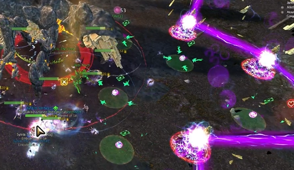

# Decima Mechanical Reference
{: .no_toc}

This page contains detailed information on all attacks, phases, mechanics and effects in the Godsquall Decima encounter.

Decima is an articulated fight with many phases and interactions, and several mechanics lead naturally into each other, so knowing the nature of these interactions is fundamental towards learning the encounter.

### Table of Contents
{: .no_toc}

1. TOC
{:toc}

---

## Attacks

These are mechanics originating from Decima herself. Decima's behaviour is to perform an attack loop: a series of skills that are cast continuously one after the other, looping continuously until the boss's health is below the threshold to begin its next phase. Most of Decima's attacks are part of this loop.

### Thrumming Presence

A 750-radius area-of-effect centered around Decima, outlined with a faint red circle. Constantly inflicts a small amount of damage to all players inside the area (increasing with the number of  [Charge] on the boss) and applies  [Harmonic Sensitivity].

Decima gains her Thrumming Presence at the beginning of the encounter, and only loses it while moving, while casting [Flux Nova], while  [Stunned], and while under 10% health.

---

### Fluxlances

Also known as "Arrows". Line attacks originating from the boss that track players. Once their indicator appears, after a brief delay, fluxlances will fire, applying an effect in a line according to their type:

- **Standard Fluxlances** - also known as "orange arrows", deal heavy damage, with additional damage applied to players affected by  [Harmonic Sensitivity], and apply 30 seconds of  [Galvanic Sensitivity].
- **Focused Fluxlances** - also known as "red arrows", instantly kill all players they hit.

Fluxlances cannot be  [Blocked] or  [Evaded], and ignore  [Invulnerability].

Players hit by any Fluxlance except their own will be  [Exposed].

Fluxlances have infinite range, but can be blocked by [Conduits]. Any conduit hit by a lance will increase its charge level, but will prevent the lance from extending beyond the conduit itself. This is useful for blocking focused fluxlances, as shown in the image below.

Lances are summoned whenever Decima casts one of the following skills as part of her attack loop:

- **Fluxlance Fusillade** - targets the five furthest players with fluxlances. Targeted players will have a number above their head from one to five. After a brief delay, the lances will be fired in sequence based on their number.
- **Fluxlance Salvo** - targets the five furthest players with fluxlances. After a brief delay, all lances are fired simultaneously.

Usually all lances will be standard fluxlances, but every other cast there will be one focused fluxlance. This lance is always targeted at the furthest player from Decima.

### Dancing Sparks

Also known as "greens". Small AoEs that spawn from charged [Conduits] and start moving towards Decima. If they are allowed to reach the boss, they are consumed and grant her a stack of  [Charge].

Sparks deal damage to all players standing in their area, which is greatly increased towards players affected by  [Galvanic Sensitivity]. When enough players stand inside a spark, it will stop moving and lose health. The number of players required to achieve this is displayed above each spark, and is equal to the charge level of its originating conduit.

All charged conduits spawn sparks simultaneously as part of Decima's attack loop.

---

### Chorus of Thunder

Decima consumes all her stacks of  [Peal of Harmony] and   [Peal of Discord], with the following effects:

- For each stack of  [Peal of Discord] consumed, Decima will  target the closest untargeted player to the boss.
- For each stack of  [Peal of Harmony] consumed, Decima will target the closest uncharged [Conduit] to the furthest player.

Decima will track each target with a Thunder AoE. This AoE will fill and explode after a brief delay, dealing damage and charging all [Conduits] it hits. Damage increases with the number of overlapping AoEs, but can be  [Evaded],  [Invulned] or  [Blocked]. Single blocks will prevent one Thunder from hitting, but channeled blocks are necessary in case of multiple overlaps.

Players hit by any Thunder except their own will be  [Exposed].

Chorus of Thunder is used periodically by Decima as part of her attack loop.

### Foreshock & Mainshock

**Foreshock** - Decima stomps three times, dealing damage in 3 large AoEs.
**Mainshock** - Always cast after Foreshock:  a "pizza" attack centered on Decima.

The pizza deals significant damage and additionally inflicts 25  [Vulnerability](https://wiki.guildwars2.com/wiki/Vulnerability). Players hit by multiple "slices" will recieve multiple instances of this damage.

Foreshock and Mainshock are used periodically by Decima as part of her attack loop.

## Effects

###  Galvanic Sensitivity

An effect that is applied to players hit by [Fluxlances], lasting for 30 seconds. Greatly increases damage taken from [Dancing Sparks].  [Galvanic Sensitivity] is incompatible with  [Harmonic Sensitivity], and overwrites it.

Players hit by any AoE except their own will be

---

###  Harmonic Sensitivity

An effect that is applied to players standing inside Decima's  [Thrumming Presence], lasting for 30 seconds. Greatly increases damage taken by [Fluxlances].  [Harmonic Sensitivity] is incompatible with  [Galvanic Sensitivity], and cannot be applied to players affected by  [Galvanic Sensitivity].

---

###  Charge

A stacking effect that is gained by Decima every time she consumes [Dancing Sparks]. Increases all outgoing damage from all of Decima's attacks. If Decima gains 10 stacks of  [Charge], she becomes  [Unstoppable](https://wiki.guildwars2.com/wiki/Unstoppable_(Decima)) and  [Invulnerable], and then defeats all players.

Decima loses all stacks of  [Charge] when she performs her [Flux Nova].

---

###  Peal of Harmony

A stacking effect that determines the number of [Conduits] that Decima targets during her [Chorus of Thunder]. Decima starts the fight with 5 stacks of  [Peal of Harmony], and gains a stack every 5% of her HP.

---

###  Peal of Discord

A stacking effect that determines the number of players that Decima targets during her [Chorus of Thunder]. Decima gains 5 stacks of  [Peal of Harmony] every 10% of her HP.

---

[Harmonic Sensitivity]: #-harmonic-sensitivity
[Galvanic Sensitivity]: #-galvanic-sensitivity
[Charge]: #-charge
[Fluxlances]: #fluxlances
[Thrumming Presence]: #thrumming-presence
[Dancing Sparks]: #dancing-sparks
[Peal of Harmony]: #-peal-of-harmony
[Peal of Discord]: #-peal-of-discord
[Conduit]: #conduits
[Conduits]: #conduits
[Flux Nova]: #flux-nova
[Chorus of Thunder]: #chorus-of-thunder

[Unblockable]: https://wiki.guildwars2.com/wiki/Unblockable
[Blocked]: https://wiki.guildwars2.com/wiki/Block
[Evaded]: https://wiki.guildwars2.com/wiki/Evade
[Exposed]: https://wiki.guildwars2.com/wiki/Exposed
[Invulnerable]: https://wiki.guildwars2.com/wiki/Invulnerability
[Invulnerability]: https://wiki.guildwars2.com/wiki/Invulnerability
[Invulned]: https://wiki.guildwars2.com/wiki/Invulnerability
[Stunned]: https://wiki.guildwars2.com/wiki/Stun

