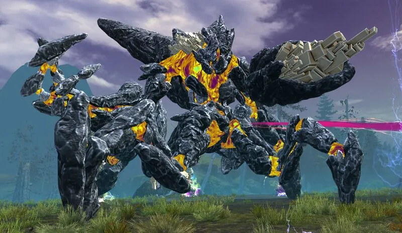

# Godsquall Decima
{: .center}

[Return to Home](../index.html){: .btn } [Strategy Guide](./strategy.html){: .btn } [Mechanical Reference](./mechanics.html){: .btn }
{: .center}

| **Health** | 97,020,176 |
| **Armor** |  2597 (standard) |
| **Hitbox** | 750 |
| **Defiance** | 7500 |
| **Enrage Timer** | 10 minutes - kills all players on running out. |

---

Decima, the Stormsinger is one of the first two bosses in the Mount Balrior raid. Defeating her, along with her fellow titan, [Greer](../greer/overview.html), is necessary in order to challenge the final boss of the instance, [Ura](../ura/overview.html).

Most of Decima's mechanics and attacks are based on the players' distance from the boss. This means that organized groups can distribute mechanics in a predictable way by positioning accordingly, making the fight relatively scripted. This, combined with how the boss periodically resets its buffs, means that the encounter is overall more forgiving compared to the other bosses in the wing.

This does not mean however that it is easy: groups heading into Godsquall Decima's arena will require good healing and  [Protection](https://wiki.guildwars2.com/wiki/Protection) uptime,  [Stability](https://wiki.guildwars2.com/Stability), and precise control of their  [Defiance](https://wiki.guildwars2.com/wiki/Defiance_bar) damage.

The fight also becomes much easier with higher damage, as the group will be have to play less mechanics. Furthermore, the final phase is a difficult damage check.

[Return to Home](../index.html){: .btn } [Strategy Guide](./strategy.html){: .btn } [Mechanical Reference](./mechanics.html){: .btn }
