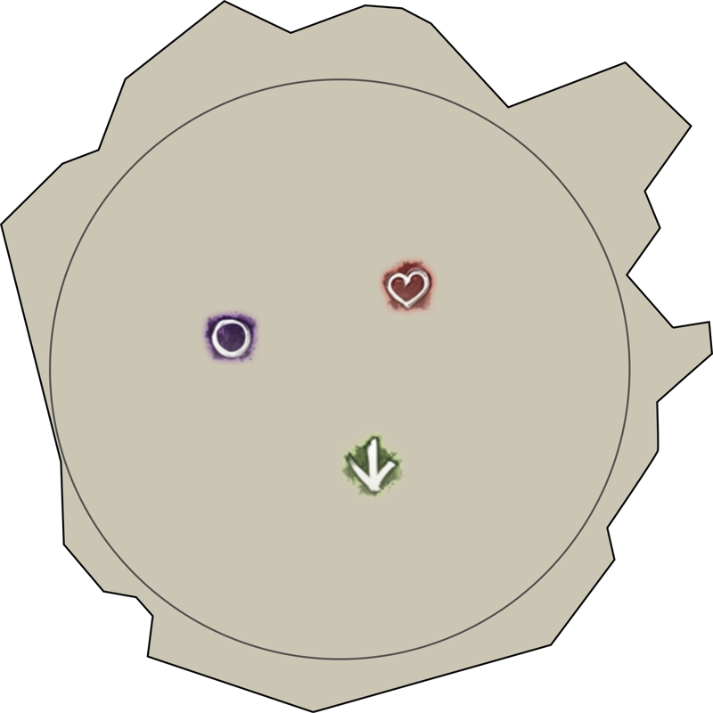
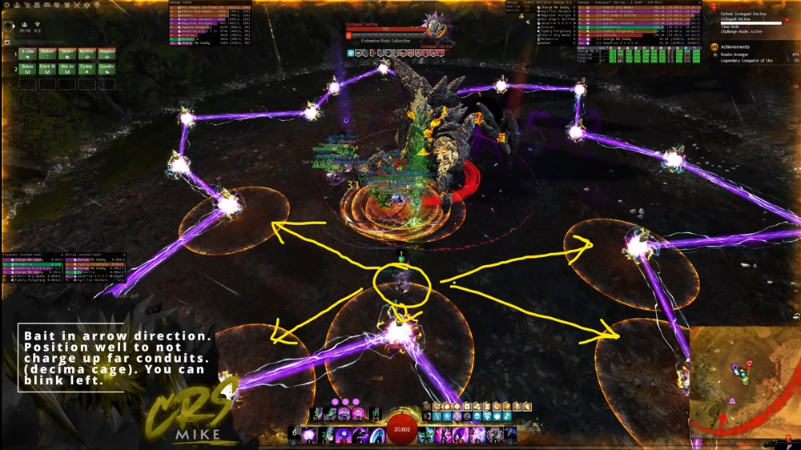
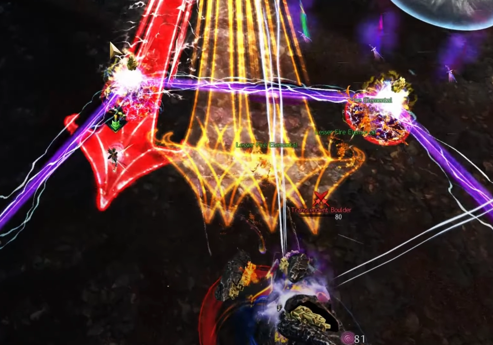
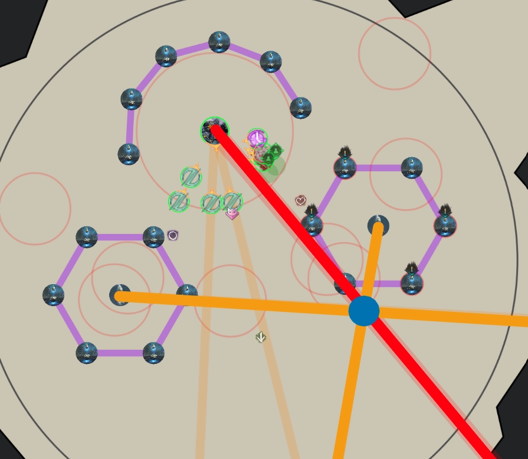
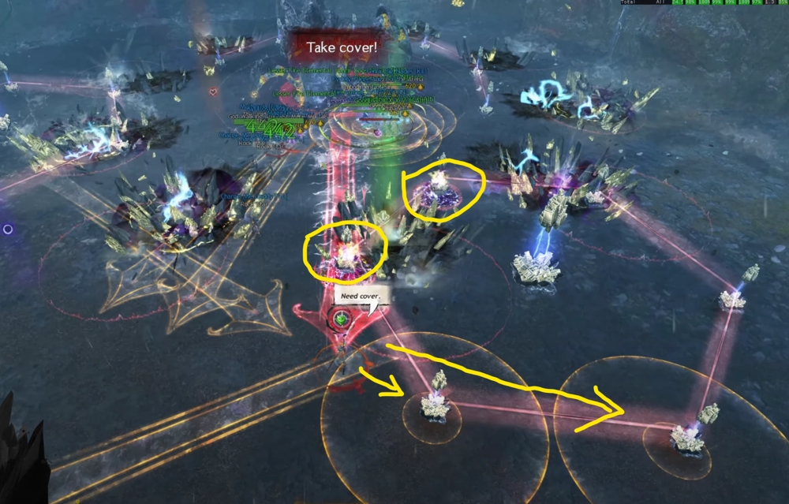

[Return to Home](../index.html){: .btn } [Return to Overview](./overview.html){: .btn } [Mechanical Reference](./mechanics.html){: .btn }

# Decima Recommended Strategy

This strategy is a written version of this [PoV](https://www.youtube.com/watch?v=Qsf582waMDM), and is designed for achievement runs, minimizing overlap and difficulty of mechanics while also requiring the least possible movement.

All markers referenced in this guide can be set up with the [Commander Markers](https://blishhud.com/modules/?module=Manlaan.CommanderMarkers) module for [Blish HUD](https://blishhud.com), using the marker pack provided below.

Click to view markers

<contents>

Paste the following code into Commander Markers to use this marker pack:

<code class="wrap">
eyJlbmFibGVkIjp0cnVlLCJuYW1lIjoiRGVjaW1hIENNIFN0cmF0ZWd5IiwiZGVzY3JpcHRpb24iOiJEZWNpbWEgQ00gc3RyYXRlZ3kgbWFya2VycyBwYWNrIGJ5IE1pa2UgW0NSU10iLCJtYXBJZCI6MTU2NCwidHJpZ2dlciI6eyJ4IjotMjc2LjU1NjEyMiwieSI6MjY1Ljc3OTU3MiwieiI6MTM4LjUxNjc2OX0sIm1hcmtlcnMiOlt7ImkiOjEsImQiOiJTb3V0aCBtYXJrZXIiLCJ4IjotMjU2Ljk5MDEsInkiOjMxNi40OTY0NiwieiI6MTM4LjUyMjM1NH0seyJpIjoyLCJkIjoiV2VzdCBtYXJrZXIiLCJ4IjotMjc3LjA4MzI4MiwieSI6MzM5LjE4OTk0MSwieiI6MTM4LjUyMjM1NH0seyJpIjozLCJkIjoiTm9ydGggbWFya2VyIiwieCI6LTI0OC41NDI3NCwieSI6MzQ3LjI0NDE0MSwieiI6MTM4LjUyMjM1NH0seyJpIjo3LCJkIjoiUm9sbCBvdXQgc3BvdCEgKHN0YXJ0aW5nIGxvY2F0aW9uKSIsIngiOi0yODIuNDU2MiwieSI6MjczLjQ2MDksInoiOjEzOC41MTY1fV19
</code>
</contents>

## Composition

The squad is separated into one ranged and one melee subgroup, each consisting of 5 players.
- The *ranged group* is responsible for baiting [Fluxlances] by being the furthest players from the boss.
- The *melee group* is responsible for baiting [Thunder] by being the closest players to the boss, and collecting [Greens].

One additional player in the ranged group, usually a healer, will cover a special role, known as the *kiter*. The kiter's responsibilities are:
- Baiting out the [Red Fluxlance] by being the furthest player from the boss.
- Controlling which conduits are charged by [Thunder] through proximity.
- Controlling the position of the [Focused Fluxlance].

The ranged group will spend a decent amount of time out of melee range and hence it is recommended to use appropriate ranged builds. Supports in either subgroup must be capable of providing [Stability], and can also bring a portal for their subgroup, although this is not strictly required. Groups will require adequate amounts of crowd control to manage Decima's large  [Defiance Bar].

Kiters greatly benefit from additional mobility, which, combined with the requirements above, limits the typical classes used to  [Chronomancer],  [Scourge] or  [Specter].

#### Heal Kiter Builds
{: .no_toc}
[ Chronomancer](https://gw2skills.net/editor/?PigEQiWmBzidxCZj4RPp2aA-DSJYjR1fh0SKUdFkeQp7rhgEK/t0+mFUB-e){: .btn } [ Scourge](https://gw2skills.net/editor/?PSwEw8NsMD2G7hFxGxU9K71D-DSRYjRLV1HSI1ALjqLg0TBdvNEkQZL8aQwmFoC-e){: .btn } [ Specter](https://gw2skills.net/editor/?PazAsqrlhySZWsN2JeqWnxeA-DSRYjhCCGJaJ/eKkWChqLg0TAdvOEkQZD8WafzCqA-e){: .btn }

## First Phase

### 100% - 80%

The fight begins by making use of Mount abilities to quickly enter the arena and get to Decima, usually either  [Roll Out](https://wiki.guildwars2.com/wiki/Roll_Out) or  [Leap](https://wiki.guildwars2.com/wiki/Leap_(Raptor)).

Decima starts with the attack pattern shown [here](mechanics.html#100---80). The [Foreshock & Mainshock] abilities are simply outhealed. Once you see Mainshock starting to cast (the 'pizza' attack), the ranged group needs to step away from the boss to bait [Fluxlances] close to the  marker.

The kiter should instead go to roughly the  marker (see image below) in order to bait [Thunder] into charging up the correct conduits. The kiter should try not to charge up any of the conduits that make up the outer ring furthest from Decima, because those will encircle Decima in the split phase, making collecting their [Greens] much more difficult (see [this](mechanics.html#80-split-phase) animation).

Shortly after, the [Fluxlances] will fire. Make sure to not hit any conduits and then quickly group up on the  marker and heal up and give  [Stability] to prevent the knockback from [Seismic Crash]

Immediately after, the ranged group has to bait the next set of [Fluxlances], while the melee group has to collect [Greens]. This set of [Fluxlances] contains the Red Arrow, so make sure that the kiter is the furthest player away. The kiter should use a mobility skill to get outside behind a conduit, making sure to not charge up one of the furthest conduits to make the split phase easier.

After the collection and Fluxlances, the attack pattern starts from the beginning again, with [Foreshock & Mainshock]. Once the pizza attack starts, the ranged group needs to bait arrows again. The kiter needs to pay attention here and make sure they are at the  marker to bait [Thunder].

Depending on the group's dps, you may already phase now into the first split phase, or if not, you will get another Knockback that needs  [Stability]. Ideally it would be better to phase before or during the next set of greens, so as to avoid an additional collection.

Phasing after the second collection usually indicates a serious DPS issue: this needs to be resolved or the group will struggle greatly with the damage check in the final phase.

---

### First Split Phase

The ranged and melee group should walk together to their respective closest [Transcendent Boulder], which is usually close to the  marker for the ranged group and to the   marker for the melee group. The two healers can either pre-place their portal before going to the adds (required for  [Specter] since their portal is one-way), or place it after playing the main mechanic during this split.

> Note that for the melee portal, the Healer needs to pay attention to not prepare the portal in front of Decima, but to the side. This is such that when the melee group takes the portal later, they don't get hit by Decima's [Fluxlance] attacks.

While dps'ing the [Transcendent Boulder] adds down as fast as possible, it's important to not use any skills with Breakbar damage in order to skip their dangerous follow-up attacks. Decima will continue her attack loop from where she left off after jumping, resulting in a set of [Fluxlances] and [Thunders] that must be played. The ranged group should thus position themselves from the [Transcendent Boulder] add outward, and the melee group inward, in order to bait the mechanics properly. The melee group can simply dodge their [Thunders], while the ranged group needs to pay attention to not charge any extra conduits. See the image below for an example spread:

After the Fluxlances and Thunders, the two healers can open their portals to get everyone back to Decima. The ranged group should be ported outside the cage, while the melee group should optimally be ported into the cage.

---

### 80% - 70%

After taking the Portal, timing-wise, Decima usually uses [Seismic Crash] again, so make sure that Healers immediately provide  [Stability]. The attack pattern is the same as usual, which means next in turn will be a set of [Fluxlances] and Green collection. Play the mechanics like before, heal everyone up and prepare your CC skills for when Decima hits 70%.

Decima will become immune to damage at 70% hp and jump into the middle of the arena. This is a knockback attack, so make sure to provide  [Stability] again. Depending on dps, [Thunders] might also spawn, so be prepared to dodge them, while also paying attention to not dodge into any conduits. Afterward, Decima will gain a  [Defiance Bar] with 7500 health, which needs to be broken as soon as possible. If broken quickly enough, there is no need to deal with any of the other mechanics (mainly [Greens]) and the only thing that'll happen next is a big incoming damage burst from [Fulminate]. Make sure that both groups are stacked up and have  [Protection], use Barrier skills and time your strong healing skills to prevent any downs. If someone downs, everyone should make sure to quickly bring them back up.

## Second Phase

### 70% - 50%

In this phase Decima repeats her attack pattern again, starting from [Foreshock & Mainshock] like in Phase 1. The melee group can stand near the  marker, while the ranged group can stand near the  marker.

The ranged group baits the conduit charges and [Fluxlances] at : spread apart without hitting any conduits and stack up quickly to heal up and provide  [Stability] for  [Seismic Crash], which comes immediately after.

Next, the melee group rotates toward  to collect [Greens], while the ranged group baits the next set of [Fluxlances] left of . The kiter needs to make sure they bait the [Red Fluxlance] again, and should move behind a conduit in order to survive. At the same time, [Thunders] may happen for the melee group, so be ready to dodge.

Decima will then start her attack pattern anew. The ranged group should position themselves between  and  and the melee group can stand near . Either the boss will phase after the following set of [Fluxlances], or you may need to play another collection.

---

### Second Split Phase

Similar to before the two groups go to their closest [Transcendent Boulder], while the healers prepare their portals. Usually, the melee group should go towards the  marker and the ranged group towards the  marker. The split phase plays similar to before, only it is much more important to not break the add's  [Defiance Bar], so as to avoid [Sparkwave](mechanics.html#sparkwave), which will usually wipe the group.

As before, the ranged group positions themselves outward to bait [Fluxlances] and melee group inward to bait [Thunders]. The ranged group needs to pay attention again to not hit any conduits with [Fluxlances] and the melee group needs to time their dodge again. As soon as both adds are dead and the two mechanics are done, use portals once more to quickly get back to Decima.

---

### 50% - 40%

This section plays identically to the 80% to 70% section. After taking the portal, be ready to give  [Stability] to prevent knockbacks. The melee group will be inside the cage collecting [Greens], while the ranged group will be outside the cage baiting [Fluxlances]. Once Decima hits 40%, be ready to dodge in case [Thunders] appear, while again not dodging into any conduits. Cast  [Stability] when Decima jumps into the middle of the arena and be ready to CC again. Stack up into groups, use barrier skills and time your heal skills to heal through the big incoming damage of [Fulminate] again.

## Third Phase

## 40% - 10%

Next, Decima will jump toward the edge of the arena. The jump is a [Seismic Crash] attack with a knockback, so make sure to provide  [Stability].

The melee group can position themselves left of Decima when looking at Decima from the center, while the ranged group just stays between the two hexagonal formations of conduits. Decima will start her attack pattern from anew, like at the start of Phase 1 and Phase 2. Once you see the pizza attack, bait the [Fluxlances].

The kiter in this phase has the additional responsibility of managing the spawn position of the [Focused Fluxlance] (aka Green Arrow). To do this, they should initially move move toward the conduits on the right-hand side, which will also bait [Thunder] onto those conduits.

The first set of [Fluxlances] additionally includes the [Focused Fluxlance]. If the kiter baits correctly on the right-hand side, the Green Arrow will spawn to the left of Decima, directly on top of the melee group, which needs to stack inside of it to solve the mechanic. This can overlap with [Thunders]: in this case the melee group will need to dodge backward, while staying inside the Green Arrow so as to not fail the mechanic.

Next, Decima will [Seismic Reposition] to a different position. Be ready to provide  [Stability] and follow Decima to her new location. The melee group can position themselves to stand between Decima and the conduits that have been charged up already, while the ranged group should remain in the center and the kiter should bait on the opposite side. In the example PoV, the charged conduits are to the right-hand side after Decima's jump. This means the melee group moves to the right side.

After the jump, Decima will start with [Foreshock & Mainshock] again. Toward the end, once the pizza attack appears, the kiter wants to make their way to bait conduits and the next [Red Fluxlances] close to the conduits that are already charged, in order to make the [Greens] come only from one side. The kiter will then need to deal with [Converging Fluxlances], which requires accurate positioning to block the [Red Fluxlance] while avoiding charging any conduits with standard [Fluxlances] (represented with the blue circle below).

Afterwards, the kiter should move back to the stack, and Decima's attack pattern starts anew. Once you see the pizza attack, in addition to baiting the five [Fluxlance], the kiter will again need to bait the Green Arrow and the next set of charging up conduits. The bait for the Green arrow should this time go to the left-hand side, since the melee group is standing to the right of Decima.

Next, Decima will jump again, and will cast [Foreshock & Mainshock] followed by a collection. The melee group this time must split between the left and right in order to collect all greens: their healer should take care to keep all his players healthy even while they are off-stack.

After the pizza attack, the ranged group will bait [Fluxlances] with the kiter playing [Converging Fluxlances] again. Following, another set of [Foreshock & Mainshock] and [Fluxlances] with the Green Arrow and possibly [Thunders] will spawn. Play them similarly to before.

At the latest after this Green Arrow, Decima should hit 10% and the final phase will start.

## Final Phase

### 10% - 0%

The final 10% is a burst phase, so you want to immediately deal as much damage as possible. Cleanly transitioning into this phase is extremely important due to the relatively tight DPS check: any downs or knockbacks at this stage will seriously hurt your chances of a kill. Depending on the dps spec, it might also be beneficial to save some cooldowns for the initial burst (e.g. Weave Self).

A the start of the phase, Decima will become invulnerable and jump into the center of the arena, while resetting all conduits. The jump is a knockback, so have  [Stability] up. and at the same time Decima will cast any remaining [Thunders], so be ready to dodge. Depending on dps, it can happen that two subsequent [Thunder] casts happen, so be ready to dodge twice subsequently. 

At the beginning, a set of [Fluxlances] and [Thunders] must be played. Make sure to not hit any conduits, and the kiter should bait the Red Arrow and use a mobility skill behind a conduit to survive.

After this, stack up at the boss and dps. Throughout this phase, [Thunders] will spawn continuously, which should be dodged into the boss. This is because around the boss, conduits will gradually come closer and closer and dodging backward or sideways will hit and charge them.

Additionally, Green collections will spawn as well, gradually escalating from only a few greens to massive simultaneous 18-conduit discharges. Try to block them as well as you can, while focusing on dps and dodging [Thunders]. If 10 Greens move into Decima's hitbox, Decima will become invulnerable and you will wipe. Hence it is important to block as many as possible. Doing this successfully and keeping up damage while avoiding downs will lead you to a successful clear.

[Return to Home](../index.html){: .btn } [Return to Overview](overview.html){: .btn } [Return to Top](#decima-recommended-strategy){: .btn .fixed}
{: .center}

[Fluxlance]: mechanics.html#fluxlances
[Fluxlances]: mechanics.html#fluxlances
[Red Fluxlance]: mechanics.html#red-fluxlance
[Focused Fluxlance]: mechanics.html#focused-fluxlance
[Thunders]: mechanics.html#chorus-of-thunder
[Thunder]: mechanics.html#chorus-of-thunder
[Fulminate]: mechanics.html#fulminate
[Greens]: mechanics.html#dancing-sparks
[Foreshock & Mainshock]: mechanics.html#foreshock--mainshock
[Seismic Crash]: mechanics.html#seismic-crash
[Seismic Reposition]: mechanics.html#seismic-crash
[Transcendent Boulder]: mechanics.html#trascendent-boulders
[Converging Fluxlances]: mechanics.html#converging-fluxlances

[Stability]: https://wiki.guildwars2.com/wiki/Stability
[Defiance Bar]: https://wiki.guildwars2.com/wiki/Defiance_bar
[Chronomancer]: https://wiki.guildwars2.com/wiki/Chronomancer
[Scourge]: https://wiki.guildwars2.com/wiki/Scourge
[Specter]: https://wiki.guildwars2.com/wiki/Specter
[Protection]: https://wiki.guildwars2.com/wiki/Protection