[Return to Home](../index.html){: .btn } [Return to Overview](./overview.html){: .btn } [Mechanical Reference](./mechanics.html){: .btn }

# Decima Recommended Strategy
{: .no_toc}

<details>
<summary><b>Table of Contents</b></summary>
<div markdown=block>
1. TOC
{:toc}

---
</div>
</details>

This strategy, also known as the "Turnaround" strategy, is the most common way of playing Decima CM. It was originally designed for achievement runs, minimizing movement and difficulty while satisfying all mechanics in a deterministic manner.

All markers referenced in this guide can be set up with the [Commander Markers](https://blishhud.com/modules/?module=Manlaan.CommanderMarkers) module for [Blish HUD](https://blishhud.com), using the marker pack provided below.

<details>
<summary>Click to view markers</summary>
<div markdown="block">
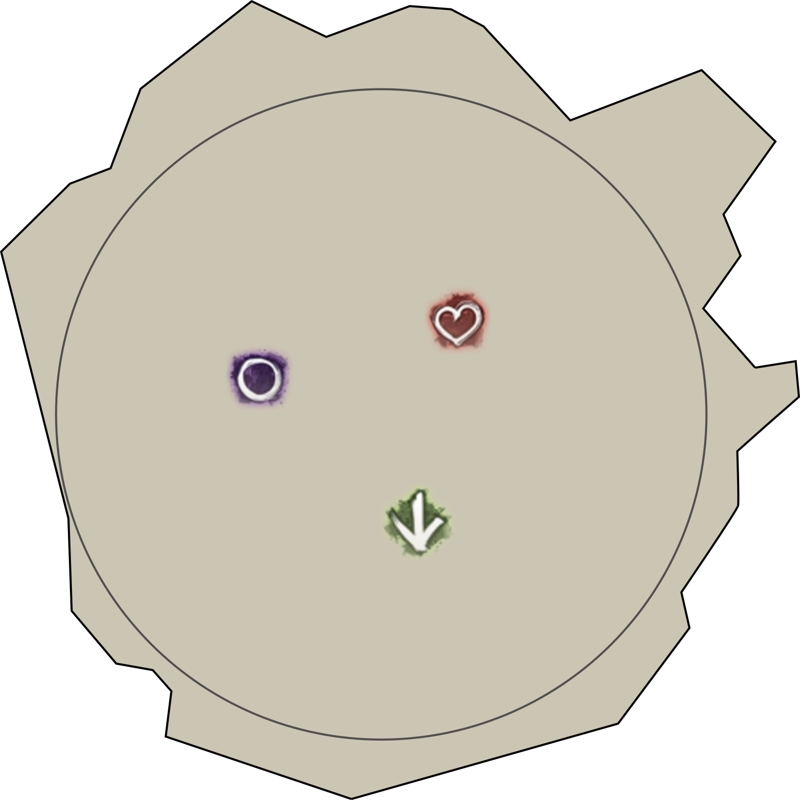

Paste the following code into Commander Markers to use this marker pack:
```
eyJlbmFibGVkIjp0cnVlLCJuYW1lIjoiRGVjaW1hIENNIFN0cmF0ZWd5IiwiZGVzY3JpcHRpb24iOiJEZWNpbWEgQ00gc3RyYXRlZ3kgbWFya2VycyBwYWNrIGJ5IE1pa2UgW0NSU10iLCJtYXBJZCI6MTU2NCwidHJpZ2dlciI6eyJ4IjotMjc2LjU1NjEyMiwieSI6MjY1Ljc3OTU3MiwieiI6MTM4LjUxNjc2OX0sIm1hcmtlcnMiOlt7ImkiOjEsImQiOiJTb3V0aCBtYXJrZXIiLCJ4IjotMjU2Ljk5MDEsInkiOjMxNi40OTY0NiwieiI6MTM4LjUyMjM1NH0seyJpIjoyLCJkIjoiV2VzdCBtYXJrZXIiLCJ4IjotMjc3LjA4MzI4MiwieSI6MzM5LjE4OTk0MSwieiI6MTM4LjUyMjM1NH0seyJpIjozLCJkIjoiTm9ydGggbWFya2VyIiwieCI6LTI0OC41NDI3NCwieSI6MzQ3LjI0NDE0MSwieiI6MTM4LjUyMjM1NH0seyJpIjo3LCJkIjoiUm9sbCBvdXQgc3BvdCEgKHN0YXJ0aW5nIGxvY2F0aW9uKSIsIngiOi0yODIuNDU2MiwieSI6MjczLjQ2MDksInoiOjEzOC41MTY1fV19
```
</div>
</details>

This is an in-depth guide: if you are looking for something fast to read and less comprehensive, check out the [Decima Fast Guides](./fast-guide.html).

---

#### Main Points
{: .no_toc}
- The squad divides into a _ranged group_ and a _melee group_.
- The _ranged group_ stays far from the boss to bait [Fluxlances].
- The _melee group_ stays close to the boss to bait [Thunder] and collect [Greens].
- One player covers a special role, the _kiter_, and controls spawn positions for several important mechanics.
- The position of the two different groups and the kiter are carefully controlled to minimize overlap between mechanics.


## General Information

Decima's encounter is inherently deterministic, giving the squad a large amount of control through careful positioning.

---

### Melee and Ranged Group

Many of the more dangerous mechanics in the encounter choose their targets based on proximity to the boss:
- [Fluxlances] always target the furthest players.
- [Thunders] always target the closest players.

Furthermore, the effects applied by some mechanics prevent affected players from participating in others:

- Players hit by [Fluxlances] will be affected by  [Galvanic Sensitivity], and thus cannot collect [Greens].
- Players staying within [Thrumming Presence] will be affected by  [Harmonic Sensitivity], making them more vulnerable to [Fluxlances].

This strategy solves this issue by separating the squad into a ranged and a melee subgroup.
- The *ranged group* is responsible for baiting [Fluxlances] by being the furthest players from the boss, and pointing them away from [Conduits].
- The *melee group* is responsible for baiting [Thunder] by being the closest players to the boss, and collecting [Greens].

In this way, most strategies eliminate harmful overlaps and reduce the overall stress on each player while retaining deterministic control of all mechanics.

---

### Kiting

Several of Decima's mechanics focus around the furthest player from the boss:
- [Harmonious Thunder] charges [Conduits] closest to them.
- The [Red Fluxlance] will target them.
- The [Focused Fluxlance] will target the conduit furthest from them.

We can take advantage of this by implementing a specific role, the _kiter_. This player can exercise a great amount of control over the encounter through accurate positioning:
- During [Chorus of Thunder], they can choose which [Conduits] are charged by staying close to them.
- While satisfying the previous point, they will also bait out the [Red Fluxlance].
- While satisfying the first point, they can also ensure that the [Focused Fluxlance] spawns in an advantageous position.

Kiters often have to move off-stack to do mechanics: this makes for lower DPS uptime and higher survivability requirements. For this reason, kiters are often the healers for the ranged subgroup.


## Composition

Support players should be providing good defensive boon coverage and healing. Decima has many strong bursts of damage incoming from various mechanics ([Fluxlances], [Seismic Crash], [Flux Nova]), so drops in  [Protection] and insufficient healing can quickly lead to players downing.

 [Stability] or  [Aegis] are required at regular intervals, portals are very useful to simplify the split phases (especially for the melee group) and good burst CC is necessary to break Decima's massive  [Defiance Bar]. Due to these requirements,  [Mesmers] such as  [Chronomancer] and  [Troubadour] are by far the most played healers, though not the only viable ones. Kiters will also greatly benefit from mobility and boon radius, as their subgroup will often have to spread out to do mechanics.

While there are less strict requirements on the boonDPS and DPS than on the healers, the _ranged group_ will spend a decent amount of time out of melee range and thus it is recommended to use appropriate builds. DPS in general should also try to bring sufficient amounts of CC, and boonDPS should bring backup  [Stability] if possible.

---

#### Builds and PoVs

This is a non-exhaustive list of playable builds on the encounter. If anything is outdated, you can find up-to-date information on  [Void Lounge](https://discord.com/invite/voidlounge).

|Build|Role|PoV|Last updated|
|---|---|---|---|
|[ Heal Chronomancer](https://gw2skills.net/editor/?PigEQiWmBzidxCZj4RPp2aA-DSJYjR1fh0SKUdFkeQp7rhgEK/t0+mFUB-e)| Heal, Kiter | [PoV (Kiter)](https://www.youtube.com/watch?v=Qsf582waMDM) [PoV (Melee)](https://www.youtube.com/watch?v=t0Dj09CKgRM) | September 2025 |
|[ Celestial Troubadour](https://gw2skills.net/editor/?PihAQZl9yiZIsEGNe8X9TNA-DSRYVREvaUAnScigIlA5KEqWBowFkgYP8WefNCA-e)| Heal, Kiter | [PoV (Kiter)](https://www.youtube.com/watch?v=8w5aHQiJ2dQ) [PoV (Melee)](https://www.youtube.com/watch?v=pIkofW0WfZQ) | August 2026 |
|[ Heal Scourge](https://gw2skills.net/editor/?PSwEw8NsMD2G7hFxGxU9K71D-DSRYjRLV1HSI1ALjqLg0TBdvNEkQZL8aQwmFoC-e) | Heal, Kiter | [PoV (Kiter)](https://youtu.be/gZSVTWeXRdk) | April 2025 |
|[ Heal Specter](https://gw2skills.net/editor/?PazAsqrlhySZWsN2JeqWnxeA-DSRYjhCCGJaJ/eKkWChqLg0TAdvOEkQZD8WafzCqA-e) | Heal, Kiter | [PoV (Kiter)](https://www.youtube.com/watch?v=RYRrvI0VWiA&ab) | September 2025 |
|[ Heal Tempest](https://gw2skills.net/editor/?PGgAsilRwWYMMPGKe2TptfA-DSJYjRDfZUdCkeBo71BWafzCqA-e) | Heal, Kiter | [PoV (Kiter)](https://youtu.be/IinQ3QXNEvI) | July 2025 |
|[ Condi Alacrity Specter](https://snowcrows.com/builds/raids/thief/condition-alacrity-spectre-scepter)| Ranged BoonDPS | | September 2025 |
|[ Condi Quickness Herald](https://snowcrows.com/builds/raids/revenant/condition-quickness-herald-spear)| Ranged BoonDPS | [PoV](https://youtu.be/mlZ-_ovKZXc) | May 2025 |
|[ Condi Virtuoso](https://snowcrows.com/builds/raids/mesmer/condition-virtuoso) | Ranged DPS | | June 2025 |
|[ Condi Scourge](https://snowcrows.com/builds/raids/necromancer/condition-scourge)| Ranged DPS |[PoV](https://youtu.be/scilNBfG0_U) | June 2025 |
|[ Condi Mechanist](https://snowcrows.com/builds/raids/engineer/condition-mechanist)| Melee DPS | [PoV](https://www.youtube.com/watch?v=xjwP5zCHzUM) | August 2025 |


## First Phase

### 100% - 80%

The fight begins by making use of Mount abilities to quickly enter the arena and reach Decima, usually either  [Roll Out](https://wiki.guildwars2.com/wiki/Roll_Out) or  [Leap](https://wiki.guildwars2.com/wiki/Leap_(Raptor)).

Decima starts with the attack pattern shown [here](mechanics.html#100---80). The [Foreshock & Mainshock] abilities are simply out-healed. 
<br>
At the start of the **Mainshock** <font size=2>("pizza" attack)</font> cast, the ranged group needs to step away from the boss to the  marker to bait [Fluxlances]. Once they have baited them, spread out to avoid overlaps and charging pylons.

<label class="arena-container">
    <input type="checkbox">
    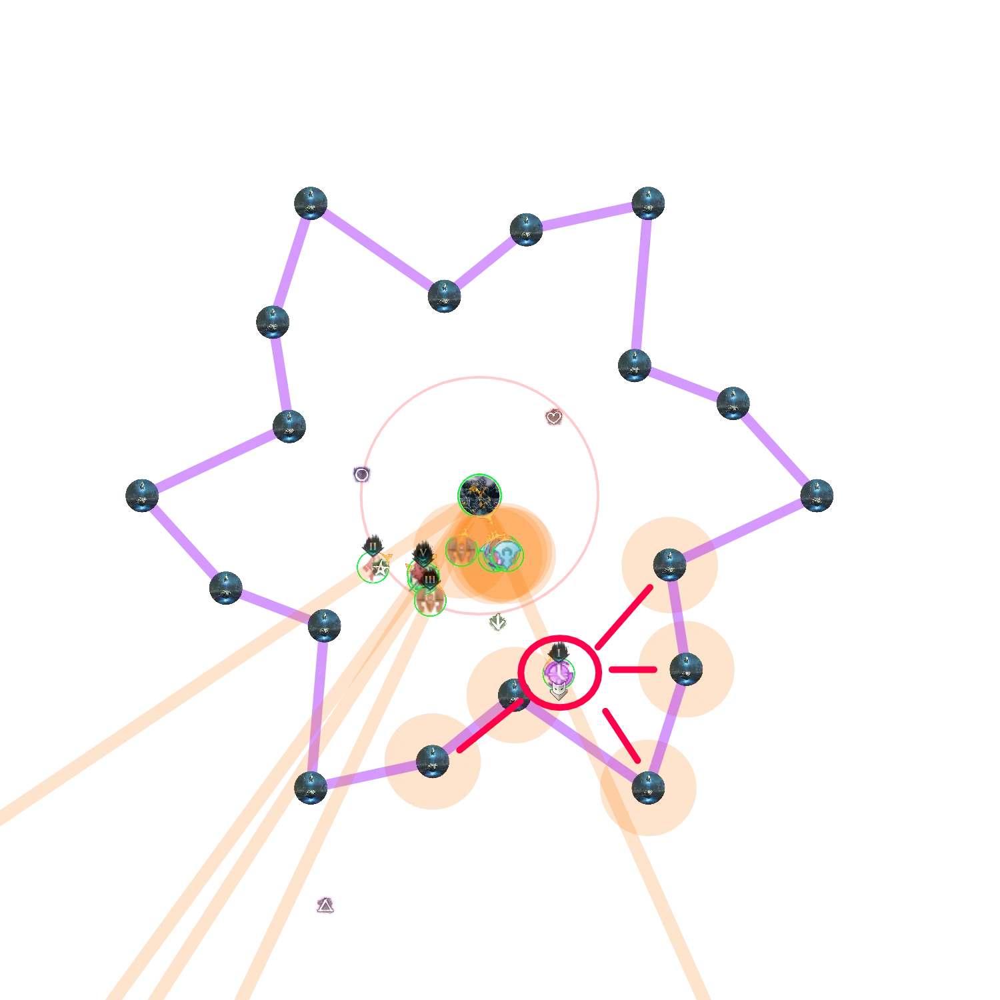
</label>

The *kiter* should instead go to roughly the  marker <font size=2>(see image below)</font> in order to bait [Thunder] into charging up the conduits directly behind the melee group. 

{: .note}
Try not to charge up any of the conduits that make up the outer ring furthest from Decima. These will encircle the boss in the following phase, making collecting their [Greens] much more difficult (see [this](mechanics.html#80---70) animation).

<label class="arena-container">
    <input type="checkbox">
    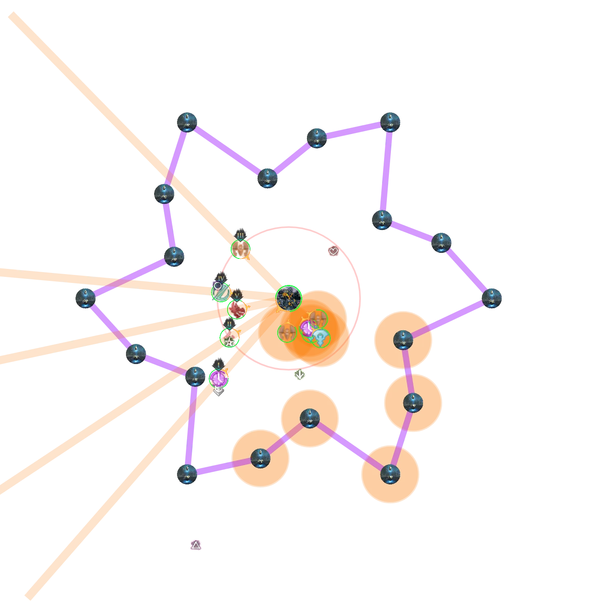
</label>

Shortly after the [Fluxlances] will fire. Make sure to not hit any conduits and then quickly group up on the  marker and heal up and give  [Stability] or  [Aegis] to prevent the  knockback from [Seismic Crash].

{: .note}
It is always better to provide  [Aegis] over  [Stability] for [Seismic Crash], as the damage done by this skill is noticeable, especially for the melee group.

<label class="arena-container">
    <input type="checkbox">
    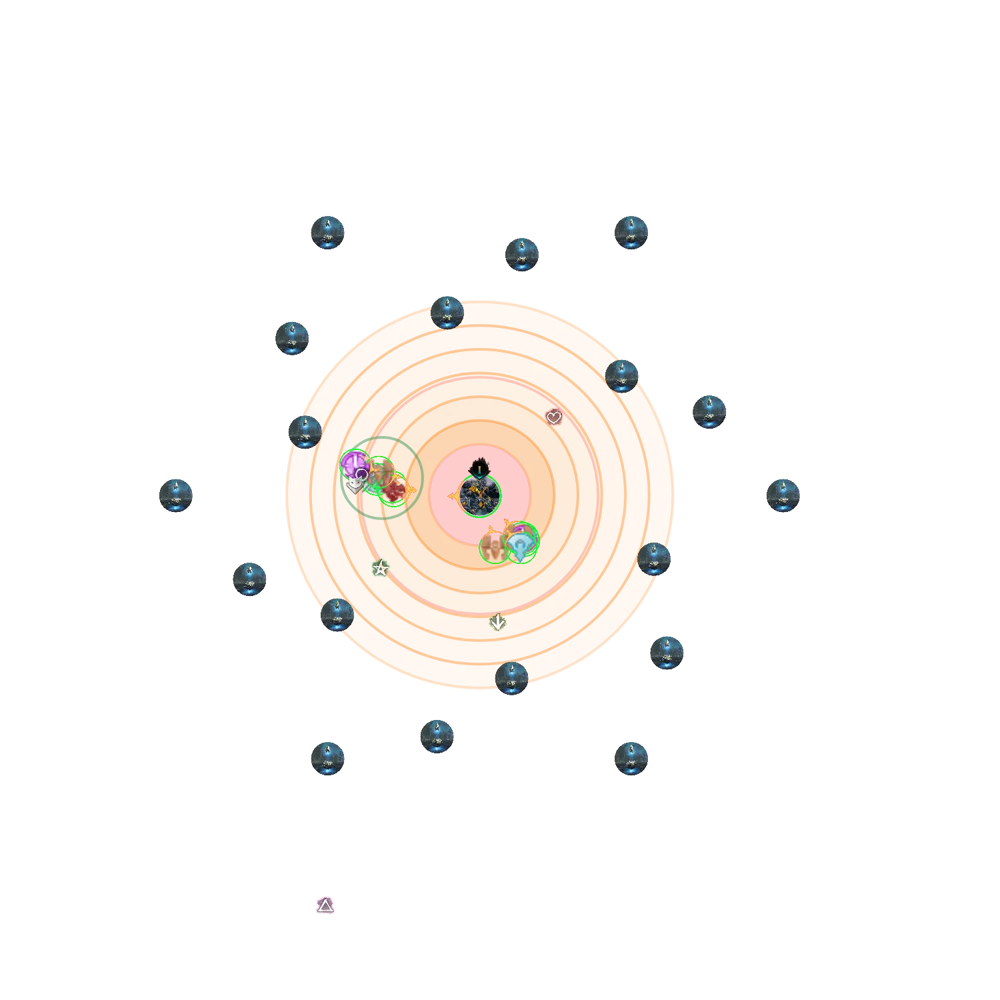
</label>

Immediately after, the ranged group will bait the next set of [Fluxlances], while the melee group collects [Greens]. 
This set of [Fluxlances] contains the [Red Fluxlance], so make sure the *kiter* should ensure they are the furthest player from boss. They can then use a mobility skill to get behind a conduit and survive the mechanic.

<label class="arena-container">
    <input type="checkbox">
    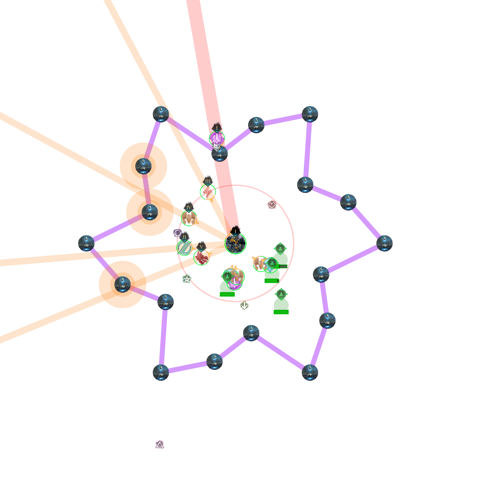
</label>

After the collection and [Fluxlances], the attack pattern starts from the beginning again, with [Foreshock & Mainshock]. Again, once the pizza attack starts, the ranged group needs to bait arrows. The kiter needs to pay attention here and make sure they are at the  marker to bait [Thunder].

<label class="arena-container">
    <input type="checkbox">
    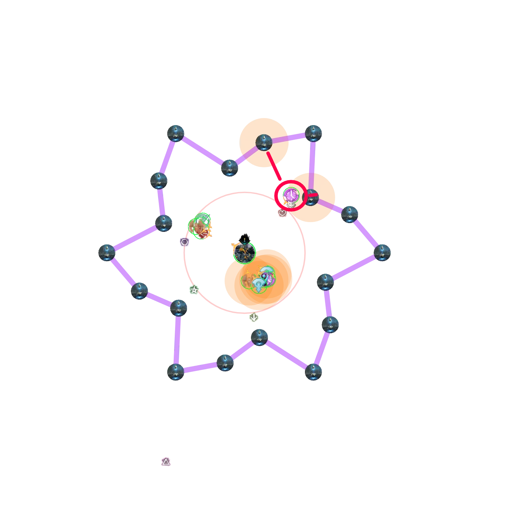
</label>

Depending on the group's DPS, you may already phase now into the first split phase; if not, you will get another Knockback. Ideally it would be better to phase before or during the next set of greens, so as to avoid an additional collection.

<label class="arena-container">
    <input type="checkbox">
    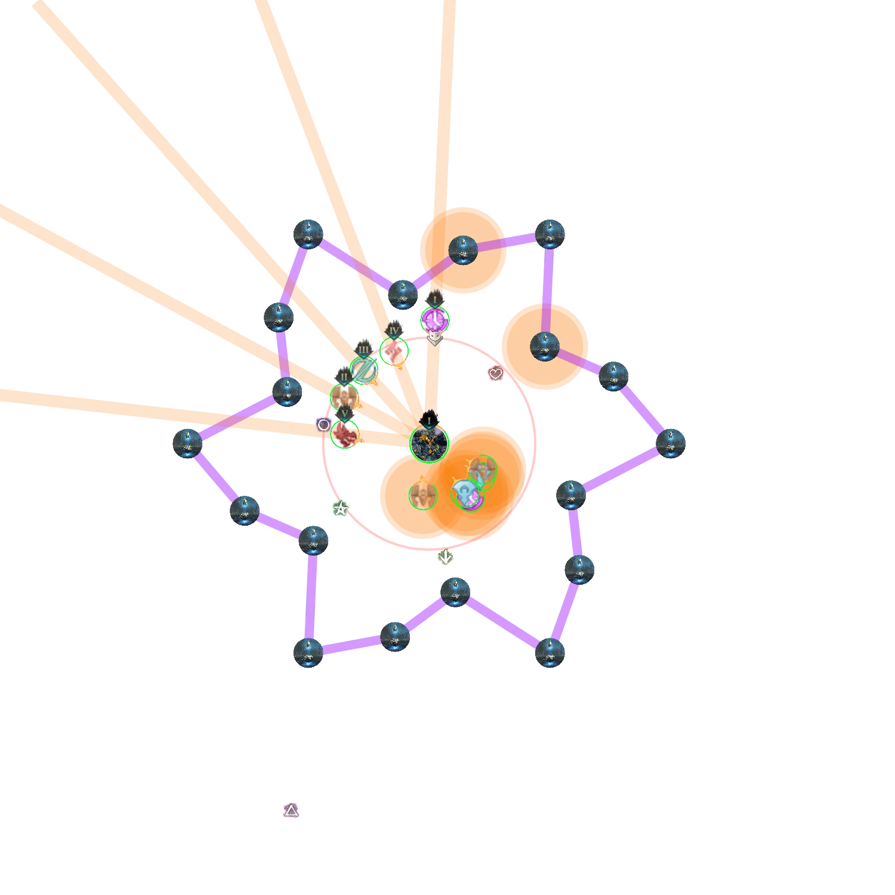
</label>

{: .note}
Phasing after the second collection usually indicates a DPS issue: this needs to be resolved or the group will struggle greatly with the damage check in the final phase.

{: .note}
>The kiter's positioning in this phase is meant to spread out the charged [Conduits] between the inner rings of the formation. In this way there will be less [Greens] in the next phase. When played correctly, only one of the outer conduits should be charged. In the image below for example, the <font color=red>red</font> conduits will have been charged during the first set of arrows, the <font color=orange>orange</font> during the second, and the <font color=yellow>yellow</font> during the third.
> 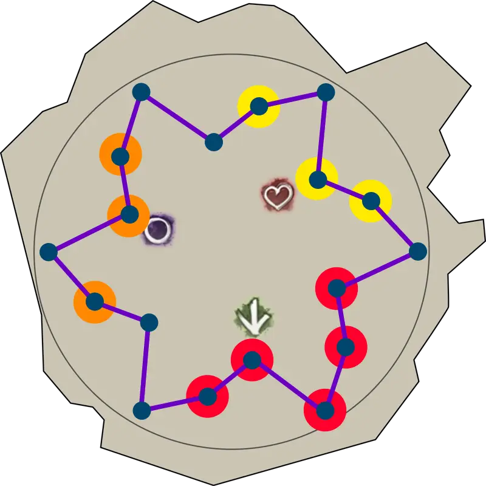

---

### First Split Phase

The ranged and melee group will split to their respective closest [Transcendent Boulder], on for the ranged group and  for the melee group. This is usually directly behind the groups' current position, meaning they can usually turn around 180° and walk to their split phase position (this maneuver is the origin of the name "Turnaround Strategy").

The two healers should prepare their portal next to Decima before going to the adds. The ranged group's can be prepared outside the cage, while the melee group's should be inside the cage.

{: .note}
Experienced squads will portal both subgroups into Decima's cage. This is usually a small DPS increase for the ranged group, but requires more careful positioning. 

{: .warning}
The melee portal should be prepared **to the right** of Decima, not in front. This prevents melee players from getting hit by by [Fluxlances] after taking the portal.

While damaging the [Transcendent Boulder] adds down as fast as possible, it's important to not use any skills with defiance damage in order to skip their dangerous follow-up attacks. 

Decima will continue her attack loop from where she left off after jumping, resulting in a set of [Fluxlances] and [Thunders] that must be played, while within the smaller arenas. The ranged group should position themselves on the far side of the [Transcendent Boulder] from Decima; the melee group on the closest side, in order to bait the mechanics properly. The melee group can simply dodge their [Thunders], while the ranged group needs to pay attention to not charge any extra conduits.

<label class="arena-container">
    <input type="checkbox">
    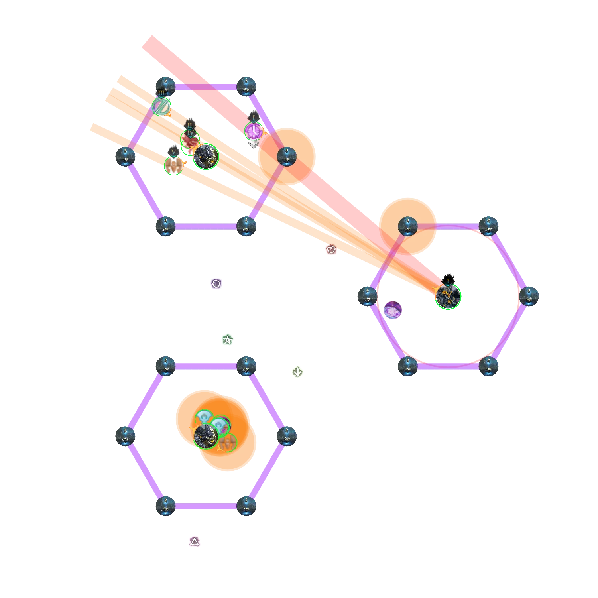
</label>

After the Fluxlances and Thunders, the two healers can open their portals to get everyone back to the main boss. 

---

### 80% - 70%

Decima will normally use [Seismic Crash] shortly after both groups take the portals, so healers should make sure to immediately provide  [Stability] or . The attack pattern for the rest of the phase is the same; next will be a set of [Fluxlances] (usually with the [Red Fluxlance] included) and a [Green] collection. Play the mechanics as before, heal everyone up and prepare your CC skills for when Decima hits 70%.

<label class="arena-container">
    <input type="checkbox">
    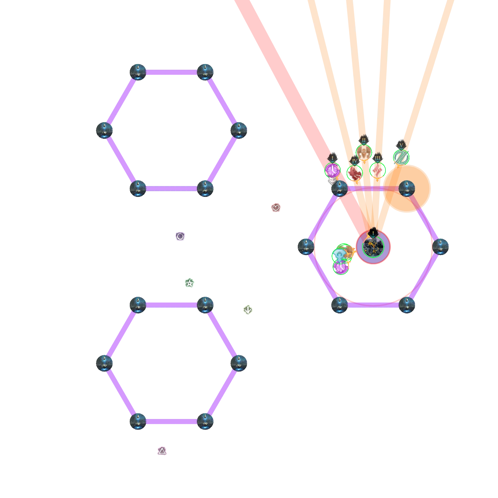
</label>

At 70% HP, Decima will become immune to damage and jump into the middle of the arena. This is a knockback attack, so make sure to provide  [Stability] again. Depending on DPS, [Thunders] might also spawn, be prepared to dodge them, while also paying attention to not charge any conduits. 

Decima will then gain a  [Defiance Bar] with 7500 HP. This needs to be broken as soon as possible, as otherwise the group will need to deal with an additional [Green] collection. Once it is broken, make sure that both groups are stacked up for [Flux Nova]. Pre-cast  [Protection] and [barrier](https://wiki.guildwars2.com/wiki/Barrier), then time your strong healing skills with the burst to prevent any  [Downstates].


## Second Phase

### 70% - 50%

In this phase Decima repeats her attack pattern starting from [Foreshock & Mainshock]. The melee group can stand near the  marker. The ranged group can wait until the pizza attack to move to  marker to bait [Fluxlances]. The *kiter* should try to remain behind the melee group to charge conduits.

<label class="arena-container">
    <input type="checkbox">
    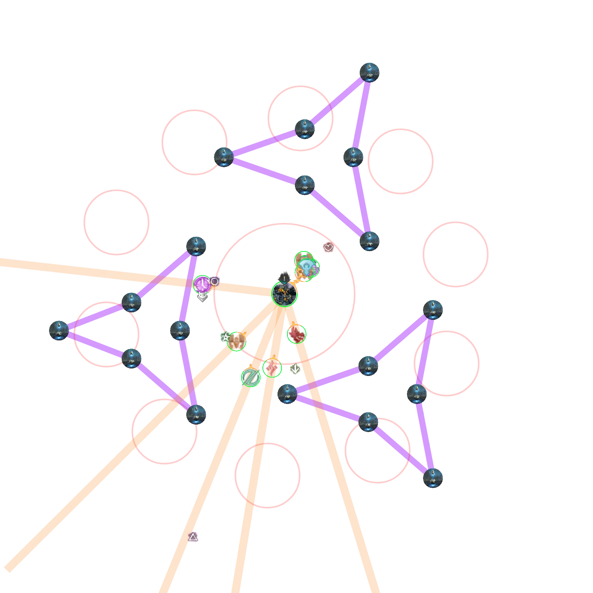
</label>

Once these mechanics are complete, stack up quickly to heal and provide  [Stability] or  [Aegis] for [Seismic Crash]. The melee group will then collect any [Greens], while the ranged group baits the next set of [Fluxlances]. The *kiter* should take care to bait the [Red Fluxlance] and move behind a conduit.  

<label class="arena-container">
    <input type="checkbox">
    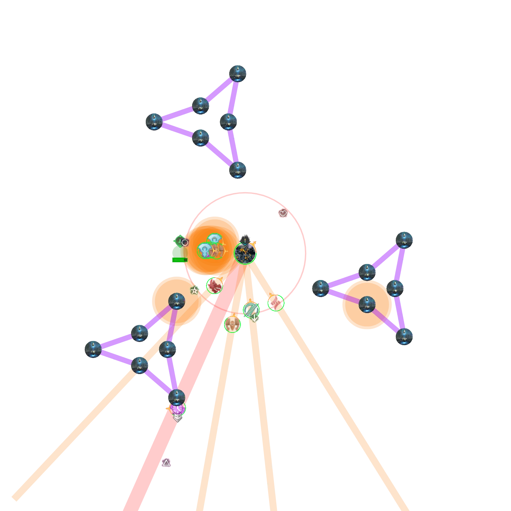
</label>

Decima will then restart her attack pattern. The ranged group can rotate slightly to follow the pylon formation, while the melee group should continue standing near . You should ideally be phasing before or during the next collection, as in phase 1.

---

### Second Split Phase

Similar to the [previous split phase](#first-split-phase), both groups go to their closest [Transcendent Boulder] while the healers prepare their portals. Usually, the melee group will go towards the  marker and the ranged group towards the  marker. The split phase plays similar to before, only it is much more important to not break the add's  [Defiance Bar], so as to avoid [Sparkwave], which will usually wipe the group.

<label class="arena-container">
    <input type="checkbox">
    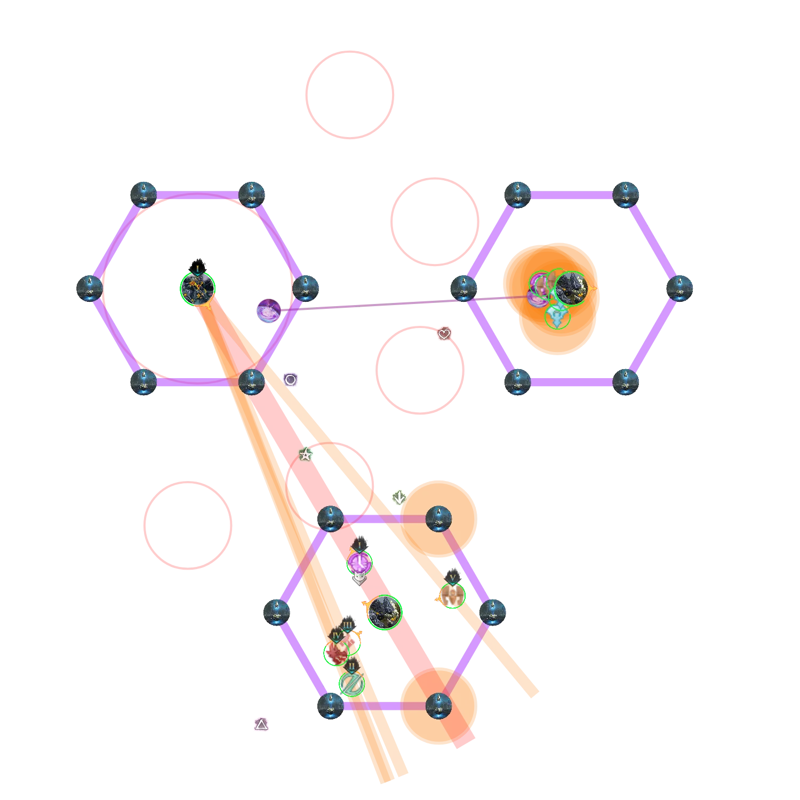
</label>

{: .warning}
Do not CC the [Transcendent Boulder]! A huge number of wipes happen in this phase due to early CC leading to [Sparkwave] casts. If you do CC early, the healer in your cage should try to be the furthest from the add, and bait the attack away from the other subgroup's cage. Everyone else should move opposite to them, so that they are not hit.

As before, the ranged group positions themselves outward to bait [Fluxlances] and melee group inward to bait [Thunders]. The ranged group needs to pay attention again to not hit any conduits with [Fluxlances] and the melee group needs to time their dodge again. As soon as both adds are dead and the two mechanics are done, use portals once more to quickly get back to Decima.

---

### 50% - 40%

This section plays identically to the [80% - 70%] section. After taking the portal, be ready to give  [Stability] or  [Aegis] to prevent knockbacks. The melee group will be inside the cage collecting [Greens]; the ranged group will be baiting [Fluxlances]. Once Decima hits 40%, be ready to dodge [Thunder] while not charging any conduits. CC, stack up and heal through the [Flux Nova] once more.


## Third Phase

### 40% - 10%

Decima will begin this phase by jumping toward the edge of the arena. The jump is a [Seismic Crash] that inflicts  knockback, so provide  [Stability] or  [Aegis].

The melee group will then position to Decima's side; the ranged group will stay in the middle, stacking between the two conduit formations. Decima will being her attack pattern as usual: [Fluxlances] will spawn shortly after the "pizza" attack.

<label class="arena-container">
    <input type="checkbox">
    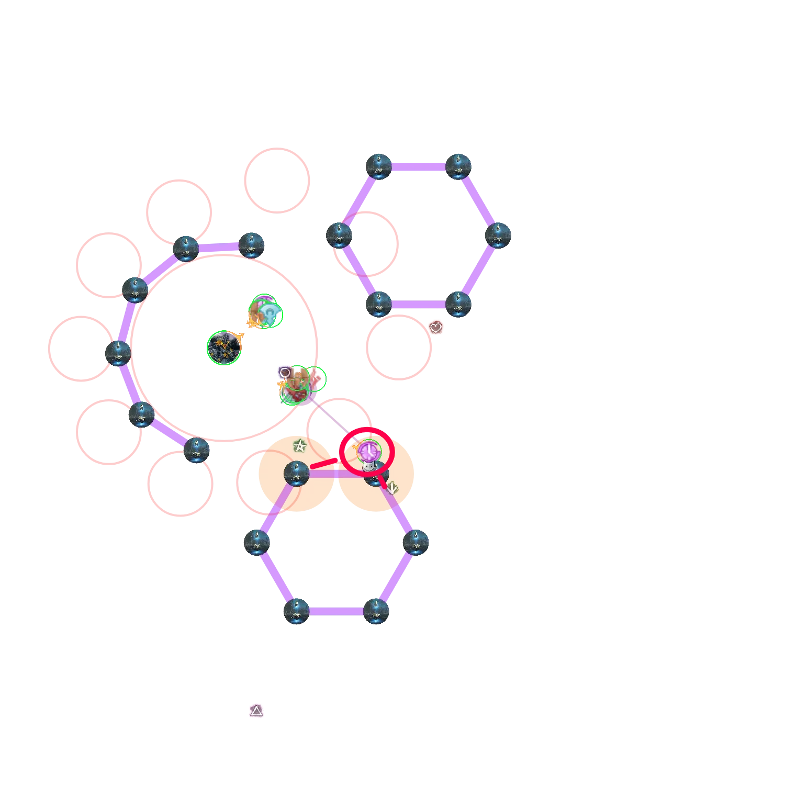
</label>

The kiter in this phase has the additional responsibility of managing the spawn position of the [Focused Fluxlance] <font size=2>(aka Green Arrow)</font>. To do this, they should move to the conduits on the opposite side from the melee group. This will charge those conduits and force the [Focused Fluxlance] to spawn on top of the melee group.

<label class="arena-container">
    <input type="checkbox">
    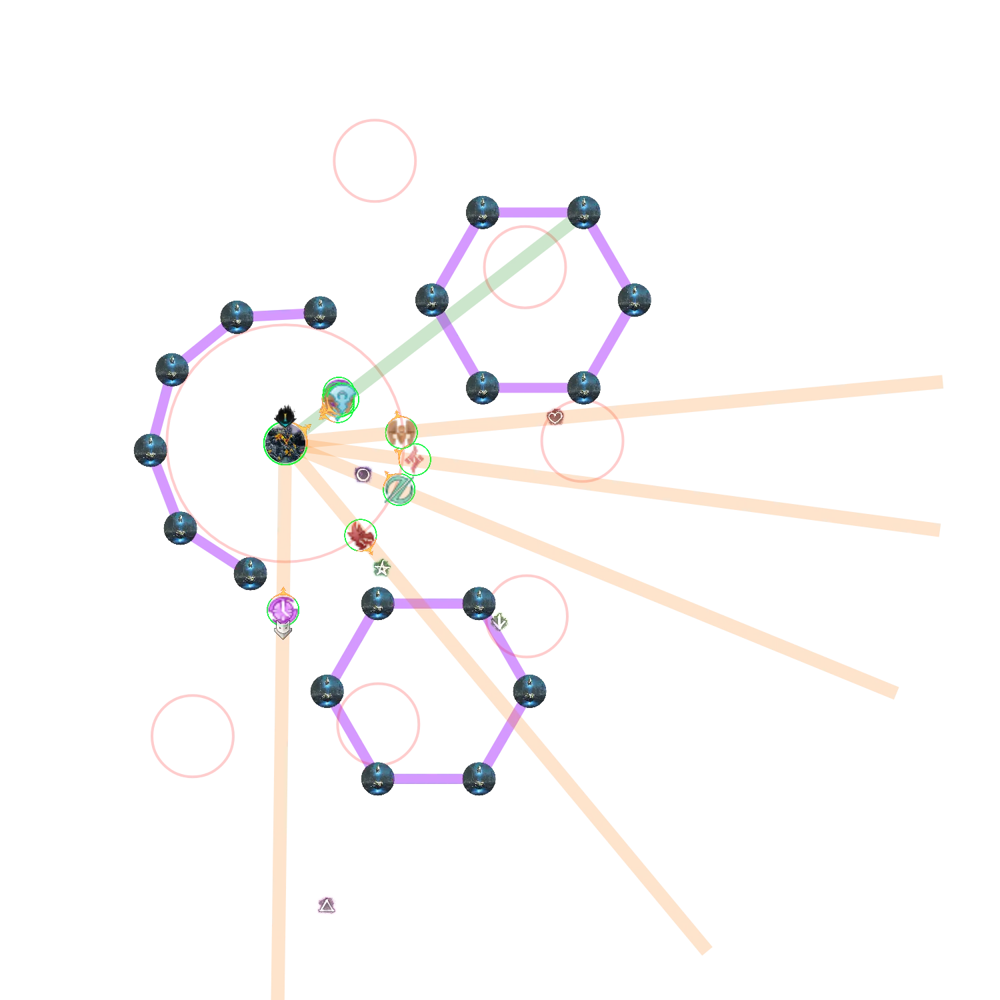
</label>

The melee group must stack inside of the [Focused Fluxlance] to solve the mechanic. This can overlap with [Thunders]: in this case they will need to dodge backwards while still staying inside the Green Arrow. Alternatively, if you are running a  [Troubadour], they can time  [Tale of the August Queen] to nullify the spreads.

Decima will then [Seismic Reposition] to a different position. Be ready to provide  [Stability] or  [Aegis] and follow her to her new location. The melee group can position themselves to stand between Decima and the conduits that have been charged up already; this is usually the opposite side from where they were stacking previously. The ranged group should will remain in the center.

<label class="arena-container">
    <input type="checkbox">
    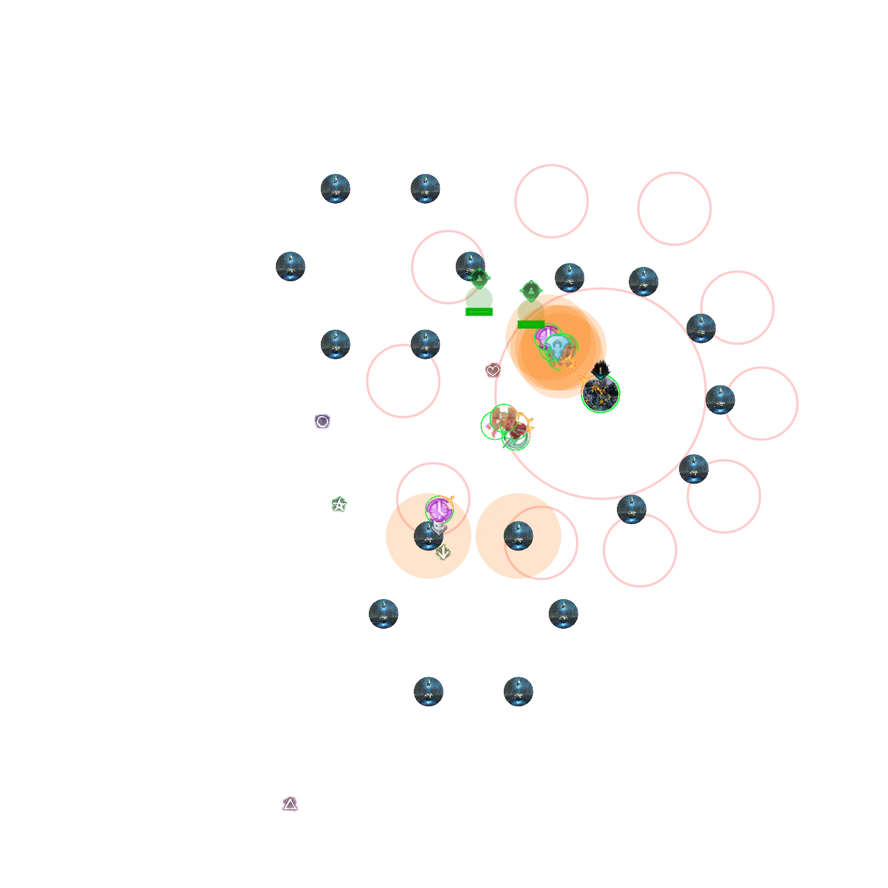
</label>

Decima will once more cast [Foreshock & Mainshock] after jumping. Once the "pizza" attack appears, the *kiter* should be ready to bait the [Red Fluxlance]. To deal with [Converging Fluxlances], they should position accurately as shown in the image below. This blocks the [Red Fluxlance] while preventing any conduits from getting charged by the normal [Fluxlances].

<label class="arena-container">
    <input type="checkbox">
    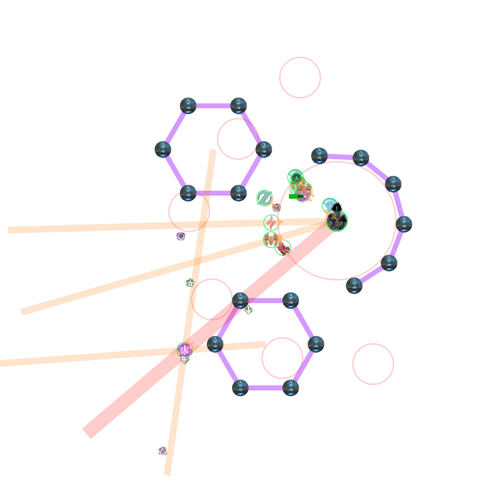
</label>

Decima's attack pattern will then recommence from scratch. After the next pizza, the *kiter* will again need to bait the [Focused Fluxlance] by standing on the opposite side from the melee group.

<label class="arena-container">
    <input type="checkbox">
    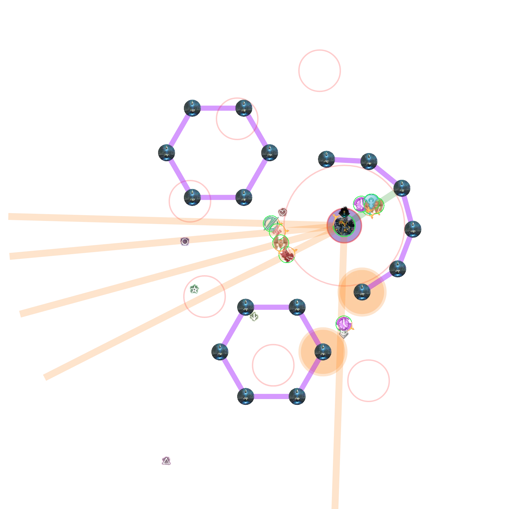
</label>

Next, Decima will jump again, and will cast [Foreshock & Mainshock] followed by a collection. The melee group this time must split between the left and right in order to collect all greens: their healer should take care to keep all the players healthy even while they are off-stack.

<label class="arena-container">
    <input type="checkbox">
    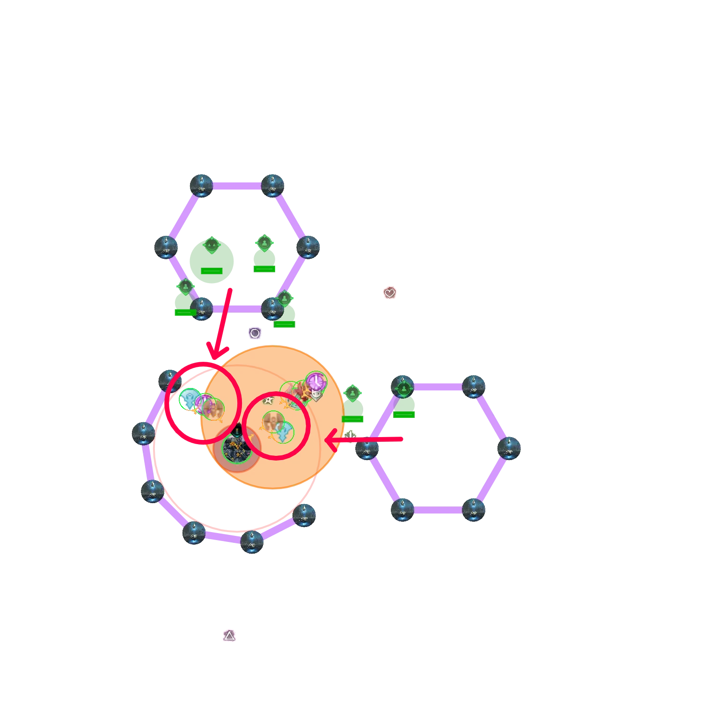
</label>

This sequence of attacks repeats continuously until Decima is lowered to 10% HP, upon which she transitions into the final phase.


## Final Phase

### 10% - 0%

Cleanly transitioning into this phase is extremely important due to the relatively tight DPS-check: any downs or knockbacks at this stage may seriously affect the likelihood of a kill. Depending on the DPS spec, it might also be beneficial to save some cooldowns for the initial burst (e.g. Weave Self).

<label class="arena-container">
    <input type="checkbox">
    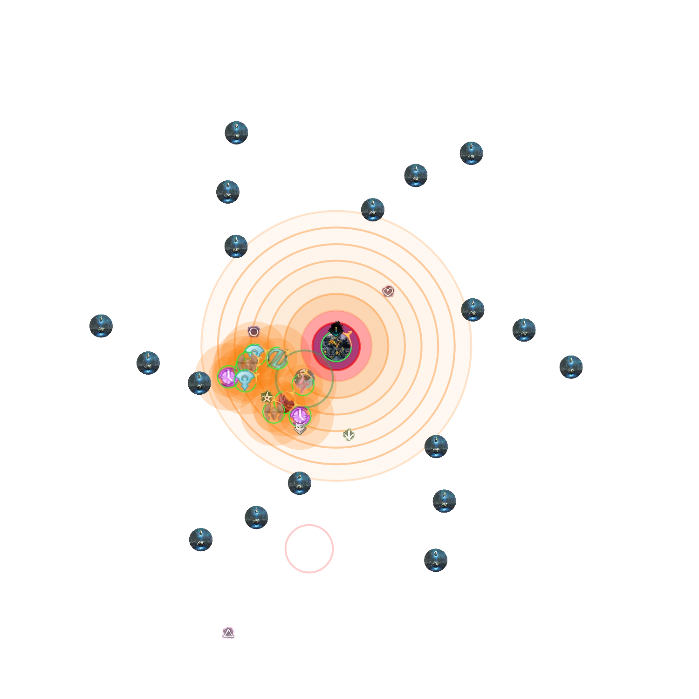
</label>

At the start of the phase, Decima will become  [Invulnerable] and jump into the center of the arena, resetting all conduits. The jump is a knockback, so have  [Stability] or  [Aegis] up. At the same time Decima will cast any remaining [Thunders], be ready to dodge. Depending on DPS, you may have two subsequent [Thunder] casts: be prepared to dodge twice.

{: .note}
This combination of [Seismic Crash] and [Thunder] is extremely lethal: players should always attempt to dodge both components (called "double dodging").

<label class="arena-container">
    <input type="checkbox">
    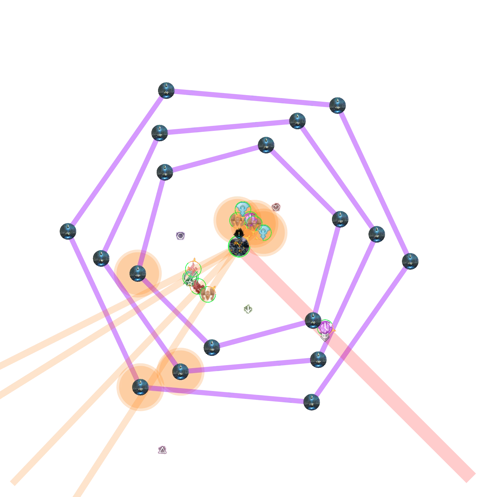
</label>

Soon after this, a final set of [Fluxlances] and [Thunders] must be played. The kiter should bait the [Red Fluxlance] and position behind a conduit to survive.

<label class="arena-container">
    <input type="checkbox">
    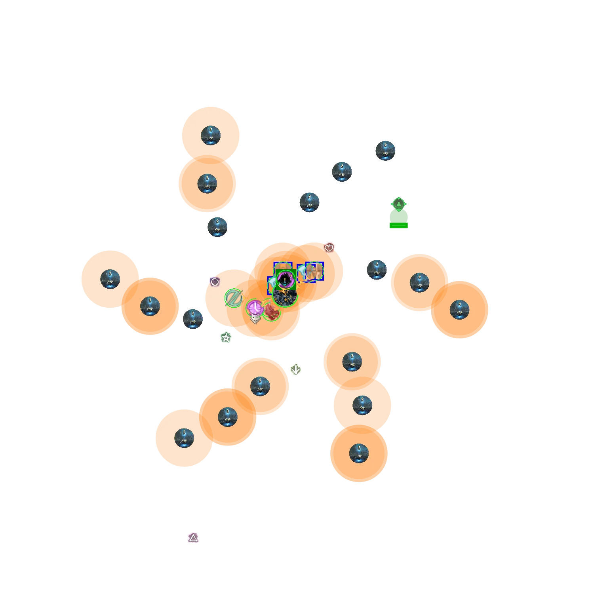
</label>

Afterwards, stack up at the boss and DPS. [Thunders] will spawn continuously throughout this phase. The first targeted players should spread out: this increases DPS by not requiring dodges. Once everyone starts getting a spread, dodge them *forwards* into the boss' hitbox: dodging backward or sideways may hit and charge multiple conduits, as they slowly start coming closer as the phase progresses.

<label class="arena-container">
    <input type="checkbox">
    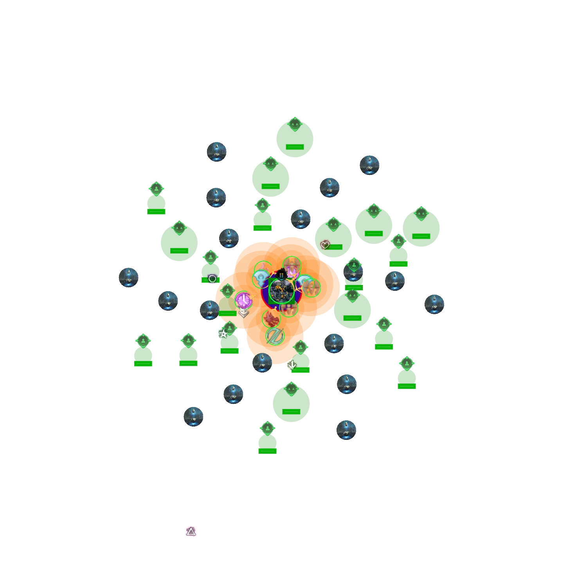
</label>

[Greens] will start spawning as well, gradually escalating from only a few greens to massive simultaneous 18-conduit discharges. Try to block them as well as you can, while focusing on DPS and dodging [Thunders]. 
<br>
If 10 [Greens] move into Decima's hitbox, Decima will become invulnerable and you will wipe. It is important to block as many as possible and kill quickly before the situation escalates. Doing this successfully, keeping up damage, and avoiding downs will lead you to a successful clear.


[Return to Home](../index.html){: .btn } [Return to Overview](overview.html){: .btn } [Return to Top](#decima-recommended-strategy){: .btn .fixed}
{: .center}

[Fluxlance]: mechanics.html#fluxlances
[Fluxlances]: mechanics.html#fluxlances
[Red Fluxlance]: mechanics.html#red-fluxlance
[Focused Fluxlance]: mechanics.html#focused-fluxlance
[Thunders]: mechanics.html#chorus-of-thunder
[Thunder]: mechanics.html#chorus-of-thunder
[Fulminate]: mechanics.html#fulminate
[Green]: mechanics.html#dancing-sparks
[Greens]: mechanics.html#dancing-sparks
[Conduits]: mechanics.html#conduits
[Foreshock & Mainshock]: mechanics.html#foreshock--mainshock
[Seismic Crash]: mechanics.html#seismic-crash
[Seismic Reposition]: mechanics.html#seismic-crash
[Transcendent Boulder]: mechanics.html#trascendent-boulders
[Converging Fluxlances]: mechanics.html#converging-fluxlances
[80% - 70%]: strategy.html#80---70
[Galvanic Sensitivity]: mechanics.html#-galvanic-sensitivity
[Harmonic Sensitivity]: mechanics.html#-harmonic-sensitivity
[Flux Nova]: mechanics.html#flux-nova
[Thrumming Presence]: mechanics.html#thrumming-presence
[Harmonious Thunder]: mechanics.html#harmonious-thunder
[Chorus of Thunder]: mechanics.html#chorus-of-thunder
[Sparkwave]: mechanics.html#sparkwave
[Tale of the August Queen]: https://wiki.guildwars2.com/wiki/Tale_of_the_Tortured_Mastermind
[Invulnerable]: https://wiki.guildwars2.com/wiki/Invulnerability

[Stability]: https://wiki.guildwars2.com/wiki/Stability
[Aegis]: https://wiki.guildwars2.com/wiki/Aegis
[Defiance Bar]: https://wiki.guildwars2.com/wiki/Defiance_bar
[Chronomancer]: #builds-and-povs
[Troubadour]: #builds-and-povs
[Scourge]: #builds-and-povs
[Specter]: #builds-and-povs
[Mesmers]: https://wiki.guildwars2.com/wiki/Mesmer
[Protection]: https://wiki.guildwars2.com/wiki/Protection
[Downstates]: https://wiki.guildwars2.com/wiki/Downstate