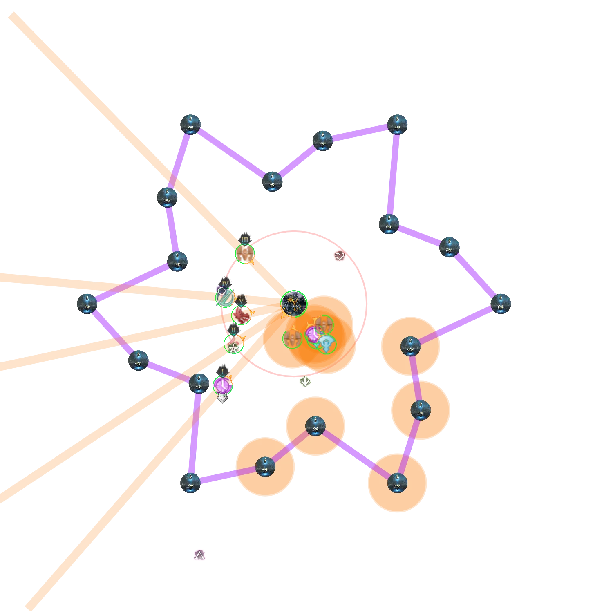
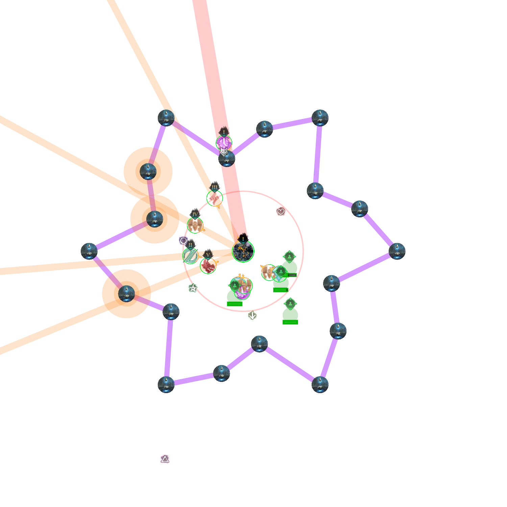
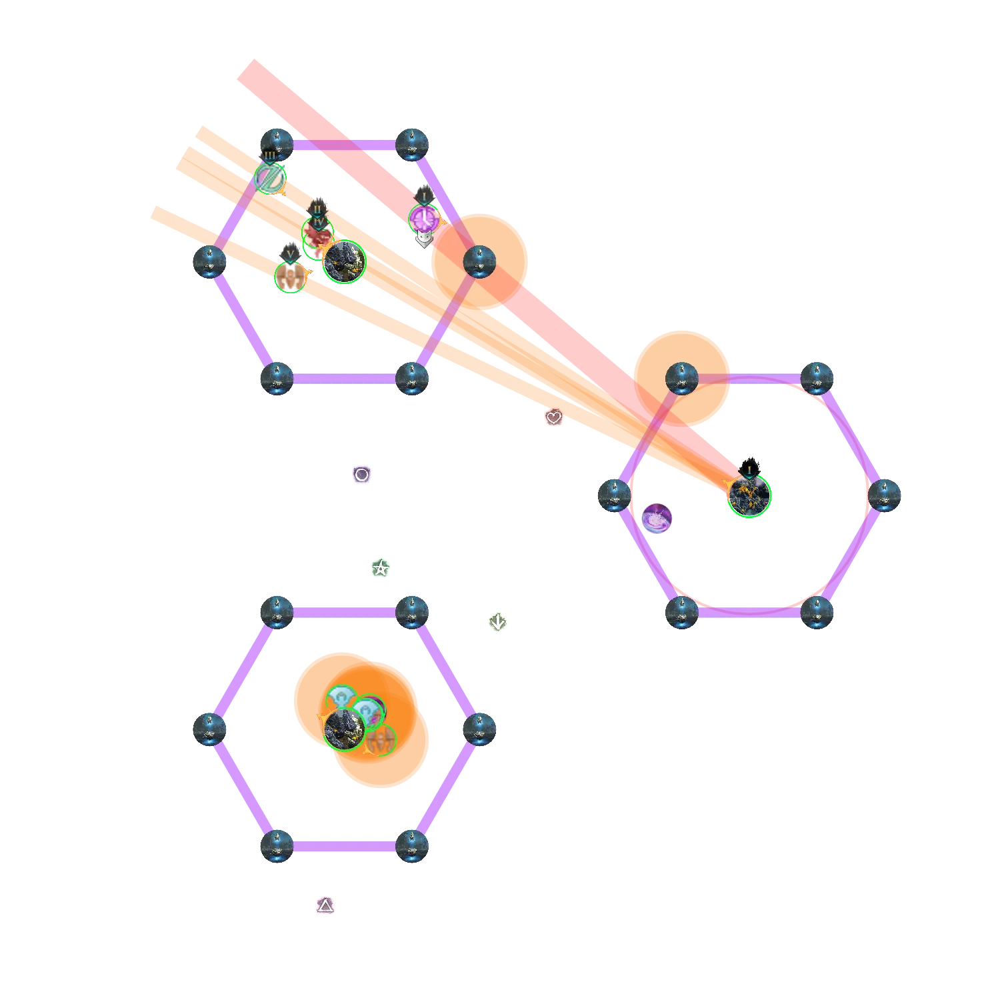

[Return to Home](../index.html){: .btn } [Return to Overview](./overview.html){: .btn } [Mechanical Reference](./mechanics.html){: .btn }

# Decima Recommended Strategy
{: .no_toc}

<details>
<summary><b>Table of Contents</b></summary>
<div markdown=block>
1. TOC
{:toc}

---
</div>
</details>

This strategy is a written version of this [PoV](https://www.youtube.com/watch?v=Qsf582waMDM), and is designed for achievement runs, minimizing overlap and difficulty of mechanics, while also requiring the least possible movement.

All markers referenced in this guide can be set up with the [Commander Markers](https://blishhud.com/modules/?module=Manlaan.CommanderMarkers) module for [Blish HUD](https://blishhud.com), using the marker pack provided below.

<details>
<summary>Click to view markers</summary>
<div markdown="block">


Paste the following code into Commander Markers to use this marker pack:
```
eyJlbmFibGVkIjp0cnVlLCJuYW1lIjoiRGVjaW1hIENNIFN0cmF0ZWd5IiwiZGVzY3JpcHRpb24iOiJEZWNpbWEgQ00gc3RyYXRlZ3kgbWFya2VycyBwYWNrIGJ5IE1pa2UgW0NSU10iLCJtYXBJZCI6MTU2NCwidHJpZ2dlciI6eyJ4IjotMjc2LjU1NjEyMiwieSI6MjY1Ljc3OTU3MiwieiI6MTM4LjUxNjc2OX0sIm1hcmtlcnMiOlt7ImkiOjEsImQiOiJTb3V0aCBtYXJrZXIiLCJ4IjotMjU2Ljk5MDEsInkiOjMxNi40OTY0NiwieiI6MTM4LjUyMjM1NH0seyJpIjoyLCJkIjoiV2VzdCBtYXJrZXIiLCJ4IjotMjc3LjA4MzI4MiwieSI6MzM5LjE4OTk0MSwieiI6MTM4LjUyMjM1NH0seyJpIjozLCJkIjoiTm9ydGggbWFya2VyIiwieCI6LTI0OC41NDI3NCwieSI6MzQ3LjI0NDE0MSwieiI6MTM4LjUyMjM1NH0seyJpIjo3LCJkIjoiUm9sbCBvdXQgc3BvdCEgKHN0YXJ0aW5nIGxvY2F0aW9uKSIsIngiOi0yODIuNDU2MiwieSI6MjczLjQ2MDksInoiOjEzOC41MTY1fV19
```
</div>
</details>

This is an in-depth guide: if you are looking for something fast to read and less comprehensive, check out the [Decima Fast Guides](./fast-guide.html).

---

#### Main Points
{: .no_toc}
- The squad divides into a _ranged group_ and a _melee group_.
- The _ranged group_ stays far from the boss to bait [Fluxlances].
- The _melee group_ stays close to the boss to bait [Thunder] and collect [Greens].
- One player covers a special role, the _kiter_, and controls spawn positions for several important mechanics.
- The position of the two different groups and the kiter are carefully controlled to minimize overlap between mechanics.


## General Information

### Melee and Ranged Group

Many of Decima's mechanics are incompatible with each other, meaning that players that participate in one of them are impeded from helping out with others. More specifically:
- Players who are baiting [Fluxlances] cannot also bait [Thunder] reliably at the same time. Furthermore, when hit by Fluxlances they will be affected by  [Galvanic Sensitivity], and thus cannot collect [Greens].
- Players who are baiting [Thunder] cannot also bait [Fluxlances] reliably at the same time. Furthermore, by staying within [Thrumming Presence] they will be affected by  [Harmonic Sensitivity], making them vulnerable to [Fluxlances].

The natural conclusion to this issue is separating the squad into a ranged and a melee subgroup.
- The *ranged group* is responsible for baiting [Fluxlances] by being the furthest players from the boss, and pointing them away from [Conduits].
- The *melee group* is responsible for baiting [Thunder] by being the closest players to the boss, and collecting [Greens].

In this way we eliminate harmful overlaps between responsibilities and reduce the overall mechanical stress on each player.

---

### Kiting

Many of Decima's mechanics focus around the furthest player from the boss.
- [Harmonious Thunder] charges [Conduits] closest to this player.
- The [Red Fluxlance] will target this player.
- The [Focused Fluxlance] will target the conduit furthest from this player.

We can take advantage of this by assigning this role to a specific player, called the _kiter_. Kiters often have to move off-stack to do these mechanics: this means lower DPS uptime and higher survivability requirements than regular DPS players. For this reason, kiters are often the healers for the ranged subgroup, though this is not set in stone.

The kiter therefore condenses several responsibilities:
- Healing and boons for the ranged subgroup.
- Positioning during [Chorus of Thunder] to control which conduits are charged.
- Aggressively baiting out the [Red Fluxlance], and then surviving when it goes off.
- Ensuring that the [Focused Fluxlance] spawns in an advantageous position.


## Composition

Support players should be providing good defensive boon coverage and healing. Decima has many strong bursts of damage incoming from various mechanics ([Fluxlances], [Seismic Crash], [Flux Nova]), so drops in  [Protection] and insufficient healing can quickly lead to players downing.

 [Stability] is required at regular intervals, portals are very useful to simplify the split phases (especially for the melee group) and good burst CC is necessary to break Decima's massive  [Defiance Bar]. Due to these requirements,  [Chronomancer] is by far the most played healer on this encounter, though not the only viable one. Kiters will also greatly benefit from mobility and boon radius, as their subgroup will often have to spread out to do mechanics.

While there are less strict requirements on the boonDPS and DPS than on the healers, the _ranged group_ will spend a decent amount of time out of melee range and thus it is recommended to use appropriate ranged builds. DPS in general should also try to bring sufficient amounts of CC, and boonDPS should bring backup  [Stability] if possible.

---

#### Builds and PoVs

This is a non-exhaustive list of playable builds on the encounter. If anything is outdated, you can find up-to-date information on  [Void Lounge](https://discord.com/invite/voidlounge).

|Build|Role|PoV|Last updated|
|[ Heal Chronomancer](https://gw2skills.net/editor/?PigEQiWmBzidxCZj4RPp2aA-DSJYjR1fh0SKUdFkeQp7rhgEK/t0+mFUB-e)| Heal, Kiter | [PoV (Kiter)](https://www.youtube.com/watch?v=Qsf582waMDM) [PoV (Melee)](https://www.youtube.com/watch?v=t0Dj09CKgRM) | September 2025 |
|[ Heal Scourge](https://gw2skills.net/editor/?PSwEw8NsMD2G7hFxGxU9K71D-DSRYjRLV1HSI1ALjqLg0TBdvNEkQZL8aQwmFoC-e) | Heal, Kiter | [PoV](https://youtu.be/gZSVTWeXRdk) | April 2025 |
|[ Heal Specter](https://gw2skills.net/editor/?PazAsqrlhySZWsN2JeqWnxeA-DSRYjhCCGJaJ/eKkWChqLg0TAdvOEkQZD8WafzCqA-e) | Heal, Kiter | [PoV](https://www.youtube.com/watch?v=RYRrvI0VWiA&ab) | September 2025 |
|[ Heal Tempest](https://gw2skills.net/editor/?PGgAsilRwWYMMPGKe2TptfA-DSJYjRDfZUdCkeBo71BWafzCqA-e) | Heal, Kiter | [PoV](https://youtu.be/IinQ3QXNEvI) | July 2025 |
|[ Condi Alacrity Specter](https://snowcrows.com/builds/raids/thief/condition-alacrity-spectre-scepter)| Ranged BoonDPS | | September 2025 |
|[Condi Quickness Herald](https://snowcrows.com/builds/raids/revenant/condition-quickness-herald-spear)| Ranged BoonDPS | [PoV](https://youtu.be/mlZ-_ovKZXc) | May 2025 |
|[ Condi Virtuoso](https://snowcrows.com/builds/raids/mesmer/condition-virtuoso) | Ranged DPS | | June 2025 |
|[ Condi Scourge](https://snowcrows.com/builds/raids/necromancer/condition-scourge)| Ranged DPS |[PoV](https://youtu.be/scilNBfG0_U) | June 2025 |


## First Phase

### 100% - 80%

The fight begins by making use of Mount abilities to quickly enter the arena and reach Decima, usually either  [Roll Out](https://wiki.guildwars2.com/wiki/Roll_Out) or  [Leap](https://wiki.guildwars2.com/wiki/Leap_(Raptor)).

Decima starts with the attack pattern shown [here](mechanics.html#100---80). The [Foreshock & Mainshock] abilities are simply outhealed. 
<br>
Once you see the start of the **Mainshock** <font size=2>("pizza" attack)</font> cast, the ranged group needs to step away from the boss to bait [Fluxlances] close to the  marker.

<label class="arena-container">
    <input type="checkbox">
    
</label>

The kiter should instead go to roughly the  marker <font size=2>(see image below)</font> in order to bait [Thunder] into charging up the correct conduits. 
<br>
The kiter should try not to charge up any of the conduits that make up the outer ring furthest from Decima, because those will encircle Decima in the split phase, making collecting their [Greens] much more difficult; (see [this](mechanics.html#80-split-phase) animation).

<label class="arena-container">
    <input type="checkbox">
    
</label>

Shortly after the [Fluxlances] will fire. Make sure to not hit any conduits and then quickly group up on the  marker and heal up and give  [Stability] to prevent the knockback from [Seismic Crash].

<label class="arena-container">
    <input type="checkbox">
    
</label>

Immediately after, the ranged group has to bait the next set of [Fluxlances], while the melee group has to collect [Greens]. 
This set of [Fluxlances] contains the [Red Fluxlance], so make sure that the kiter is the furthest player from boss. The kiter should use a mobility skill to get behind a conduit, making sure to not charge up one of the furthest conduits, to make the split phase easier.

<label class="arena-container">
    <input type="checkbox">
    
</label>

After the collection and [Fluxlances], the attack pattern starts from the beginning again, with [Foreshock & Mainshock]. Again, once the pizza attack starts, the ranged group needs to bait arrows. The kiter needs to pay attention here and make sure they are at the  marker to bait [Thunder].

<label class="arena-container">
    <input type="checkbox">
    
</label>

Depending on the group's DPS, you may already phase now into the first split phase; if not, you will get another Knockback that needs  [Stability]. Ideally it would be better to phase before or during the next set of greens, so as to avoid an additional collection.

<label class="arena-container">
    <input type="checkbox">
    
</label>

{: .note}
Phasing after the second collection usually indicates a serious DPS issue: this needs to be resolved or the group will struggle greatly with the damage check in the final phase.

{: .note}
>The kiter's positioning in this phase is meant to spread out the charged [Conduits] between the inner rings of the formation. In this way there will be less [Greens] in the next phase. When played correctly, only one of the outer conduits should be charged. In the image below for example, the <font color=red>red</font> conduits will have been charged during the first set of arrows, the <font color=orange>orange</font> during the second, and the <font color=yellow>yellow</font> during the third.
> 

---

### First Split Phase

The ranged and melee group will split to their respective closest [Transcendent Boulder], which is usually close to the  marker for the ranged group and to the   marker for the melee group. 
<br>
The two healers can either pre-place their portal before going to the adds (required for  [Specter] since their portal is one-way), or place it after playing the main mechanic during this split.

{: .note}
For the melee portal, the healer needs to pay attention to **prepare the portal to the side** of Decima, not in front. This is to prevent the melee group getting hit by by [Fluxlances] after taking the portal.

While damaging the [Transcendent Boulder] adds down as fast as possible, it's important to not use any skills with Breakbar damage in order to skip their dangerous follow-up attacks. 

Decima will continue her attack loop from where she left off after jumping, resulting in a set of [Fluxlances] and [Thunders] that must be played, while within the smaller arenas. The ranged group should position themselves on the far side of the[Transcendent Boulder] from Decima; the melee group on the closest side, in order to bait the mechanics properly. The melee group can simply dodge their [Thunders], while the ranged group needs to pay attention to not charge any extra conduits.

<label class="arena-container">
    <input type="checkbox">
    
</label>

After the Fluxlances and Thunders, the two healers can open their portals to get everyone back to Decima. The ranged group should be ported outside the cage, while the melee group should be ported into the cage.

{: .note}
Some experienced squads will portal both subgroups into Decima's cage. This is usually a small DPS increase for the ranged group, but requires more careful positioning. 

---

### 80% - 70%

After taking the portal, timing-wise, Decima usually uses [Seismic Crash] again, so healers should make sure to immediately provide  [Stability]. The attack pattern is the same; next in turn will be a set of [Fluxlances] and [Green] collection. Play the mechanics as before, heal everyone up and prepare your CC skills for when Decima hits 70%.

<label class="arena-container">
    <input type="checkbox">
    
</label>

 At 70% HP, Decima will become immune to damage and jump into the middle of the arena. This is a knockback attack, so make sure to provide  [Stability] again. Depending on DPS, [Thunders] might also spawn, be prepared to dodge them, while also paying attention to not charge any conduits. 
 <br>
 Afterward Decima will gain a  [Defiance Bar] of 7500, this needs to be broken as soon as possible. If broken quickly enough, there is no need to deal with any of the other mechanics (mainly [Greens]) and the only thing that'll happen next is a big incoming damage burst from [Fulminate]. 
  <br>
  Make sure that both groups are stacked up and have  [Protection], use Barrier skills and time your strong healing skills to prevent any downs. If someone downs, everyone should make sure to quickly bring them back up.


## Second Phase

### 70% - 50%

In this phase Decima repeats her attack pattern; starting from [Foreshock & Mainshock] like in Phase 1. The melee group can stand near the  marker. The ranged group can stand near the  marker.

<label class="arena-container">
    <input type="checkbox">
    
</label>

The ranged group baits the conduit charges and [Fluxlances] at . Spread apart without hitting any conduits and stack up quickly to heal and provide  [Stability] for the [Seismic Crash] coming immediately after.

Next, the melee group rotates toward  to collect [Greens], [Thunders] may happen at the same time, so be ready to dodge. 
 <br>
The ranged group will be baiting the next set of [Fluxlances] right of . The kiter needs to make sure they bait the [Red Fluxlance] again and move behind a conduit in order to survive.  

<label class="arena-container">
    <input type="checkbox">
    
</label>

Decima will then restart her attack pattern. The ranged group should position themselves between  and  and the melee group can stand near . Either the boss will phase after the following set of [Fluxlances], or you may need to play another collection.

---

### Second Split Phase

Similar to before the two groups go to their closest [Transcendent Boulder], while the healers prepare their portals. Usually, the melee group should go towards the  marker and the ranged group towards the  marker. The split phase plays similar to before, only it is much more important to not break the add's  [Defiance Bar], so as to avoid [Sparkwave], which will usually wipe the group.

<label class="arena-container">
    <input type="checkbox">
    
</label>

{: .warning}
Do not CC the [Transcendent Boulder]! A huge number of wipes happen in this phase due to early CC leading to [Sparkwave] casts. If you do CC early, the healer in your cage should try to be the furthest from the add, and bait the attack away from the other subgroup's cage. Everyone else should move opposite to them, so that they are not hit.

As before, the ranged group positions themselves outward to bait [Fluxlances] and melee group inward to bait [Thunders]. The ranged group needs to pay attention again to not hit any conduits with [Fluxlances] and the melee group needs to time their dodge again. As soon as both adds are dead and the two mechanics are done, use portals once more to quickly get back to Decima.

---

### 50% - 40%

This section plays identically to the [80% - 70%] section. After taking the portal, be ready to give  [Stability] to prevent knockbacks. The melee group will be inside the cage collecting [Greens]; the ranged group will be outside the cage baiting [Fluxlances]. Once Decima hits 40%, be ready to dodge in case [Thunders] appear, while again not dodging into any conduits. Cast  [Stability] when Decima jumps into the middle of the arena and be ready to CC again. Stack up into groups, use barrier skills and time your heal skills to heal through the big incoming damage of [Fulminate] again.


## Third Phase

### 40% - 10%

Next, Decima will jump toward the edge of the arena. The jump is a [Seismic Crash] attack with a knockback, make sure to provide  [Stability].

The melee group can position themselves left or right of Decima when looking at her from the center; the ranged group just stays between the two hexagonal formations of conduits. Decima will start her attack pattern again, like at the start of Phase 1 and Phase 2. Once you see the "pizza" attack begin, bait the [Fluxlances].

<label class="arena-container">
    <input type="checkbox">
    
</label>

The kiter in this phase has the additional responsibility of managing the spawn position of the [Focused Fluxlance] <font size=2>(aka Green Arrow)</font>. To do this: they should initially move toward the conduits on the opposite side from the melee group, this will also bait [Thunder] onto those conduits.

<label class="arena-container">
    <input type="checkbox">
    
</label>

The first set of [Fluxlances] in this phase includes the [Focused Fluxlance]. If the kiter baits correctly on the right-hand side, the Green Arrow will spawn to the left of Decima, directly on top of the melee group. The melee group needs to stack inside of the [Focused Fluxlance] to solve the mechanic. This can overlap with [Thunders]: in this case they will need to dodge backward/forward while still staying inside the Green Arrow so as to not fail the mechanic.

Next, Decima will [Seismic Reposition] to a different position. Be ready to provide  [Stability] and follow Decima to her new location. The melee group can position themselves to stand between Decima and the conduits that have been charged up already; the ranged group should remain in the center and the kiter should bait on the opposite side to the melee group.

<label class="arena-container">
    <input type="checkbox">
    
</label>

After the jump Decima will start with [Foreshock & Mainshock] again. Toward the end, once the "pizza" attack appears, the kiter wants to make their way to bait conduits and the next [Red Fluxlances]. This should be close to the conduits that are already charged, in order to make the [Greens] come only from one side. The kiter will then need to deal with [Converging Fluxlances], which requires accurate positioning to block the [Red Fluxlance] while avoiding charging any conduits with standard [Fluxlances].

<label class="arena-container">
    <input type="checkbox">
    
</label>

Afterwards, the kiter should move back to the stack, and Decima's attack pattern starts again. Once you see the "pizza" attack, in addition to baiting the five [Fluxlance], the kiter will again need to bait the Green Arrow and the next set of charging up conduits.

<label class="arena-container">
    <input type="checkbox">
    
</label>

Next, Decima will jump again, and will cast [Foreshock & Mainshock] followed by a collection. The melee group this time must split between the left and right in order to collect all greens: their healer should take care to keep all the players healthy even while they are off-stack.

<label class="arena-container">
    <input type="checkbox">
    
</label>

After the "pizza" attack, the ranged group will bait [Fluxlances] with the kiter playing [Converging Fluxlances] again. Following this is another set of [Foreshock & Mainshock] and [Fluxlances], with the Green Arrow and possibly [Thunders]. Play them similarly to before.

<label class="arena-container">
    <input type="checkbox">
    
</label>

After this Green Arrow, ideally before, Decima should hit 10% and the final phase will start.


## Final Phase

### 10% - 0%

The final 10% is a burst phase, so you want to immediately deal as much damage as possible. Cleanly transitioning into this phase is extremely important due to the relatively tight DPS-check: any downs or knockbacks at this stage will seriously hurt your chances of a kill. Depending on the DPS spec, it might also be beneficial to save some cooldowns for the initial burst (e.g. Weave Self).

<label class="arena-container">
    <input type="checkbox">
    
</label>

At the start of the phase, Decima will become invulnerable and jump into the center of the arena, resetting all conduits. The jump is a knockback, so have  [Stability] up. At the same time Decima will cast any remaining [Thunders], be ready to dodge. Depending on DPS, it can happen that two subsequent [Thunder] casts happen, be prepared to dodge twice subsequently.

{: .note}
This combination of [Seismic Crash] and [Thunder] is extremely lethal: players should always attempt to dodge both components (called "double dodging").

<label class="arena-container">
    <input type="checkbox">
    
</label>

Soon after this, a set of [Fluxlances] and [Thunders] must be played. Make sure to not hit any conduits, and the kiter should bait the [Red Fluxlance] and use a mobility skill behind a conduit to survive.

<label class="arena-container">
    <input type="checkbox">
    
</label>

Afterwards, stack up at the boss and DPS. Throughout this phase, [Thunders] will spawn continuously, these should be dodged into the boss. This is because around the boss conduits will gradually come closer and closer and dodging backward or sideways will hit and charge them.

<label class="arena-container">
    <input type="checkbox">
    
</label>

Additionally, [Greens] collection will spawn as well, gradually escalating from only a few greens to massive simultaneous 18-conduit discharges. Try to block them as well as you can, while focusing on DPS and dodging [Thunders]. 
<br>
If 10 [Greens] move into Decima's hitbox, Decima will become invulnerable and you will wipe. Hence, it is important to block as many as possible. Doing this successfully, keeping up damage, and avoiding downs will lead you to a successful clear.


[Return to Home](../index.html){: .btn } [Return to Overview](overview.html){: .btn } [Return to Top](#decima-recommended-strategy){: .btn .fixed}
{: .center}

[Fluxlance]: mechanics.html#fluxlances
[Fluxlances]: mechanics.html#fluxlances
[Red Fluxlance]: mechanics.html#red-fluxlance
[Focused Fluxlance]: mechanics.html#focused-fluxlance
[Thunders]: mechanics.html#chorus-of-thunder
[Thunder]: mechanics.html#chorus-of-thunder
[Fulminate]: mechanics.html#fulminate
[Greens]: mechanics.html#dancing-sparks
[Conduits]: mechanics.html#conduits
[Foreshock & Mainshock]: mechanics.html#foreshock--mainshock
[Seismic Crash]: mechanics.html#seismic-crash
[Seismic Reposition]: mechanics.html#seismic-crash
[Transcendent Boulder]: mechanics.html#trascendent-boulders
[Converging Fluxlances]: mechanics.html#converging-fluxlances
[80% - 70%]: strategy.html#80---70
[Galvanic Sensitivity]: mechanics.html#-galvanic-sensitivity
[Harmonic Sensitivity]: mechanics.html#-harmonic-sensitivity
[Flux Nova]: mechanics.html#flux-nova
[Thrumming Presence]: mechanics.html#thrumming-presence
[Harmonious Thunder]: mechanics.html#harmonious-thunder
[Chorus of Thunder]: mechanics.html#chorus-of-thunder
[Sparkwave]: mechanics.html#sparkwave

[Stability]: https://wiki.guildwars2.com/wiki/Stability
[Defiance Bar]: https://wiki.guildwars2.com/wiki/Defiance_bar
[Chronomancer]: https://wiki.guildwars2.com/wiki/Chronomancer
[Scourge]: https://wiki.guildwars2.com/wiki/Scourge
[Specter]: https://wiki.guildwars2.com/wiki/Specter
[Protection]: https://wiki.guildwars2.com/wiki/Protection