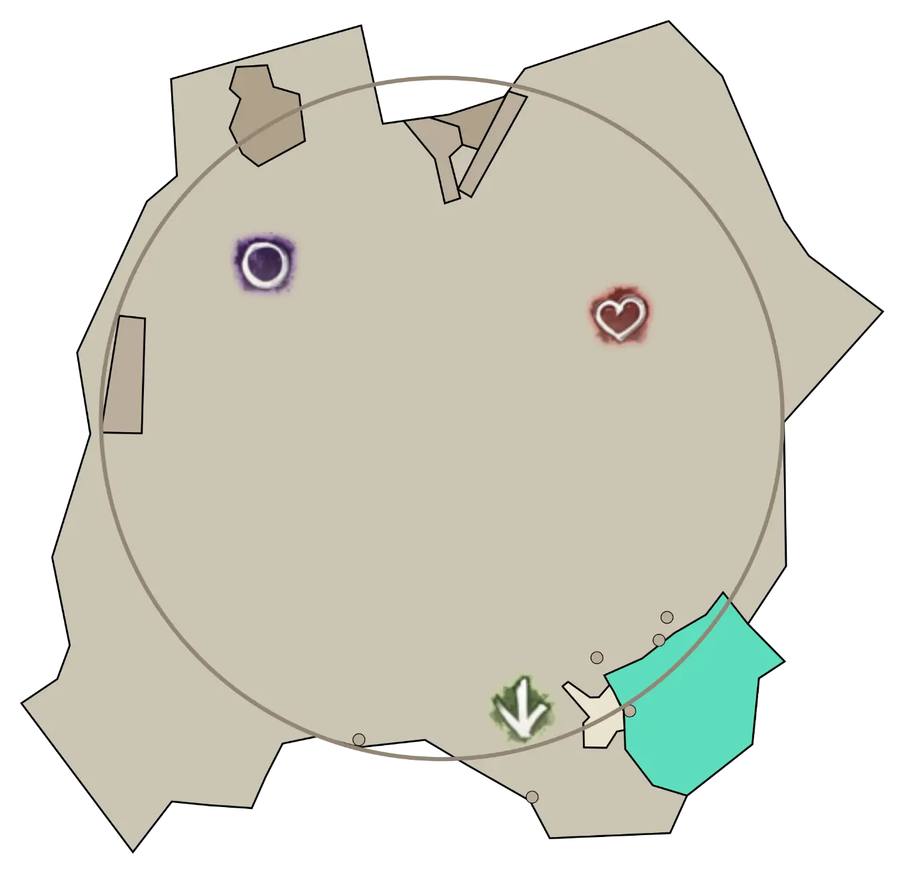
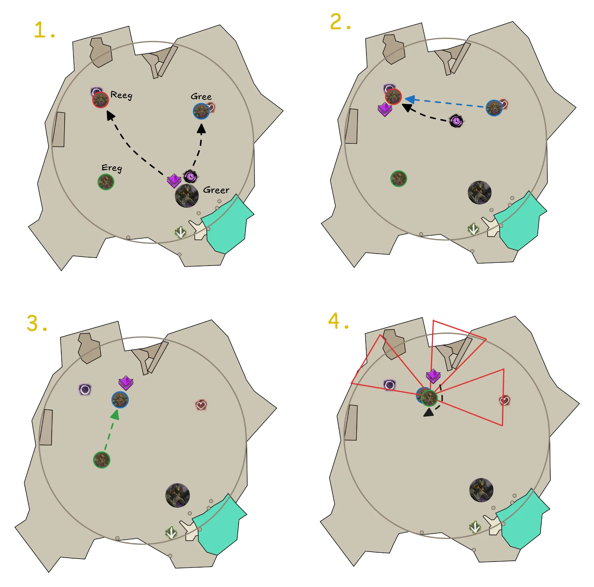
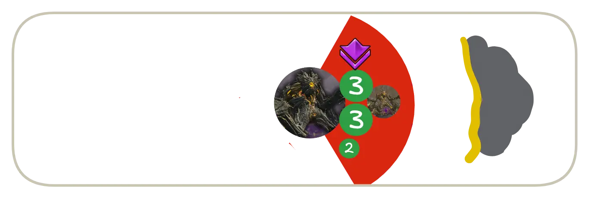
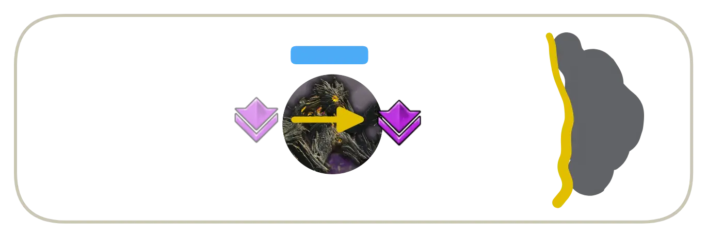
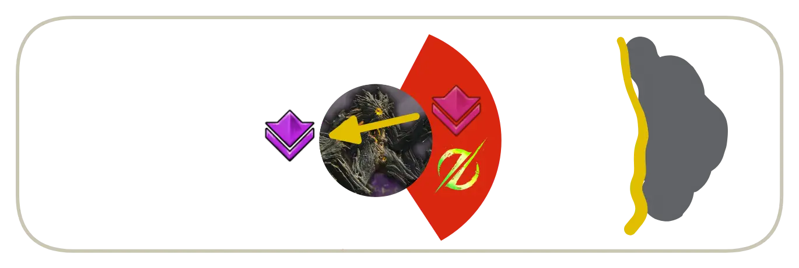

[Return to Home](../index.html){: .btn } [Return to Overview](./overview.html){: .btn } [Mechanical Reference](./mechanics.html){: .btn } [Strategy Guide](./strategy.html){: .btn }

# Fast Greer Guides

This page contains some simple guides for several roles in the Godspoil Greer encounter. If you want something more in-depth, please read the full [Strategy Guide](./strategy.html).

All markers referenced in this guide can be set up with the [Commander Markers](https://blishhud.com/modules/?module=Manlaan.CommanderMarkers) module for [Blish HUD](https://blishhud.com), using the marker pack provided below.

<details>
<summary>Click to view markers</summary>
<div markdown=block>

Paste the following code into Commander Markers to use this marker pack:
```
eyJlbmFibGVkIjp0cnVlLCJuYW1lIjoiR3JlZXIgQ00geGIiLCJkZXNjcmlwdGlvbiI6ImRlc2NyaXB0aW9uIiwibWFwSWQiOjE1NjQsInRyaWdnZXIiOnsieCI6MC4wLCJ5IjowLjAsInoiOjAuMH0sIm1hcmtlcnMiOlt7ImkiOjEsImQiOiJtYXJrZXIgbmFtZSIsIngiOjM3My40NDgxODEsInkiOi0yMzIuNTQ3MjExLCJ6Ijo3Ny40MTg1NX0seyJpIjo0LCJkIjpudWxsLCJ4IjozOTEuMDg5NCwieSI6LTIzMi44NzAxNDgsInoiOjc3LjU2MzY0fSx7ImkiOjcsImQiOm51bGwsIngiOjM4MC40NiwieSI6LTI0MC4zODM3NzQsInoiOjc3LjUzOTAyNDR9LHsiaSI6MywiZCI6bnVsbCwieCI6MzU5Ljk5NSwieSI6LTE4Ny42NTAxLCJ6Ijo3Ny4zOTU1MTU0fSx7ImkiOjIsImQiOm51bGwsIngiOjM1Mi4wNDc2NjgsInkiOi0xNTEuMzcxNDQ1LCJ6Ijo3Ny4zOTE3NTQyfSx7ImkiOjgsImQiOm51bGwsIngiOjM4OC4wODYzNjUsInkiOi0yNDMuMDk3NjI2LCJ6Ijo3Ny41NTQwMX0seyJpIjo1LCJkIjpudWxsLCJ4IjozNzMuNzU3MDE5LCJ5IjotMjQyLjU2ODU3MywieiI6NzcuNTc5MjN9XX0=
```
</div>
</details>

---

## What are you playing?
{: .center}

<div class="index-container">
    <a href="#heal-chronomancer-guide"
       class="guides-button"
       style="background-image: url(../images/greer/strategy/fast-guides/chrono.webp);">Heal Chronomancer</a>
    <a href="#bubble-guide"
       class="guides-button"
       style="background-image: url(../images/greer/strategy/fast-guides/bubble.webp);">Bubble</a>
</div>
<div class="index-container">
    <a href="#10-tank-guide"
       class="guides-button"
       style="background-image: url(../images/greer/strategy/fast-guides/tank.webp);">10% Tank</a>
    <a href="#dps-guide"
       class="guides-button"
       style="background-image: url(../images/greer/strategy/fast-guides/dps.webp);">Boon/DPS</a>
</div>


# Heal Chronomancer Guide

[ Builds and PoVs](./strategy.html#builds-and-povs){: .btn}

Your responsibilities (excluding basic healing and support as required by your role) consist in:
1. Providing  [Stability] and  [Aegis] for most, if not all mechanics.
2. Intercepting [Blighted Orbs] using  [Distortion] to delete them.
3. Providing backup projectile reflection with  [Feedback].
4. Aggro-ing certain adds during the split phases.
5. Providing large amounts of CC.

#### General Information for all Phases
- Save your  [Mantra of Concentration] for the [Swipes]. You can often block both swipes with a single cast if well timed. Call out if you don't have it for mechanics.
- Save your  [Well of Precognition] for the [Slams]. This becomes increasingly important as the fight progresses. Call out if you don't have it for a slam.
- Save your  [Distortion] for [Blighted Orbs]. Sort out with your fellow  [Chronomancer] who does the first set of orbs and who the second, and call out whenever you are deleting.
- When your bubble player calls for backup (usually by saying "Bubble Down"), you should pick a side of the boss (usually by calling "Double"/"Single") and use your  [Feedback] to block [Empowering Orbs] from your direction when you see them.
- If possible, save your  [Continuum Split] for the CC phases.
- Make sure you are dodging or jumping the shockwave component of Greer's [Slams].
- Sidestep all arrows. Try to provide  [Stability] for them if you can spare it.

---

<details class=faq>
<summary>Phase 1</summary>
<div markdown='block'>
- Start on [Reeg].
- You will have a first set of [Blighted Orbs] just before [Greens]. If you are responsible for this first set, it could be your responsibility to aggro the boss and pull it to the group.
- You may be responsible of blocking the first set of [Empowering Orbs] from [Gree] and [Ereg]. In this case, after deleting the [Blighted Orbs], use  [Continuum Split] to double-cast  [Feedback] so that both directions are covered.
<details>
<summary> Example of an opener with orb deletion and double  Feedback</summary>
<iframe class="youtube-video center" width="100%" src="https://www.youtube.com/embed/Y1QIgchi1SU?si=vjBewg-lzPSfN-1b&start=7&end=36&mute=1 " frameborder="0" allow="accelerometer; clipboard-write; encrypted-media; gyroscope; picture-in-picture; web-share" referrerpolicy="strict-origin-when-cross-origin" allowfullscreen></iframe>
</details>
- When Greer lumbers over, move between him and Reeg so your DPS can cleave them together.
- Wait for Greer's [Breath Attack], baiting it outwards. If [Reeg] is dead, dodge through Greer and position inwards, otherwise continue cleaving him. You will usually have a second set of [Blighted Orbs] in this moment.
- Play the rest of the phase positioned towards the center of the arena.
</div>
</details>

<details class=faq>
<summary>First Split Phase</summary>
<div markdown='block'>
- Often you or your fellow  [Chronomancer] must aggro [Gree] on  and pull it towards the group on .
- If you are not aggroing Gree, cross the arena to [Reeg] on  and start damaging him.
- If you get a [Green] while off-stack, try to dodge it or call for a buddy to help you out.
- Once [Reeg] is gone or close to 50%, move to [Gree]. Stack on the outside of Gree so that [Ereg] walks to you.
- Cleave the two adds together. When Ereg uses its [Breath Attack], dodge through it and continue cleaving.

</div>
</details>

<details class=faq>
<summary>Phase 2</summary>
<div markdown='block'>
- As soon as [Gree] is dead, walk back to the boss.
- You may have to delete a set of [Blighted Orbs] while walking to the boss.
- Move to [Reeg] and kill him while playing [Greens]. Players targeted by greens should split to the left and right between the boss and the add, as shown in the image.


- Wait for Greer's [Breath Attack], baiting it outwards. If Reeg is dead, dodge through Greer and position inwards, otherwise continue cleaving him.
- Play the rest of the phase positioned towards the center of the arena.
</div>
</details>

<details class=faq>
<summary>Second Split Phase</summary>
<div markdown='block'>
- Play this identically to the first split phase.
- [Ereg] will often remain alive for a bit after [Gree] dies: continue staying on him with your squad until your commander calls for you to move.
</div>
</details>

<details class=faq>
<summary>Phase 3</summary>
<div markdown='block'>
- You will have to play triple [Greens]. If you get one of these, stack with your green buddies together off the main group, then try to dodge the greens together as shown [here](https://www.youtube.com/watch?v=-epK7O8qfl4). If you go downstate, wait for your teammates to rez you. Use  [Feedback] to aid with rezzing (thanks to  [Medic's Feedback]).
- Play the beginning of the phase positioned towards the center of the arena.
- During CC, your squad should move through Greer towards the outside of the arena.


- On the first [Swipe], [Slam] or [Breath Attack] after CC, dodge through Greer so that only the tank remains in front of him.


- Play the rest of the phase positioned towards the center of the arena.
</div>
</details>

<details class=faq>
<summary>Protoling Phase</summary>
<div markdown='block'>
- Follow your commander to the furthest [Protoling].
- Shatter any clones so that Protolings aggro correctly onto you.
- Try to stay on tag while sidestepping [Swipes] and moving out of [Slams].
- You will have to play triple [Greens]. If you get one of these, stack with your green buddies together off the main group, then try to dodge the greens together as shown [here](https://www.youtube.com/watch?v=-epK7O8qfl4). If you go downstate, wait for your teammates to rez you.
- When the last [Protoling] is close to dying, your commander will have you move back to Greer.
- Greer will have lots of  [Empowered] in the final 10%: make sure you are sidestepping [Swipes] and providing  [Aegis] for [Slams].
</div>
</details>


# Bubble Guide

[ Builds and PoVs](./strategy.html#builds-and-povs){: .btn}

Your responsibilities (excluding basic damage and support as required by your role) consist in:
1. Intercepting [Empowering Orbs] to prevent the boss from getting  [Empowered].
2. Negating the many mechanics throughout the fight that barrage players with projectiles.
3. Calling for backup every time you do not have projectile reflection or negation for a mechanic. 

#### General Information for all Phases
- Throughout most damage phases, [Empowering Orbs] will come in sets of three from the two adds (as a "double" and a "single").
- During CC phases at 80%, 50% and 20%, several [Empowering Beasts] will spawn. These will often cast [Empowering Orbs], so make sure you always have reflection up.
- Always call for backup when your projectile management skills are unavailable, especially during split phases and the Protoling phase.
- Make sure you are dodging or jumping the shockwave component of Greer's [Slams].
- Sidestep all arrows.

<details class=faq>
<summary>Phase 1</summary>
<div markdown='block'>
- Start on [Reeg] and DPS him while playing [Greens].
- Check if your  [Chronomancers] are reflecting the first set of [Empowering Orbs]. If they aren't, it is your responsibility to run over to Greer, block them and aggro the boss towards the group. 
- When Greer lumbers over, move between him and Reeg to cleave them together.
- Wait for Greer's [Breath Attack], baiting it outwards. If Reeg is dead, dodge through Greer and position inwards, otherwise continue cleaving him.
- Play the rest of the phase positioned towards the center of the arena.
- Have your bubble ready for the CC phase at 80%.
</div>
</details>

<details class=faq>
<summary>First Split Phase</summary>
<div markdown='block'>
- Cross the arena to [Reeg] on  and start damaging him.
- Once Reeg disappears or is close to 50%, move to [Gree]. Stack on the outside of Gree so that [Ereg] walks to you.
- Cleave the two adds together. When Ereg uses its [Breath Attack], dodge through it and continue cleaving.

</div>
</details>

<details class=faq>
<summary>Phase 2</summary>
<div markdown='block'>
- As soon as [Gree] is dead, walk back to the boss.
- Move to [Reeg] and kill him while playing [Greens]. Players targeted by greens should split to the left and right between the boss and the add, as shown in the image.


- Wait for Greer's [Breath Attack], baiting it outwards. If Reeg is dead, dodge through Greer and position inwards, otherwise continue cleaving him.
- Play the rest of the phase positioned towards the center of the arena.
- Have your bubble ready for the CC phase at 50%.
</div>
</details>

<details class=faq>
<summary>Second Split Phase</summary>
<div markdown='block'>
- Play this identically to the first split phase.
- [Ereg] will often remain alive for a bit after [Gree] dies: continue staying on him with your squad until your commander calls for you to move.
</div>
</details>

<details class=faq>
<summary>Phase 3</summary>
<div markdown='block'>
- You will have to play triple [Greens]. If you get one of these, stack with your green buddies together off the main group, then try to dodge the greens together as shown [here](https://www.youtube.com/watch?v=-epK7O8qfl4). If you go downstate, wait for your teammates to rez you.
- Play the beginning of the phase positioned towards the center of the arena.
- Have your bubble ready for the CC phase at 20%.
- During CC, your squad should move through Greer towards the outside of the arena.


- On the first [Swipe], [Slam] or [Breath Attack] after CC, dodge through Greer so that only the tank remains in front of him.


- Play the rest of the phase positioned towards the center of the arena.
</div>
</details>

<details class=faq>
<summary>Protoling Phase</summary>
<div markdown='block'>
- Follow your commander to the furthest [Protoling].
- Try to stay on tag while sidestepping [Swipes] and moving out of [Slams].
- You will have to play triple [Greens]. If you get one of these, stack with your green buddies together off the main group, then try to dodge the greens together as shown [here](https://www.youtube.com/watch?v=-epK7O8qfl4). If you go downstate, wait for your teammates to rez you.
- When the last Protoling is close to dying, your commander will have you move back to Greer. Prestack conditions on Greer to improve your ramp-up.
- Greer will have lots of  [Empowered] in the final 10%: make sure you are sidestepping [Swipes].
</div>
</details>


# 10% Tank Guide

[ Builds and PoVs](./strategy.html#builds-and-povs){: .btn}

Your responsibilities (excluding basic damage and support as required by your role) consist in:
1. Keeping Greer occupied in phases where the rest of the group is not on him (usually only the Protoling phase).
2. Providing backup projectile reflection.

#### General Information for all Phases
- Make sure you are dodging or jumping the shockwave component of Greer's [Slams].
- Sidestep all arrows. Try to provide  [Stability] for them if you can spare it.
- When your bubble player calls for backup (usually by saying "Bubble Down"), you should pick a side of the boss (usually by calling "Double"/"Single") and place your projectile blocks when you see [Empowering Orbs] come from your direction.
- Greer aggros on the closest player in a 120% cone in front of him. When tanking, try to always stay in melee range within this cone.

<details class=faq>
<summary>Phase 1</summary>
<div markdown='block'>
- Start on [Reeg] and DPS him while playing [Greens].
- Block the first [Empowering Orb] from Reeg using  [Corrosive Poison Cloud].
- When Greer lumbers over, move between him and Reeg to cleave them together.
- Wait for Greer's [Breath Attack], baiting it outwards. If Reeg is dead, dodge through Greer and position inwards, otherwise continue cleaving him.
- Play the rest of the phase positioned towards the center of the arena.
</div>
</details>

<details class=faq>
<summary>First Split Phase</summary>
<div markdown='block'>
- If your  [Chronomancers] are not doing it, it's your responsibility to aggro [Gree] on  and pull it towards the group on .
- If you are not aggroing Gree, cross the arena to [Reeg] on  and start damaging him.
- Once Reeg disappears or is close to 50%, move to [Gree]. Stack on the outside of Gree so that [Ereg] walks to you.
- Cleave the two adds together. When Ereg uses its [Breath Attack], dodge through it and continue cleaving.

</div>
</details>

<details class=faq>
<summary>Phase 2</summary>
<div markdown='block'>
- As soon as [Gree] is dead, walk back to the boss.
- Move to [Reeg] and kill him while playing [Greens]. Players targeted by greens should split to the left and right between the boss and the add, as shown in the image.


- Wait for Greer's [Breath Attack], baiting it outwards. If Reeg is dead, dodge through Greer and position inwards, otherwise continue cleaving him.
- Play the rest of the phase positioned towards the center of the arena.
</div>
</details>

<details class=faq>
<summary>Second Split Phase</summary>
<div markdown='block'>
- Play this identically to the first split phase.
- If [Ereg] is still healthy when [Gree] dies, you should run to Greer and keep him occupied while the rest of the group continues damaging him.
</div>
</details>

<details class=faq>
<summary>Phase 3</summary>
<div markdown='block'>
- You will have to play triple [Greens]. If you get one of these, stack with your green buddies together off the main group, then try to dodge the greens together as shown [here](https://www.youtube.com/watch?v=-epK7O8qfl4). If you go downstate, wait for your teammates to rez you.
- Play the beginning of the phase positioned towards the center of the arena.
- After CC, your squad should move through Greer towards the outside of the arena.


- On the first [Swipe], [Slam] or [Breath Attack], the rest of the squad will dodge through Greer so that only you remain in front of him.


- Play the rest of the phase tanking Greer towards the outside of the arena while your squad is on the inside.
</div>
</details>

<details class=faq>
<summary>Protoling Phase</summary>
<div markdown='block'>
- Stay with Greer. Ask your squad to aggro and pull away any [Protolings] that come to you.
- Stand close to Greer and sidestep [Swipes] and [Cage of Decay]. Save your dodges for [Slams], making sure to jump the wave.
- Use  [Corrosive Poison Cloud] if you get too many projectiles on yourself.
- If a Protoling spawns close and aggros on you, you may need to come back to the squad earlier to survive. In this case, try to bait out Greer's [Jump].
- When the last Protoling is close to dying, your commander will have the squad move back to Greer. Prestack conditions on Greer to improve your ramp-up.
- If you are healthy and confident, try to continue facing Greer away from the group until he is dead.
</div>
</details>


# DPS Guide

[ Builds and PoVs](./strategy.html#builds-and-povs){: .btn}

Your responsibilities consist in:
1. Doing as much damage as you can to Greer.
2. Trying to stay alive and not fail mechanics while remaining on the stack.

#### General Information for all Phases
- Make sure you are dodging or jumping the shockwave component of Greer's [Slams].
- Sidestep all arrows. Try to provide  [Stability] for them if you can spare it.
- Try to check that you have  [Stability] before tanking a mechanic.

<details class=faq>
<summary>Phase 1</summary>
<div markdown='block'>
- Start on [Reeg] and DPS him while playing [Greens].
- When Greer lumbers over, move between him and Reeg to cleave them together.
- Wait for Greer's [Breath Attack], baiting it outwards. If Reeg is dead, dodge through Greer and position inwards, otherwise continue cleaving him.
- Play the rest of the phase positioned towards the center of the arena.
</div>
</details>

<details class=faq>
<summary>First Split Phase</summary>
<div markdown='block'>
- Cross the arena to [Reeg] on  and start damaging him.
- Once Reeg disappears or is close to 50%, move to [Gree]. Stack on the outside of Gree so that [Ereg] walks to you.
- Cleave the two adds together. When Ereg uses its [Breath Attack], dodge through it and continue cleaving.

</div>
</details>

<details class=faq>
<summary>Phase 2</summary>
<div markdown='block'>
- Move to [Reeg] and kill him while playing [Greens]. Players targeted by greens should split to the left and right between the boss and the add, as shown in the image.


- Wait for Greer's [Breath Attack], baiting it outwards. If Reeg is dead, dodge through Greer and position inwards, otherwise continue cleaving Reeg.
- Play the rest of the phase positioned towards the center of the arena.
</div>
</details>

<details class=faq>
<summary>Second Split Phase</summary>
<div markdown='block'>
- Play this identically to the first split phase.
- [Ereg] will often remain alive for a bit after [Gree] dies: continue staying on him with your squad until your commander calls for you to move.
</div>
</details>

<details class=faq>
<summary>Phase 3</summary>
<div markdown='block'>
- You will have to play triple [Greens]. If you get one of these, stack with your green buddies together off the main group, then try to dodge the greens together as shown [here](https://www.youtube.com/watch?v=-epK7O8qfl4). If you go downstate, wait for your teammates to rez you.
- Play the beginning of the phase positioned towards the center of the arena.
- During CC, your squad should move through Greer towards the outside of the arena.


- On the first [Swipe], [Slam] or [Breath Attack] after CC, dodge through Greer so that only the tank remains in front of him.


- Play the rest of the phase positioned towards the center of the arena.
</div>
</details>

<details class=faq>
<summary>Protoling Phase</summary>
<div markdown='block'>
- Follow your commander to the furthest [Protoling].
- Shatter any clones and recall any pets so that Protolings aggro correctly onto you.
- Try to stay on tag while sidestepping [Swipes] and moving out of [Slams].
- You will have to play triple [Greens]. If you get one of these, stack with your green buddies together off the main group, then try to dodge the greens together as shown [here](https://www.youtube.com/watch?v=-epK7O8qfl4). If you go downstate, wait for your teammates to rez you.
- When the last Protoling is close to dying, your commander will have you move back to Greer. Prestack conditions on Greer to improve your damage.
- Greer will have lots of  [Empowered] in the final 10%: make sure you are sidestepping [Swipes].
</div>
</details>


[Return to Home](../index.html){: .btn } [Return to Overview](overview.html){: .btn } [Return to Top](#fast-greer-guides){: .btn .fixed}
{: .center}

[Protoling]: mechanics.html#champion-proto-greerling
[Empowering Beasts]: mechanics.html#elite-empowering-beasts
[Gree]: mechanics.html#lesser-titans
[Reeg]: mechanics.html#lesser-titans
[Ereg]: mechanics.html#lesser-titans

[Empowering Blast]: mechanics.html#empowering-blast
[Cage of Decay]: mechanics.html#cage-of-decay
[Blighted Orbs]: mechanics.html#blob-of-blight
[Swipe]: mechanics.html#sweep-the-mold
[Swipes]: mechanics.html#sweep-the-mold
[Empowered]: mechanics.html#empowered
[Breath Attack]: mechanics.html#enfeebling-miasma
[Slams]: mechanics.html#stomp-the-growth
[Slam]: mechanics.html#stomp-the-growth
[Rain of Spores]: mechancis.html#rain-of-spores
[Green]: mechanics.html#eruption-of-rot
[Greens]: mechanics.html#eruption-of-rot
[Jump]: mechanics.html#ripples-of-rot
[Scattering Sporeblast]: mechanics.html#scattering-sporeblast
[Eruption of Rot]: mechanics.html#eruption-of-rot
[Empowering Orbs]: mechanics.html#empowering-blast

[Aegis]: https://wiki.guildwars2.com/wiki/Aegis
[Protection]: https://wiki.guildwars2.com/wiki/Protection
[Resolution]: https://wiki.guildwars2.com/wiki/Resolution
[Stability]: https://wiki.guildwars2.com/wiki/Stability
[Mantra of Concentration]: wiki.guildwars2.com/wiki/Mantra_of_Concentration
[Well of Precognition]: https://wiki.guildwars2.com/wiki/Well_of_Precognition
[Knockback]: https://wiki.guildwars2.com/wiki/Knockback
[Knockdown]: https://wiki.guildwars2.com/wiki/Knockdown
[Distortion]: https://wiki.guildwars2.com/wiki/Distortion
[Spare the Ereg]: https://wiki.guildwars2.com/wiki/Mount_Balrior_(achievements)#achievement8548
[Defiance Bar]: https://wiki.guildwars2.com/wiki/Defiance_bar
[Invulnerable]: https://wiki.guildwars2.com/wiki/Invulnerability
[Invulnerability]: https://wiki.guildwars2.com/wiki/Invulnerability
[Feedback]: https://wiki.guildwars2.com/wiki/Feedback
[Chronomancer]: https://wiki.guildwars2.com/wiki/Chronomancer
[Chronomancers]: https://wiki.guildwars2.com/wiki/Chronomancer
[Continuum Split]: https://wiki.guildwars2.com/wiki/Continuum_Split
[Medic's Feedback]: https://wiki.guildwars2.com/wiki/Medic%27s_Feedback
[Corrosive Poison Cloud]: https://wiki.guildwars2.com/wiki/Corrosive_Poison_Cloud