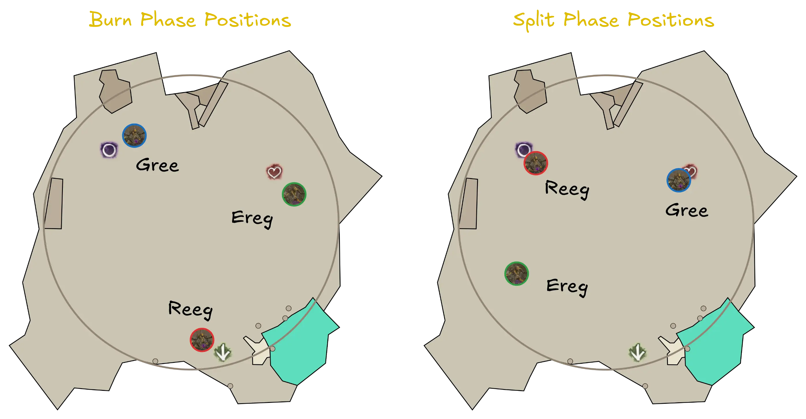
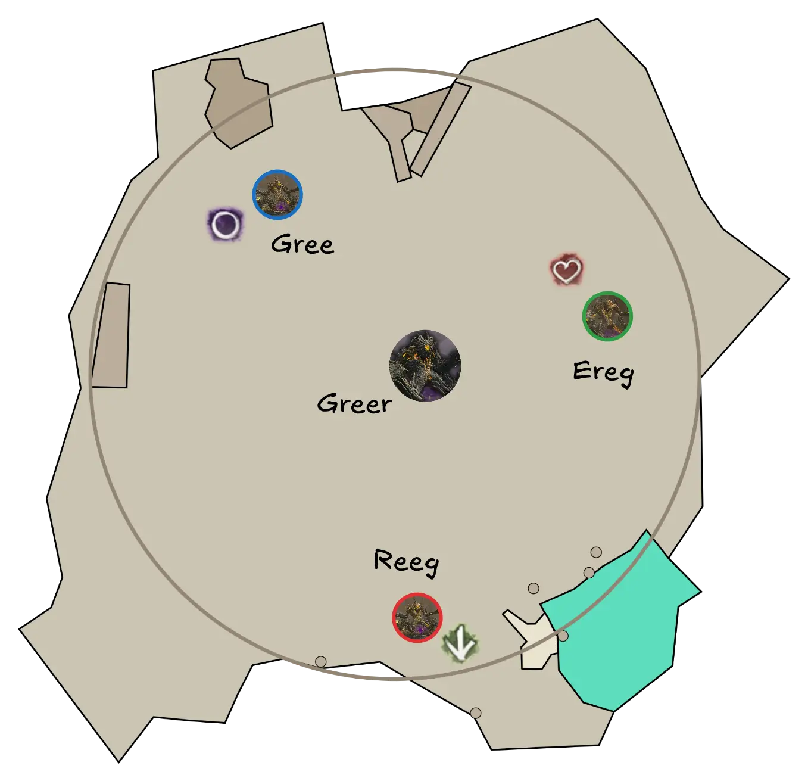
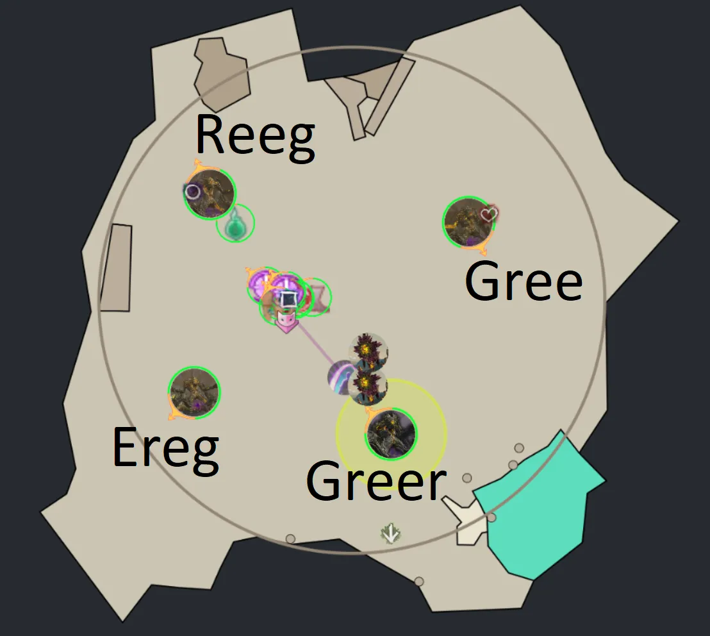
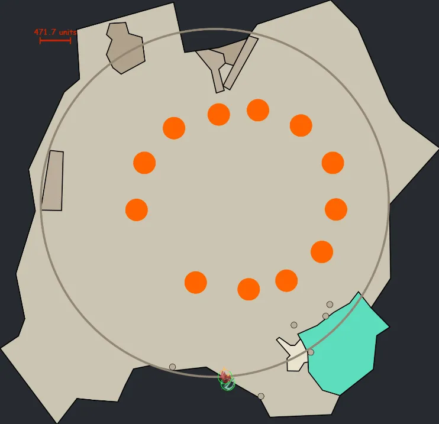

[Return to Home](../index.html){: .btn } [Return to Overview](./overview.html){: .btn } [Strategy Guide](./strategy.html){: .btn }

# Greer Mechanical Reference
{: .no_toc}

This section contains a detailed reference of the various attacks and mechanics present in the Godspoil Greer encounter. 

The rest of this page is structured into the following sections:
1. [**Overview**](#overview) - basic description of the fight and its main points.
2. [**Phases**](#phases) - a description of the structure of the fight, with transitions and differences between phases.
3. [**Mechanics**](#list-of-mechanics) - a reference of every attack in the encounter.
4. [**Effects**](#list-of-effects) - a reference of all effects unique to the encounter.

## Overview

Greer's basic attack pattern centers around a handful of skills that have individual cooldowns, priorities, and line of sight/range conditions. This means that while there is some randomness in the encounter, repeatable patterns often occur as high priority skills come off cooldown at roughly the same time over multiple pulls. The fight is separated into various burn and split phases, with transitions triggered by hitting specific health thresholds.

---

### Lesser Titans
{: .no_toc}

A defining characteristic of this encounter is the presence of the *lesser titans*: [Reeg], [Gree] and [Ereg]. These have a profound impact on the overall structure and strategy of the fight.

    
    
       

| **Enemy** | **Health** | **Hitbox** | **Boon** |
| Reeg, the Blighter | 23,594,400 | 600 |  [Resolution] |
| Gree, the Bringer | 23,594,400 | 600 |  [Protection] |
| Ereg, the Enabler | 23,594,400 | 600 |  [Might] x 25|

During [burn phases](#burn-phases), lesser titans are locked into specific positions, and cannot move, limiting the skills they can use. During [split phases](#split-phases), they move to new positions and are then free to ambulate and use all their skills as their AI dictates. Each one has access to a subset of Greer's skills, as shown [here](mechanics.html#list-of-mechanics).

Each lesser titan is associated with a boon: [Reeg] with  [Resolution], [Gree] with  [Protection] and [Ereg] with  [Might]. As long as a lesser titan is alive, they will provide their boon to all other titans on the map. These boons cannot be stripped.

{: .note}
[Ironically](https://i.imgflip.com/524q8q.png?a488712), lesser titans cannot grant themselves their own boon. 

Damaging a lesser titan to a certain threshold will make it despawn for the current phase, at which point it will stop providing its boon and casting skill. These thresholds are:
- 75% for the first burn phase.
- 50% for the first split phase.
- 25% for the second burn phase.

[Gree] and [Reeg] must be dead at the end of the second split phase, but [Ereg] does not need to be killed at all. Leaving him alive, and surviving his attacks during the hectic final phases of the fight, will net you the  [Spare the Ereg] achievement.

{: .note}
These mechanics generally force squads onto either a full  [Power] or full  [Condition] composition. More information on why can be found [here](./strategy.html#power-vs-condition).

---

### Table of Mechanics
{: .no_toc}
A brief description of the primary mechanics in the fight. Click on a mechanic to view additional information.

| **Attack** | **Common Name** | **Brief Description** |
| [Blob of Blight] | Death/Blighting orbs | Three large homing orbs that  [Knockback] and spawn projectiles. |
| [Cage of Decay] | Arrows | 5 projectiles that pulse  [Knockback]. The projectiles spawn [Noxious Blight] pools once they reach the end of their range. |
| [Empowering Blast] | Empowered orbs/Small orbs | Small purple orbs that give  [Empowered] stacks to any titans they hit. |
| [Enfeebling Miasma] | Cones, Poison cones | A large wave of poisonous gas that applies conditions, corrupts boons and leaves behind [Noxious Blight] pools. |
| [Eruption of Rot] | Greens | Large greens that require 2 or 3 players to be solved. |
| [Rain of Spores] | Artillery barrage | A barrage of projectiles that explode on impact, dealing damage and applying conditions. |
| [Ripples of Rot] | Jump | A jump attack with a large AoE that deals damage and inflicts  [Knockback] and  [Plague Rot]. |
| [Scattering Sporeblast] | Barrage | A barrage of damaging projectiles that targets enemies in front of the caster. |
| [Stomp the Growth] | Slam, Stomp, Wave | A three-part attack chain, with two AoE slams followed by a wave that  corrupts boons and inflicts  [Knockdown]. |
| [Sweep the Mold] | Autoattack, Cone | Two cone attacks that deal damage and inflict  [Knockback]. |
|  [Plague Rot] | Covid, Reds | A dangerous debuff applied by some of Greer's abilities that can rapidly spread to other players. |

## Phases

There are essentially 3 different types of phases:
- Burn phases, in which [Greer] and *the lesser Titans* are vulnerable.
- Split phases, in which [Greer] is  [Invulnerable] and the *lesser Titans* are vulnerable (at new, separate locations) 
- The 10% phase, in which [Greer] is  [Invulnerable], but 3 Champion Proto-Greerlings are active (and Ereg, if kept alive).

The fight overall consists of:
1. A first burn phase from 100% to 65% health.
2. The first split phase.
3. A second burn phase from 65% to 35% health.
4. The second split phase.
5. A third burn phase from 35% to 10% health.
6. The proto-greerling phase.
7. A final burn phase from 10% to 0% health.

---

### Burn Phases
The fight begins with [Greer] and the *lesser Titans* at the following spawn points.

During the first two burn phases, all *lesser Titans* will not move from these locations. During the third one, [Ereg] will be free to move if he is still alive.

High priority skills such as [Blob of Blight] and [Eruption of Rot] mark the beginning of these phases. These skills have a long enough cooldown that they are generally used only once or twice per phase.

Once per burn phase, at 80%, 50%, and 20% of his health, [Greer] will become  [Invulnerable], unlocking a  [Defiance Bar]. This needs to be broken quickly, as while the defiance bar is active [Greer] will continuously spawn AoEs on the group, which deal moderate to high damage. 
 
Breaking the bar will spawn several [Elite Empowering Beasts] (see amount below); these will start targeting [Greer] with [Empowering Blast], requiring additional projectile block.
- Two will be spawned at 80% HP
- Three will be spawned at 40% HP
- Four will be spawned at 20% HP

The first main phase ends at 65%, the second at 35% and the third at 10%. The first two main phases are pretty similar in the amount of mechanics and [Empowering Blasts] that have to be dealt with. The third main phase is different, since both [Gree] and [Reeg] will have been killed, removing the need to block their projectiles.

---

### Split Phases

The split phases start once [Greer] hits 65% and 35% HP. All *lesser Titans* will move to a new position, as shown by the following image. 

During these phases [Greer] is  [Invulnerable] and does not perform any attacks or mechanics, instead remaining at the position he occupied at the end of the previous main phase.

Split phases end when both [Reeg] and [Gree] have reached a defined health threshold, that being 50% HP for the first split phase, and 0% for the second. 

{: .note}
[Ereg] does not count towards the end of the split phase. He will despawn upon being damaged to 50% HP during the first split, or otherwise when the phase ends. If he is alive at the end of the second split phase, he will remain active and mobile throughout the rest of the fight or until killed.

---

### Proto-Greerling Phase

Once [Greer] hits 10% of his HP, he will become  [Invulnerable]. At the same time, three [Champion Proto-Greerlings] will appear. They have 12 possible spawn points, from these, three are chosen at random.

The *Protolings* will continuously perform the basic attack chains: [Sweep the Mold], [Stomp the Growth] and [Scattering Sporeblast]. This means this phase has a very high level of incoming damage and requires constant projectile block.

[Greer] will remain fully active throughout this phase. The squad should pay attention to his highly disruptive mechanics, in particular [Blob of Blight], [Eruption of Rot] and [Ripples of Rot].

--- 

### Sub 10% Phase

Once the last [Champion Proto-Greerling] has been defeated, [Greer] becomes vulnerable for 30 seconds. After this time passes, he will re-spawn all Protolings become  [Invulnerable] once more until they are dead. This usually leads to a wipe due to the tight enrage timer.

While this phase is functionally identical to a main phase, the time limit means that it must be approached in a fundamentally different manner. You only have to deal with attacks from [Greer] (and Ereg if he's alive); because [Greer] often has a lot of  [Empowered] stacks at this point, every attack is deadly, **especially** [Stomp the Growth].

## List of Mechanics

This section contains a full, in-depth explanation of all mechanics in the encounter.

Generally, there is a skill priority that titans follow, however, this skill priority is often interrupted with the auto-attack chain [Sweep the Mold]. The full logic behind how [Greer] selects what attacks to use is not yet fully understood. The general priority of skills is roughly as follows:

|**Priority**|**Skill**              |**Greer**          |**Gree**           |**Reeg**           |**Ereg**           |
|1           |[Blob of Blight]       ||                   |||
|2           |[Eruption of Rot]      |||||
|3           |[Ripples of Rot]       |||                   |                   |
|4           |[Rain of Spores]       ||                   |||
|5           |[Scattering Sporeblast]||                   |||
|6           |[Enfeebling Miasma]    ||                   |||
|7           |[Cage of Decay]        |||                   |                   |
|8           |[Rain of Spores]       ||                   |||
|9           |[Stomp the Growth]     |||                   |                   |
|Auto        |[Sweep the Mold]       |||                   |                   |

---

### [Blob of Blight]
{: .no_toc}

Used by [Greer] (cooldown 120s), [Reeg] (cooldown 75s) and [Ereg] (cooldown 75s).
 
Targets the three furthest players. These players get notified by a  [Target] effect in their boon bar and a pulsing audio cue. The attacks spawns three homing orbs in sequence in front of the caster. These orbs start tracking the targeted players while constantly spawning projectiles.

If they hit a player, they will become stationary for 12 seconds before despawning. The projectiles they summon during this period can quickly become deadly if not avoided.

Moving orbs can also be despawned by evading through then them, or by moving into them with active  [Invulnerability] effects, such as  [Distortion]. **This does not work for stationary orbs.**

---

### [Cage of Decay]
{: .no_toc}

Used by [Greer] (cooldown 120s) and [Gree] (cooldown 30s). 
 
This attack produces five projectiles, marked with arrow indicators. It starts with 2 arrows directed towards opposite sides of the caster, with the following directed inwards by 45° steps. These projectiles inflict  [Knockback] multiple times while traveling along their path.

Once they reach their maximum travel or hit the edge of the arena, they spawn a pool of [Noxious Blight] which persists for a brief period, stripping boons and applying  [Plague Rot]. The pool is additionally ringed by a set of walls that deal damage and inflict  [Knockback] on contact with a player, leaving only a few narrow passages to escape through.

{: .note}
Since  [Plague Rot] is removed on downing, affected players will often run constantly against these walls to take damage and go downstate, thus removing the effect before it can spread.

---

### [Empowering Blast]
{: .no_toc}

Used by the three *lesser Titans* and by [Elite Empowering Beasts] (cooldown 10s). 
 
The caster shoots out small orbs towards other *lesser Titans* and towards [Greer]. If they hit their target, the target receives two stacks of  [Empowered]. These small orbs can be destroyed by using projectile destruction/reflection skills. During the first and second main phase, *lesser Titans* will constantly use this ability as long as they are active, requiring frequent projectile block. It's crucial to block those as much as possible, otherwise [Greer] will gain too many  [Empowered] stacks and overwhelming damage.

---

### [Enfeebling Miasma]
{: .no_toc}

Used by [Greer] (cooldown 120s), [Reeg] (cooldown 75s) and [Ereg] (cooldown 75s). 
 
Spawns three cone indicators that release an outgoing wave of miasma, leaving behind clouds of poisonous gas. The waves corrupt boons and apply  [Poison]; they should be avoided by either immediately dodging through the casting add, or by standing between the cones. 

{: .note}
The actual area of effect is larger than the indicator. The poisonous gas clouds are pools of [Noxious Blight], which corrupt boons and apply  [Plague Rot]. **Avoid them at all costs.**

---

### [Eruption of Rot]
{: .no_toc}

Used by [Greer] (cooldown 120s) and all three *lesser Titans* (cooldown 75s). 
 
Targets one or more players with a green AoE; requires a certain amount of players inside: 3 if the caster is Greer, 2 if the caster is a *lesser Titan*. Failing to solve any Green summons a [Noxious Blight] pool under the targeted player that knocks up, corrupts boons, and inflicts  [Plague Rot]. Failing a Green furthermore gives two stacks of  [Empowered] to the caster: for this reason it's always important to have the minimum number of players for each Green.

Players that stand in multiple Greens within a short time interval will be  [Downed]. This effect can be evaded with the right timing, or can be avoided with  [Invulnerability] skills. Similarly, the pool summoned by failed Greens can be avoided in the same manner.

The number of Greens spawned by [Greer] increases in later phases up to a maximum number of three simultaneous three-person Greens.

Greens always target the furthest untargeted player from the caster.

---

### [Rain of Spores]
{: .no_toc}

Used by [Greer] (cooldown 120s), [Reeg] (cooldown 120s) and [Ereg] (cooldown 120s). 
 
Targets the furthest player; consists of a barrage of projectiles, indicated by small AoEs. These deal damage and apply  [Poison] and  [Confusion]. It's best to have projectile block up for these to mitigate as much damage as possible.

[Greer] uses this attack only when his target is not in melee range.

---

### [Ripples of Rot]
{: .no_toc}

Used by Greer (cooldown 120s) and [Gree] (cooldown 30s).
 
This attack can occur whenever the caster doesn't have a melee target available. When this attack is used, the caster jumps up toward their target, falling down in a deadly AoE that spreads outwards from their point of contact with the ground. The attack deals damage and inflicts  [Knockback],  [Bleeding] and  [Plague Rot]. 

{: .note}
The exact trigger for this attack is not precisely understood, but it's tied to being in a specific range window from the caster, somewhere between 600 and 1000. If you are closer than this, this attack will not be used.

Additionally, the attack leaves behind a pool of [Noxious Blight], which is ringed by walls that deal damage and inflict  [Knockback] on contact with a player, leaving only a few narrow passages to escape through.

{: .note}
Since  [Plague Rot] is removed on downing, affected players will often run constantly against these walls to take damage and go downstate, thus removing the effect before it can spread.

---

### [Scattering Sporeblast]
{: .no_toc}

Used by [Greer] (cooldown 12s), [Reeg] (cooldown 8s), [Ereg] (cooldown 8s), and *Champion Proto-Greerlings*. 

Shoots damaging spores that can be projectile blocked, targeting enemies in front of the caster and dealing moderate to high damage. Since [Reeg] and [Ereg] don't have [Sweep the Mold] and [Stomp the Growth] in their skillsets, they will use this attack very frequently. 
 
[Greer] uses this attack only when his target is not in melee range.

---

### [Stomp the Growth]
{: .no_toc}

A three-part attack-chain used by [Greer], [Gree] and *Champion Proto-Greerlings* regularly. 
 
The first two attacks are high damage melee AoE slams. The third and final attack has different effects based on the caster: when cast by Greer it releases a wave that deals damage, corrupts boons, and inflicts  [Vulnerability] and  [Knockback]; when cast by [Gree] or the Champion Proto-Greerlings, it does not unleash a wave, instead dealing heavy damage and a inflicting  [Knockdown].

This attack can be mitigated with  [Aegis], blocks, or evasion. The wave it generates when cast by [Greer] can be jumped, but cannot be blocked and corrupts  [Stability].

This attack becomes especially deadly in the later phases of the fight, when [Greer] often has several stacks of  [Empowered], due to its high damage and large area of effect.

---

### [Sweep the Mold]
{: .no_toc}

This attack is used by [Greer], [Gree] and *Champion Proto-Greerlings* regularly. 
 
It consists of two subsequent 60° cones that  [Knockback] and deal damage; it also inflicts  [Bleeding] and  [Poison] on the first swipe, and  [Cripple] and  [Poison] on the second swipe. The damage component of this attack is not high, so it can be ignored using  [Stability], or otherwise mitigated with  [Aegis], or by sidestepping.

---

### Elite Empowering Beast

|**Health**|**Hitbox**|**Defiance**|
| 236,003 | 240 | 500 |

These adds are spawned in shortly after Greer's  [Defiance Bar] is broken.
- Two will be spawned at 80% HP
- Three will be spawned at 40% HP
- Four will be spawned at 20% HP

They themselves are not especially dangerous, as they deal little damage and can be easily cleaved. However, they will cast [Empowering Blast] every 10 seconds, which can easily grant Greer several stacks of  [Empowered] if mismanaged.

---

### Champion Proto-Greerling

|**Health**|**Hitbox**|
| 5,112,120 | 600 |

Also called *Protolings*, these are dangerous adds that spawn when Greer reaches 10% health, at the beginning of the [Protoling phase](#proto-greerling-phase). As long as one is alive, Greer is  [Invulnerable]. After the last one dies, Greer will wait 30 seconds before re-summoning them.

Proto-Greerlings have access to three skills that they spam relentlessly: [Sweep the Mold], [Stomp the Growth] and [Scattering Sporeblast].

Proto-Greerlings grant themselves three  [Might] every second, up to 25 stacks. If [Ereg] is alive, he will also grant them an additional 25 stacks, up to 50 total (Ereg's  [Might] is a considered separate).

This combination of high damage and heavy crowd control makes them tough enemies to deal with.

## List of Effects
The [Greer] encounter has some additional unique effects, which are listed below for reference purposes.

---

###  Empowered
{: .no_toc}
An effect that is gained by [Greer] and all three *lesser Titans* when players fail mechanics. Increases outgoing damage by 5% per stack, up to 99 stacks, at which point all attacks become unblockable. Titans can gain  [Empowered] through the following:

- [Empowering Blast] will grant one stack every time it hits a titan.
- [Eruption of Rot] will grant two stacks to the casting titan on failure.

---

###  Plague Rot
{: .no_toc}
An debuff that is applied to players hit by a [Cage of Decay], [Enfeebling Miasma], or [Ripples of Rot]. Affected players are surrounded by a red AoE that regularly corrupts boons and applies  [Poison]. This effect spreads to other players on contact with the AoE, and if uncontrolled, can quickly spread to the entire squad.

The effect is removed if the affected player is  [Downed], or after a brief time interval.

Reaching 10 stacks of  [Plague Rot] will instantly kill the player.

---

###  Target
{: .no_toc}
An effect that gets applied from being targeted by [Blob of Blight], which targets the furthest players away from the caster.

---

### [Noxious Blight]
{: .no_toc}
Describes various stationary AoE pools left behind by some abilities that corrupt boons and apply  [Plague Rot] to any player touching them.

[Return to Home](../index.html){: .btn } [Return to Overview](overview.html){: .btn } [Return to Top](#greer-mechanical-reference){: .btn .fixed}
{: .center}

[Greer]: ./overview.html
[Greer encounter]: ./overview.html
[Gree]: #lesser-titans
[Reeg]: #lesser-titans
[Ereg]: #lesser-titans
[Elite Empowering Beast]: #elite-empowering-beast
[Elite Empowering Beasts]: #elite-empowering-beast
[Champion Proto-Greerling]: #champion-proto-greerling
[Champion Proto-Greerlings]: #champion-proto-greerling
[Empowering Blast]: #empowering-blast
[Empowering Blasts]: #empowering-blast
[Cage of Decay]: #cage-of-decay
[Blob of Blight]: #blob-of-blight
[Empowered]: #-empowered
[Enfeebling Miasma]: #enfeebling-miasma
[Eruption of Rot]: #eruption-of-rot
[Rain of Spores]: #rain-of-spores
[Ripples of Rot]: #ripples-of-rot
[Scattering Sporeblast]: #scattering-sporeblast
[Stomp the Growth]: #stomp-the-growth
[Sweep the Mold]: #sweep-the-mold
[Plague Rot]: #-plague-rot
[Target]: #-target
[Noxious Blight]: #noxious-blight

[Aegis]: https://wiki.guildwars2.com/wiki/Aegis
[Protection]: https://wiki.guildwars2.com/wiki/Protection
[Resolution]: https://wiki.guildwars2.com/wiki/Resolution
[Might]: https://wiki.guildwars2.com/wiki/Might
[Stability]: https://wiki.guildwars2.com/wiki/Stability
[Poison]: https://wiki.guildwars2.com/wiki/Poisoned
[Confusion]: https://wiki.guildwars2.com/wiki/Confusion
[Bleeding]: https://wiki.guildwars2.com/wiki/Bleeding
[Vulnerability]: https://wiki.guildwars2.com/wiki/Vulnerability
[Cripple]: https://wiki.guildwars2.com/wiki/Crippled
[Knockback]: https://wiki.guildwars2.com/wiki/Knockback
[Knockdown]: https://wiki.guildwars2.com/wiki/Knockdown
[Distortion]: https://wiki.guildwars2.com/wiki/Distortion
[Spare the Ereg]: https://wiki.guildwars2.com/wiki/Mount_Balrior_(achievements)#achievement8548
[Defiance Bar]: https://wiki.guildwars2.com/wiki/Defiance_bar
[Invulnerable]: https://wiki.guildwars2.com/wiki/Invulnerability
[Invulnerability]: https://wiki.guildwars2.com/wiki/Invulnerability
[Power]: https://wiki.guildwars2.com/wiki/Power
[Condition]: https://wiki.guildwars2.com/wiki/Condition_Damage
[Downed]: https://wiki.guildwars2.com/wiki/Downed