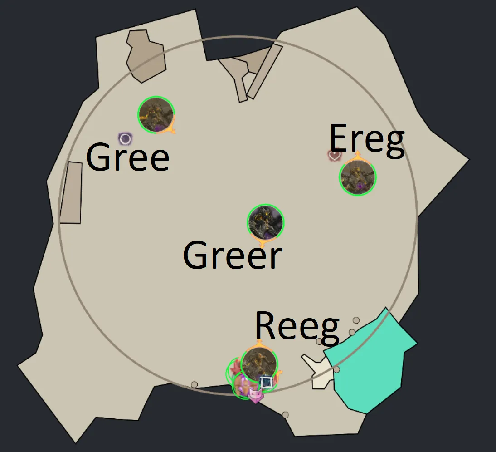

[Return to Home](../index.html){: .btn } [Return to Overview](./overview.html){: .btn } [Strategy Guide](./strategy.html){: .btn }

# Godspoil Greer: Mechanics
{: .no_toc}

This section contains a detailed reference of the various attacks and mechanics present in the Godspoil [Greer encounter]. 

The rest of this page is structured into the following sections:
1. **Overview** - basic description of the fight and its main points.
2. **Phases** - a description of the structure of the fight, with transitions and differences between phases.
3. **Mechanics** - a reference of every attack in the encounter.
4. **Effects** - a reference of all effects unique to the encounter.

### Table of Contents
{: .no_toc}

1. TOC
{:toc}

---

## Overview

Greer's basic attack pattern centers around a handful of skills that are on individual cooldowns, priorities and line of sight/range conditions. The area affected by some of his abilities also grow in size in later phases. The fight is separated into main and split phases, which are triggered by hitting some specific Greer health thresholds.

### Enemy entities
{: .no_toc}

During the [Greer encounter], you will have to deal with multiple different enemies on top of [Greer]: the three lesser Titans ([Ereg], [Gree] and [Reeg]), Champion Proto-Greerlings and some weaker [Elite Empowering Beast].

| **Enemy** | **Health** | **Hitbox** | **Defiance Bar** |
| Godspoil Greer | 47,188,800 | 800 | 6000 |
| Gree, the Bringer | 23,594,400 | 600 | |
| Reeg, the Blighter | 23,594,400 | 600 | |
| Ereg, the Enabler | 23,594,400 | 600 | |
| Champion Proto-Greerling | 5,112,120 | 600 | |
| Elite Empowering Beast | 236,003 | 240 | 500 |

### Boons on the titans
{: .no_toc}

The fight starts with [Greer], [Gree], [Reeg], and [Ereg] all being alive and attackable at their specific spawn location. While [Gree], [Reeg], or [Ereg] are alive (called, the lesser titans, hereafter), they will give boons that are shared between each other and [Greer]. Gree gives  [Protection](https://wiki.guildwars2.com/wiki/Protection), Reeg  [Resolution](https://wiki.guildwars2.com/wiki/Resolution) and Ereg  [Might](https://wiki.guildwars2.com/wiki/Might). Bringing the lesser titans to a certain health threshold, makes them despawn for the current phase and consequently stops the respective boon being spread. Hence, Power-based squad compositions should start on Gree, while Condition-based squads should focus on Reeg. The two health thresholds are 75% in the first main phase and 25% in the second main phase, after which the respective lesser titan will disappear from the main phase and only reappear again in the split phase.

### Table of Mechanics
{: .no_toc}
The following enemy attacks are used in the [Greer encounter] (more details in the mechanics section below):

| **Attack** | **Common Name** | **Target** | **Used by (Cooldown [s])** | **Brief Description** |
| [Blob of Blight] | Death orbs | Furthest player | Greer (120), Reeg (75), Ereg (75) | 3 subsequent large homing orbs that spawn projectiles. |
| [Cage of Decay] | Arrows | Tank | Greer (120), Gree (30) | 5 Arrows that spawn projectiles starting with the two outer Arrows going inward. The projectiles spawn [Noxious Blight] pools once they reach the end of their track, or when they hit the edge of the arena. |
| [Empowering Blast] | Empowered orbs/Small orbs | Greer and other lesser Titans | lesser titans (10) | Small purple orbs that give [Empowered] stacks to their target. |
| [Enfeebling Miasma] | Cones, Poison cones | Tank | Greer (120), Reeg (75), Ereg, (75) | An attack spawning three cones with an outgoing poisonous gas that applies  [Poison] and leaves behind [Noxious Blight] pools. |
| [Eruption of Rot] | Greens | Random | Greer (120), lesser titans (75) | Large Greens AoEs centered around players that need either 2, or 3 players inside them when exploding. |
| [Rain of Spores] | Artillery barrage | Furthest players | Greer (120), Reeg (120), Ereg (120) | A barrage of projectiles indicated by small AoEs dealing damage and applying  [Poison] and  [Confusion] when exploding on impact. |
| [Ripples of Rot] | Jump | Closest player, but only if no player is in their extended melee range | Greer (120), Gree (30) | Jumps toward his target, dealing damage,  [Knockback],  [Bleeding]  and [Plague Rot], when hit. |
| [Scattering Sporeblast] | Barrage | Tank | Greer (12), Reeg (8), Ereg (8) | Shoots damaging spores that can be projectile blocked to targets in front of the caster. |
| [Stomp the Growth] | Slam, Stomp, Wave | Tank | Greer (2), Gree (2), Reeg (2) | Is a three-part attack chain that can be mitigated by  [Aegis], blocks, or dodge. The first two attacks are damaging AoE slams and the third and final part releases a boon corrupting wave that deals damage, corrupts boons, applies  [Vulnerability] and does a  [Knockdown]. |
| [Sweep the Mold] | Autoattack, Cone | Tank | Greer (2), Gree (2) | Two subsequent cone attacks that apply damage,  [Knockback],  [Bleeding] and  [Poison] for the first swipe and damage,  [Knockback],  [Cripple] and  [Poison] for the second swipe. |

## Phases

There are essentially 3 different phases. The main phase, in which Greer and the lesser titans are attackable, the split phase, in which Greer is invulnerable and the lesser Titans are attackable (at new, different locations) and the 10% phase, in which Greer is invulnerable, but 3 Champion Proto-Greerlings are active (and Ereg, if kept alive).

### Main phase
{: .no_toc}

The main phase starts at the beginning of the fight with the following spawnpoints for Greer and the lesser titans:

Depending on if you play with a Power, or Condition based squad composition, you will either start at Gree, or Reeg, respectively. At the start of phases, high priority skills are usually used, which means [Blob of Blight] (Death Orbs) and [Eruption of Rot] (Greens). The first goal is to bring either Gree, or Reeg to 75%, such that they despawn and with it the respective boon (Protection for Gree, Resolution for Reeg) will disappear from Greer. Once the lesser titan has disappeared, the main phase revolves around dps'ing Greer while dealing with his cooldown and priority based attacks and while simultaneously blocking all relevant projectiles, especially [Empowering Blast] from the active lesser titans, to prevent [Empowered] stacks on Greer.

Greer will go invulnerable at 80%, 50%, and 20% and will receive a breakbar, which quickly needs to be broken. Breaking his breakbar will spawn 2, 3, and 4 [Elite Empwering Beast]s, respectively, that will use also use [Empowering Blast] targeted at Greer and therefor need additional projectil block and should be cleaved.

The first main phase ends at 65%, the second at 35% and the third at 10%. The first two main phases are pretty similar in the amount of mechanics and small orbs from [Empowering Blast] that have to be dealt with. The third main phase is different, because at that point both Gree and Reeg will have been killed already, which removes the need to block projectiles from those.

---

### Split phase
{: .no_toc}

The split phases start once Greer hits 65% and 35% and start with these spawnpoints:

The location of Greer depends where he has been phased, but the lesser titans spawn at those fixed spawnpoints at the start of each split phase. Split phases end, when both Reeg and Greer have reached 50% hp (for the first split phase), or 0% (in the second split phase). Because Reeg and Gree are both active again, you usually want to start by killing the Reeg in a Condition based squad, or Gree in a Power based squad first. If you try to do the Achievement [Spare the Ereg], you will keep Ereg alive and want to cleave him as little as possible. Conversely, if you want to kill him, you want to focus Ereg as much as possible, as soon as he is close to the squad. There can be two scenarios: 1) Ereg is higher HP than the other lesser titans, or 2) Ereg has lesser HP than the others. After the first split phase when Greer is active again, the main phase starts and Ereg will reappear at his main phase spawnpoint in case of 2). In case of 1) during the first split phase, Ereg will simply disappear at 50%, but you still need to bring both Reeg and Gree to 50% to finish the split phase. At the end of the second split phase, if Ereg is still alive and you want to kill him, usually the squad just stays at Ereg and finishes him, before switching back to Greer.

Since Greer is invulnerable inside a protective bubble and basically afk, you don't have to deal with any of Greer's attacks during this phase.

---

### 10%, Proto-Greerling phase
{: .no_toc}

Once Greer hits 10%, he will go invulnerable, but not afk! This means he will continously using his attacks, while being invulnerable. At the same time, three Champion Proto-Greerlings will appear. They have 12 spawn points in total, but which three are chosen is random. See the image below for the spawnpoints.

Besides having to deal with Greer's attacks, the Champions will also use some attacks, which are essentially the 3 basic attack chains: [Sweep the Mold], [Stomp the Growth] and [Scattering Sporeblast]. This means this phase has a very high level of incoming damage and needs constant projectile block. Because Greer still keeps using his abilities, you also need to be careful about, in particular, [Blob of Blight], [Eruption of Rot] and [Ripples of Rot] and quickly react and deal with those abilities. Once the three Champions have been defeated a 30 second timer starts until they respawn and the invulnerability from Greer disappears for that time period.

--- 

### Sub 10% phase

Greer becomes damageable again as soon as the last Champion Proto-Greerling is defeated. Conditions can already stacked on Greer while he is still invulnerable. During this last burn phase, you only have to deal with Greer's attacks (and Ereg's if being kept alive), but because Greer might have a lot of  [Empowered] stacks at this point, every attack can be very deadly. This requires carefully evading his attacks, especially [Stomp the Growth]. If you don't defeat Greer within the 30 seconds from the last Champion being killed, all three Champions will respawn and Greer becomes invulnerable again, which is essentially a wipe due to the tight enrage timer. For this reason, always try to prepare for the burn phase approriately, by having major cooldowns ready (such as Weave Self) and/or by prestacking Conditions on Greer while finishing the last Champion.

---

## Mechanics

This section contains a full, in-depth explanation of all mechanics in the [Greer encounter].

Generally, there is a skill priority that titans follow, however, this skill priority is often interrupted with the Auto-attack chain [Sweep the Mold]. The full process behind when which attack is used is not yet fully understood. The general priority of skills is roughly as follows:
1. [Blob of Blight]
2. [Eruption of Rot]
3. [Ripples of Rot] (only when no target is in range)
4. [Rain of Spores]  (when Greer's target is not in melee range)
5. [Scattering Sporeblast] (when Greer's target is not in melee range)
6. [Enfeebling Miasma]
7. [Cage of Decay]
8. [Rain of Spores]  (when Greer's target is not in melee range)
9. [Stomp the Growth]

### [Blob of Blight]
{: .no_toc}

[Blob of Blight] is an attack used by Greer (cooldown 120s), Reeg (cooldown 75s) and Ereg (cooldown 75s) and targets the furthest players away. It subsequently spawns 3 homing orbs in front of the caster. The targeted players get notified by a  [Target] effect in their boon bar. These homing orbs last for 12 seconds, but can also be despawned by dodging into them, or by moving into them with active Invulnerabity effects, like [Distortion]. If they are not despawned and the orbs hit a player, they will become stationary and shoot out projectiles, that can quickly become deadly if not avoided.

---

### [Cage of Decay]
{: .no_toc}

[Cage of Decay] is an attack used by Greer (cooldown 120s) and Gree (cooldown 30s). This attacks produces 5 projectiles, marked with 5 Arrows, starting with 2 arrows at the two 180° sides of the caster and going inward by 45° steps. These projectiles  [Knockback] and travel along the path indicated ba the Arrows. Once the projectile hits the end of the path, or hits the edge of the arena, a pool of [Noxious Blight] is generated, which boonstrips and much more importantly applies  [Plague Rot]. You always want to avoid those pools and step away. The projectils themselves can simply be avoided by standing between two Arrows.

---

### [Empowering Blast]
{: .no_toc}

[Empowering Blast] is an attack used by the three lesser titans: Gree (cooldown 10s), Reeg (cooldown 10s) and Ereg (cooldown 10s). It shoots out small orbs towards other lesser titans and towards Greer. If they hit their target, the target receives 2x stacks of  [Empowered]. These small orbs can be destroyed by using Projectile block/destruct/reflect abilities. During the first and second main phase, lesser titans will constantly use this ability as long as they are active, which requires frequent projectile block. It's crucial to block those as much as possible, because otherwise Greer will gain too many  [Empowered] stacks and overwhelm you.

---

### [Enfeebling Miasma]
{: .no_toc}

[Enfeebling Miasma] is an attack used by Greer (cooldown 120s), Reeg (cooldown 75s) and Ereg (cooldown 75s), that spawns three cone indicator that spawn an outgoing wave which leaves poisonous gas clouds behind. The waves boon corrupt and applies  [Poison] and should therefore be avoided by either immediately dodging through the caster, or by standing between the cones. Note that the actual area of effect is larger than the indicator. The poisonous gas clouds are pools of [Noxious Blight], which boonstrip and much more importantly apply  [Plague Rot]. Avoid at all cost.

---

### [Eruption of Rot]
{: .no_toc}

Used by Greer (cooldown 120s) and all three lesser titans (cooldown 75s). Greer spawns a Green that needs 3 players inside, while the lesser titans spawn a Green needing only 2 players inside. Failing to solve any Green creates a [Noxious Blight] pool under the player that corrupts boons and inflicts  [Plague Rot]. It is therefore of highest importance to solve Greens. However, Greens can also be evaded by dodging toward the end of the Green, or by using Invulnerability, or Evade skills. Failing a Green furthermore gives 2x stacks of  [Empowered] to the caster. For this reason, it's important to always have 3 players inside the Greens from Greer (the Greens requiring 3 players) in order to not give Greer extra  [Empowered] stacks. Those stacks matter only little on the lesser titans, which means if you dodge Greens alone, do it with 2 player Greens. The number of Greens spawned from Greer increases in later phases up to a maximum number of three triple Greens.

---

### [Rain of Spores]
{: .no_toc}

Used by Greer (cooldown 120s), Reeg (cooldown 120s) and Ereg (cooldown 120s) at the furthest players and shoots out a barrage of projectiles indicated by small AoEs dealing damage and applying  [Poison] and  [Confusion] when exploding on impact. The projectiles deal moderates amount of damage and can be projectile blocked. It's always best to have projectile block for these up as well to mitigate as much damage as possible. Greer uses this attack only when his target is not in melee range

---

### [Ripples of Rot]
{: .no_toc}

Is an attack used by Greer (cooldown 120s) and Gree (cooldown 30s) that can happen whenever they don't have a melee target available. When this attack is used, the caster jumps toward their target, indicated by a deadly AoE on the ground. The attack deals damage,  [Knockback],  [Bleeding] and [Plague Rot]. It's important to not get hit ny this attack, because the inflicted  [Plague Rot] can very quickly spiral out of control and lead to a wipe. The exact trigger for this attack to happen is not precisely understood, but it's tied to being in a specific range window away from the caster. This range is supposedly somewhere between 600 and 1000 range. Meaning if you are closer than that, it will not be used.

---

### [Scattering Sporeblast]
{: .no_toc}

Used by Greer (cooldown 12s), Reeg (cooldown 8s), Ereg (cooldown 8s) and Champion Proto-Greerlings and shoots damaging spores that can be projectile blocked to targets in front of the caster. They deal moderate to high amounts of damage, so make sure to always have projectile protection up. Since Reeg and Ereg don't have [Sweep the Mold] and [Stomp the Growth] in their skillsets, they will very frequently use hit attack, requiring high amounts of projectile block. Greer uses this attack only when his target is not in melee range.

---

### [Stomp the Growth]
{: .no_toc}

This attack is used by Greer, Gree and Champion Proto-Greerlings regularly. It is a three-part attack chain that deals heavy damage and corrupts boons. It can be mitigated by  [Aegis], blocks, or dodge (and jumping for the third part). For Greer, the first two attacks are high damage AoE slams and the third and final part releases a boon corrupting wave that deals damage, corrupts boons, applies  [Vulnerability] and does a  [Knockdown]. For Gree and the Champion Proto-Greerlings, the last part of this attack does not unleash a wave; instead it only deals heavy damage and a a  [Knockdown]. This should always be avoided by using one of the effects already mentioned, especially in the later phases when Greer might have high  [Empowered] stacks.

---

### [Sweep the Mold]
{: .no_toc}

This attack is used by Greer, Gree and Champion Proto-Greerlings regularly. It consists of two subsequent 60° cone attacks that apply damage,  [Knockback],  [Bleeding] and  [Poison] for the first swipe and damage,  [Knockback],  [Cripple] and  [Poison] for the second swipe. These should either be sidestepped, or ignored by using  [Stability] to prevent the knockback effect. The accompanying conditions and damage can simply be cleansed and outhealed, respectively. The damage component itself of this attack is not that high.

---

## List of Effects
Greer's encounter has some additional effects that are applied to players, which are listed below for reference purposes.

###  [Plague Rot]
{: .no_toc}
An effect that is applied to players hit by a [Cage of Decay], [Enfeebling Miasma], or [Ripples of Rot]. This effect spreads to other players that get touched by the Red AoE around the player. Reaching 10 stacks of  [Plague Rot] will kill the player. Furthermore,  [Plague Rot] regularly boon corrupts and applies  [Poison] every few seconds.

---

###  [Target]
{: .no_toc}
An effect that gets applied from being targeted by [Blob of Blight], which targets the furthest players away from the caster.

---

### [Noxious Blight]
{: .no_toc}
Describes various AoE pools left behind some abilities that are stationary and apply  [Plague Rot] and corrupt boons to any player touching [Noxious Blight] pools.

---

[Return to Home](../index.html){: .btn } [Return to Overview](overview.html){: .btn } [Return to Top](#greer-mechanical-reference){: .btn .fixed}

[Greer]: https://wiki.guildwars2.com/wiki/Greer,_the_Blightbringer
[Greer encounter]: https://wiki.guildwars2.com/wiki/Mount_Balrior#Challenge_mode_2
[Gree]: https://wiki.guildwars2.com/wiki/Gree,_the_Bringer
[Reeg]: https://wiki.guildwars2.com/wiki/Reeg,_the_Blighter
[Ereg]: https://wiki.guildwars2.com/wiki/Ereg,_the_Enabler
[Elite Empowering Beast]: https://wiki.guildwars2.com/wiki/Elite_Empowering_Beast
[Empowering Blast]: https://wiki.guildwars2.com/wiki/Empowering_Blast
[Cage of Decay]: https://wiki.guildwars2.com/wiki/Cage_of_Decay_(Greer)
[Blob of Blight]: https://wiki.guildwars2.com/wiki/Blob_of_Blight_(Greer)
[Empowered]: https://wiki.guildwars2.com/wiki/Empowered_(Greer,_the_Blightbringer)
[Enfeebling Miasma]: https://wiki.guildwars2.com/wiki/Enfeebling_Miasma_(plague)
[Eruption of Rot]: https://wiki.guildwars2.com/wiki/Eruption_of_Rot_(Greer)
[Rain of Spores]: https://wiki.guildwars2.com/wiki/Rain_of_Spores_(Greer)
[Ripples of Rot]: https://wiki.guildwars2.com/wiki/Ripples_of_Rot_(plague)
[Scattering Sporeblast]: https://wiki.guildwars2.com/wiki/Scattering_Sporeblast_(Greer)
[Stomp the Growth]: https://wiki.guildwars2.com/wiki/Stomp_the_Growth_(Greer)
[Sweep the Mold]: https://wiki.guildwars2.com/wiki/Sweep_the_Mold_(Greer)
[Plague Rot]: https://wiki.guildwars2.com/wiki/Plague_Rot
[Noxious Blight]: https://wiki.guildwars2.com/wiki/Noxious_Blight

[Aegis]: https://wiki.guildwars2.com/wiki/Aegis
[Protection]: https://wiki.guildwars2.com/wiki/Protection
[Resolution]: https://wiki.guildwars2.com/wiki/Resolution
[Might]: https://wiki.guildwars2.com/wiki/Might
[Stability]: https://wiki.guildwars2.com/wiki/Stability
[Poison]: https://wiki.guildwars2.com/wiki/Poisoned
[Confusion]: https://wiki.guildwars2.com/wiki/Confusion
[Bleeding]: https://wiki.guildwars2.com/wiki/Bleeding
[Vulnerability]: https://wiki.guildwars2.com/wiki/Vulnerability
[Cripple]: https://wiki.guildwars2.com/wiki/Crippled
[Knockback]: https://wiki.guildwars2.com/wiki/Knockback
[Knockdown]: https://wiki.guildwars2.com/wiki/Knockdown
[Distortion]: https://wiki.guildwars2.com/wiki/Distortion
[Spare the Ereg]: https://wiki.guildwars2.com/wiki/Mount_Balrior_(achievements)#achievement8548
