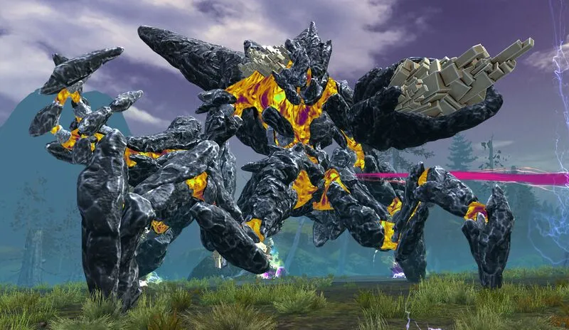

# Godspoil Greer
{: .center}

| **Health** |  47,188,800  |
| **Armor** |  2597 (standard) |
| **Hitbox** | 800 |
| **Instance**| Day |
| **Enrage Timer** | 10 minutes - kills all players on running out. |

---

Greer, the Blightbringer is one of the first two bosses in the Mount Balrior raid. Defeating him, along with his fellow titan, [Decima](../decima/overview.md), is necessary in order to challenge the final boss of the instance, [Ura](../ura/overview.html).

Most of Greer's mechanics are on a cooldown and are based on a priority system. Greer uses them based on availability, but also based on if a player is recognized as "tank", or not. Most of the mechanics can be baited and are therefore not fully rng, however, they require careful positioning. Managing these different reoccuring mechanics while keeping everyone healthy and including a hefty amount of projectile denial are the main cornerstones of this encounter.

Greer can be played with a Power, or Condition based composition, which is reflected by small changes in, where to start the fight. Furthermore, the last phase, from 10% to 0%, is a tight dps check, which requires careful planning and clean execution.