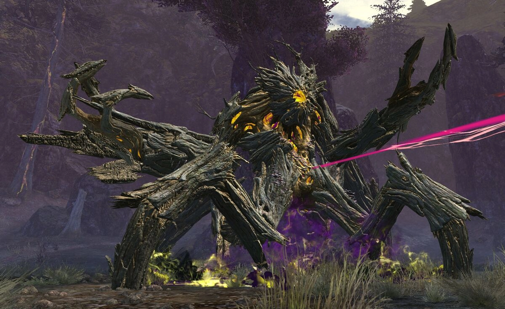

# Godspoil Greer
{: .center}

[Return to Home](../index.html){: .btn } [Strategy Guide](./strategy.html){: .btn } [Mechanical Reference](./mechanics.html){: .btn }[Fast Guide](./fast-guide.html){: .btn }
{: .center}

| **Health** |  47,188,800  |
| **Armor** |  2597 (standard) |
| **Hitbox** | 800 |
| **Defiance** | 6000 |
| **Enrage Timer** | 10 minutes - kills all players on running out. |

Greer, the Blightbringer is one of the first two bosses in the Mount Balrior raid. Defeating him, along with his fellow titan, [Decima](../decima/overview.html), is necessary in order to challenge the final boss of the instance, [Ura](../ura/overview.html).

In this encounter the squad will have to deal with multiple enemies that lay out with an unending barrage of attacks, dealing high damage and inflicting a multitude of debilitating conditions and crowd control. The fight can seem chaotic and unforgiving for an unprepared group, but it follows certain rules based on individual skill cooldowns, priority and targeting. Proper control and mitigation of all incoming mechanics while maintaining high damage uptime is the cornerstone of this fight, and must be achieved through a combination of careful positioning, healing,  [Stability](https://wiki.guildwars2.com/wiki/Stability),  [Aegis](https://wiki.guildwars2.com/wiki/Aegis) and projectile denial.

Greer can be played with a  [Power](https://wiki.guildwars2.com/wiki/Power) or  [Condition](https://wiki.guildwars2.com/wiki/Condition_Damage) based composition, which is reflected in small changes in starting position and in the encounter's split phases. Furthermore, the last phase, from 10% to 0%, is a tight damage check, requiring careful planning and clean execution.

[Return to Home](../index.html){: .btn } [Strategy Guide](./strategy.html){: .btn } [Mechanical Reference](./mechanics.html){: .btn }
{: .center}
