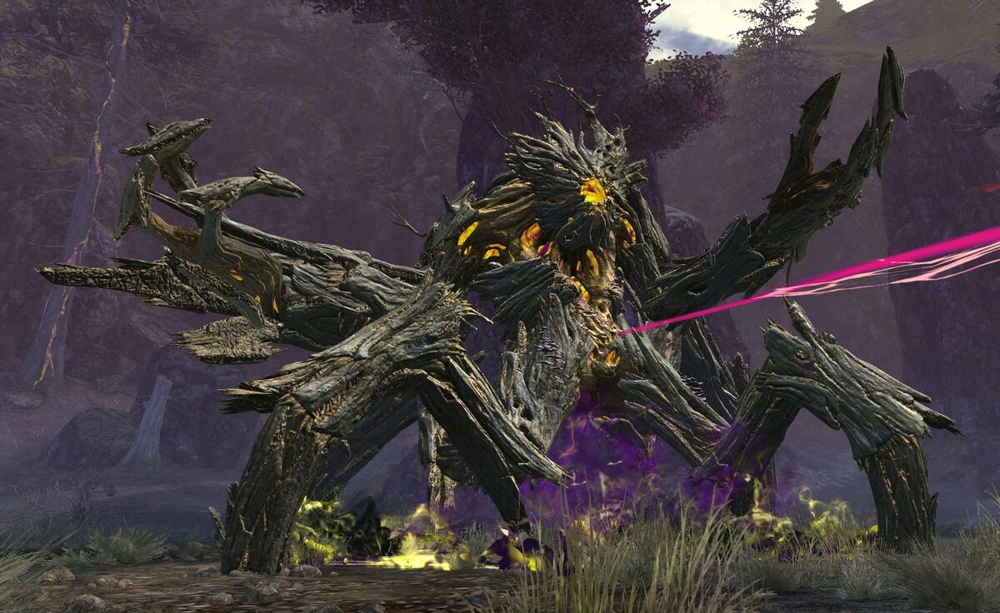

# Godspoil Greer
{: .center}

[Return to Home](../index.html){: .btn } [Strategy Guide](./strategy.html){: .btn } [Mechanical Reference](./mechanics.html){: .btn }[Fast Guide](./fast-guide.html){: .btn }
{: .center}

| **Health** |  42'469'920  |
| **Armor** |  2597 (standard) |
| **Hitbox** | 800 |
| **Defiance** | 6000 |
| **Enrage Timer** | None. |

Greer, the Blightbringer, is one of the first two bosses in the Mount Balrior raid. Defeating him, along with his fellow titan [Decima](../decima/overview.html), is necessary in order to challenge the final boss of the instance, [Ura](../ura/overview.html).

This boss often forces the squad to fight multiple enemies simultaneously, each one dealing high damage and inflicting a multitude of debilitating conditions and crowd control. As a result, it can seem chaotic and unforgiving for an unprepared group. However, the encounter follows certain rules based on individual skill cooldowns, priority, and targeting, making it somewhat predictable with experience.

Proper control and mitigation of all incoming mechanics while maintaining high damage uptime is the cornerstone of this fight, and must be achieved through a combination of careful positioning, healing,  [Stability](https://wiki.guildwars2.com/wiki/Stability),  [Aegis](https://wiki.guildwars2.com/wiki/Aegis) and projectile denial.

Greer can be played with a  [Power](https://wiki.guildwars2.com/wiki/Power) or  [Condition](https://wiki.guildwars2.com/wiki/Condition_Damage) based composition. The choice of either composition is reflected in small changes in starting position and in the encounter's split phases. Furthermore, the last phase (10% to 0%), is a tight damage check requiring careful planning and clean execution.

[Return to Home](../index.html){: .btn } [Strategy Guide](./strategy.html){: .btn } [Mechanical Reference](./mechanics.html){: .btn }
{: .center}
