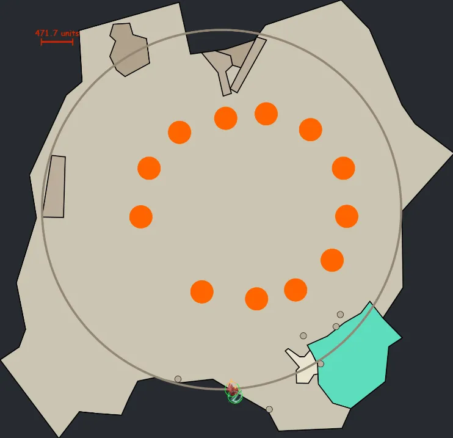

[Return to Home](../index.html){: .btn } [Return to Overview](./overview.html){: .btn } [Mechanical Reference](./mechanics.html){: .btn }

# Greer Recommended Strategy

Greer is a hectic fight that requires constant attention to mechanics, careful positioning, and constant on-the-fly decision making and adaptation to the semi-randomness this boss throws at you. It is greatly beneficial for these reasons to play using voice chat.

There are two strategies that are commonly played: one with dedicated Tank and one without a Tank. Here, we will focus only on the non-Tank version, because it's the most frequent in pug runs. This strategy, commonly called 'cozy' strat, typically uses the following composition:

- two Heal  [Chronomancers] providing  [Stability] and  [Aegis].
- a Ventari  [Herald] providing  [Quickness] and projectile blocks.
- a Celestial hybrid  [Scourge] (replaceable with any other sufficiently tanky build).
- Six damage dealers.

Due to how Greer [boon mechanics](mechanics.html#boons-on-the-titans) work, it's typical to use either a full Condition, or full Power based squad. In the following, we assume a Condition based composition. When running power, what changes is where you start the fight and where you go in split phases, which is at/to Gree instead of Reeg.

[ Chronomancer](https://gw2skills.net/editor/?PigEQiWmBzi1wAZj4RPp2aA-DSJYjR1fh0SKUdFkeQp7rhgEK/t0+mFUB-e){: .btn } [PoV](https://www.youtube.com/watch?v=bBk0LWdAsIs){: .btn }

[ Scourge](https://gw2skills.net/editor/?PSwEo8NsMDmG7jJxIxi9661D-DyIY1ol/M6SKkrCQhHDCSoMFeNg4BDUB-e){: .btn } [PoV](https://youtu.be/VBgiTP4SdhI){: .btn }

[ Herald](https://snowcrows.com/builds/raids/revenant/condition-quickness-herald-spear){: .btn } [PoV](https://www.youtube.com/watch?v=RYRrvI0VWiA&ab){: .btn }

(Use Ventari instead of Mallyx)

## 100% - 65%

The fight starts on the ledge to the right-hand side when moving from the Camp to Greer's arena. Simply jump down into the arena which will start the fight.

Reeg will be attackable shortly after the start. The supports want to very quickly provide boons. One of the  [Chronomancers] must then run toward Greer to  [Distort] the [Blobs of Blight] coming from Greer, and to lure Greer close to Reeg. In order to do this properly, you want to stay more than 900 range away from Greer, because otherwise he will start using his melee attacks, delaying his movement. 

The squad at Reeg will have to solve a pair of Greens, while bringing Reeg as quickly as possible to 75%. Once Greer is close enough, you can stand between Reeg and Greer to cleave both.

The  [Herald] needs to pay attention at that point and regularly block the [Empowering Blast] coming from the Gree and Ereg toward Greer in order to keep  [Empowered] stacks low on Greer. Whenever the Ventari Herald can't block for any reason, make sure to call for backup projectile block in voice; usually there is at least one more Scourge with  [Corrosive Poison Cloud] and the two  [Chronomancers] should run  [Feedback].

The  [Scourge] should stay on the outer side of Greer until he uses [Enfeebling Miasma] to bait it away from the center of the arena. Everone else can move behind Greer. If the miasma is cast early and Reeg has not disappeard yet, you may need to go back and finish Reeg. Roughly at the same time the second  [Chronomancer] needs to be ready to Distort the second set of [Blobs of Blight], this time coming from Ereg from the North-East of the arena.

Then follows the 'main' component of fighting Greer. For the  [Chronomancers] this revolves around providing  [Stability] for the [Sweep the Mold] (or sidestepping if none is available) and, more importantly, using  [Well of Precognition] to block [Stomp the Growth]. It's important that the squad is stacked so that everyone is within the well's area. If any of the  [Chronomancers] have the well ready, communicate it in voice such that people can use their dodge. It's not as important in the early phases when Greer's [Empowered] stacks are low, but this is crucial later on, because the slam attacks can very quickly wipe an unprepared squad.

Once Greer hits 80%, he will gain a  [Defiance Bar]. After breaking it, the squad should be ready to block the additional [Empowering Blast] that will be launched from the Elite Empowered Beasts spawning.

If damage is on the lower side, you may have one final set of [Blob of Blight] coming from the North.

## First Split Phase

At 65%, the boss will disappear and the first split phase begins. Note that conditions keep ticking at the boss, you no damage will be wasted.

Everyone in the squad except one  [Chronomancer] should go to Reeg, which will be located in the North-West of the arena. The one  [Chronomancer]  will go to Gree (North-East) to capture his aggro and drag him towards the rest of the group on Reeg.

Note that depending on dps, the [Blobs of Blight] spawning at the end of the previous phase may also need to be  [Distorted] by this  [Chronomancer] on the way to Gree. Conversely, with very high dps they will not appear at all. To bait Gree properly and quickly, try to keep some distance in order to not trigger Gree's melee attacks, similar to how baiting Greer at the start of the fight works. Note that Gree may use his Jump attack, which must to be avoided at all cost, so if it's cast, just run away, regroup and after the attack is over go back to melee range.

In parallel, while the squad is at Reeg, [Blob of Blight] from Reeg and possibly from Ereg will be cast. This means the  [Chronomancer] on the stack needs to  [Distort] the [Blob of Blight] from Reeg. If [Blob of Blight] from Ereg come delayed, they need to be dodged by the entire squad. If the dodge is failed, just make sure to immediately walk away: standing under a non-deleted orb will quickly kill you. Additionally, there will also be Greens that need to be done. There is a chance that the player who baits Gree gets a Green as well, the easiest way to deal with that is to just dodge it.  [Chronomancers] running spear can use use  [Imaginary Inversion] (Spear 3) into Dodge for a longer evaison period to make this easier.

Reeg and Ereg will constantly use [Rain of Spores], blasting everyone with projectiles. This can simply be mitigated by having blocks up, so communicate accordingly to always have some ready. Once Reeg hits 50%, he will disappear. Note that similar to Greer when phasing, Reeg also does not become invulnerable, which means that applied conditions willkeep ticking and no damage is wasted.

After Reeg has disappeared, the focus shifts to Gree and Ereg. Note that if you are doing the achievement to keep Ereg alive, you will only focus Gree, but if you want to kill Ereg, you can damage Gree until Ereg comes into melee range and then switch to Ereg. Stand on the other side of Gree from Ereg in order to bait his [Enfeebling Miasma] away from the center. As soon as the cone indicators appear, dodge through Ereg to the safe side.

Gree will constantly use [Sweep the Mold] and [Stomp the Growth]. Provide  [Stability] for the first and  [Well of Precognition] against the second. Furthermore, Gree will also use the [Cage of Decay]. Note that the Arrow projectiles stop at the edge of the arena and don't travel their full distance: this means when Gree is standing close to the edge of the arena, the large boon corrupt AoE can quickly and surprisingly appear under the squad. For this reason it's crucial to immediately go toward the inner side of the Gree when you see the arrow indicators.

## 65% - 35%

Once Gree hits 50% hp, the split phase is over, Greer will become vulnerable and start attacking again. The first attack will be [Blob of Blight]. This means when running back to the boss, one  [Chronomancer] should be ready to  [Distort] the orbs. Everyone else should run stacked together, behind the  [Chronomancer].

After the [Blobs of Blight] are dealt with, run past Greer to Reeg, which spawns at the original position next to Greer again. In order to remove the Resolution boon from Greer, Reeg needs to be damaged to 25% of his health. The Ventari  [Herald] needs to pay attention the whole time to block [Empowering Blast].

Very shortly after, there will be a few [Eruptions of Rot] that need to be solved. These are one two-person green from Reeg, and two three-person greens from Greer. If they are desynchronized, you can solve all of them relatively easily, but if they happen simultaneously, it's easier to dodge the two person Green and solve both three person Greens. The reason for this is that the three-person greens give  [Empowered] stacks to the boss when failed, while the two person Green will not give.

It is important to provide  [Stability] while these greens are happening, since Greer may also cast [Sweep the Mold] and [Stomp the Growth] while they are being solved. Be careful to not dodge out of greens while avoiding the shockwave.

Reeg and Greer might also use artillery skills during this time, so have your  [Corrosive Poison Cloud] and  [Feedback] ready to use. After Reeg has disappeared, the  [Scourge] should stay on the outerside of Greer until he uses [Enfeebling Miasma], while everyone else can already go behind him.

The rest of this phase is similar to the first phase. Deal with the mechanics appropriately ( [Distort] the orbs, provide  [Stability] for swipes, use  [Well of Precognition] for slams...), with a  [Defiance Bar] that appears at 50%. Similar to before, after breaking the bar, Elite Empowering Beasts will appear and cast [Empowering Blast] toward Greer, so make sure to block all of those and communicate if any backup projectile block is needed.

## Second Split Phase

The second split phase is similar to the first one. The Heal Chronos have to deal with  [Chronomancers], one of them must bait Gree and otherwise the squad will move and damage Reeg in the North-West. This time, the phase ends when Reeg and Gree are fully dead. If you're keeping Ereg alive, simply ignore him, otherwise try to focus him down as soon as he's in melee range. All things mentioned in the first split phase apply once more. Once Reeg and Gree are dead, the next boss phase will start.

## 35% - 10%

If you decided to kill Ereg, the squad should stay on him until he is dead. One of the  [Chronomancers] can run to Greer in order to bait him closer already and to distort [Blob of Blight], which will be casted from Greer at the start of this phase. [Blob of Blight] timing from Ereg depends on squad damage, and might happen either toward the end of the split phase, or sometime soon at the start of this phase.

After [Blob of Blight], Greer will use [Eruption of Rot]. This will be a set of three three-person Greens (often called 'triple Greens'). The easiest way to deal with these is to stack them, which will cause them to count as successful (thus not giving any ), but will down the players involved. Hence, you want to dodge the greens together: coordinate to stack next to the boss a bit outside of melee range and dodge toward the boss together, and then res any players who downed.

Timing wise, Ereg might also use his two person Green ability, which can be solved on the stack. At this point, Ereg should be close to dying. With a Condition based squad composition, you can leave Ereg and switch dps to the Greer around 7% hp.

At this point, there will be no more regular [Empowering Blast], because all lesser Titans are dead. However, at 20% there will be another breakbar and after this another set of Elite Empowering Beasts will spawn. Be ready to block the [Empowering Blast] orbs from those.

Once Greer reaches ~11%, everyone except the  [Scourge] can start moving away from Greer to the opposite side of the arena together. Conditions will bring Greer to 10% at which point the next phase starts.

## Proto Phase

Once Greer hits 10%, Greer becomes invulnerable and three Champion Proto-Greerling will spawn at random locations in the arena (there are 12 possible spawnpoints -- see image below -- three are chosen at random). 

The 10% tank stays on Greer with their task being to keep Greer away from the rest of the squad. However, in order to survive, they should try to evade as many attacks as possible. If they are unlucky and a Protoling spawns close to Greer and aggros on them, they may need to come back to the squad earlier in order to survive. The rest of the squad should be prepared to run away together in case Greer uses [Ripples of Rot].

The squad should kill the Champion Proto-Greerlings as fast as possible. Simply move either toward a Protoling that is far away from Greer, or in case two are stacked together, move toward those. Any ranged damage dealers can try to bait in any extra Protolings that are far from the squad. Other then that, it is important to constantly stay stacked together, because the Greerlins will constantly spam [Scattering Sporeblast], which requires projectile blocks, and [Sweep the Mold] and [Stop the Growth] for which  [Stability] and  [Aegis] are helpful.

Communicate in voice for projectile blocks and whenever there is no <igm class='inline precog'> [Well of Precognition], such that people know they need to use dodges, or sidestep AoEs. It's always good to try and evade as many attacks whenever possible, while staying close together. Always use your dodge before you die from the next AoE attack! 

Besides the plethora of AoEs that need to be evaded, special attention has to be given to two attacks: First, [Blob of Blight] will be cast at some point during the 10% phase, so one of the  [Chronomancers] needs to be ready to  [Distort] when this happens. Second, Triple Greens will also happen at some point toward the end of the 10% phase. Play these similarly to the ones before, by stacking together, moving to a spot free from AoEs and slightly away from the boss and finally dodging toward the boss.

Sometimes it can happen that the last Protoling is close to Greer. In those cases, focus the Protoling while trying to evade all Greer attacks. Once the it's is close to dying, switch to Greer to pre-stack conditions.

## 10% - 0%

Greer will become vulnerable once the last Protoling is dead. After 30 second, the Protolings will respawn, which is essentially a wipe. That's why pre-stacking Conditions toward the end of the 10% phase is important, because it effectively removes a large part of the ramp-up time from the squad's damage profile: this is much more important than quickly killing the final Protoling. Greer will continue to use his mechanics during this phase. It's best to sidestep AoEs to prevent as much damage as possible, but especially for [Stomp the Growth], having  [Well of Precognition] up is essential to surviving. Communicate in voice if it's not ready and in that case use dodges to survive!

---

[Return to Home](../index.html){: .btn } [Return to Overview](overview.html){: .btn } [Return to Top](#Recommended-Greer-strategy){: .btn .fixed}

[Empowering Blast]: mechanics.html#empowering-blast
[Cage of Decay]: mechanics.html#cage-of-decay
[Blob of Blight]: mechanics.html#blob-of-blight
[Blobs of Blight]: mechanics.html#blob-of-blight
[Sweep the Mold]: mechanics.html#sweep-the-mold
[Empowered]: mechanics.html#empowered
[Enfeebling Miasma]: mechanics.html#enfeebling-miasma
[Stomp the Growth]: mechanics.html#stomp-the-growth
[Rain of Spores]: mechancis.html#rain-of-spores
[Eruptions of Rot]: mechanics.html#eruption-of-rot
[Ripples of Rot]: mechanics.html#ripples-of-rot
[Scattering Sporeblast]: mechanics.html#scattering-sporeblast

[Aegis]: https://wiki.guildwars2.com/wiki/Aegis
[Well of Precognition]: https://wiki.guildwars2.com/wiki/Well_of_Precognition
[Feedback]: https://wiki.guildwars2.com/wiki/Feedback
[Corrosive Poison Cloud]: https://wiki.guildwars2.com/wiki/Corrosive_Poison_Cloud
[Chronomancer]: https://wiki.guildwars2.com/wiki/Chronomancer
[Chronomancers]: https://wiki.guildwars2.com/wiki/Chronomancer
[Herald]: https://wiki.guildwars2.com/wiki/Herald
[Scourge]: https://wiki.guildwars2.com/wiki/Scourge
[Quickness]: https://wiki.guildwars2.com/wiki/Quickness
[Stability]: https://wiki.guildwars2.com/wiki/Stability
[Distort]: https://wiki.guildwars2.com/wiki/Distortion
[Distorted]: https://wiki.guildwars2.com/wiki/Distortion
[Defiance Bar]: https://wiki.guildwars2.com/wiki/Defiance_bar
[Imaginary Inversion]: https://wiki.guildwars2.com/wiki/Imaginary_Inversion