[Return to Home](../index.html){: .btn } [Return to Overview](./overview.html){: .btn } [Mechanical Reference](./mechanics.html){: .btn }

# Greer Recommended Strategy
{: .no_toc}

<details>
<summary><b>Table of Contents</b></summary>
<div markdown=block>
1. TOC
{:toc}
</div>
</details>


Greer is a hectic fight that requires constant attention to mechanics, careful positioning, and on-the-fly decision making and adaptation. For these reasons, it is recommended to play using voice chat.

This is an in-depth guide: if you are looking for something fast to read and less comprehensive, check out the [Greer Fast Guides](./fast-guide.html).

All markers referenced in this guide can be set up with the [Commander Markers](https://blishhud.com/modules/?module=Manlaan.CommanderMarkers) module for [Blish HUD](https://blishhud.com), using the marker pack provided below.

<details>
<summary>Click to view markers</summary>
<div markdown=block>

Paste the following code into Commander Markers to use this marker pack:
```
Work In Progress
```
</div>
</details>

---

#### General Points
{: .no_toc}
- Groups must choose between a full  [Power] or full  [Condition] composition.
- Supports provide  [Aegis] and  [Stability] for most mechanics.
- Projectile management is required to avoid granting too much  [Empowered].
- Careful positioning is used to stack the boss and various adds in advantageous positions.
- A tank is used to occupy the boss in the final phases of the fight.
- [Some parts of the fight](./mechanics.html#proto-greerling-phase) require excellent movement and defensive support to survive. 
- The last 10% is a tight DPS check.


## Composition

Two strategies are commonly played on the encounter: one with a dedicated tank for the entire fight, and one that uses a tank only in the last 10%. Here we will focus only on the non-Tank version, because it's the most frequent in pug runs. This strategy, commonly called "cozy strat", typically uses the following composition:

- Two Heal  [Chronomancers] providing  [Stability] and  [Aegis].
- A *bubble* to provide projectile blocks, usually a  [Herald]  or  [Firebrand].
- A *10% tank*, usually played by a Celestial-hybrid  [Scourge] or any other sufficiently tanky build .
- Six damage dealers.

The focus is on providing enough defensive utility to manage all of Greer's attacks:  [Chronomancers] are the best choice as they are unmatched in  [Stability] and  [Aegis] uptime, while also having excellent boons, CC, healing and access to  [Distortion] for [Blobs of Blight].

A bubble player is required to manage the copious amount of projectile denial the encounter mandates. This is most often a  [Herald] running  [Legendary Centaur Stance], with the  [Chronomancers] providing backups with  [Feedback].

Finally,  [Scourge] is commonly chosen as a tank, usually as a celestial boon provider, due to its high survivability and utility with  [Corrosive Poison Cloud] and  [Signet of Undeath](https://wiki.guildwars2.com/wiki/Signet_of_Undeath). 

---

#### Power vs. Condition

Due to how the [lesser titans] provide boons throughout the encounter, it's typical to use either a full  [Condition], or full  [Power] based squad. By default, enemies will be affected by both  [Protection] and  [Resolution], however:

-  [Power] compositions can kill [Gree] to remove  [Protection] from all enemies.
-  [Condition] compositions can kill [Reeg] to remove  [Resolution] from all enemies.

The choice of composition brings about a noticeable difference in positioning: each strategy will start the fight next to the lesser titan that grants their antagonistic boon, and will focus them down at the beginning of every burn phase and split phase. Apart from this, roles and mechanics function equally for both.

In the following, we assume a  [Condition] based composition.

{: .note}
Hybrid compositions are universally avoided, as it is infeasible to kill both [Reeg] and [Gree], and one of their damage components will be impacted by the titan they leave alive. Similarly, builds that have a hybrid damage profile (such as  [Condition Virtuoso]) will struggle to provide comparable DPS on this encounter.

---

#### Builds and PoVs

This is a non-exhaustive list of playable builds on the encounter. If anything is outdated, you can find up-to-date information on  [Void Lounge](https://discord.com/invite/voidlounge).

|Build|Role|PoV|Last updated|
|[ Chronomancer](https://gw2skills.net/editor/?PigEQiWmBzi1wAZj4RPp2aA-DSJYjR1fh0SKUdFkeQp7rhgEK/t0+mFUB-e)| Heal & Mechanics | [PoV](https://youtu.be/Y1QIgchi1SU) | September 2025 |
|[ Scourge](https://gw2skills.net/editor/?PSwEo8NsMDmG7jJxIxi9661D-DyIY1ol/M6SKkrCQhHDCSoMFeNg4BDUB-e) | 10% Tank | [PoV](https://youtu.be/VBgiTP4SdhI) | June 2025 |
|[ Herald (Use Ventari instead of Mallyx)](https://snowcrows.com/builds/raids/revenant/condition-quickness-herald-spear) | Boon & Bubble | [PoV](https://www.youtube.com/watch?v=RYRrvI0VWiA&ab) | April 2025 |
|[ Bubblebrand](https://gw2skills.net/editor/?PWxEQLtrMC2DTkpwMxk66/ZB-DSRYjRNGJsyo6UI9KQ3fBpIM7h3S7bWQFA-e) | Heal & Bubble | [PoV (Power)](https://www.youtube.com/watch?v=yNg0_2bXl4U) | September 2025 |
|[ Condi Willbender](https://snowcrows.com/builds/raids/guardian/condition-willbender)| DPS | [PoV](https://www.youtube.com/watch?v=p4WIceytxVg) | June 2025 |


## First Phase

#### Beginning of the Phase

The very first part of the encounter aims to quickly phase [Reeg] and position the squad towards the center of the arena. This is complicated by the dangerous high-priority mechanics that Greer always uses at the start of the phase: [Greens], [Blobs of Blight], and [Enfeebling Miasma].

Groups will usually start on the ledge to the right-hand side when entering Greer's arena: simply jump down to begin. [Reeg] will spawn in shortly; stand between him and the wall and DPS him down.

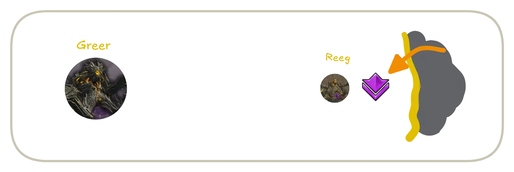

One of the  [Chronomancers] will usually deal with the  first set of [Blobs of Blight] coming from [Greer]. This can easily be done with  [Distortion], or alternatively you can use a combination of dodges and  [Imaginary Inversion] to evade all three orbs while conserving clones to provide additional boons for your DPS's openers.


In experienced groups, that same  [Chronomancer] will have the responsibility of blocking the first set of [Empowering Blasts] originating from [Gree] and [Ereg]. This is done by using  [Continuum Split] to double-cast  [Feedback] so that both directions are covered. The orb originating from [Reeg] is usually blocked by a  [Scourge] with  [Corrosive Poison Cloud], a  [Feedback] from the other  [Chronomancer], or by the dedicated bubble player.

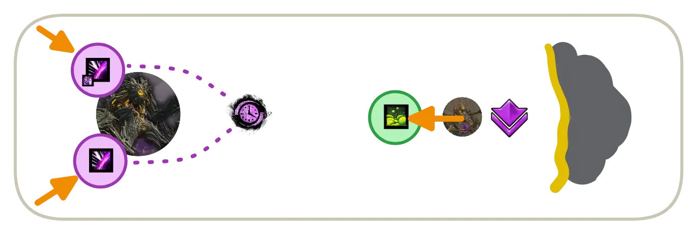

{: .note}
If neither  [Chronomancer] is feeling confident with this maneuver, then the bubble (usually a  [Herald]) can follow them while they are deleting the first set of Death Orbs and then block the [Empowering Blasts] themselves. However, this usually severely hurts the squad's overall boon uptime in the opener.

Whoever blocked the [Empowering Blasts] is also responsible for luring the boss close to [Reeg]. In order to do this properly they should stay more than 900 range from [Greer], otherwise he will start using his melee attacks, delaying his movement. Vice versa, if you get to him too late, he will start casting ranged attacks such as [Rain of Spores] and [Greens] before moving.

<details>
<summary> Chronomancer PoV</summary>
<iframe class="youtube-video center" width="100%" src="https://www.youtube.com/embed/Y1QIgchi1SU?si=vjBewg-lzPSfN-1b&start=7&end=36&mute=1 " frameborder="0" allow="accelerometer; clipboard-write; encrypted-media; gyroscope; picture-in-picture; web-share" referrerpolicy="strict-origin-when-cross-origin" allowfullscreen></iframe>
</details>

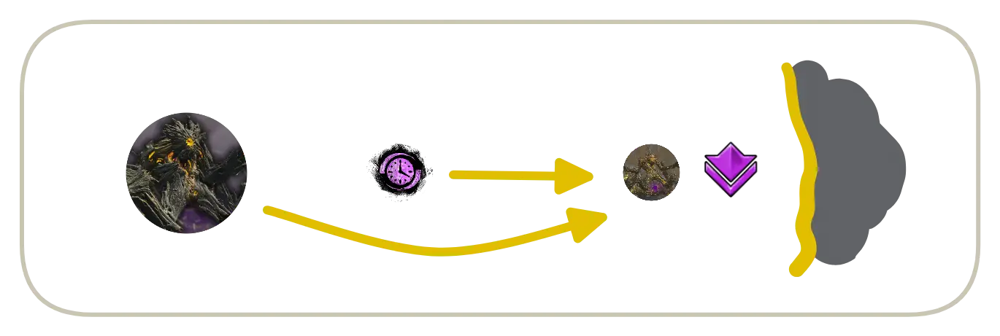

{: .note}
Quickly stacking Greer next to [Reeg] can massively increase your squad's overall DPS, and positions him in a comfortable position for the rest of the fight. For this reason it's important to bait him properly, but the rest of the squad should also stack on the other side of [Reeg] so that he gets as close as possible.

Meanwhile, the squad at [Reeg] will have to solve a pair of  [Greens] while bringing the add down to 75%, at which point he despawns. Once [Greer] is close enough, you can stand between the two and cleave both.

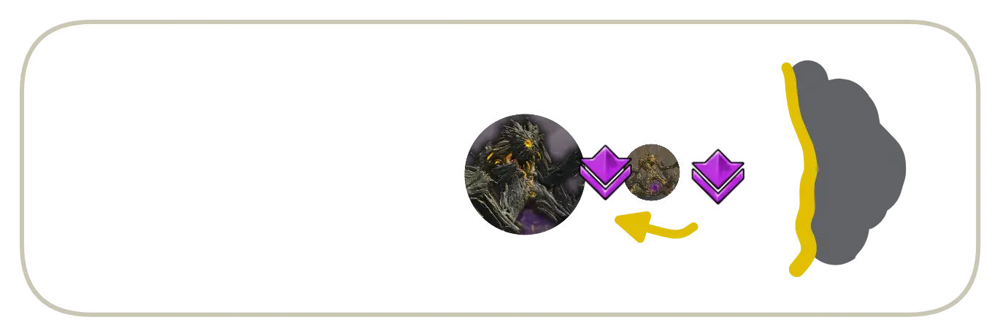

At this point, the  [Herald] needs to pay attention and regularly block the [Empowering Blast] coming from [Gree] and [Ereg] in order to not grant any  [Empowered] stacks. Whenever they can't block for any reason, they should call for backup in voice, and a  [Scourge] with  [Corrosive Poison Cloud] or  [Chronomancer] with  [Feedback] will provide the reflect.

Stay on the outside of [Greer] until he uses [Enfeebling Miasma], baiting it towards the wall. Once he casts this skill, dodge through his hitbox to the safe side. Roughly at the same time, the second  [Chronomancer] needs to be ready to  [Distort] the second set of [Blobs of Blight] coming from [Ereg] from the North-East.

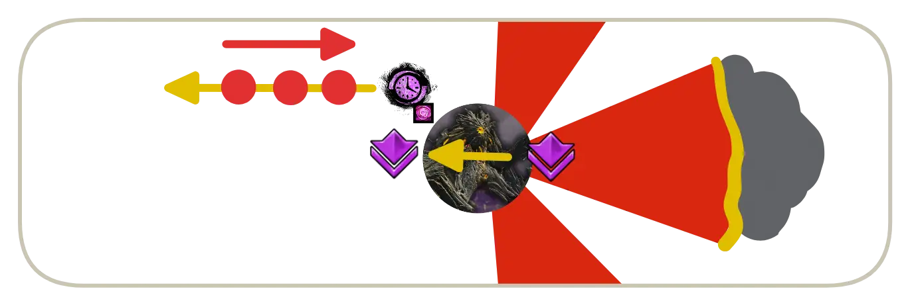

If the [Enfeebling Miasma] is cast early and [Reeg] has not despawned yet, you can stack inside of Greer's hitbox to finish him.

---

#### Main Body

After the opening sequence, Reeg should be dead,  [Greens] solved, [Blobs of Blight] deleted and [Enfeebling Miasma] painting the wall. Most of these skills have a long enough cooldown that you won't have to deal with them until the next phase.

Thus follows the main component of fighting [Greer]. For the  [Chronomancers] this revolves around providing  [Stability] for the [Sweep the Mold] <font size=2>(or sidestepping if none is available)</font> and, more importantly, using  [Well of Precognition] to block [Stomp the Growth].

{: .note}
It's important that the squad is stacked so that everyone is within the well's area. If any of the  [Chronomancers] don't have the well ready, communicate it in voice such that people can use their dodge. It's not as important in the early phases when Greer doesn't have much  [Empowered], but it becomes crucial later on as the slam attacks can very quickly wipe an unprepared squad.

For the bubble player, they should always be ready to block [Empowering Blasts], calling for backup when they don't have projectile destruction ready.

When Greer uses [Cage of Decay], all players should sidestep the arrows. These pulse  [Knockback] fast enough that most forms of  [Stability] are ineffective.

Once [Greer] hits 80%, he will gain a  [Defiance Bar], becoming  [Invulnerable] until it is broken, which also spawns several [Elite Empowering Beasts]. Players should be ready to handle the additional [Empowering Blasts] these adds generate.

This phase continues until 35%, when the first split phase begins. If damage is on the lower side, you may have one final set of [Blobs of Blight] coming from the North before transitioning.


## First Split Phase

At 65%, the boss will become untargetable and the first split phase begins.  [Conditions] will keep ticking on [Greer], so no damage will be wasted.

Everyone in the squad will go to [Reeg], located on ; 
<br>
**Except** for one player, who will go to [Gree] on  to capture his aggro and drag him towards the rest of the group on Reeg. This is often a  [Chronomancer] or the *10% tank*.

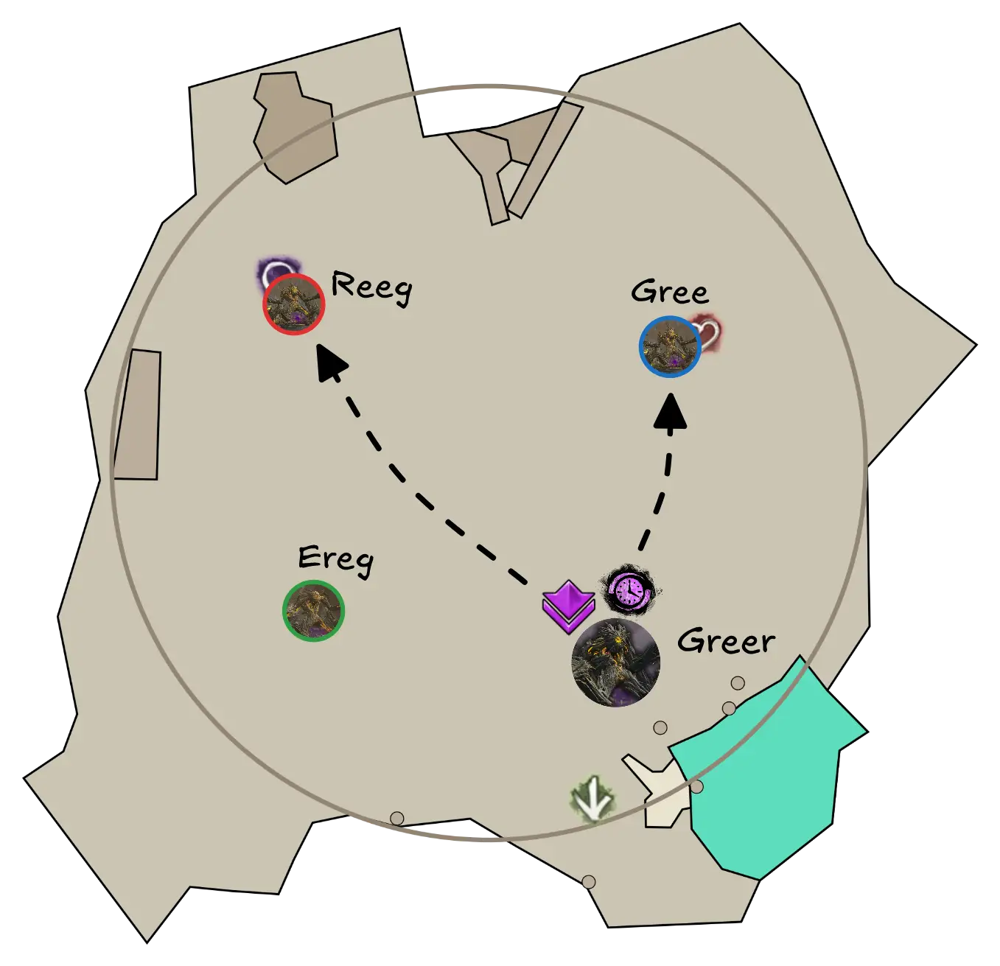

{: .note}
Depending on the situation and your DPS, [Ereg] may cast [Blobs of Blight] at the end of the previous phase. If this happens, it may be convenient to send a  [Chronomancer] to , and let them  [Distort] the orbs (see [here](https://www.youtube.com/watch?v=dx2zLoPADFk&start=105s&end=120s)). Otherwise, Ereg will use this skill at the beginning of the split phase, in which case it's better to keep both  [Chronomancers] on stack (see [here](https://www.youtube.com/watch?v=Y1QIgchi1SU&start=107s&end=135s)). 

To bait [Gree] properly and quickly: keep some distance in order to not trigger his melee attacks, similar to baiting Greer at the start of the fight.
[Gree] may use his [Ripples of Rot] attack, which must be avoided at all costs; if it is cast, just run away, regroup and after the attack is over go back to melee range.

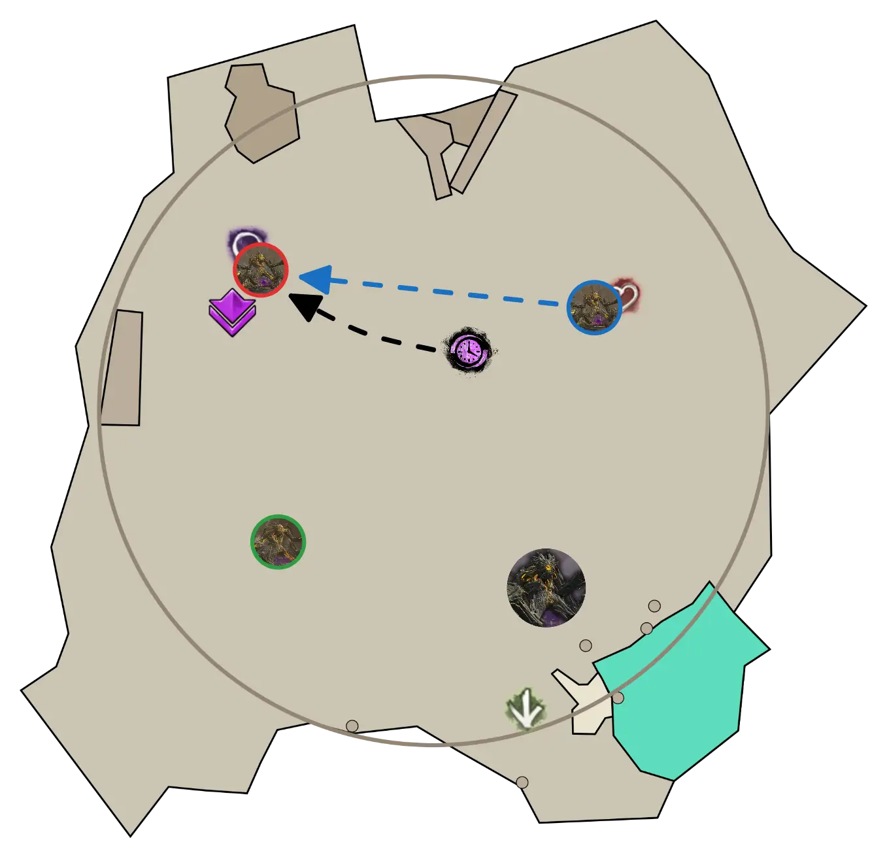

Both [Reeg] and [Ereg] can cast [Blob of Blight] on the squad at this time.
<br>
The  [Chronomancers] on the stack needs to  [Distort] the [Blob of Blight] from [Reeg]. If the [Blobs of Blight] from [Ereg] are delayed, they may need to be dodged **by the entire squad**. If the dodge is failed make sure to immediately walk away; standing under a stationary orb will quickly kill you. 
<br>
Additionally, there will also be  [Greens] that need to be played at the same time. 

{: .note}
There is a high chance that the player who's baiting [Gree] gets targeted by a [Green] as well: it is convenient to dodge it as they will be off-stack.  [Chronomancers] running spear can use use  [Imaginary Inversion] into Dodge for a longer evasion period to make this easier.

[Reeg] and [Ereg] will constantly use [Rain of Spores], blasting everyone with projectiles. This can be mitigated by having projectile blocks up, communicating accordingly to always have some ready.

After [Reeg] has disappeared or is close to disappearing (usually around 56% HP), the focus shifts to [Gree] and [Ereg]. Move to Gree and position on the far side of him compared to Ereg. This will bait Ereg to stand on top of Gree, so that you can cleave them together.

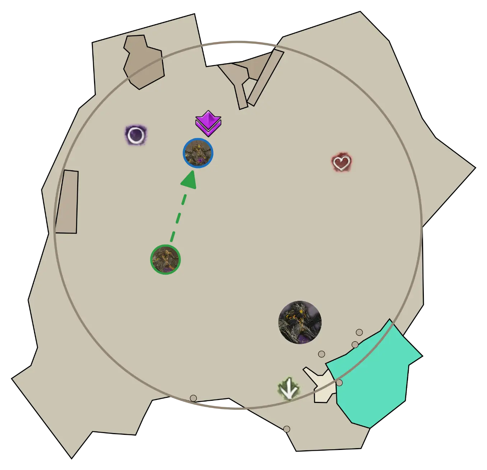

{: .note}
If you are doing the achievement to keep [Ereg] alive, you will only focus [Gree], otherwise you can damage [Gree] until [Ereg] comes into melee range and then switch, as Ereg will be less healthy at this point.

Soon after getting to Gree, [Ereg] will cast [Enfeebling Miasma]. When the cone indicators appear, dodge through the miniboss to the safe side.

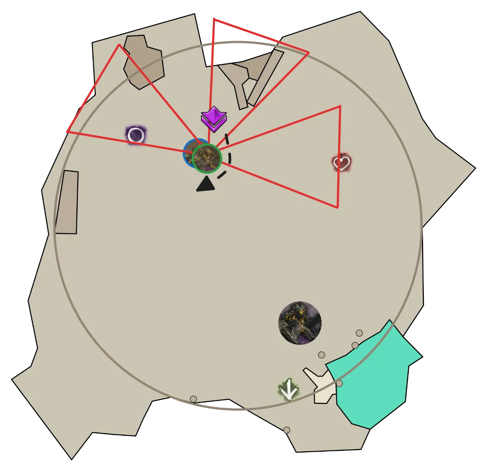

[Gree] will constantly use [Sweep the Mold] and [Stomp the Growth]. Provide  [Stability] for the first and  [Well of Precognition] for the second. Furthermore, [Gree] will also use the [Cage of Decay]. Try to always move out of the arrows, as  [Stability] is not useful with them.

{: .note}
The Arrow projectiles from [Cage of Decay] stop at the edge of the arena and don't travel their full distance: meaning when [Gree] is standing close to the edge of the arena, the large boon corrupt AoE can instantly appear under the squad. For this reason it's crucial to immediately go toward the inner side of Gree when you see the arrow indicators.


## Second Phase

#### Beginning of the Phase

Once [Gree] hits 50% hp, the split phase is over. [Ereg] will despawn, all three adds will re-appear in their original positions and [Greer] will become vulnerable and start attacking again. The first attack will always be [Blob of Blight], so when running back to the boss one  [Chronomancer] should be ready to  [Distort] them. Everyone else should run stacked together, behind the  [Chronomancer].

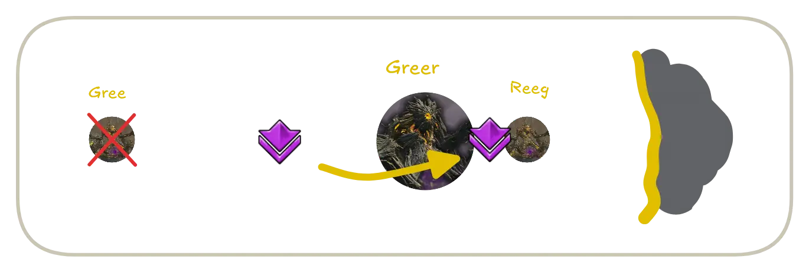

Then follows a sequence that is similar to what happened at the beginning of the encounter. Run past [Greer] to [Reeg], who spawns at his original position next to [Greer] again.

Very shortly after, there will be a few [Greens] that need to be solved. 
- a single  [two-person-green] from [Reeg]
- two  [three-person-greens] from [Greer]


If they are desynchronized you can solve all of them relatively easily by stacking the two-person green on top of one of the three-person ones. If they happen simultaneously, it's better to dodge the two-person-green and solve both three-person-greens. The reason for this is that the three-person-greens give  [Empowered] stacks to the boss when failed, while the two-person-green will give them to the *lesser Titan*.

It is important to provide  [Stability] while these [Greens] are happening, since [Greer] may also cast [Sweep the Mold] and [Stomp the Growth] while they are being solved. Be careful to not dodge out of [Greens] while avoiding the shockwave.

Once greens are done and [Reeg] is dead, wait for Greer to cast [Enfeebling Miasma], then dodge through his hitbox to the safe side. 

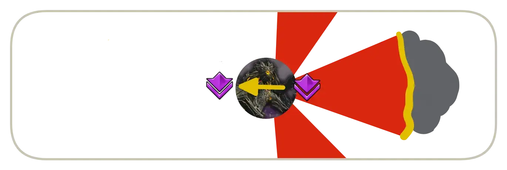

---

#### Main Body

The rest of this phase is similar to the first phase. Deal with mechanics appropriately:

-  [Distort] the [Blobs of Blight]
- Provide  [Stability] for [Sweep the Mold].
- Use  [Well of Precognition] for [Stomp the Growth].
- Continue blocking [Empowering Blasts].

A  [Defiance Bar] appears again at 50%. Upon breaking this bar, [Elite Empowering Beasts] will spawn again, and cast [Empowering Blast] toward [Greer]; make sure to block all of these and communicate if any backup projectile block is needed.

This phase continues until 35%, when the second split phase begins.


## Second Split Phase

The second split phase is similar to the first. 
The squad will go to [Reeg] again, while one player has to bait [Gree] to the group.

{: .note}
If you're keeping [Ereg] alive, simply ignore him, otherwise try to focus him down as soon as he's in melee range. 

This time, the phase ends when [Reeg] and [Gree] are fully dead. If [Ereg] is still healthy, the squad should remain on him until he is low, while the tank can go distract Greer. In this case, pay attention to any [Blobs of Blight] incoming from the boss.


## Third Main Phase

#### Beginning of the Phase

[Greer] will always open with [Blob of Blight], followed by [Eruption of Rot]. This will be a set of 3   [three-person-greens] <font size=2>(often called "Triple Greens")</font>. 
The easiest way to deal with this version of the mechanic is to stack them; all three targeted players should move out of melee range, off the stack, and dodge towards the boss. This will prevent any  [Empowered] on [Greer] and any players that are  [Downed] can be ressed.
<details>
<summary>Example of dodging triple greens</summary>
<iframe class="youtube-video-wide center" src="https://www.youtube.com/embed/-epK7O8qfl4?si=OlA4G6xiHNTBVtrT&mute=1 " frameborder="0" allow="accelerometer; clipboard-write; encrypted-media; gyroscope; picture-in-picture; web-share" referrerpolicy="strict-origin-when-cross-origin" allowfullscreen></iframe>
</details>

Timing wise, [Ereg] might also use his  [two-person-green], which can be solved on the stack. At this point, [Ereg] should be close to dying. With a  [Condition] based composition, you can leave [Ereg] and swap to [Greer] at around 7% of his HP.

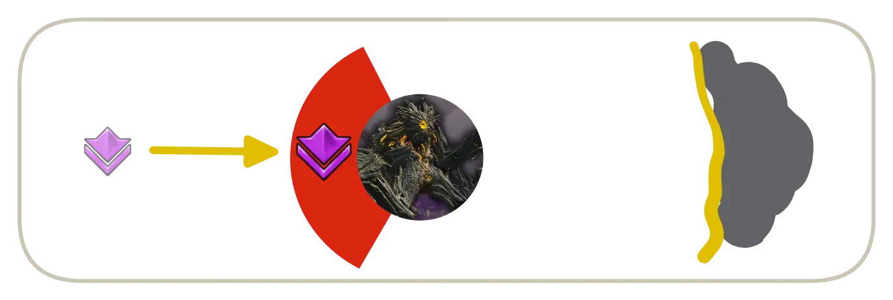

At this point, there will be no more regular [Empowering Blast], because all *lesser Titans* are dead. Since you don't have to cleave [Reeg], you can just walk directly to the boss and start DPSing him.

---

#### Tanking Setup Maneuver

At 20% there will be another  [Defiance Bar], and another set of [Elite Empowering Beasts] will spawn. Groups will usually take advantage of this breakbar to maneuver in preparation for the protoling phase. Once the bar appears, run through the boss and stand between him and the wall.


Once the bar is broken, Greer will turn around towards the wall where the squad is. Wait for his next [Sweep the Mold], [Stomp the Growth], [Cage of Decay] or [Enfeebling Miasma]: these skills all lock Greer in place for their animation, allowing the group to move back to the inside while the *tank* stays in place and keeps Greer's aggro on them.


Once [Greer] reaches ~11% HP, the squad (minus the tank) should start moving away in preparation for the protoling phase. Conditions will bring [Greer] to 10% at which point the next phase starts.

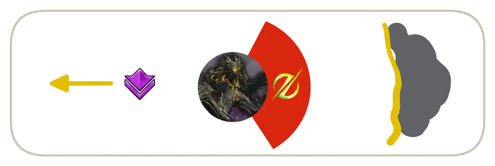


## Proto-Greerling Phase

Once [Greer] hits 10% he becomes  [Invulnerable] and three [Champion Proto-Greerlings] <font size=2>(from here on called Protolings)</font> will spawn at random locations in the arena. All three *Protolings* must be killed before Greer can be damaged again.


 <font size=2 class=center>There are 12 possible spawnpoints, from which three are chosen at random.</font>

---

#### Tanking

The tank's job is to keep the boss away from the rest of the squad and facing the wall. In order to survive, they should try to evade as many attacks as possible. Stand close to Greer and sidestep [Sweep the Mold] and [Cage of Decay]. Save your dodges for [Stomp the Growth], making sure to jump the wave. As you are close to the boss, you will not be targeted by [Blobs of Blight] or [Eruption of Rot], but call out when the mechanics are happening for your squad.

If you are unlucky and a *Protoling* spawns close and aggros on you, you may need to come back to the squad earlier. In this case, try to bait out [Ripples of Rot]. This skill is very dangerous, but has a long cooldown, so having him cast it at the beginning means that you will not have to deal with it later on.

---

#### Killing Protolings

Once the spawn positions are apparent, the squad should move either toward the furthest *Protoling* from [Greer], or towards multiple stacked *Protolings* if there are any. Any ranged damage dealers can try to bait in extra *Protolings* that are far from the squad.
<br>
The *Protolings* will constantly spam these attacks:
- [Scattering Sporeblast] - dealt with by keeping projectile blocks up at all times.
- [Sweep the Mold] - managed bia  [Stability] and  [Aegis] or by sidestep the cones.
- [Stomp the Growth] - dodge through the caster to the safe side. Casts of this will often overlap, dealing a surprising amount of damage.

It is important to remain stacked throughout the entire phase as closely as possible to benefit from this defensive support and skills: players off the stack will die very quickly, losing valuable time and risking destabilizing the squad while reviving.

{: .note}
Communication of cooldowns for projectile blocks and  [Well of Precognition] is important here. Blocking, sidestepping, and dodging the damage in this section can make or break a run. Stay close together and always use your dodge before you die from the next AoE attack! 

Besides this plethora of AoEs, special attention has to be given to two attacks: 

1. [Greer] (and [Ereg] if he is alive) will cast [Blob of Blight] at some point during the 10% phase, so one of the  [Chronomancers] needs to be ready to  [Distort] when this happens. 
2. Triple  [Greens] will also happen at some point toward the end of the 10% phase; Play these similarly to the ones before, by stacking together, moving to a spot free from AoEs and slightly away from the boss, and finally dodging toward the boss.

Sometimes it can happen that the last *Protoling* is close to [Greer]. In those cases, focus the *Protoling* while trying to evade all [Greer] attacks.

Once the last *Protoling* is close to dying, switch to [Greer] to pre-stack  [Conditions].


## Final Phase

[Greer] will become vulnerable once the last *Protoling* is dead. After 30 seconds, the *Protolings* will respawn, which is usually a wipe due to the tight enrage timer. 
<br>
Pre-stacking  [Conditions] towards the end of the 10% phase is important, as it effectively removes a large part of the ramp-up time from the squad's damage profile; this is much more important than quickly killing the final *Protoling*. 

[Greer] will continue to use his mechanics during this phase. 
Unless the squad has played perfectly there will be  [Empowered] on [Greer]. The extra damage he gains is extremely dangerous, as such, it is best to avoid as much damage as possible:
- Sidestep [Sweep the Mold] whenever possible.
- Always provide  [Well of Precognition] for [Stomp the Growth]; if it's not available call it out, and the entire squad should dodge the slams and jump the shockwave.


[Return to Home](../index.html){: .btn } [Return to Overview](overview.html){: .btn } [Return to Top](#greer-recommended-strategy){: .btn .fixed}
{: .center}

[Greer]: ./overview.html
[Gree]: ./mechanics.html#lesser-titans
[Reeg]: ./mechanics.html#lesser-titans
[Ereg]: ./mechanics.html#lesser-titans
[Elite Empowering Beast]: ./mechanics.html#elite-empowering-beast
[Elite Empowering Beasts]: ./mechanics.html#elite-empowering-beast
[Champion Proto-Greerling]: ./mechanics.html#champion-proto-greerling
[Champion Proto-Greerlings]: ./mechanics.html#champion-proto-greerling

[lesser titans]: mechanics.html#lesser-titans
[Green]: mechanics.html#eruption-of-rot
[Greens]: mechanics.html#eruption-of-rot
[two-person-green]: mechanics.html#eruption-of-rot
[two-person-greens]: mechanics.html#eruption-of-rot
[three-person-green]: mechanics.html#eruption-of-rot
[three-person-greens]: mechanics.html#eruption-of-rot
[Empowering Blast]: mechanics.html#empowering-blast
[Empowering Blasts]: mechanics.html#empowering-blast
[Cage of Decay]: mechanics.html#cage-of-decay
[Blob of Blight]: mechanics.html#blob-of-blight
[Blobs of Blight]: mechanics.html#blob-of-blight
[Sweep the Mold]: mechanics.html#sweep-the-mold
[Empowered]: mechanics.html#empowered
[Enfeebling Miasma]: mechanics.html#enfeebling-miasma
[Stomp the Growth]: mechanics.html#stomp-the-growth
[Rain of Spores]: mechancis.html#rain-of-spores
[Eruptions of Rot]: mechanics.html#eruption-of-rot
[Ripples of Rot]: mechanics.html#ripples-of-rot
[Scattering Sporeblast]: mechanics.html#scattering-sporeblast
[Eruption of Rot]: mechanics.html#eruption-of-rot

[Firebrand]: #builds-and-povs
[Chronomancer]: #builds-and-povs
[Chronomancers]: #builds-and-povs
[Herald]: #builds-and-povs
[Scourge]: #builds-and-povs

[Aegis]: https://wiki.guildwars2.com/wiki/Aegis
[Well of Precognition]: https://wiki.guildwars2.com/wiki/Well_of_Precognition
[Feedback]: https://wiki.guildwars2.com/wiki/Feedback
[Corrosive Poison Cloud]: https://wiki.guildwars2.com/wiki/Corrosive_Poison_Cloud
[Quickness]: https://wiki.guildwars2.com/wiki/Quickness
[Stability]: https://wiki.guildwars2.com/wiki/Stability
[Distort]: https://wiki.guildwars2.com/wiki/Distortion
[Distorted]: https://wiki.guildwars2.com/wiki/Distortion
[Defiance Bar]: https://wiki.guildwars2.com/wiki/Defiance_bar
[Imaginary Inversion]: https://wiki.guildwars2.com/wiki/Imaginary_Inversion
[Condition]: https://wiki.guildwars2.com/wiki/Condition_Damage
[Conditions]: https://wiki.guildwars2.com/wiki/Condition_Damage
[Power]: https://wiki.guildwars2.com/wiki/Power
[Invulnerable]: https://wiki.guildwars2.com/wiki/Invulnerability
[Resolution]: https://wiki.guildwars2.com/wiki/Resolution
[Downed]: https://wiki.guildwars2.com/wiki/Downed
[Continuum Split]: https://wiki.guildwars2.com/wiki/Continuum_Split
[Distortion]: https://wiki.guildwars2.com/wiki/Distortion
[Knockback]: https://wiki.guildwars2.com/wiki/Knockback
[Protection]: https://wiki.guildwars2.com/wiki/Protection
[Legendary Centaur Stance]: https://wiki.guildwars2.com/wiki/Legendary_Centaur_Stance

[Condition Virtuoso]: https://snowcrows.com/builds/raids/mesmer/condition-virtuoso