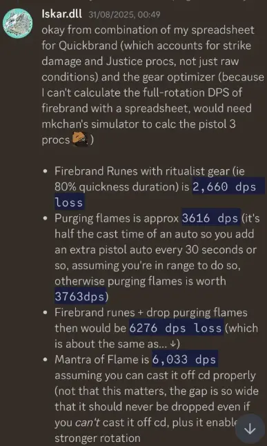

[Return to Home](../index.html){: .btn } [Return to Overview](./overview.html){: .btn } [Mechanical Reference](./mechanics.html){: .btn } [Strategy Guide](./strategy.html){: .btn }

# Legendary Ura Frequently Asked Questions

## Ura Attacks and how to deal with them

### How, who, where to kite Ura jumps in p1?

Ura targets the furthest player within 1500 range (that’s the max range of her abilities). So in order to kite, you just need to be the furthest away. It’s best if all healers (Chrono, Scourge, DE) are aware of how and where to kite, so they can easily all kite for some redundancy and know how to react if they are out of place. The path where you want Ura to jump is roughly just following the Toxic Geysers, like shown below (The numbers with the white background next to the black arrows is the order of the jumps; 1, 2, 3, …; you can see that you essentially kite Ura back and forth). Importantly though, you want to kite such that Ura does not jump into Toxic Geysers, because that will give her boons; you want to be close to the Toxic Geysers, but outside of the boon range (Note: boons from Toxic Geysers are only given in the initial radius of Toxic Geysers and not in the extended radius when they grow).

Useful note: If you are in a situation where you are doing a Toxic Geyser and you know Ura will jump soon, but you are in a bad spot, then you can try to quickly either move close to Ura so the other healers bait her properly, or move out of her 1500 range so you aren’t targeted.

Important note for the picture: depending on dps you might want to bait slightly differently and not exactly like shown. You can just follow the general principles of: 1) follow Toxics, 2) make sure to not make her jump into toxics, 3) after the last jump, stand southwest of Ura to make her face that way (more info on that below).

---

### How, when and why to CC Ura correctly?

Ura builds up a stacking damage reduction debuff, which gets removed when you CC her, while also giving her a stack of Titanic Resistance, which reduces the CC amount of skills. This means that you want to CC Ura whenever she gets to 5-6 stacks roughly, in order to keep the damage reduction low on average, while also not getting overwhelmed by high Titanic Resistance stacks. Whenever Ura is CCd, her attack will be interrupted and she will start casting the next attack (think about how you can weaponstow and immediately cast another ability, also cancelling aftercasts).

Ura’s attacks are on a priority list, have casttimes, aftercasts and cooldowns. She will go down her priority list and cast the next skill that is available (if a target is in range). If you CC at bad times, you remove cast+aftercast from a skill, which will cause Ura to run out of attacks and then use Propel (the jump). That’s why we want to CC at the end of aftercasts, in order to minimise the chances of Ura jumping away.

The following table contains some rough numbers, but they are likely not 100% correct; but just to give you a rough idea:

|               | priority | cd | cast | aftercast |
| --            | -- | --   | -- | -- |
| Bubble        | 1  | ~25s | 5s | ~1.5s |
| Titanspawn    | 2  | ~30s | 5s | ~2s |
| Sulfuric      | 3  | ~20s | 5s | ~4s |
| Arena         | 4  | ~15s | 7s | ~5s |
| Propel (jump) | 5  | ~12s | -  | - |

Best CC Timings (gifs from Elise):

1)  Arena: After her hands are down. Roughly 3 seconds time window after hands are down.

2) Titanspawner, after she is in the air. Roughly 4-5 seconds time window after she is in the air.

3) Sulfuric: Once the sulfuric indicators starts, which is roughly when she has stretched her arm out front fully. About 2-3 seconds of a window.

---

### How, when and who to tank Ura?

Ura needs a tank from Phase 3 (40%) onward. The reason for this is that in Phase 2 she cannot use Propel (jump), but she can use it again in Phase 3 and 4. You need a tank for Ura such that Ura is able to cast attacks other than Propel. If no one is in front of her, she casts Propel, because all other attacks require a target in front of her (i.e. she goes down her priority list and if no target is available, goes to the next attack etc.. which brings her to the only attack that doesn’t require a target in front of her, which is Propel).

The tank can be any dps, or any player in general. There is no real “tanking mechanic” per se, like nothing to do with Toughness or anything, it’s just that Ura needs any player in front of her to cast abilities other than Propel.

The Line of Sight from Ura is roughly a 140° cone; see the shaded area below, so yes, the cone is decently wide and the tank just needs to stay within that cone.

---

### How to turn Ura on the correct side?

Turning Ura is a bit finnicky. She only turns when she casts Arena, or Sulfuric Geyser. For both casts she will turn toward a random target. This means that she actually can do a 180° turn to one of the Toxic Geyser kiters and in those situations it’s crucial for the tank to notice this and quickly run back into her cone of vision. You can use this to turn Ura by having everyone except the tank go to the side where you want Ura to turn, which gives you a high probability that she will turn once Arena/Sulfuric is used.

Other than that the los tank can try to slowly rotate Ura by standing on one side at the end of Ura’s cone of vision and rotate her in small steps.

---

### What gives Exposed?

When Sulfuric Acid ticks for 5 seconds, it will turn into Exposed. You get Sulfuric Acid from many different attacks: standing in Toxic/Sulfuric Geysers if you have too many Poison stacks, from Ura’s Acid spray attack (is used when she has no melee target), from the waves that get released from Sulfuric Geysers.

In order to prevent getting exposed, you need to condi cleanse Sulfuric Acid, but only one stack at a time can be cleansed. That’s why bringing extra cleanse on dps is so important, such that you have many different skills that cleanse the group in order to minimise Exposed.

---

### What are the worst and the best place to drop sulfuric?

Good places are the purple areas, so basically outside of the area that is covered with Toxic Geysers and additionally specifically not behind 1 and 2 (except for the ranged group if they are close there). The reason for this is that the purple areas below area reachable from the boss, but behind 1 and 2 is not reachable.

Additionally, within those areas, it’s better to drop Sulfurics between Geysers where NO double drops are happening. Example: 13+14 is always double dropped, so ideally don’t go between them. But 12 and 14, or 10 and 13 are not double drop, so it’s better to drop em between those. The absolute best area to drop them is behind 9, which can be seen from the image below, as it’s the shortest path from Ura to get behind Toxic Geysers.

[toxic-geyser-spawns](../images/ura/ura_sulfurics.webp)

---

### Is it worth stacking Sulfuric Geysers?

Yes, but they can very quickly kill you if you are not careful. Rule of thumb is that on a non-healer you can stack maximum 2 sulfurics (i.e. you run into only one existing and drop yours on top) and on a healer it depends if you have many cleanses or distort available. Chrono has it the easiest to stack them, because you can press Distort and drop stack em safely.

---

### What attacks to dodge?

Generally, dodge Titanspawn Geysers (the stomp/jump in the air from Ura) and Propel (jump) when she lands. Other than that you can jump, or dodge over the waves from Sulfuric Geysers. You can also double dodge out of the Arena with the right timing (or with Superspeed), if you don’t have a mobility skill and no Stab. You can dodge Sulfuric/Toxic Geyser AoEs to prevent the ticks, but this is not as important.

---

### Can you give stability to people in bubbles?

No, the people targeted by the mechanic get stability removed if they have it before and cannot receive it again during bubbles, until they're dispelled. This means that players in bubbles can get knocked by Fumarroller attacks, which can lead to displaced bubbles. The Bloodstone shard needs to be dropped under the bubble, so in such knocked cases immediately call out in voice that bubble got knocked and that the Bloodstone shard needs to be dropped again. The white indicator on the floor is wrong in those cases, because it only shows the initial bubble position, but does not get updated when knocked. But the dispel does only work if the Bloodstone shard is dropped underneath the bubble.

---

### How melee deal with bubbles in this these situations:

#### I have bubble same time as titan spawn – both strategy (whole group on titan, power on titan), what has priority

The Shard always MUST to go to the Titanspawn, this means that the bubbles also MUST go to the Titanspawn.

General rule of thumb is to always do bubbles next to the Titanspawn when both are up.

#### I have bubble same time as titan spawn and second bubble is tank

In this case they should call for a backup tank immediately and run to the Titanspawn. Usually there is always someone who can backup tank for a bit, like the dps from the ranged team, or one of the healers.

#### I have bubble but I am far running back from sulfuric

Just like the case above with the ranged being far away, call it out immediately with the direction and meet in the middle.

There is one specific possible scenario where you get Sulfuric > phase 40% to p3 > Sulfuric person gets bubble. This is very unlucky timing and it’s a difficult situation to solve. The second bubble has to run out to the Sulfuric person together with the melee who has the bloodstone shard (and the one who is supposed to pick up) in order to save them. Otherwise they will likely die and it’s a wipe.

## Ranged group, Toxic Geyser kiting

### Who should be double dropping?

All healers: Chrono, DE and Scourge generally. There is an edge case where the dps that helps the ranged team also has to double drop, which can happen in the p2 to p3 transition if Toxic Geyser 5, or 6 spawns. In that case the dps has to double drop 8 and 9, but otherwise only the healers double drop.

---

### What toxics are double drops?

Essentially almost all of them. Please refer to a ranged rotation sheet for more information.

- Narra/NA Pug: https://docs.google.com/spreadsheets/d/e/2PACX-1vTRRf8AogRxhW1trZYtEtOPlQzA5WaZjZD64s90_IuGrxyWGjgwLCo3yBQRCAytN8VGu6gALfMAw9V8/pubhtml?gid=591640946&single=true
- EU Pug: https://docs.google.com/spreadsheets/d/e/2PACX-1vQttaDhjhxuvL_VH61ieYoJSYwn2odinF7puAqlxfgMd397TE4ifA3-htNj8iXWBRF15qFkR9vDSxA9/pubhtml?gid=1491958775&single=true
- Heal only (requires higher dps): https://docs.google.com/spreadsheets/d/18a4OXN5U8gqNg8eI7LLdyj6YZwHlVMm8bcH1rhdfXps/edit?gid=969431177#gid=969431177

---

### What toxic should be done in p4?

Explained already. P4 up to 14+ 8 and 11 if you get them.

---

### Are there differences in kiting in p3 and p4?

Mechanically speaking, generally no, but exceptions apply for the last few Toxic Geysers of Phase 4. So once you hit p4, you want to continue as usual with the Toxic Geysers. Toward the end when you only have Toxic Geyser 12, 13 and 14 left however, you don’t need to do them immediately, because at that point you aren’t doing all of them anymore. So you can take your time and do those whenever it is a good time. That’s generally when there is no important mechanic happening, like CCing the boss, or healing needed. After 14, the next Toxic Geyser that becomes relevant is 8 and then 11. If you have high enough dps, those won’t matter, but if they do, have your Chrono and if needed someone else prepared to immediately CC 8 when it spawns (for timing, look when 6 and then 7 spawns, so you know pretty precisely when 8 will spawn). Depending on Ura’s HP, either she will die very soon and you can ignore 8 after CCing, or you wanna drop a shard there (e.g. by using Scourge Sandswell to quickly get there and back again). If the dps is low enough to where you get 11, just immediately drop the shard (and pick it up again) and kill it with dps, since the squad should stack on that spot usually. If not stacking there, then the Chrono and if needed more should immediately CC 11.

---

### What is the advantage/disadvantage of having a DPS help the ranged group?

Having dps help makes the ranged rotation easier to deal with, because of the limiting factor which is the Bloodstone Saturation debuff from dropping the Bloodstone Shard. The disadvantage is just that for the dps it becomes more easy and safe if they have a blink skill, which limits the dps options a bit. But it’s not too bad.

Playing with 3 heal ranged only is harder to execute. The only advantage there is just that you can have 2 tanks instead of 1.

---

### How to deal with bubbles, sulfuric and cage when kiting/double dropping?

- Bubbles: Quick reactions, depending on the situation you might want to call out that the Toxic Geyser person frees you on the next Toxic Geyser, or that you run back to the group.
- Sulfuric: Always has high priority and needs to be placed away well. If you are supposed to do a double drop and you just dropped the shard and then received Sulfuric, just leave the shard on the ground, place the sulfuric, and tell the group that the shard will tick two, or three times so they can play safe and heal accordingly.
- Cage/Arena/Donut: Just place it in a way to not overlap any Toxics that you wanna do, while also moving away from melee range such that the squad can still move around the boss. The reason for the former is that the Arena reflects projectiles, which means the CC DE cannot CC, because Spear 4 (the CC skill) is a projectile. There are cases where e.g. the DE has already CCd one Toxic and you are supposed to double drop and get the arena. In those cases you can just go to the Toxic, drop the shard, place the arena there, pick up and move to the second Toxic. This is fine if and only if the first Toxic has been CCd already, cause then the projectile reflects don’t matter (and you can simply outheal a few ticks on yourself from being inside the arena).

---

### How to deal with different situations, how ranged group deals with bubbles in the following:

#### I have a shard that I am supposed to drop, but I just got bubble

First of all, if you hold the shard, you are immune to bubble and you also don’t get targeted. If you just dropped a shard, then get a bubble, but you are supposed to double drop, then you can just wait 2 seconds and then pick up the shard again to immune the bubble and just outheal the tick from it. Drop it once you the bubble is over (and you are on the next Toxic.

If you are Supposed to pick it up, but your buddy has not dropped it yet, you can call that they should free you on top of a Toxic Geyser where they need to drop the shard. So they just do the Toxic Geyser as usual and additionally free you on the Toxic.

#### I have a shard that I just dropped but I just got bubble and group is far

Immediately call out that bubble is far away (and the direction if possible) and then use your movement skills if you have any available. In principle, the 2 bubbles should meet in the middle if both are far away from each other.

#### I have a shard that I am supposed to drop but another range near me have a bubble

If you have the shard and a range buddy next to you has bubble, then just free them when you drop the Toxic Geyser. Depending on the situation, you may have to just wait a second or 2 longer until they are bubbled and only then can you drop. Just spam your healing skills on top of yourself to heal against the incoming damage from the Bloodstone Shard (in case you already have one stack).

## Phasing and related issues

### What is the issue with CCing around 40%? 

On 40%, Ura transitions from Phase 2 to Phase 3. This causes her to interrupt herself. Similar to bad CC timing, this can lead to an unlucky self-interrupt timing that can cause a jump. There is not really a whole lot that you can do about that, because controlling dps to phase at a good time is very hard. However, what is good to do is to not CC her shortly before, or after, because if you do, that’s two CCs in a short time (once from the squad, once from her self-interrupt), which can increase the chance of her running out of attacks to use and then consequently use Propel (the jump).

---

### What are the biggest issues while phasing?

- P2: nothing specifically, except if you have low dps, then Toxic Geyser 12, 13, 14 can be an issue (see next question below).
- P3: Ura will self-interrupt and the Toxic Geyser timer instantly resets to 0 and Toxic 7 will spawn (this means it’s a bit more hectic for the ranged team). Additionally, Ura will immediately cast Bubbles/friends as the first skill in P3. This is usually the most difficult transition, because it starts from being very chill in p2 to suddenly being very hectic with lots of mechanics.
- P4: self-interrupt, but otherwise nothing in particular. The self-interrupt is less of an issue, because Ura will also spend a few seconds in a phasing animation.

---

### 1st phasing 70% - How to deal with 10. and 11. (12.) And 8. Toxic spawn? 

Depends on strategy, please refer to a ranged rotation spreadsheet, or ask for a specific strat.

But generally if you have low dps and you get 13 + 14, you might even just want to /gg and practice p1, since your whole rotation will be thrown off. If just 12 and 13 spawn extra, the CC DE can CC those to reset the aoe until they are done normally during p2. Realistically this should only happen very early into 0 exp prog. Even after a couple of pulls you should phase fast enough to get max 12. If not, you might have a dps issue in general and won’t be able to kill Ura within the enrage timer (i.e. this is also a nice self-squad check to see if the overall dps is good enough – just remember specifically for this that depending on the dps, you might have some extra modifiers at high/low hp percentages; but it works as rule of thumb).

---

### 2nd phasing 40% - How to deal with 7. And 8. Toxic spawn?

Depends on strategy; please refer to a ranged rotation spreadsheet, or ask for a specific strat.

---

### Is there any issue while phasing p4?

Phase 4 transition also self-interrupts Ura, so it can happen to also cause a jump if she self-interrupts at a very bad timing. However, due to the phase 4 transition also causing an animation for Ura, it’s a little bit less likely than for the p2>p3 transition.

## Titanspawner, Fumarollers, Ventshots

### How does Titanspawner and Ventshot work?

Titanspawner Geysers are created every time Ura uses her Create Titanspawn ability (Orange Circle around her and jump/stomp in the air). The Titanspawners in p2/p3 are the same as in p4, but while p2/p3 is active, they will spawn Champion Fumarollers, while in p4 they will spawn Legendary Ventshots. Additionally, when Ura hits 1% and heals, she will always spawn an additional Titanspawn Geyser independent of her Create Titanspawn Geyser skill.

More details here: https://silverhalf.github.io/mount-balrior/ura/mechanics.html#titanspawn-geysers

---

### When is a good time to stop killing Titanspawners?
It depends on the squad. Stopping to kill Titanspawn Geysers during p3 can be very dicey, because multiple Fumarollers alive can very quickly down and wipe you. If you play with 2x Heal Chronos, you can outheal/stab that and stop killing Titanspawners roughly after 15%. This will reduce the number of Ventshots you get down to ~2 during p4, which means you will likely not wipe if projectile block fails.
However, if you play with only one Chrono and one hybrid Scourge, then it’s not recommended to stop killing Titanspawn Geysers in p3. In that case just stop doing them in p4, except if the first Titanspawn Geyser in p4 is directly next to the squad. In that case you can quickly kill it. Ignore all other Titanspawners after the first in p4.

---

### What is the biggest issue when letting Fumarollers run around and how to deal with it?

The dangerous part is that Fuma attacks hit quite hard and that combined with Stars/Snowflakes can quickly down and kill you. The longer they live, the higher the chance that they spawn another star under the boss. That’s why you generally want to kill them as quickly as possible, like so: 1) Fuma spawns on titanspawner, 2) bait the Fuma to the boss (standing 90°/tangential at the boss), and 3) after Fuma has charged, move on top of it and cleave it down asap.

The only exception to killing them immediately is for some specific strategies in which you want to keep Fumas alive for as long as possible at the start of p4, in order to get less Ventshots (this works because Ventshots, Titanspawners and Fumarollers have an entity cap, such that when too many are on the field, no new entities will spawn). But this is quite dangerous, because multiple Fumas alive can kill you quickly. The cap is currently believed to be at ~6 for Ventshots, which means that if you have 6 entities from Titanspawners + Fumarollers alive, that no Ventshot will spawn.

For kiting, you can watch the Fumas and bait them into the stack before running out for Toxic Geysers; the baiting part works, because Fumas target the highest Toughness player with their charge attack that is in their cone of vision. This makes it relatively easy to bait them as healers to the squad; in that way they also won’t bother you at range. Sometimes there is no time to wait for this, in that case just avoid as much damage as possible, by e.g. using Dodge/Distort and healing yourself in case you take damage.

Generally, you want the Fumarollers to charge as quickly and as close as possible to Ura and then you want to immediately cleave them down, before they cast a star/snowflake on the boss. If they do cast one, just move out of it as quickly as possible. If someone downs, everyone needs to immediately ress, because downing on top of a star/snowflake can very quickly kill you.

Fumarollers don’t need to be CCd. They can be CCd just from passive AoE CC, but there is no specific need to pay special attention to it.

The melee team who kills the Titanspawner should always have some stability (e.g. from the qfb) when they go kill the Titanspawner, such that they don’t immediately get knocked. Once the Fumaroller is on the group, also make sure to use Stability. The star attack knocks back three times, while charge, roll and headbut knocks once each.

---

### How to deal with Venshots?

After having 2+ Ventshots, keep projectile block up on the group permanently and try to keep up Stab as well. Ventshots can kill you either with ranged attacks when projectile block is down, or with melee attacks (that also knock you) when they are close to the squad. 

As Chrono with Stab Mantra and Precog, you can this rotation for permanent Stability from Schwifty: https://www.youtube.com/watch?v=ZNt3AbNwiuw

---

### There are multiple strategies for Titanspawners: What is an advantage and disadvantage of power/all dps taking care of titan spawn?

The reason why Power dps on Titanspawner has an added advantage is because Titanspawners have low armor and hence take extra Power damage and combined with no ramp-up which is typical for most power builds, they can pretty quickly, which mitigates the possibility of having a second Fumaroller spawning. Burn-based condition builds are also pretty strong due to their relatively short ramp-up. Note that Conditions can be stacked on the Titanspawner Geyser while it’s still invulnerable.

All dps (and QFBs) on the Titanspawner has the advantage that the group stays together (except for the los tank), but it has the disadvantage that when the los tank gets bubble, there is a chance that no backup tank is available which means the tank cannot move to the Titanspawner quickly. One way to circumvent this is by having only the melee group who do the Bloodstone Shard rotation be on the Titanspawner, which means you will always have multiple people los tanking and there is no need to call for a backup tank if someone gets a mechanic. The downside for this is that the squad is split into two, so if someone starts downing for whatever reason, ressing takes longer.

Generally either way works good enough and you can pick on personal preference and/or if you have Power dps available or not.

---

### In case of power dps taking care of Titan - How many people and what class should be sent there?

For simplicity it’s best to send the full melee shard rotation group there, because then you will always have the players who need to drop and pick the Bloodstone Shard on the group. This should be a QFB and 3x dps. 1x Power dps and 2x Condi dps, or having at least 2x Burn-based Condi dps (Weaver, Willbender, Firebrand) is usually enough to make sure the 4 players from the melee group can kill the Titanspawner comfortably in time.

## Builds, Squad compositions and more

### What are available builds?

#### CC Deadeye

For the most part there is only one specific build, but some small variations are possible. Depending if you are tunneling or not, you can play with/without weapon swap.

NOTE: Depending on if you need to provide Fury/Might, or not, you can choose between Relic of the Midnight King (for Fury/Might), or Relic of Speed (permanent Superspeed if boons aren’t needed).

- Default build with weapon swap (Quick Pockets): https://gw2skills.net/editor/?PagEQjWWADkJx2Ym4xad92A-DyIY1oivMapCCLFc82gK0HUB-e
- Tunnel variation without weapon swap (Sleight of Hand; Note that you can also run a different stacking Sigil, like Perception for more Precision if critting is an issue for Init regen): https://gw2skills.net/editor/?PagEQjWWADkJx2Ym4xad92A-DyIY1oi/QaRJEmEomRgjuKoC9BVA-e

---

#### Heal Chronomancer

The last util skill is flexible and can be taken based on personal preference, or to fill the gap where your squad is likely needing it the most:
- Blink is nice for early prog to cover up mistakes and when being late with mechanics, which can help your group to prog faster early on. It is also useful to blink and bait Ura into a specific direction when CCing at the wrong time (but that requires fast anticipatory reactions).
- Feedback and the trait Medic’s Feedback give you some ranged ress power and allow you to backup projectile blocks in p4.
- A CC skill (Technobabble, Signet of Domination, Well of Senility) can be useful to quickly solo CC Toxic Geysers from range (otherwise solo CC with Moa + Spear 5; or with Rifle4 + Moa, but the latter requires very good timing). This can be useful when the CC DE is not that experienced yet, and in general to support CC more (both Toxics and Boss).
- Well of Precognition is in the default build (below), but if you are paired with a Quick Firebrand who has Stab and is comfortable with it, then you could also drop Well of Precognition and use two of the utilities mentioned above.

Note that there have been plenty of kills with all different kind of utility variations and the different utility skills can fill different needs. Hence, there is not a clear go to that is the best for all situations.

Build (if tunneling, just swap Concentration to Sigil of Life on the Spear): https://gw2skills.net/editor/?PigEQiWmBzCrhNiH9karD-DSRYjR1VPSIFlRLpQ6VluvGCSo83S7bWQFA-e

---

#### Celestial Hybrid Scourge

There are a few different build options to run as Scourge. This mostly depends what your group needs, or is comfortable with, in terms of balancing offensive vs defensive.

- Offensive: Curses + Soul Reaping; advantage is you have low cd on CPC, which means 1x scg + 1x qfb can take care of reflect and the rest is additional backup and higher dps. sword offhand for extra movement; downsides is less healing and no Stability, so when running this you want lots of Stability from your Quick Firebrand: https://gw2skills.net/editor/?PSAFo8FbYZGsPGILiNiF711rH-DyIY1on/M6SKkrKQh/KGSQsHeNB4BDUB-e
- Middle ground: play the offensive one with Trail of Anguish instead of Blood is Power, if you want to have a Stability skill available.
- Defensive: Blood Magic instead of Curses; has more healing and more Stability/boons; downside is that not running Curses means longer CPC cd, which means you need to account for either a more difficult projectile block rotation that involves more people, or better you need at least 2 Firebrands that can do the projectile block rotation and Scourge is just a backup with CPC – Note that one qfb with Wall of Reflect + F3-3 and then a second Firebrand with just F3-3 is enough for the basic projectile block rotation: https://gw2skills.net/editor/?PSwAo+ZlZwiYfsH2ImqXXveA-DyIY1oj/U6SCkqIIXFQ6CBD/rYIBxe41AiHMQFA-e

---

####  Condition Quickness Firebrand

There are a few variations possible that mostly depends on what your squad needs (the first 3 builds are around ~2.7k to 3.7k lower lower than the SC bench; the last build is around ~6.3k lower; see screenshot below):
- Wall of Reflection (Trapper runes; ~3.7k dps loss); is needed once per squad and should call the Projectile block rotation with Wall + F3-3 + fill – where the fill is either Scourge CPC, or another Firebrand F3-3: https://gw2skills.net/editor/?PWyAo+rlRExe6ZQBttkGZkW0WbPTA-DSJYyRL/hkjkKBFQHCBF+r4IBxW41AiPNQFA-e
- Some Stability FB; Elite Mantra is recommended due to higher dps:
    - Elite Stab Mantra (Firebrand runes, but still purging flames; ~2.7k dps loss); trades the SYG from the build above for Elite Mantra; loses the Superspeed from FMW, but gains the condi cleanse from PF and a group stunbreak on Elite Mantra: https://gw2skills.net/editor/?PWyAo+rlRExe6ZQBtukmZkW0WbPTA-DSJYyRL/hkjkKBFQHCBx+r4IBxW41AiPNQFA-e
    - FMW + Stand Your Ground (Trapper runes; ~3.7k dps loss); has the advantage of still having FMW for Superspeed to quickly run to the Titanspawners; use SYG for Titanspawn and F3-5 for Arena: https://gw2skills.net/editor/?PWyAo+rlRExe6ZQBNskGZkW0WbPTA-DSJYyRL/hkjkKBFQHCBF+r4IBxW41AiPNQFA-e
- Stab bot: Elite Stab Mantra + Stand Your Ground (Firebrand runes; ~6.3k dps loss); trades even more dps for more Stability, which can be done if people in your sub get knocked around a lot (e.g. in the offensive Scourge subgroup when the Scourge has no Stability): https://gw2skills.net/editor/?PWyAo+rlRExe6ZQBNskmZkW0WbPTA-DSJYyRL/hkjkKBFQHCBx+r4IBxW41AiPNQFA-e

---

#### DPS builds

DPS builds always depend on the current Meta, so it’s best to just look at the build section on the Void Lounge discord, but a current snapshot (August 2026) is: Condi Weaver, Willbender, Daredevil, Mechanist, Firebrand & Power Scrapper, Berserker, Vindicator: https://discord.com/channels/1121166847266537562/1332712612877570089/1360699762143137963

---

#### What are important skills DPS should take?

Depends on the spec, but general condition cleanse, stability and movement skills are nice if they don’t cost that much dps and if you are not struggling with dps. Examples are:
- Willbender: Virtues traitline, middle column, take the middle trait => lots of additional condi cleanse with F2 at a very minor dps loss
- Mechanist: Healing Turret for aoe condi cleanse
- Weaver: lightning flash for mobility instead of fire elemental (generally it’s always worth to have good sulfuric placements over some dps)
- Scrapper: can take the Stab on Function trait in the first column of the Scrapper traitline, but note that you have less party Superspeed then

---

### What are the best ways to CC on the support classes?

- For CC DE, check out this amazing guide from Chupa: https://docs.google.com/presentation/d/19xXTt8iPkvoDVG_I_TEQOd_Xyw4R6ZdB90SOWWzzh4M/edit?slide=id.p#slide=id.p
- Chrono: Moa (+ any other skill from weapon or util you might have) and depending on the situation also don’t be afraid to use those within CS if you anticipate needing CC again soon after.
- Scourge: Golem
- QFB: Pistol 5 (but generally don’t hold it) and F1-3 (is relatively little CC though).

---

### Who is the main provider of stability?

It depends on the squad composition, how much Stability you are running and on the situation; so generally there is not one main Stability provider. But the Chrono has Stab Mantra and should always pay attention to mechanics and use a charge whenever there is a mechanic (Titanspawner, Arena, Fumaroller) and when running Precognition can also drop those onto the group at the Titanspawner, or on the squad when a Fumaroller is alive. Scourge and Qfb have varying amounts depending on the build, but should similarly use them whenever needed and they are in range (e.g. Stand Your Ground when the group runs to the Titanspawner and F3-5/Elite Mantra for Arena and Fumaroller attacks. So summarizing, whoever has Stability should always use it for mechanics if they are at the squad, or wherever the mechanic is happening (e.g. while the Chrono has obviously the most amount of Stability if they run Precog, this doesn’t help when they are on ranged shard duty away from the squad, at which point the Qfb needs to provide the Stability).

---

### What are possible compositions?

The two main compositions are relatively similar and only come down to Scourge, or Chrono as second healer and what specific build the QFB runs.

Scourge comp: higher dps, but less healing/stability

| CC DE       | Hybrid Scourge* | QFB (Stab**) | dps (los tank) | dps (ranged bu) |
| -- | -- | -- | -- | -- |
| Heal Chrono | QFB (Wall, marker) | dps | dps | dps |

*If defensive, then the two QFBs should do the basic projectile block rotation, while having the CPC from Scourge as backup whenever needed.
**If confident, can also drop the SYG and still run PF, especially if the Hybrid Scourge plays the defensive version with Trail + Staff for Stability.

Double Chrono comp: higher dps, but less healing/stability

| CC DE       | Heal Chrono | QFB (Wall, marker) | dps (los tank) | dps (ranged bu) |
| -- | -- | -- | -- | -- |
| Heal Chrono | QFB*     | dps | dps | dps |

*The PF QFB can either still run Elite Mantra with Purging Flames to have some more Stability, or fully offensive with the default SC build (only F3-5 then for Stability).

The dps can in principle be any dps of the builds mentioned above in the dps build section. One notable distinction is that if you run a full Condi comp, everyone in Sub2 (QFB + 3 dps) should go kill the Titanspawner Geyser, while with Power dps, only 2x Power dps are required to go there to kill it in time

---

### How to assign dps for melee rotations and Titanspawners?

Titanspawner and melee rotation: The melee shard rotation consists of 4 people (e.g. everyone except the Healer in Sub2 => QFB + 3 dps) and hence all of them can go to the Titanspawn Geyser, such that you always have the melee Bloodstone Shard person there and the Stability from the QFB for the Fumaroller (F3-5/SYG/Stab Mantra, depending on the build you run). Having at least one Power dps in this group helps with killing the Titanspawn Geyser more quickly. If you run a full Condi composition and have problems killing it in time, then you can have the QFB from Sub1 and the dps (ranged bu) also go and dps the Titanspawner (which leaves only the los tank at the boss).

### Is it possible to have a different quick dps?

Other quickness builds are technically possible to run if there is no need for specific skills (e.g. projectile block, Stability, ..), but QFB is generally the best choice due to high dps combined with the massive amount of utility it brings. If in doubt, just check your squad composition and make sure everything is covered.

## Glossary

Arena: Donut/Cage/Prison refers to Ura’s Steam Prison attack that shows up as a donut-shaped orange indicator around a player and spawns a circular boundary. After spawning, it can only be escped by having Stability, or via blinking over it. Inside, it ticks damage, applies Sulfuric Acid and reflects all projectiles.

Bubbles: Bubbles, or the “Friends” mechanic refers to Ura’s Pressure Blast attack that applies 2 small circle indicators to random players (who don’t hold a Bloodstone Shard at the time of casting), which will trap those players and anyone else caught in the explosion radius in floating bubbles that slowly rise.

Titanspawner: Refers to the Titanspawn Geyser that appears when Ura casts “Create Titanspawn Geyser”. Spawns Fumarollers, or Ventshots depending on the phase.

Fumas/Fumarollers: Refer to the Champion Fumaroller adds that spawn from Titanspawn Geysers during phase 2 and phase 3.

Ventshots: Refer to the Legendary Ventshot enemies that spawn from Titanspawn Geysers during phase 4.

[Return to Home](../index.html){: .btn } [Return to Overview](overview.html){: .btn } [Return to Top](#ura-faq){: .btn .fixed}
{: .center}
