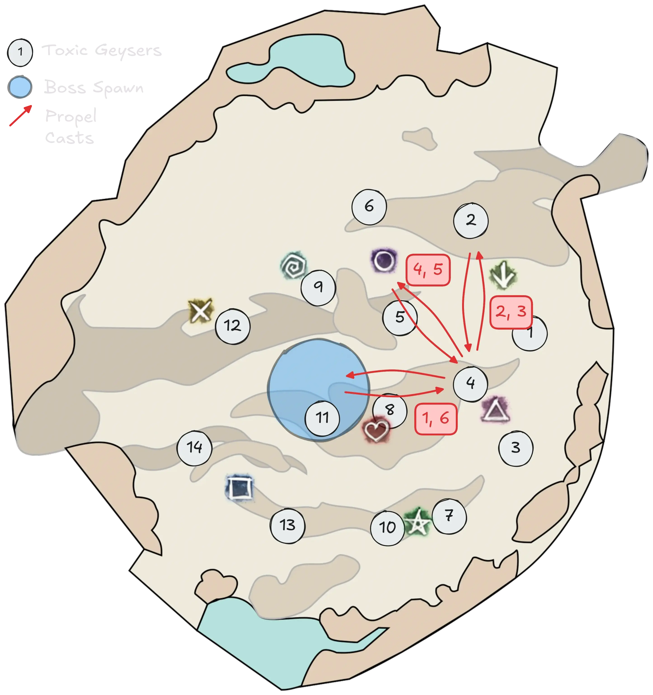
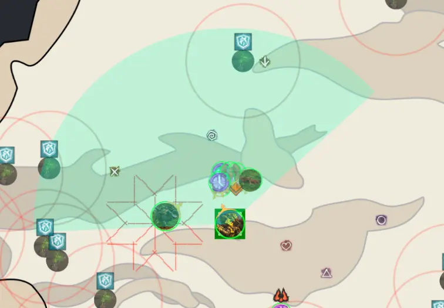
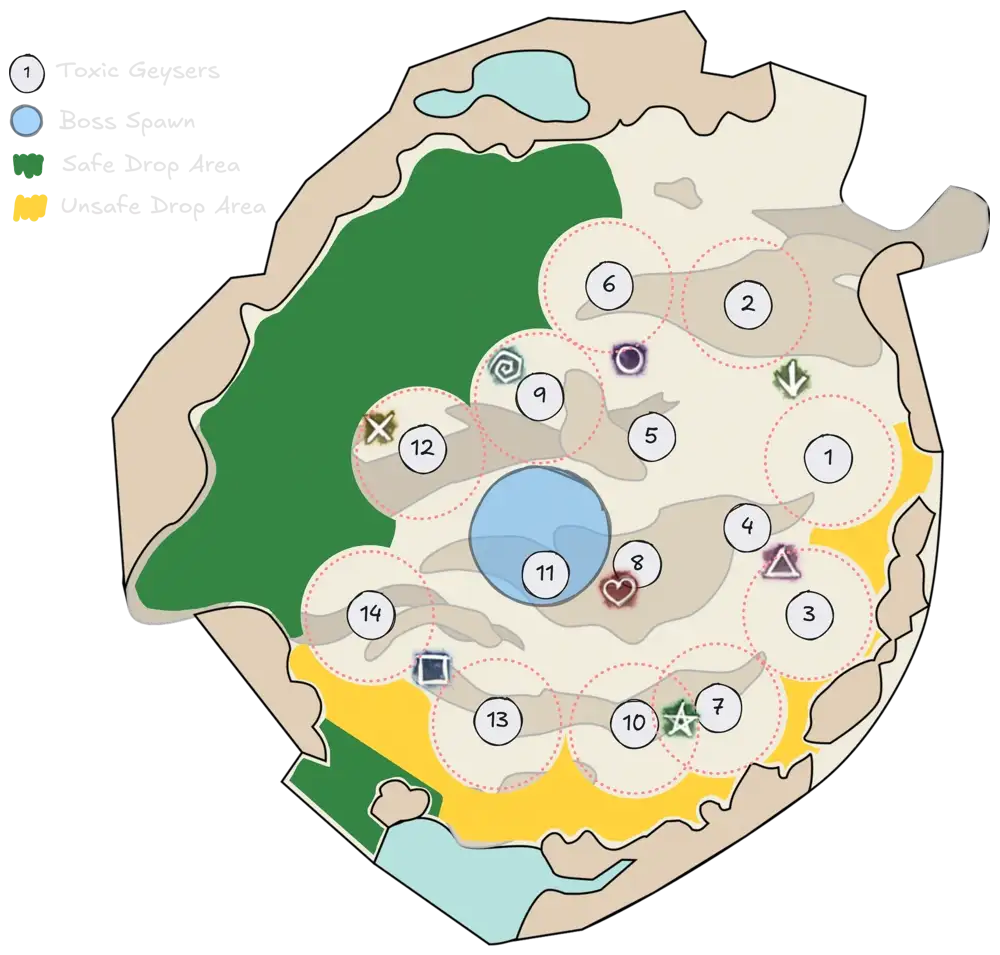

[Return to Home](../index.html){: .btn } [Return to Overview](./overview.html){: .btn .uralm } [Strategy Guide](./strategy.html){: .btn .uralm}

# Legendary Ura - FAQ

Based on the  [original document](https://docs.google.com/document/d/e/2PACX-1vTiV_esFGeLKwltjn5AC68p7TNm66DjCQbbaF5gOWx6cb_h4l7zfT0f8fwNesRXs6WtMHUsxmFQMsCy/pub) made with contributions from Minas, Spencer, Sleider, Elise and many more.

This page contains a set of frequently asked questions regarding the Legendary Ura encounter. These are grouped into the following sections:

1. [Ura's Attacks and How to Deal with Them](#1-uras-attacks-and-how-to-deal-with-them)
2. [Ranged Group and Toxic Geysers](#2-ranged-group-and-toxic-geysers)
3. [Phasing and Related Issues](#3-phasing-and-related-issues)
4. [Titanspawners, Fumarollers, Ventshots](#4-titanspawners-fumarollers-ventshots)
5. [Builds, Composition and More](#5-builds-squad-compositions-and-more)
6. [Glossary](#glossary)

## 1. Ura's Attacks and how to deal with them

---

1.1 - How does kiting Ura work in phase 1?

Ura targets the furthest player within 1500 range, so in order to kite, you just need to be the furthest away. It’s best if everyone in the ranged group is aware of how and where to kite, so they can provide some redundancy and know how to react if they are out of place.

Ura's jumps should roughly follow the [Toxic Geysers], as shown below (The numbers with the white background next to the black arrows are the order of the jumps; 1, 2, 3, …; you can see that you essentially kite Ura back and forth). Importantly though, you want to kite so that Ura does not jump *into* Toxic Geysers, as that will give her boons. You want her to be close to the geysers, but outside of the boon range.

{: .note}
Boons from Toxic Geysers are only given in the initial radius and not in the extended radius when they grow.

If you are in a situation where you are doing a Toxic Geyser in a bad position and you know Ura will jump soon, you can try to quickly move closer to Ura so the other healers can bait her properly, or move out of her 1500 range so you aren’t targeted.

Depending on your damage and whether Ura gets CC'd, you might want to bait slightly differently and not exactly like shown. You can just follow the general principles of: 
1) Follow Toxics.
2) Make sure to not make her jump into Toxics.
3) After the last jump, stand southwest of Ura to make her face that way (more info on that below).

1.2 - How, when and why to CC Ura correctly?

Ura builds up  [Rising Pressure], which gets removed when you CC her. This also gives her a stack of  [Titanic Resistance], which reduces incoming CC damage. This means that you want to CC Ura whenever she gets to roughly 5-6 stacks, in order to keep the average damage reduction low while also not getting overwhelmed by high  [Titanic Resistance] stacks.

Whenever Ura is CCd, her attack will be interrupted and she will immediately start casting the next attack. Ura’s attacks are on a priority list: she will go down her priority list and cast the next skill that is available (if a target is in range). If you CC at the wrong time, you can remove cast and aftercast from a skill, which will cause Ura to run out of attacks and then use [Propel], which would normally be skipped due to having a low priority. That’s why we want to CC at the end of aftercasts, in order to minimize the chances of Ura jumping away. For more information see [preventing Propel](../ura/mechanics.html#preventing-propel).

The best CC timings are:

[Steam Prison] - After her hands are down. Roughly 3 seconds time window after hands are down.

[Create Titanspawn Geyser] - after she is in the air. Roughly 4-5 seconds time window after she is in the air.

[Sulfuric Geyser] - Once the indicators start, which is roughly when she has stretched her arm out front fully. About 2-3 seconds of a window.

Gifs by Elise

1.3 - How, when and who tanks Ura?

Ura needs a tank from Phase 3 (40%) onward. The reason for this is to provide a target for her mechanics: if no one is in front of her, she will cast [Propel], because all other attacks require line of sight (i.e. she goes down her priority list and if no target is available, goes to the next attack etc.. which brings her to the only attack that doesn’t require a target in front of her, which is [Propel]). For more information see [preventing Propel](../ura/mechanics.html#preventing-propel).

The tank can be any DPS, or any player in general. There is no real “tanking mechanic” per se, nothing to do with Toughness.

The line of sight from Ura is roughly a 140° cone: see the shaded area below. The cone is decently wide and the tank just needs to stay within that cone. See [tanking Ura](../ura/strategy.html#tanking-ura) for more information.

1.4 - How do I turn Ura to the correct side?

Turning Ura is a bit finnicky. She only turns when she casts [Steam Prison] or [Sulfuric Geyser]. For both casts she will turn toward a random target and follow them for the duration of the cast. This means that she actually can spin 180° to one of the [Toxic Geyser] group: in these situations it’s crucial for the tank to notice this and quickly run back into her cone of vision.

You can use this to turn Ura by having everyone except the tank go to the side where you want Ura to turn, which gives you a high probability that she will turn once Arena/Sulfuric is used.

Other than that, the tank can try to slowly rotate Ura by standing on one side at the end of Ura’s cone of vision and rotate her in small steps.

1.5 - How come I'm getting  Exposed?

When  [Sulfuric Acid] ticks for 5 seconds, it will turn into  [Exposed]. You can get  [Sulfuric Acid] from many different attacks: standing in [Toxic Geysers] and [Sulfuric Geysers] for too long, from Ura’s [Acid Spray] (used when she has no melee target), and from the waves that get released from [Sulfuric Geysers] when they spawn.

In order to prevent getting exposed, you need to cleanse  [Sulfuric Acid], which can only be done one stack at a time. That’s why bringing extra cleanse is important, so that you have many different skills cleansing the group.

1.6 - Where do I drop Sulfurics?

Good places are the green areas highlighted by the image below, which correspond with the part of the arena where [Toxic Geysers] do not spawn. Additionally, avoid attempting to place geysers behind *#1* and *#2*, as this area is difficult to reach from the boss in time, unless you are in the ranged group and doing either of those geysers.

Within these regions, it’s better to drop Sulfurics between Geysers where NO double drops are happening. Example: *#13* and *#14* are always double dropped, so ideally don’t go between them, but *#12* and *#14*, or *#10* and *#13* are not, so it’s better to drop between those. The absolute best area to drop them is behind *#9*, which, as can be seen from the image, is the shortest path from Ura.

1.7 - Is it worth stacking Sulfuric Geysers?

Yes, but they can very quickly kill you if you are not careful. Rule of thumb is that on a non-healer you can stack a maximum of two [Sulfuric Geysers] (i.e. you run into only one existing and drop yours on top) and on a healer it depends if you have many cleanses or defensive skills available.  [Mesmer] has it easiest, because you can press  [Distort] and ignore all incoming damage and conditions.

1.8 - What attacks should I dodge?

Generally, dodge [Create Titanspawn Geyser] (the stomp/jump in the air from Ura) and [Propel] (jump) when she lands. Try to sidestep or dodge the final cone of her [Autoattack Chain]. Other than these, you can jump, block or dodge the waves from [Sulfuric Geysers]. You can also double dodge out of the [Steam Prison] with the right timing (or with  [Superspeed]), if you don’t have a mobility skill and no  [Stability]. You can dodge [Sulfuric Geyser]/[Toxic Geyser] AoEs to prevent the damage ticks, but this is not as important.

1.9 - Can you give  Stability to people in bubbles?

No, the people targeted by the mechanic are stripped of  [Stability] if they have it beforehand, and cannot receive it again during bubbles, until they're  [Dispelled]. This means that players in bubbles can get knocked by [Champion Fumarollers], which can lead to displaced bubbles.

The white indicator on the floor is misleading in these situations, because it only shows the initial bubble position, and does not get updated when knocked, while  [Dispel] only works if casted underneath the bubble. In such cases immediately call out in voice that the shard needs to be dropped again.

1.10 - How do I deal with bubbles in this situation?

#### I have bubble at the same time as the Titanspawner!

If you are killing spawners, the [Bloodstone Shard] MUST go to the [Titanspawner]. This means that the bubbles must also go there. General rule of thumb is to always do bubbles next to the spawner when both are up.

#### I have bubble at the same time as the Titanspawner and the second bubble is tank!

In this case the tank should immediately call for a backup and run to the spawner. Usually there is always someone who can backup tank for a bit, often one of the healers.

#### I have bubble but I am running back from [Sulfuric Geyser]!

Just like the case above with the ranged being far away, call it out immediately with the direction and meet in the middle.

There is one specific possible scenario where you get Sulfuric into the 40% phase and the Sulfuric person gets the bubble. This is very unlucky timing and it’s a difficult situation to solve. The second bubble has to run out to the Sulfuric person together with the melee who has the bloodstone shard (and the one who is supposed to pick up) in order to save them. Otherwise they will likely die and it’s a wipe.

## 2. Ranged group and Toxic Geysers

---

2.1 - Who should be double dropping?

#### Solo CC
{: .no_toc}
Both healers and the solo CC generally. There is an edge case where the DPS that helps the ranged team also has to double drop, which can happen in the 40% transition if Toxic Geyser *#5* or *#6* spawns. In that case the DPS may have to double drop *#8* and *#9*, but this is an exception.

#### 4-man
All four support players must double drop.

2.2 - Which Toxic Geysers are double dropped?

Essentially almost all of them. Please check a [ranged rotation](strategy.html#shard-rotations) for more information.

2.3 - What Toxic Geysers should be done in the final phase?

All should be done up to *#14*. After that, everything else can be safely ignored, except for *#8* and *#11* if you get them. Please check a [ranged rotation](strategy.html#shard-rotations) for more information.

2.4 - Are there differences in doing Toxics in phase 3 and phase 4?

Not mechanically speaking, but exceptions apply for the last few [Toxic Geysers] of Phase 4. Toward the end when you only have geysers *#12*, *#13* and *#14* left, you don’t need to do them immediately since at that point you aren’t doing the rest. So you can take your time and do those whenever it is convenient, which is generally when your squad is healthy and there are no important mechanics happening (such as CCing the boss).

After *#14*, the next Toxic Geysers that become relevant are *#8* and then *#11*. If you have high enough damage, those won’t matter, but if they do, be prepared to immediately CC #8 when it spawns (you can estimate the timing by looking at when *#6* and *#7* spawn). Depending on Ura’s HP, either she will die very soon and you can ignore *#8* after CCing, or you want to drop a shard there. If damage is low enough to where you get *#11*, just immediately drop the shard (and pick it up again) and kill it with DPS, since the squad is usually stacking on that spot.

2.5 - Why is a DPS helping the ranged group in solo CC strategies?

Having a DPS help makes the ranged rotation easier to deal with. The limiting factor is the duration of the  [Bloodstone Saturation] debuff from using  [Dispel]. The disadvantage is that it is better to have a DPS with blink skill, which limits playable classes.

Playing with 3-heal ranged is harder to execute, as the duration of  [Bloodstone Saturation] makes it tighter. The advantage is slightly higher DPS on the boss.

2.6 - How do I deal with bubbles, sulfurics and cage when double dropping?

- [Pressure Blast] - Quick reactions, depending on the situation you might want to call out for the next person in the rotation to free you on the next Geyser, or that you'll run back to the group.
- [Sulfuric Geyser] - Always has higher priority and needs to be placed correctly. If you are supposed to do a double drop, and you just used  [Dispel] and then got targeted by the sulfuric, just leave the shard on the ground, place the geyser, and tell the group that the shard will tick two or three times so they can play safe and heal accordingly.
- [Steam Prison] - Place it so that it does not overlap any geysers you need to do, while also moving away from melee range such that the squad can still move around the boss. The arena reflects projectiles, which means that  [Distracting Throw] cannot hit. There are situations where one Toxic has already been CCd and you are supposed to double drop when you get the arena. In those cases you can just go to the Toxic,  [Dispel], place the arena there, pick up and move to the second Toxic. This is fine if and only if the first Toxic has been CCd already, cause then the projectile reflects don’t matter and you can simply out-heal the arena damage.

2.7 - I have a shard that I am supposed to drop, but I just got bubble!

First of all, while holding the [Bloodstone Shard], you are immune to [Pressure Blast] and you also can't get targeted by it. If you just  [Dispelled], then get a bubble, and you are supposed to double drop, then you can just wait 2 seconds and then pick up the shard again to ignore the bubble and just out-heal the tick from it.  [Dispel] again once the bubble is over and you are on the next Toxic.

If you are supposed to pick up the shard, but your buddy has not dropped it yet, you can call that they should free you on top of the geyser they need to  [Dispel].

2.8 - I dropped the shard, then got the bubble far from the group!

Immediately call out that bubble is far away (and the direction if possible) and then use your movement skills if you have any available. In principle, both bubbles should meet in the middle if they are far from each other.

2.1 - I have to  Dispel but another ranged player near me has a bubble!

If you are holding the [Bloodstone Shard] and a ranged buddy next to you has the bubble, then just free them when you  [Dispel] your geyser. Depending on the situation, you may have to wait a couple of seconds until they are bubbled, and only then should you drop. Remember to spam your healing skills on top of yourself to negate the incoming damage from  [Bloodstone Saturation] in case you already have a stack.

## 3. Phasing and related issues

---

3.1 - Why did Ura jump shortly after 40%?

At 40% of her HP, Ura transitions from Phase 2 to Phase 3. This interrupts her current skill cast, which similarly to bad CC timing, can lead to her using [Propel]. There isn't much you can do to prevent this, as controlling DPS to phase at a good time is very difficult. However, try not to CC her shortly before or after the transition, as two interrupts in a short interval can increase the chance of her running out of attacks to use and then consequently using [Propel]. See [preventing Propel](mechanics.html#preventing-propel) for more information.

3.2 - What are the biggest issues while phasing?

- **Phase 2** - nothing specifically, but if you have low dps, then [Toxic Geysers] #12, #13, #14 can be an issue.
- **Phase 3** - Ura will self-interrupt and the [Toxic Geyser] timer instantly resets, spawning #7 instantly and making things a bit more difficult for the ranged team. Additionally, Ura will immediately cast [Pressure Blast]. This is usually the most difficult transition, because it starts from being very chill in p2 to suddenly being very hectic with lots of mechanics.
- **Phase 4** - self-interrupt, but otherwise nothing in particular. The self-interrupt is less of an issue, because Ura will also spend a few seconds in the phasing animation.

3.3 - How do I deal with *#10*, *#11* (*#12*) and *#8* geysers at 70%?

Depends on strategy; please refer to a [ranged rotation](strategy.html#shard-rotations) or ask your commander.

But generally if you have low dps and you get *#13* and *#14*, you might even want to /gg and practice phase 1, since your whole rotation will be thrown off. If just *#12* and *#13* spawn extra, reset them with CC until they are done normally at some point in phase 2.

Realistically this should only happen very early into prog: even after a couple of pulls you should phase fast enough to not get *#13*. If not, you have a DPS issue which will prevent you from killing Ura within the enrage timer; as rule of thumb, this is also a nice check to see if the overall squad dps is enough.

3.4 - How do I deal with *#7* and *#8* geysers at 40%?

Depends on strategy; please refer to a [ranged rotation](strategy.html#shard-rotations) or ask your commander.

3.5 - Is there any issue while phasing into phase 4?

The Phase 4 transition also interrupts Ura's current cast, so it can also cause a jump if it happens with very bad timing. However, due to the transition also including an animation for Ura, it’s less likely than for the phase 3 transition. Check [preventing Propel](mechanics.html#preventing-propel) for more information.

## 4. Titanspawners, Fumarollers, Ventshots

---

4.1 - How do Titanspawners and Ventshots work?

[Titanspawn Geysers] are created every time Ura uses her [Create Titanspawn Geyser] ability. The Titanspawners in phase 2 and 3 are the same as in phase 4, but while they will spawn [Champion Fumarollers] in p2, in p4 they will instead spawn [Legendary Ventshots]. Additionally, when Ura hits 1% and heals, she will always spawn an additional Titanspawn Geyser independent of her Create Titanspawn Geyser skill.

The number of [Champion Fumarollers] and [Legendary Ventshots] that can exist simultaneously is limited. The game considers Titanspawners, Fumarollers and Ventshots all to be "enemy entities". If the number of entities is greater or equal than a certain value, Titanspawners will not spawn any additional enemies. This number is equal to 10 for [Champion Fumarollers] and 6 for [Legendary Ventshots].

4.2 - Why are Fumarollers dangerous and how do I deal with them?

[Champion Fumarollers] hit hard: their attacks often inflict  [Knockback], which when combined with the heavy damage from Stars/Snowflakes, can quickly down and kill you. The longer they live, the higher the chance that they spawn another star under the boss, so you generally want to kill them as quickly as possible. This usually involves baiting them to the main group by having at least one player with high Toughness there. Ranged players should ensure they have lower toughness for this reason.

Once a Fumaroller gets to the main stack, you want to kill it before it casts a star/snowflake on the boss. If you get one, move out of it as quickly as possible. If someone downs, everyone needs to immediately res, as the high incoming damage makes it difficult to do with few players.

Fumarollers don’t need to be CCd. They can be CCd just from passive AoE CC, but there is no specific need to pay special attention to it.

The melee team should always upkeep  [Stability] so that they don’t immediately get knocked once the Fumaroller is on the group. The star attack inflicts  [Knockback] three times, while the charge, roll and headbutt only once each.

4.3 - How do I deal with Ventshots?

[Legendary Ventshots] have over 20 million HP, so they are not meant to be killed. Generally one or two are manageable with only  [Stability] and some healing, but any more require permanent projectile block. Ventshots can kill you either with ranged attacks when projectile block is down, or with melee attacks (that also inflict  [Knockback]) when they are close to the squad. 

## 5. Builds, Squad Compositions and More

---

5.1 - What compositions are common?

Legendary Ura is played primarily with two different composition types, differing based on how they manage crowd control:
- [Solo CC] compositions compress most of the encounter's CC requirements onto one specialized build.
- [4-man] compositions have all four supports provide CC.

Composition choice greatly impacts the strategy for the ranged group. Solo CC compositions put less strain on the healers as they have fewer mechanics to deal with, but pressure is increased for the CC player, who has to keep up with the encounter's pace on his own. 4-man compositions spread out this responsibility, forcing the healers and boonDPS to take on additional mechanics. In exchange, they don't require a specialized role and often have a more flexible rotation due to all four ranged players double-dropping.

5.2 - What supports should I play?

It depends on your composition. [Solo CC] compositions can play anything in theory as long as the basic requirements of healing, cleanse and high  [Stability] uptime are met. [4-man] compositions often run with a fixed roster of two heal  [Troubadours] and two celestial  [Specters], with little variation. You can find a list of builds in the [builds & PoV section](strategy.html#builds-and-povs) of the strategy guide.

5.3 - What DPS should I play?

DPS builds always depend on the current meta, so look at the [builds & PoV section](strategy.html#builds-and-povs) or use resources such as  [Void Lounge](https://discord.com/invite/voidlounge) and [Snowcrows](https://snowcrows.com/). However, if you have to pick a single build,  [Willbender] running  [Stand Your Ground!] is common due to its high mobility, abundant cleanse, and increased damage when cleaving when cleaving multiple targets thanks to  [Permeating Wrath] and  [Restorative Virtues].

5.4 - What utility should I bring on DPS?

Condition cleanse,  [Stability] and movement skills are nice if they don’t cost you much and if your group doesn't require more damage. Examples are:

-  [Willbender] - in the  [Virtues] traitline, taking  [Absolute Resolve] brings lots of cleanse at a very minor DPS loss.
-  [Mechanist] -  [Healing Turret] is good AoE cleanse.
-  [Weaver] - can bring  [Lightning Flash] for mobility instead of  [Glyph of Lesser Elementals]. Generally it’s always worth to have good [Sulfuric Geyser] placements over some additional damage.
-  [Scrapper] - can take  [Mass Momentum] for additional  [Stability] at the cost of  [Superspeed].

5.5 - How much damage should my squad be dealing?

[This page](https://docs.google.com/spreadsheets/d/e/2PACX-1vQRWHzmW9qli-mQ_MBS_uq65Bd64jy-djaDM7-Lt5sAcTqeuaOER3an1XNsS054DZeKg06ehE_Cf4_g/pubhtml) shows average and approximate DPS required by squads to clear LCM.

## Glossary

---

**Arena:** Donut/Cage/Prison refers to Ura’s [Steam Prison] attack that shows up as a donut-shaped orange indicator around a player.

**Bubbles:** aka “Friends”, refers to Ura’s [Pressure Blast] attack that applies 2 small circle indicators to random players which will trap those players and anyone else caught in the explosion radius in floating bubbles.

**CC:** Crowd Control. Any effect that impacts a character's ability to act. Check the [wiki page](https://wiki.guildwars2.com/wiki/Control_effect) for more information.

**Titanspawner:** Refers to the [Titanspawn Geyser] that appears when Ura casts [Create Titanspawn Geyser].

**Fumas/Fumarollers:** Refer to the [Champion Fumaroller] adds that spawn from [Titanspawn Geysers].

**LCM:** Legendary Challenge Mode.

**Ventshots:** Refer to the [Legendary Ventshot] adds that spawn from [Titanspawn Geysers] during phase 4.

[Return to Home](../index.html){: .btn } [Return to Overview](overview.html){: .btn } [Return to Top](#legendary-ura---faq){: .btn .fixed}
{: .center}

[Chronomancer]: strategy.html#builds-and-povs
[Chronomancers]: strategy.html#builds-and-povs
[Deadeye]: strategy.html#builds-and-povs
[Scourge]: strategy.html#builds-and-povs
[Firebrand]: strategy.html#builds-and-povs
[Firebrands]: strategy.html#builds-and-povs
[Willbender]: strategy.html#builds-and-povs-1
[Specter]: strategy.html#builds-and-povs-1
[Weaver]: strategy.html#builds-and-povs
[Mechanist]: strategy.html#builds-and-povs
[Scrapper]: strategy.html#builds-and-povs
[Mesmer]: strategy.html#builds-and-povs
[Troubadours]: strategy.html#builds-and-povs
[Specters]: strategy.html#builds-and-povs
[Solo CC]: ./strategy.html#solo-cc-compositions
[4-man]: ./strategy.html#4-man-compositions

[Bloodstone Shard]: ../ura/mechanics.html#bloodstone-shards
[Bloodstone Shards]: ../ura/mechanics.html#bloodstone-shards
[Toxic Geyser]: ../ura/mechanics.html#toxic-geysers
[Toxic Geysers]: ../ura/mechanics.html#toxic-geysers
[Sulfuric Geyser]: ../ura/mechanics.html#sulfuric-geysers
[Sulfuric Geysers]: ../ura/mechanics.html#sulfuric-geysers
[Dispel]: ../ura/mechanics.html#-dispel
[Dispelled]: ../ura/mechanics.html#-dispel
[Titanspawn Geyser]: ../ura/mechanics.html#titanspawn-geysers
[Titanspawn Geysers]: ../ura/mechanics.html#titanspawn-geysers
[Titanspawner]: ../ura/mechanics.html#titanspawn-geysers
[Create Titanspawn Geyser]: ../ura/mechanics.html#titanspawn-geysers
[Pressure Blast]: ../ura/mechanics.html#pressure-blast
[Pressure Blasts]: ../ura/mechanics.html#pressure-blast
[Titanic Resistance]: ../ura/mechanics.html#-titanic-resistance
[Champion Fumaroller]: ../ura/mechanics.html#champion-fumaroller
[Champion Fumarollers]: ../ura/mechanics.html#champion-fumaroller
[Legendary Ventshot]: ../ura/mechanics.html#legendary-ventshot
[Legendary Ventshots]: ../ura/mechanics.html#legendary-ventshot
[Bloodstone Saturation]: ../ura/mechanics.html#-bloodstone-saturation
[Propel]: ../ura/mechanics.html#propel
[Autoattack Chain]: ../ura/mechanics.html#autoattack-chain
[Rising Pressure]: ../ura/mechanics.html#-rising-pressure
[Steam Prison]: ../ura/mechanics.html#steam-prison
[Return]: ../ura/mechanics.html#return
[Sulfuric Acid]: ../ura/mechanics.html#-sulfuric-acid
[Acid Spray]: ../ura/mechanics.html#acid-spray

[Exposed]: https://wiki.guildwars2.com/wiki/Exposed
[Poison]: https://wiki.guildwars2.com/wiki/Poison
[Burning]: https://wiki.guildwars2.com/wiki/Burning
[Distort]: https://wiki.guildwars2.com/wiki/Distortion
[Stability]: https://wiki.guildwars2.com/wiki/Stability
[Superspeed]: https://wiki.guildwars2.com/wiki/Superspeed
[Knockback]: https://wiki.guildwars2.com/wiki/Knockback
[Power]: https://wiki.guildwars2.com/wiki/Power
[Condition]: https://wiki.guildwars2.com/wiki/Contition_damage
[Might]: https://wiki.guildwars2.com/wiki/Might
[Fury]: https://wiki.guildwars2.com/wiki/Fury
[Relic of the Midnight King]: https://wiki.guildwars2.com/wiki/Relic_of_the_Midnight_King
[Relic of Speed]: https://wiki.guildwars2.com/wiki/Relic_of_Speed
[Well of Precognition]: https://wiki.guildwars2.com/wiki/Well_of_Precognition
[Blink]: https://wiki.guildwars2.com/wiki/Blink
[Feedback]: https://wiki.guildwars2.com/wiki/Feedback
[Medic Feedback]: https://wiki.guildwars2.com/wiki/Medic%27s_Feedback
[Technobabble]: https://wiki.guildwars2.com/wiki/Technobabble
[Signet of Domination]: https://wiki.guildwars2.com/wiki/Signet_of_Domination
[Well of Senility]: https://wiki.guildwars2.com/wiki/Well_of_Senility
[Signet of Humility]: https://wiki.guildwars2.com/wiki/Signet_of_Humility
[Phantasmal Sharpshooter]: https://wiki.guildwars2.com/wiki/Phantasmal_Sharpshooter
[Mental Collapse]: https://wiki.guildwars2.com/wiki/Mental_Collapse
[Clarity]: https://wiki.guildwars2.com/wiki/Clarity
[Corrosive Poison Cloud]: https://wiki.guildwars2.com/wiki/Corrosive_poison_cloud
[Stand Your Ground!]: https://wiki.guildwars2.com/wiki/%22Stand_Your_Ground!%22
[Trail of Anguish]: https://wiki.guildwars2.com/wiki/Trail_of_Anguish
[Blood is Power]: https://wiki.guildwars2.com/wiki/Blood_is_power
[Curses]: https://wiki.guildwars2.com/wiki/Curses
[Soul Reaping]: https://wiki.guildwars2.com/wiki/Soul_Reaping
[Blood Magic]: https://wiki.guildwars2.com/wiki/Blood_Magic
[Wall of Reflection]: https://wiki.guildwars2.com/wiki/Wall_of_Reflection
[Chapter 3: Valiant Bulwark]: https://wiki.guildwars2.com/wiki/Chapter_3:_Valiant_Bulwark
[Mantra of Liberation]: https://wiki.guildwars2.com/wiki/Mantra_of_Liberation
[Purging Flames]: https://wiki.guildwars2.com/wiki/Purging_Flames
[Stunbreak]: https://wiki.guildwars2.com/wiki/Stun_break
[Feel My Wrath!]: https://wiki.guildwars2.com/wiki/%22Feel_My_Wrath!%22
[Epilogue: Unbroken Lines]: https://wiki.guildwars2.com/wiki/Epilogue:_Unbroken_Lines
[Chapter 3: Heated Rebuke]: https://wiki.guildwars2.com/wiki/Chapter_3:_Heated_Rebuke
[Virtues]: https://wiki.guildwars2.com/wiki/Virtues
[Absolute Resolve]: https://wiki.guildwars2.com/wiki/Absolute_Resolve
[Healing Turret]: https://wiki.guildwars2.com/wiki/Healing_Turret
[Lightning Flash]: https://wiki.guildwars2.com/wiki/Lightning_Flash
[Glyph of Lesser Elementals]: https://wiki.guildwars2.com/wiki/Glyph_of_Lesser_Elementals
[Mass Momentum]: https://wiki.guildwars2.com/wiki/Mass_Momentum
[Continuum Split]: https://wiki.guildwars2.com/wiki/Continuum_Split
[Summon Flesh Golem]: https://wiki.guildwars2.com/wiki/Summon_Flesh_Golem
[Charge]: https://wiki.guildwars2.com/wiki/Charge_(necromancer_skill)
[Jurisdiction]: https://wiki.guildwars2.com/wiki/Jurisdiction
[Mantra of Concentration]: https://wiki.guildwars2.com/wiki/Mantra_of_Concentration
[Distracting Throw]: https://wiki.guildwars2.com/wiki/Distracting_Throw
[Restorative Virtues]: https://wiki.guildwars2.com/wiki/Restorative_Virtues
[Permeating Wrath]: https://wiki.guildwars2.com/wiki/Permeating_Wrath