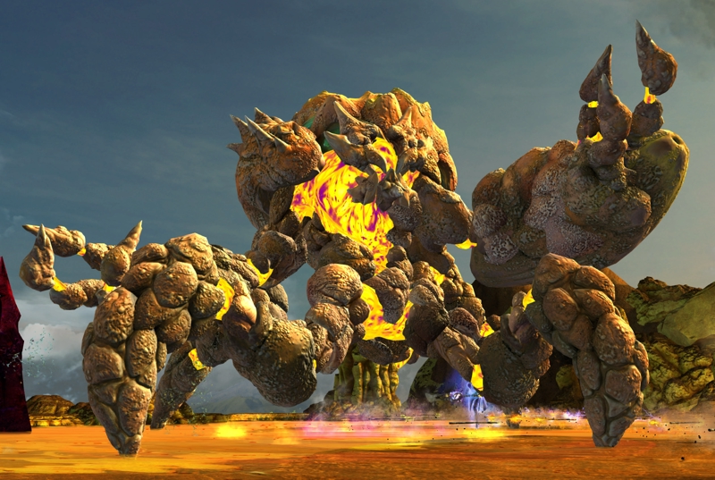

# Legendary Godscream Ura
{: .center}

[Return to Home](../index.html){: .btn } [Strategy Guide](./strategy.html){: .btn } [FAQ](./faq.html){: .btn }
{: .center}

| **Health** | 105,508,684 *|
| **Armor** |  2597 (standard) |
| **Hitbox** | 1000 |
| **Defiance** | 3000 ** |
| **Enrage Timer** | 10 minutes - kills all players on running out. |

Legendary Godscream Ura is an extreme challenge aimed at the highest tier of players. Beating her encounter requires perfect knowledge of the fight and of your class, and smooth execution of your chosen strategy.

Activating Legendary Mode makes the following changes to the fight:
- Ura's maximum health increases by 30%.
- Entities in the fight gain  [Rising Pressure](../ura/mechanics.html#-rising-pressure) every 8 seconds instead of every 12.
- All [Toxic Geysers]'  [Defiance Bar] has 1000 HP instead of 800 HP.
- [Toxic Geysers] will spawn every 12 seconds for the entirety of the fight.
- Both Ura and [Toxic Geysers]'  [Defiance Bar] will regenerate 150 HP every second.
- At the beginning of the final phase, Ura will heal by 30% of her maximum HP instead of 15%.
- Starting from the final phase, [Titanspawn Geysers] will begin spawning [Legendary Ventshots] exclusively.

Legendary Mode is mechanically similar to Challenge Mode, requiring good healing and condition cleanse, very good  [Stability](https://wiki.guildwars2.com/wiki/Stability) uptime (especially through the final phase), and a greater amount of crowd control than any other encounter in the game.

Squads attempting Ura will generally run an optimized composition, where every player will have their role in managing one or more of the boss's mechanics.

---

\* Due to Ura regenerating at 1% health, her effective total health is 137,161,289.

** While Ura's defiance technically does not change throughout the encounter, its effective value can become much greater due to  [Titanic Resistance](mechanics.html#-titanic-resistance).

[Return to Home](../index.html){: .btn } [Strategy Guide](./strategy.html){: .btn } [FAQ](./faq.html){: .btn }
{: .center}

[Toxic Geysers]: ../ura/mechanics.html#toxic-geysers
[Titanspawn Geysers]: ../ura/mechanics.html#titanspawn-geysers
[Legendary Ventshots]: ../ura/mechanics.html#legendary-ventshot

[Defiance Bar]: https://wiki.guildwars2.com/wiki/Defiance_bar