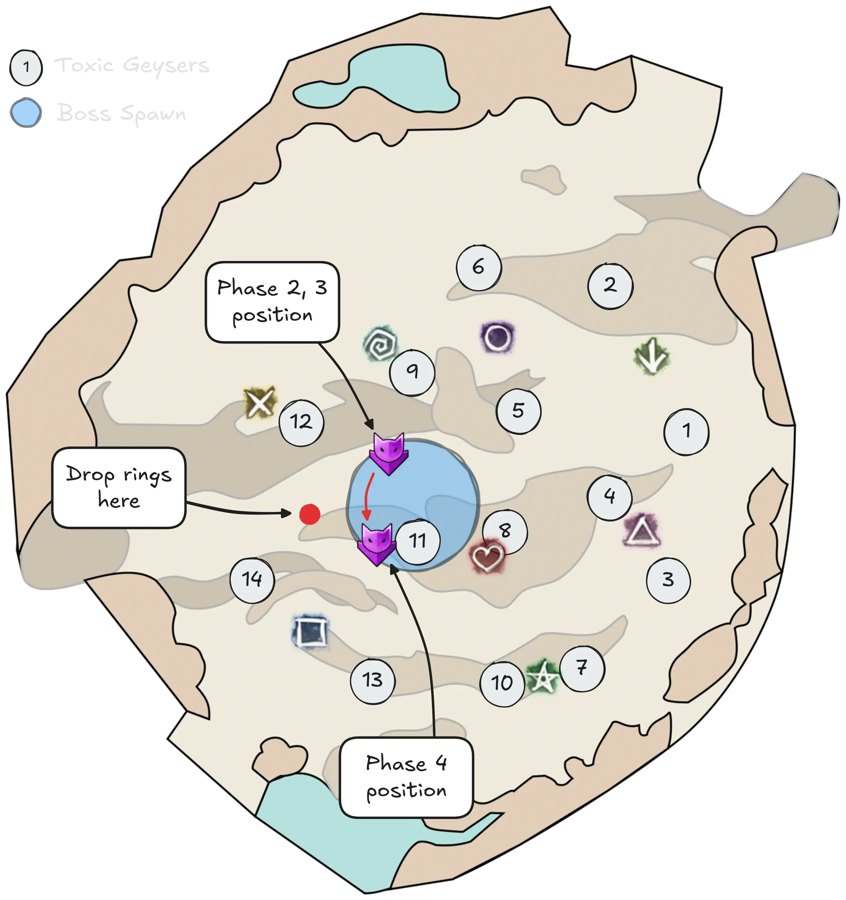

[Return to Home](../index.html){: .btn } [Return to Overview](./overview.html){: .btn .uralm} [Frequently Asked Questions](./faq.html){: .btn .uralm}

# Legendary Ura Strategy Guide
{: .no_toc}

<b>Table of Contents</b>

1. TOC
{:toc}

---

Legendary Godscream Ura is an extreme challenge that requires near-perfect execution to be cleared.
Many concepts generally carry over from the [Challenge Mode Strategy](../ura/strategy.html), so it is highly recommended to be familiar with Challenge Mode and with your chosen class before attempting to progress the Legendary Mode.

---

#### Main Points
{: .no_toc}
- Most LCM strategies ignore [Titanspawn Geysers], drastically simplifying melee group mechanics.
- Two compositions are popular: [Solo CC] and [4-man].
- The fight is a tight DPS check, requiring every player to pull their weight.
- An inordinate amount of CC is required throughout the fight to manage [Rising Pressure] and [Toxic Geysers].
- The ranged group will have to [double drop](../ura/strategy.html/#double-sharding-toxic-geysers) for the entire fight.
- [Tanking Ura](../ura/mechanics.html#tanking-ura), facing her in the right direction and timing CC correctly is essential to avoid her casting [Propel] and upkeep high DPS uptime.
- The final phase spawns multiple [Legendary Ventshots] that introduce extreme damage and CC pressure.

## Overview

Ura's overall mechanics and flow remain similar from CM to LCM. It is played pretty much [in the same way]((../ura/strategy.html#bloodstone-juggling-and-groups)), by dividing the squad into two groups, *melee* and *ranged*, with each group managing a single [Bloodstone Shard]. The main differences strategy-wise are:
- The *melee* group does not move to kill [Titanspawn Geysers].
- The *ranged* group will [double drop](../ura/strategy.html/#double-sharding-toxic-geysers) for the entire fight, with a rotation that depends on their composition.

---

#### Why not kill Titanspawners?

The primary reason is to take advantage of the cap on [Legendary Ventshots]. These are extremely dangerous enemies that start spawning from [Titanspawn Geysers] in the final phase, replacing the usual [Champion Fumarollers]. However, they can only spawn if there are less than 6 entities alive, including both [Champion Fumarollers] and [Titanspawn Geysers].

The aim of this strategy is therefore to have as many entities alive as possible when going into the final phase. By not killing any Titanspawners, you can have up to five of them simultaneously, which combined with the [Champion Fumarollers] surviving from the previous phase will prevent any Ventshots from spawning.

Towards the end of the fight, once all [Champion Fumarollers] are dead, you can still have one or two Ventshots spawning, but since these are few and appear late into the phase, they can simply be ignored with healing and  [Stability]. This is much easier compared to the alternative, where you have to upkeep permanent projectile block throughout the phase.

This strategy has the added advantage of always keeping the melee group in a single stack. Management of the [Bloodstone Shard] is simplified due to not having to  [Dispel] Titanspawners, the group has higher DPS uptime on the boss and more DPS overall, and it is easier to provide support. Furthermore, a [tank](../ura/strategy.html#tanking-ura) is not strictly necessary as the entire group will stay within line-of-sight at all times.

The disadvantage of this strategy is the presence of multiple [Champion Fumarollers] on the group for most of the fight, which requires consistently high healing and  [Stability] uptime and limits composition options.

---

#### Meeting the DPS check

Legendary Ura has an effective health of 123'451'556 HP and a maximum encounter duration of 11 minutes. This means that effectively, a group will need to average overall 187k average DPS to clear the encounter before enrage.

This number is greatly influenced by  [Rising Pressure]. Correct management of the damage reduction applied by this status will make or break a pull. Always keep an eye on the number of stacks on the boss: try to CC whenever she reaches 5 stacks. Ideally try to do so immediately after she gains a stack: this alone can increase your DPS by 3-4% easily, which is equivalent to 20-25 seconds on the enrage timer.

Players should have an up-to-date build (check the [builds section](#builds-and-povs) above and [Snowcrows](https://snowcrows.com/)), and should be competent with their class and rotation, practicing it if necessary on the [DPS golem](https://snowcrows.com/guides/arcdps/special-forces-area). Players should aim to do as much damage as possible while not failing mechanics.

To have an indicative understanding of how much DPS is necessary to clear the encounter, check the spreadsheet [here](https://docs.google.com/spreadsheets/d/e/2PACX-1vQRWHzmW9qli-mQ_MBS_uq65Bd64jy-djaDM7-Lt5sAcTqeuaOER3an1XNsS054DZeKg06ehE_Cf4_g/pubhtml).

## Composition

Legendary Ura is played primarily with two different composition types, differing based on how they manage CC:
- [Solo CC] compress most of the encounter's CC requirements onto one specialized build.
- [4-man] spreads out CC between the four supports.

The composition choice will greatly impact the strategy for the ranged group, but the melee group plays identically with both.

---

### Solo CC Compositions

These compositions use a single specialized role to CC all of the [Toxic Geysers] over the course of the fight. This frees up the rest of the squad to run anything in theory, as long as the basic requirements of healing,  [Stability] and cleanse are met.

The most common solo-CC class is  [Deadeye], due to its extreme mobility with  [Shadowstep] and  [Deadeye's Mark](https://wiki.guildwars2.com/wiki/Deadeye%27s_Mark), and its ability to constantly inflict  [Daze] with  [Distracting Throw] and regenerate initiative with  [Maleficent Seven](https://wiki.guildwars2.com/wiki/Maleficent_Seven),  [Malicious Ashen Assault](https://wiki.guildwars2.com/wiki/Malicious_Ashen_Assault)  and  [Mercy](https://wiki.guildwars2.com/wiki/Mercy). Other viable classes include  [Antiquary](https://wiki.guildwars2.com/wiki/Antiquary),  [Specter] (either celestial or heal) and  [Bladesworn](https://wiki.guildwars2.com/wiki/Bladesworn): the only strict requirement is being able to burst out over 1000 CC every 12 seconds.

For defensive supports,  [Troubadour] is the most common pick due to its great healing,  [Stability] access and CC. Similarly for BoonDPS,  [Evoker](https://wiki.guildwars2.com/wiki/Evoker) (specifically played with the Toad familiar) is a common pick due to its great damage and  [Stability] access.

Try to run DPS that can provide good amounts of  [Stability].  [Willbender] with  [Stand Your Ground!] is a common pick due to its high mobility, abundant cleanse, and its increased damage when cleaving thanks to  [Permeating Wrath] and  [Restorative Virtues]. Additionally:
- One DPS will have to participate in the ranged rotation and therefore benefits from additional mobility: this is often played by a  [Mechanist] or  [Scourge].
- One or more DPS will play a high-toughness build, aiming to be highest in the group. This will make [Champion Fumarollers] target them and get cleaved down on top of the boss. 

#### Example Composition
{: .no_toc}

<table class="fl-table padded">
    <thead>
        <tr>
            <th>Sub</th>
            <th>Build</th>
            <th>Role</th>
            <th>Melee</th>
            <th>Ranged</th>
        </tr>
    </thead>
    <tbody>
        <tr>
            <td class='phase1'>1</td>
            <td><a href="#builds-and-povs"> CC Deadeye</a></td>
            <td>CC + Ranged</td>
            <td></td>
            <td>2</td>
        </tr>
        <tr>
            <td class='phase1'>1</td>
            <td><a href="#builds-and-povs">Heal Troubadour</a></td>
            <td>Ranged</td>
            <td></td>
            <td>3</td>
        </tr>
        <tr>
            <td class='phase1'>1</td>
            <td>Toad Evoker</td>
            <td>Melee</td>
            <td>A</td>
            <td></td>
        </tr>
        <tr>
            <td class='phase1'>1</td>
            <td>DPS</td>
            <td>Melee</td>
            <td>B</td>
            <td></td>
        </tr>
        <tr>
            <td class='phase1'>1</td>
            <td>DPS</td>
            <td>Melee</td>
            <td></td>
            <td></td>
        </tr>
        <tr>
            <td class='phase2'>2</td>
            <td><a href="#builds-and-povs"> Heal Troubadour</a></td>
            <td>Ranged</td>
            <td></td>
            <td>1</td>
        </tr>
        <tr>
            <td class='phase2'>2</td>
            <td>Toad Evoker</td>
            <td>Melee</td>
            <td>C</td>
            <td></td>
        </tr>
        <tr>
            <td class='phase2'>2</td>
            <td>DPS</td>
            <td>Melee</td>
            <td>D</td>
            <td></td>
        </tr>
        <tr>
            <td class='phase2'>2</td>
            <td>DPS</td>
            <td>Ranged</td>
            <td></td>
            <td>4</td>
        </tr>
        <tr>
            <td class='phase2'>2</td>
            <td>DPS</td>
            <td>Tank</td>
            <td></td>
            <td></td>
        </tr>
    </tbody>
</table>

---

### 4-man Compositions

These compositions tend to spread out CC requirements between all four support players, who together form the ranged group. This forces a stricter composition, as each support needs to be able to CC [Toxic Geysers], leading to the ubiquitous roster of heal  [Troubadours] and celestial  [Specters]:

-  [Troubadour] provides incredible boon access,  [Stability] uptime, CC, healing and general utility.
- Celestial  [Specters] provide decent  [Stability] and boons, excellent CC and mobility, and can also upkeep  [Vulnerability] and  [Poison] (required for  [Relic of Thorns]).

It's very rare to run supports aside from the ones listed above.

Try to run DPS that can provide good amounts of  [Stability].  [Willbender] with  [Stand Your Ground!] is a common pick due to its high mobility, abundant cleanse, and its increased damage when cleaving thanks to  [Permeating Wrath] and  [Restorative Virtues].  [Willbender] players should run a mix of Trailblazer and Dire for additional survivability. This brings around 2.5k DPS loss in a golem situation, which can be made up with through the more aggressive gameplay this gear enables. Healers must ensure that they have less toughness than the DPS so that they are not targeted by [Champion Fumarollers] while doing mechanics.

Up to one DPS per subgroup can bring a different build that is not  [Willbender]; any more and  [Stability] uptime may start to become an issue. These players will often bring whatever flavour of greedy DPS has the highest benchmark at the time.

#### Example Composition
{: .no_toc}

<table class="fl-table padded">
    <thead>
        <tr>
            <th>Sub</th>
            <th>Build</th>
            <th>Role</th>
            <th>Melee</th>
            <th>Ranged</th>
        </tr>
    </thead>
    <tbody>
        <tr>
            <td class='phase1'>1</td>
            <td><a href="#builds-and-povs"> Cele Specter</a></td>
            <td>Ranged</td>
            <td></td>
            <td>1</td>
        </tr>
        <tr>
            <td class='phase1'>1</td>
            <td><a href="#builds-and-povs"> Heal Troubadour</a></td>
            <td>Ranged</td>
            <td></td>
            <td>2</td>
        </tr>
        <tr>
            <td class='phase1'>1</td>
            <td><a href="#builds-and-povs"> DPS</a></td>
            <td>Melee</td>
            <td>A</td>
            <td></td>
        </tr>
        <tr>
            <td class='phase1'>1</td>
            <td><a href="#builds-and-povs"> DPS</a></td>
            <td>Melee</td>
            <td>B</td>
            <td></td>
        </tr>
        <tr>
            <td class='phase1'>1</td>
            <td>Greedy DPS</td>
            <td>Melee</td>
            <td></td>
            <td></td>
        </tr>
        <tr>
            <td class='phase2'>2</td>
            <td><a href="#builds-and-povs"> Cele Specter</a></td>
            <td>Ranged</td>
            <td></td>
            <td>3</td>
        </tr>
        <tr>
            <td class='phase2'>2</td>
            <td><a href="#builds-and-povs"> Heal Troubadour</a></td>
            <td>Ranged</td>
            <td></td>
            <td>4</td>
        </tr>
        <tr>
            <td class='phase2'>2</td>
            <td><a href="builds-and-povs"> DPS</a></td>
            <td>Melee</td>
            <td>C</td>
            <td></td>
        </tr>
        <tr>
            <td class='phase2'>2</td>
            <td><a href="builds-and-povs"> DPS</a></td>
            <td>Melee</td>
            <td>D</td>
            <td></td>
        </tr>
        <tr>
            <td class='phase2'>2</td>
            <td>Greedy DPS</td>
            <td>Melee</td>
            <td></td>
            <td></td>
        </tr>
    </tbody>
</table>

#### Alternative 4-man

An alternative composition "inverts" the support roles, running two heal  [Specters] and two celestial  [Troubadours]. The idea behind this is that the  [Specters] can take care of most of the CC, enabling the  [Troubadours] to remain on stack. The  [Troubadour] in turn brings similar DPS as  [Specter] with much better healing and group support, including great  [Stability]. This then enables groups to run only one  [Willbender] per subgroup, making the composition much more flexible.

---

### Builds and PoVs

This is a small selection of builds and PoVs and is not regularly updated. You can find up-to-date information on  [Void Lounge](https://discord.com/invite/voidlounge).

#### Solo CC
{: .no_toc}

|Build|Role|PoV|Last updated|
|  [CC Deadeye](https://gw2skills.net/editor/?PagEQjWWADkJx2Ym4xad92A-DyIY1oi/MaRF0zUwRfMUh+gKA-e) | Ranged Solo Toxics | TBA | July 2026 |
|  [CC Bladesworn](https://gw2skills.net/editor/?PKRAYlJwUZtsEGJeaX/xXA-DSRYKBhPGFcHnRLKgemAO6EBL0vZBVA-e) | Ranged Solo Toxics | [PoV](https://youtu.be/3aj-JoV9GJI) | July 2026 |
|  [Heal Troubadour](https://gw2skills.net/editor/?PihEQiW2L7iNzsYj4RPlO1B-DSZYjRFoGGSwlRLJQ6FgvvGCSAsBwS7bWQFA-e) | Ranged, Heal | [PoV](https://www.youtube.com/watch?v=j9cDoQ8IcZY) | July 2026 |
|  [Toad Evoker](https://gw2skills.net/editor/?PGgEoEWWAjmdx0Y14o8YNVVKHAA-DSRYkRDWOszoDFQISAF+rIIhwG41ogPNQFA-e) | Melee, BoonDPS | [PoV](https://youtu.be/OuoCipdW4GQ) | July 2026 |

#### 4-man
{: .no_toc}

|Build|Role|PoV|Last updated|
| [Heal Troubadour](https://gw2skills.net/editor/?PigEQiW2LzidxkZj4RPlOVB-DSZYjRwKTN0GkoiIzsQaJESvqKJBc8ERQCl/WafzCqA-e) ( [Call and Response])|Healer & Toxics|[PoV](https://youtu.be/U-_TFEcLBb4)|April 2026|
| [Heal Troubadour](https://gw2skills.net/editor/?PihEQiWmB7iJzsYj4RPpOzB-DSZYjBlpGaDSUdkZWGtkCpXBOeiIIBwe4t0+mFUB-e) ( [Altered Chord])|Healer & Toxics|[PoV](https://youtu.be/X_BUGk2vzhw)|April 2026|
| [Celestial Specter ( Mesmer)](https://gw2skills.net/editor/?PagEQjWGKjlly2Yn4Yb9H9B-DyIY1oivQapCiMBqMEc89QQCg9wbh+vKoC-e)|Toxics|[PoV](https://youtu.be/rUM8EZMYLrU)|April 2026|
| [Celestial Specter ( Trapper)](https://gw2skills.net/editor/?PagEQjWGKjlty2Yn4Yb9H9B-DyIY1oi/QaRFEpEoShgCfPEkAYP8Wo/rCqA-e)|Toxics| |April 2026|
| [DPS Willbender (PP/PT)](https://gw2skills.net/editor/?PWABoqp/lVw6YqMMWLW0WbxSA-DSRYcB1TG9cCFSlhQuJQHVgD/KCSQsHeNg4TDUB-e)| DPS |[PoV](https://www.youtube.com/watch?v=WJKHwUIudkA)|September 2025|

For more information on  [Willbender] gameplay in particular, check out Mastro's [P/P/T cWB Manifesto](https://discord.com/channels/380901000200060929/380903704808652801/1467802730658664500).

## Strategy

The fight plays out in a similar manner as the [regular Challenge Mode](../ura/strategy.html): the first phase is played identically, and differences start appearing in the second phase, when [Titanspawn Geysers] start spawning.

### Titanspawn Phases

In the second and third phase, the group will be stacking on the northern side of Ura, in front of geysers *#9* and *#12*. If any players are running  [Relic of Thorns], stay inside Ura's hitbox to trigger the relic with Ura's [Scalding Aura](../ura/mechanics.html#scalding-aura).

The only reason for DPS players to leave the stack from now on is to satisfy essential mechanics:
- [Bubbles](../ura/mechanics.html#pressure-blast) are usually always played to the *left* or *immediately behind* the group.
- [Sulfuric Geysers] can be placed in the safe zone *behind* the group.
- [Steam Prison](../ura/mechanics.html#steam-prison) should be placed to the *right* of the group. Commanders may mark a location that does not interfere with the ranged players, usually between geysers *#11* and *#14*.

In the final phase, groups will often rotate to stack to the south-west of the boss, roughly corresponding to *#11*. This is because the usual safe area behind *#9* and *#12* is often filled with geysers at this point, making it actively dangerous for the DPS players. Rotating enables players to drop behind *#13* and *#14* which should be relatively empty.

During the last three phases of the fight, no [Titanspawn Geysers] will be killed. This will result in a constant stream of [Champion Fumarollers] spawning. If your toughness is set up right, these should consistently charge into the main stack and then getting cleaved down on top of the boss. Ideally you want to kill them as they come: an excessive amount can quickly overwhelm the group with CC.

Players should try to avoid taking excessive damage, often coming from [Breaking Ground](../ura/mechanics.html#champion-fumaroller) (snowflake), and should be constantly providing  [Stability] off-cooldown.

---

### Shard Rotations

The only thing the melee group needs to  [Dispel] is [Pressure Blast]. This means that less people need to be involved in the rotation, which usually consists of only four players. Groups can choose to forgo a rotation if they are confident.

The _ranged rotation_ depends on the composition used:

---

#### Solo CC

The strategy uses a 3 + 1 rotation involving both healers, the solo CC player, and a ranged DPS to simplify transitions and reduce overall pressure.

[ 3.5-man Rotation for Solo-CC Strat by Elise](https://docs.google.com/spreadsheets/d/1Ktp0BY9JaYToIiVv3RluenDjy8uVAylq8nqHLEvje0o){: .btn}

Responsibility for CCing [Toxic Geysers] lies fully on the solo CC. Some classes, most notably  [Thief] specializations, will not be able to CC *#11* due to Ura's hitbox blocking  [Distracting Throw]. This geyser will have to be CC'd by the rest of the group.

For more information on how to play the solo CC role, and on solo CC  [Deadeye] in particular, check out Chupathingy's [CC Deadeye Guide](https://docs.google.com/presentation/d/19xXTt8iPkvoDVG_I_TEQOd_Xyw4R6ZdB90SOWWzzh4M).

---

#### 4-man

The strategy uses a 4-man rotation involving all the support players double-dropping.

[ 4-man Rotation for Willbender Strat by Asterius](https://docs.google.com/spreadsheets/d/1gOhbFgtSnaW_8T1m12PgZe8lG7VH-P3IckXoPUPqNdA){: .btn}

Responsibility for CCing [Toxic Geysers] is spread out between all of the ranged group members. Each support will CC two geysers every rotation:
- The geyser they pick up the [Bloodstone Shard] from.
- The first geyser they  [Dispel] when double dropping.

By alternating  [Troubadours] and  [Specters] in the rotation, the rotation ensures that there is always at least one healer on the main stack.

 [Troubadours] running  [Call and Response] can CC toxics by doing the combination:
1.  [Tale of the Tortured Mastermind].
2.  [Phantasmal Sharpshooter] or  [Mental Collapse] with  [Clarity].
3.  [Signet of Humility] or  [Deafening Drum] with three notes to trigger  [Call and Response].

Alternatively, if they are running  [Altered Chord] they can either:
- Use  [Deafening Drum] in medium range to trigger the 2-second  [Daze], and wait for 1-2 autos before casting it for the optimal timing (overlapping with the final pulse of  [Tale of the Tortured Mastermind]).
- Use  [Flustering Flute](https://wiki.guildwars2.com/wiki/Flustering_Flute) before  [Deafening Drum] (at the cost of  [Protection] uptime).
- Use an additional weapon skill after the normal sequence.

 [Specters] can CC with  [Distracting Throw], making sure to have enough initiative to do so. There is generally enough time between the two geysers for it to regenerate, but players who find themselves constantly short can run two spears and take advantage of  [Quick Pockets]. Crowd control from  [Distracting Throw] requires that the target be movement-impaired. This can be done by casting  [Siphon](https://wiki.guildwars2.com/wiki/Siphon) or  [Well of Gloom](https://wiki.guildwars2.com/wiki/Well_of_Gloom) on the target.

If players cannot CC, they should call for backups. Since all four ranged players are double dropping, there is quite a bit of flexibility overall.

[Return to Home](../index.html){: .btn } [Return to Overview](overview.html){: .btn } [Return to Top](#legendary-ura-strategy-guide){: .btn .fixed}
{: .center}

[Bloodstone Shard]: ../ura/mechanics.html#bloodstone-shards
[Bloodstone Shards]: ../ura/mechanics.html#bloodstone-shards
[Toxic Geyser]: ../ura/mechanics.html#toxic-geysers
[Toxic Geysers]: ../ura/mechanics.html#toxic-geysers
[Sulfuric Geyser]: ../ura/mechanics.html#sulfuric-geysers
[Sulfuric Geysers]: ../ura/mechanics.html#sulfuric-geysers
[Dispel]: ../ura/mechanics.html#-dispel
[Dispelled]: ../ura/mechanics.html#-dispel
[Titanspawn Geyser]: ../ura/mechanics.html#titanspawn-geysers
[Titanspawn Geysers]: ../ura/mechanics.html#titanspawn-geysers
[Create Titanspawn Geyser]: ../ura/mechanics.html#titanspawn-geysers
[Pressure Blast]: ../ura/mechanics.html#pressure-blast
[Pressure Blasts]: ../ura/mechanics.html#pressure-blast
[Titanic Resistance]: ../ura/mechanics.html#-titanic-resistance
[Champion Fumaroller]: ../ura/mechanics.html#champion-fumaroller
[Champion Fumarollers]: ../ura/mechanics.html#champion-fumaroller
[Legendary Ventshots]: ../ura/mechanics.html#legendary-ventshot
[Bloodstone Saturation]: ../ura/mechanics.html#-bloodstone-saturation
[Propel]: ../ura/mechanics.html#propel
[Autoattack Chain]: ../ura/mechanics.html#autoattack-chain
[Rising Pressure]: ../ura/mechanics.html#-rising-pressure
[Steam Prison]: ../ura/mechanics.html#steam-prison
[Return]: ../ura/mechanics.html#return
[Solo CC]: #solo-cc-compositions
[4-man]: #4-man-compositions

[Deadeye]: #builds-and-povs
[Scourge]: #builds-and-povs
[Mechanist]: https://wiki.guildwars2.com/wiki/Mechanist
[Willbender]: #builds-and-povs
[Willbenders]: #builds-and-povs
[Specter]: #builds-and-povs
[Specters]: #builds-and-povs
[Troubadour]: #builds-and-povs
[Troubadours]: #builds-and-povs
[Thief]: #builds-and-povs

[Power]: https://wiki.guildwars2.com/wiki/Power
[Condition]: https://wiki.guildwars2.com/wiki/Condition_damage
[Conditions]: https://wiki.guildwars2.com/wiki/Condition_damage
[Defiance Bar]: https://wiki.guildwars2.com/wiki/Defiance_bar
[Aegis]: https://wiki.guildwars2.com/wiki/Aegis
[Stability]: https://wiki.guildwars2.com/wiki/Stability
[Dimensional Aperture]: https://wiki.guildwars2.com/wiki/Dimensional_Aperture
[Superspeed]: https://wiki.guildwars2.com/wiki/Superspeed
[Invulnerable]: https://wiki.guildwars2.com/wiki/Invulnerability
[Wall of Reflection]: https://wiki.guildwars2.com/wiki/Wall_of_Reflection
[Stand Your Ground!]: https://wiki.guildwars2.com/wiki/%22Stand_Your_Ground!%22
[Chapter 3: Valiant Bulwark]: https://wiki.guildwars2.com/wiki/Chapter_3:_Valiant_Bulwark
[Smoke Screen]: https://wiki.guildwars2.com/wiki/Smoke_Screen
[Corrosive Poison Cloud]: https://wiki.guildwars2.com/wiki/Corrosive_Poison_Cloud
[Feedback]: https://wiki.guildwars2.com/wiki/Feedback
[Shift Signet]: https://wiki.guildwars2.com/wiki/Shift_Signet
[Mantra of Concentration]: https://wiki.guildwars2.com/wiki/Mantra_of_Concentration
[Well of Precognition]: https://wiki.guildwars2.com/wiki/Well_of_Precognition
[Master of Consecrations]: https://wiki.guildwars2.com/wiki/Master_of_Consecrations
[Restorative Virtues]: https://wiki.guildwars2.com/wiki/Restorative_Virtues
[Permeating Wrath]: https://wiki.guildwars2.com/wiki/Permeating_Wrath
[Blink]: https://wiki.guildwars2.com/wiki/Blink
[Haste]: https://wiki.guildwars2.com/wiki/Haste
[Stunbreak]: https://wiki.guildwars2.com/wiki/Stun_break
[Quickness]: https://wiki.guildwars2.com/wiki/Quickness
[Vulnerability]: https://wiki.guildwars2.com/wiki/Vulnerability
[Poison]: https://wiki.guildwars2.com/wiki/Poison
[Relic of Thorns]: https://wiki.guildwars2.com/wiki/Relic_of_Thorns
[Shadowstep]: https://wiki.guildwars2.com/wiki/Shadowstep
[Distracting Throw]: https://wiki.guildwars2.com/wiki/Distracting_Throw
[Continuum Split]: https://wiki.guildwars2.com/wiki/Continuum_Split
[Signet of Domination]: https://wiki.guildwars2.com/wiki/Signet_of_Domination
[Well of Senility]: https://wiki.guildwars2.com/wiki/Well_of_Senility
[Signet of Humility]: https://wiki.guildwars2.com/wiki/Signet_of_Humility
[Phantasmal Sharpshooter]: https://wiki.guildwars2.com/wiki/Phantasmal_Sharpshooter
[Mental Collapse]: https://wiki.guildwars2.com/wiki/Mental_Collapse
[Clarity]: https://wiki.guildwars2.com/wiki/Clarity
[Corrosive Poison Cloud]: https://wiki.guildwars2.com/wiki/Corrosive_poison_cloud
[Stand Your Ground!]: https://wiki.guildwars2.com/wiki/%22Stand_Your_Ground!%22
[Trail of Anguish]: https://wiki.guildwars2.com/wiki/Trail_of_Anguish
[Blood is Power]: https://wiki.guildwars2.com/wiki/Blood_is_power
[Curses]: https://wiki.guildwars2.com/wiki/Curses
[Soul Reaping]: https://wiki.guildwars2.com/wiki/Soul_Reaping
[Blood Magic]: https://wiki.guildwars2.com/wiki/Blood_Magic
[Wall of Reflection]: https://wiki.guildwars2.com/wiki/Wall_of_Reflection
[Chapter 3: Valiant Bulwark]: https://wiki.guildwars2.com/wiki/Chapter_3:_Valiant_Bulwark
[Mantra of Liberation]: https://wiki.guildwars2.com/wiki/Mantra_of_Liberation
[Purging Flames]: https://wiki.guildwars2.com/wiki/Purging_Flames
[Stunbreak]: https://wiki.guildwars2.com/wiki/Stun_break
[Feel My Wrath!]: https://wiki.guildwars2.com/wiki/%22Feel_My_Wrath!%22
[Epilogue: Unbroken Lines]: https://wiki.guildwars2.com/wiki/Epilogue:_Unbroken_Lines
[Chapter 3: Heated Rebuke]: https://wiki.guildwars2.com/wiki/Chapter_3:_Heated_Rebuke
[Virtues]: https://wiki.guildwars2.com/wiki/Virtues
[Absolute Resolve]: https://wiki.guildwars2.com/wiki/Absolute_Resolve
[Healing Turret]: https://wiki.guildwars2.com/wiki/Healing_Turret
[Lightning Flash]: https://wiki.guildwars2.com/wiki/Lightning_Flash
[Glyph of Lesser Elementals]: https://wiki.guildwars2.com/wiki/Glyph_of_Lesser_Elementals
[Mass Momentum]: https://wiki.guildwars2.com/wiki/Mass_Momentum
[Continuum Split]: https://wiki.guildwars2.com/wiki/Continuum_Split
[Summon Flesh Golem]: https://wiki.guildwars2.com/wiki/Summon_Flesh_Golem
[Charge]: https://wiki.guildwars2.com/wiki/Charge_(necromancer_skill)
[Jurisdiction]: https://wiki.guildwars2.com/wiki/Jurisdiction
[Mantra of Concentration]: https://wiki.guildwars2.com/wiki/Mantra_of_Concentration
[Distracting Throw]: https://wiki.guildwars2.com/wiki/Distracting_Throw
[Might]: https://wiki.guildwars2.com/wiki/Might
[Fury]: https://wiki.guildwars2.com/wiki/Fury
[Relic of the Midnight King]: https://wiki.guildwars2.com/wiki/Relic_of_the_Midnight_King
[Relic of Speed]: https://wiki.guildwars2.com/wiki/Relic_of_Speed
[Quick Pockets]: https://wiki.guildwars2.com/wiki/Quick_Pockets
[Altered Chord]: https://wiki.guildwars2.com/wiki/Altered_Chord
[Call and Response]: https://wiki.guildwars2.com/wiki/Call_and_Response
[Protection]: https://wiki.guildwars2.com/wiki/Protection
[Tale of the Tortured Mastermind]: https://wiki.guildwars2.com/wiki/Tale_of_the_Tortured_Mastermind
[Deafening Drum]: https://wiki.guildwars2.com/wiki/Deafening_Drum
[Daze]: https://wiki.guildwars2.com/wiki/Daze