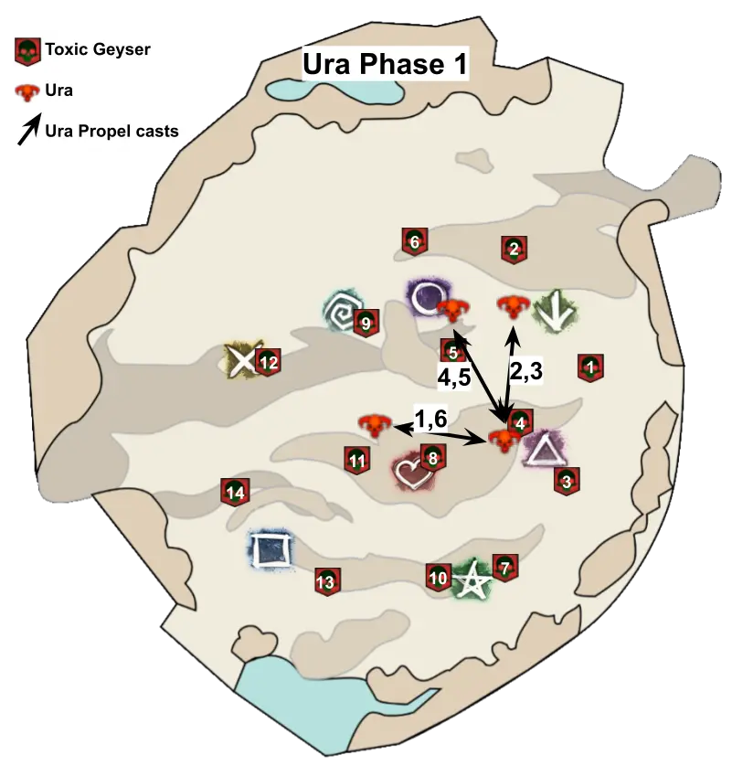
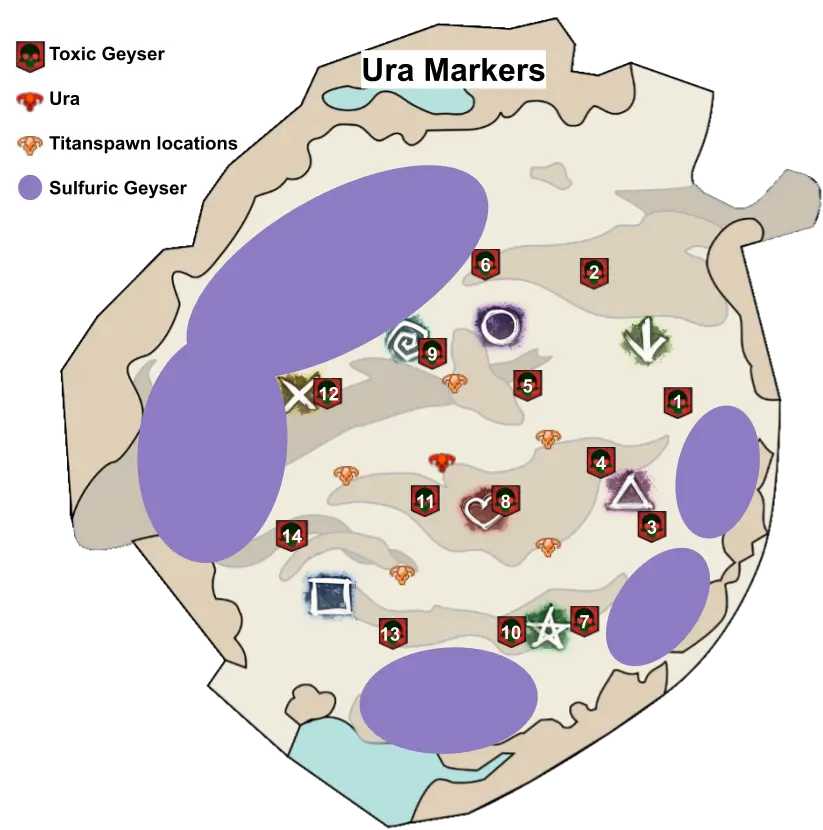

[Return to Home](../index.html){: .btn } [Return to Overview](./overview.html){: .btn } [Mechanical Reference](./mechanics.html){: .btn }

# Fast Ura Guides

This page contains some simple guides for several roles in the Godscream Ura encounter. If you want something more in-depth, please read the full [Strategy Guide](./strategy.html).

---

## What are you playing?
{: .center}

    <a href="#ranged-group-quick-guide"
       class="guides-button"
       style="background-image: url(../images/ura/strategy/fast-guides/ranged.webp);">Ranged Group</a>
    <a href="#melee-group-quick-guide"
       class="guides-button"
       style="background-image: url(../images/ura/strategy/fast-guides/melee.webp);">Melee Group</a>
    <a href="#tank-quick-guide"
       class="guides-button"
       style="background-image: url(../images/ura/strategy/fast-guides/tank.webp);">Tank</a>

# Ranged Group Quick Guide
Your responsibilities (excluding basic damage, healing or support as required by your role) consist in:
1. Picking up the ranged [Bloodstone Shard] whenever it's your turn and using  [Dispel] on the [Toxic Geysers] that are your duty.
2. CC'ing the [Toxic Geysers] that you  [Dispel].
3. Baiting [Propel] into the proper directions during the first phase.

{: .note}
It is highly recommended (almost mandatory!) to have a [marker pack] that shows you where the [Toxic Geysers] will spawn and in what order.

#### General Information for all Phases
- Picking up the [Bloodstone Shard] right after using one (and thus under the effect of  [Bloodstone Saturation]) will deal massive damage over time. Be aware.
- Standing in [Toxic Geysers] for too long will afflict you with  [Sulfuric Acid]. This is a dangerous condition that must be cleansed soon or you will be  [Exposed].
- Check who is before you and after you in the ranged rotation, asking your commander if necessary.
- Set a [personal target](https://wiki.guildwars2.com/wiki/Call_Target) on the person before you and be aware of where they go so you can pick up the [Bloodstone Shard] after they use it.
- Whenever you  [Dispel], call out the person after you in the rotation and tell them where they have to pick up the shard.

---

Phase 1

{: .note}
> If you are [double dropping](strategy.html#double-sharding-toxic-geysers), you will have to handle two [Toxic Geysers] every time it's your turn in the rotation. To do this:
> 1. CC the first geyser soon after it spawns, then wait for the second to spawn.
> 2. Move to the first geyser and  [Dispel].
> 3. Pick up the [Bloodstone Shard], quickly move to the second one and  [Dispel] again.

- If you are first in the rotation, you will start the fight by picking up the ranged shard.
- Start in front of the boss. She will always begin with [Bubbles].
- After every set of [Bubbles] she will use [Propel]. Try to be the furthest one from the boss in order to bait it. Try to follow the pattern in the image below.
- The ranged rotation starts from [Toxic Geyser] #1.
- Be on stack whenever you are not CCing a geyser or using your [Bloodstone Shard]. Try to provide  [Stability] for the [cone attack].
- Try not to  [Dispel] just before 70%, or you may not be able to pick up your shard before the boss casts [Return].

Phase 2

{: .note}
> From this phase onwards it is not necessary to double drop, as the spawn rate of [Toxic Geysers] is halved.

- The ranged rotation restarts from [Toxic Geyser] #7. The timer will not reset however.
- Be on stack whenever you are not CCing a geyser or using your [Bloodstone Shard]. Try to provide  [Stability] for the [jump attack].
- Follow your group to kill [Titanspawn Geysers]. Try to provide  [Stability] for the [Champion Fumaroller]'s attacks.
- Once a [Titanspawn Geyser] is dead, return to the stack and try to recall/remove any pets or clones so that the [Champion Fumaroller] comes to the stack and is cleaved down.
- If you are targeted by [Sulfuric Geyser], run out and drop it along the edge of the arena. A [marker pack] can show you the safe areas.

[Return to Home](../index.html){: .btn } [Return to Overview](overview.html){: .btn } [Return to Top](#recommended-ura-strategy){: .btn .fixed}
{: .center}

[Bloodstone Shard]: mechanics.html#bloodstone-shards
[Bloodstone Shards]: mechanics.html#bloodstone-shards
[Toxic Geyser]: mechanics.html#toxic-geysers
[Toxic Geysers]: mechanics.html#toxic-geysers
[Sulfuric Geyser]: mechanics.html#sulfuric-geysers
[Sulfuric Geysers]: mechanics.html#sulfuric-geysers
[Dispel]: mechanics.html#-dispel
[Dispelled]: mechanics.html#-dispel
[Titanspawn Geyser]: mechanics.html#titanspawn-geysers
[Titanspawn Geysers]: mechanics.html#titanspawn-geysers
[Titanspawners]: mechanics.html#titanspawn-geysers
[Create Titanspawn Geyser]: mechanics.html#titanspawn-geysers
[jump attack]: mechanics.html#titanspawn-geysers
[Bubbles]: mechanics.html#pressure-blast
[Titanic Resistance]: mechanics.html#-titanic-resistance
[Champion Fumaroller]: mechanics.html#champion-fumaroller
[Champion Fumarollers]: mechanics.html#champion-fumaroller
[Bloodstone Saturation]: mechanics.html#-bloodstone-saturation
[Propel]: mechanics.html#propel
[Autoattack Chain]: mechanics.html#autoattack-chain
[cone attack]: mechanics.html#autoattack-chain
[Rising Pressure]: mechanics.html#-rising-pressure
[Steam Prison]: mechanics.html#steam-prison
[Return]: mechanics.html#return
[Sulfuric Acid]: mechanics.html#-sulfuric-acid

[marker pack]: strategy.html#marker-packs

[Chrono]: https://wiki.guildwars2.com/wiki/Chronomancer
[Chronomancer]: https://wiki.guildwars2.com/wiki/Chronomancer
[Chronomancers]: https://wiki.guildwars2.com/wiki/Chronomancer
[Druid]: https://wiki.guildwars2.com/wiki/Druid
[Specter]: https://wiki.guildwars2.com/wiki/Specter
[Scourge]: https://wiki.guildwars2.com/wiki/Scourge
[Power]: https://wiki.guildwars2.com/wiki/Power
[Condition]: https://wiki.guildwars2.com/wiki/Condition_damage
[Conditions]: https://wiki.guildwars2.com/wiki/Condition_damage
[Defiance Bar]: https://wiki.guildwars2.com/wiki/Defiance_bar
[Aegis]: https://wiki.guildwars2.com/wiki/Aegis
[Stability]: https://wiki.guildwars2.com/wiki/Stability
[Dimensional Aperture]: https://wiki.guildwars2.com/wiki/Dimensional_Aperture
[Superspeed]: https://wiki.guildwars2.com/wiki/Superspeed
[Invulnerable]: https://wiki.guildwars2.com/wiki/Invulnerability