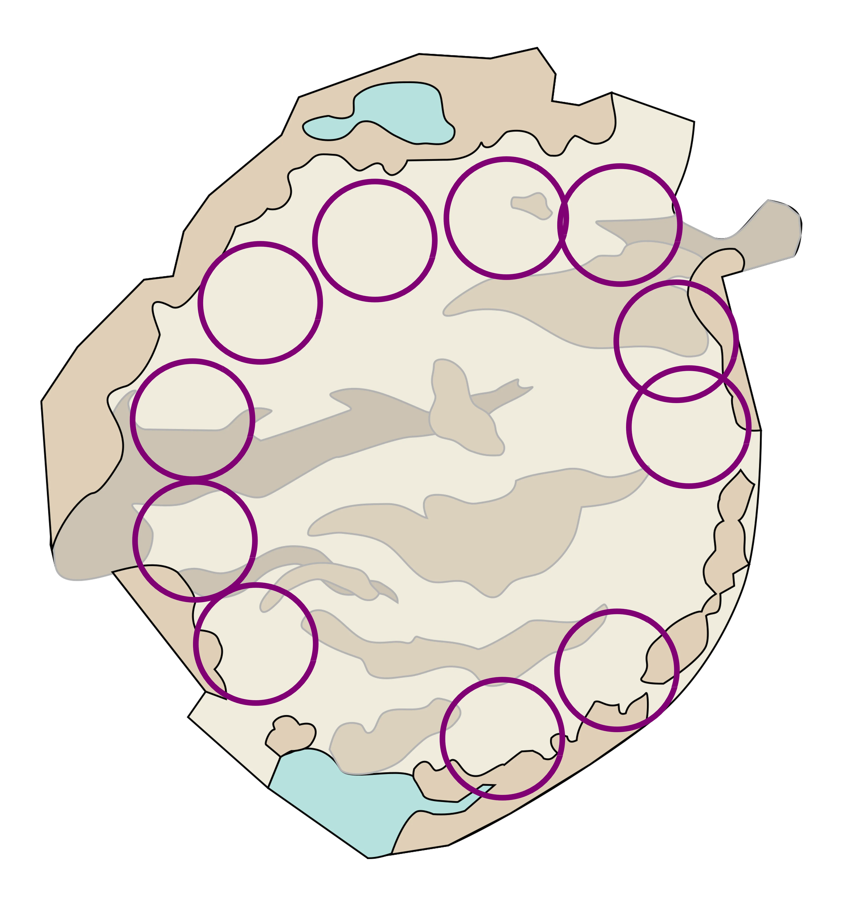
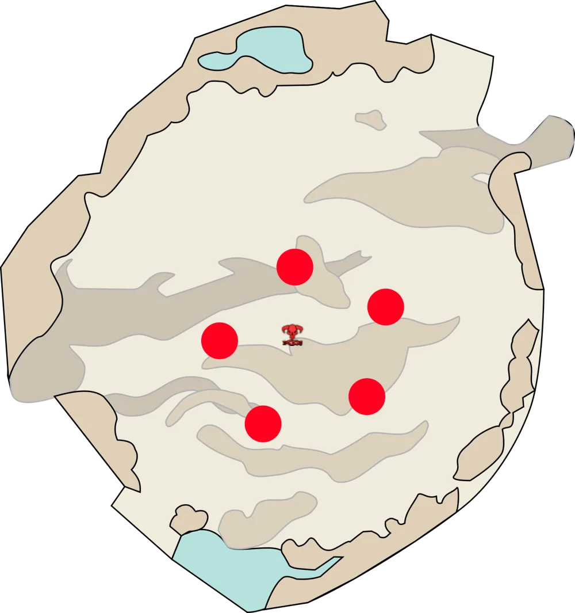

[Return to Home](../index.html){: .btn } [Return to Overview](./overview.html){: .btn } [Strategy Guide](./strategy.html){: .btn }

# Ura Mechanical Reference
{: .no_toc}

<b>Table of Contents</b>

1. TOC
{:toc}

---

This page contains a detailed reference of the various attacks and mechanics present in the encounter. 

The rest of this page is structured into the following sections:
1. [**Overview**](#overview) - basic description of the fight and its main points.
2. [**Phases**](#phases) - a description of the structure of the fight, with transitions and differences between phases.
3. [**Mechanics**](#list-of-mechanics) - a reference of every attack in the encounter.
4. [**Effects**](#list-of-effects) - a reference of all effects unique to the encounter.

## Overview

The fight against [Ura] is split into 4 different phases, each characterized by a different set of mechanics. The phase transitions are based on the boss' health pool, occurring at 70%, 40%, and 1% of her maximum health. At the beginning of the final phase, [Ura] heals back to 16% HP (31% in Legendary Mode).

Managing the fight's mechanics requires lots of breakbar damage, cleave damage, mobility, and support in the form of  [Condition] cleanse and  [Stability].

---

#### Bloodstone Juggling

One of the defining characteristics of [Godscream Ura] is [Bloodstone Shards] and their associated mechanics. [Bloodstone Shards] are interactable objects that can be picked up by players, and are of fundamental importance for clearing the encounter; they allow players to negate mechanics and make vulnerable enemies that otherwise wouldn't be.

Two shards spawn at the beginning of the encounter and a player using a shard generally cannot pick up a new one for a certain amount of time. In order to cover all mechanics, it is necessary to rotate the shards throughout the entire squad; getting the hang of this "juggling" and performing it smoothly is the key to clearing the encounter, it is also the main reason why voice communications are so highly recommended.

More information on this mechanic can be found [here](#bloodstone-shard).

---

#### Geysers and Arena Management

An important facet of the [Ura] encounter is area denial. Throughout the fight, the boss will summon Geysers: stationary structures that affect an area, buffing the boss and harming the squad in some manner.
Learning to kill or otherwise handle these quickly and efficiently is the foundation of this fight, as the eventual lack of space and additional damage pressure they inflict can quickly escalate.

More information on geysers can be found [here](#geysers).

---

#### Defiance Management

Throughout the fight, [Ura] will periodically gain stacks of  [Rising Pressure]. These increase her outgoing damage while reducing all incoming damage.

Breaking the  [Defiance Bar] resets the number of stacks to zero. **However**, the downside here is [Ura] gains  [Titanic Resistance], a permanent stacking buff which reduces incoming defiance damage and makes breaking successive bars more difficult. Managing outgoing crowd control is therefore very important and requires decent coordination to only break the bar at specific intervals.

{: .legendary}
Ura regenerates 150 Defiance every second, so the pressure becomes even greater.

---

#### Table of Mechanics

A brief description of the primary attacks performed by Ura during the encounter. Click on a mechanic to view additional information.

| **Attack**      | **Common Name**  | **Brief Description** |
| [Scalding Aura] | Hitbox | Pulses damage and  [Burning] to players inside Ura's hitbox. |
| [Autoattack Chain] | Autos, Cone | A series of 3 attacks, dealing damage and applying  [Vulnerability]. The third and final attack also inflicts  [Knockdown]. |
| [Acid Spray]    | Spray | Used when the target is not in melee range. Sprays  [Sulfuric Acid]. |
| [Pressure Blast] | Bubbles, Friends  | Traps two random players inside bubbles. These must be freed using  [Dispel]. |
| [Propel]        | Jump, Leap | Ura jumps a fixed distance, dealing heavy damage when she lands. |
| [Return]       | Toilet, Whirlpool | Swirls players around Ura and then teleports everyone and herself to a fixed location. |
| [Steam Prison]  | Arena, Cage | Spawns a delayed cage around a player that blocks movement and reflects projectiles. |
| [Create Titanspawn Geyser]  |  Titanspawn, Jump |  [Knockdown] in an AoE around the boss, then spawns a [Titanspawn Geyser]. |
| [Titanspawn Geyser] | Titanspawn | Structures that spawn dangerous adds continuously. |
| [Toxic Geyser] | Toxic | Structures that damage players and buff the boss. |
| [Sulfuric Geyser] | Sulfuric | Semi-permanent structures that damage players and buff the boss.  |

## Phases
This encounter can be divided into four distinct parts, with transitions triggering at specific health thresholds. Transitions will usually interrupt whatever skill Ura is casting at the moment, placing it on cooldown.

---

### Phase 1

#### 100% - 70%
{: .no_toc}
The fight starts when both [Bloodstone Shards] are picked up by the players. [Ura] will spawn in the center of the arena and start using the following skills (generally in this order):
- [Pressure Blast]
- [Propel]
- [Autoattack Chain]
- [Acid Spray] (only if her target isn't in melee range)

Additionally, [Toxic Geysers] will start spawning every 12 seconds.

Once [Ura] hits 70% health, she will interrupt whatever skill she is casting, lock her breakbar and use [Return]. 

{: .note}
If the transition interrupts the very beginning of a [Propel] cast, then she may not cast [Return]. Depending on her position, this can be catastrophic, as she will not move in the next phase.

---

### Phase 2

#### 70% - 40%
{: .no_toc}
Assuming a successful [Return]; the second phase starts after everyone has been transported to Ura's new starting location. 
 
The [Toxic Geyser] timer continues from the previous phase, however, the next spawn point changes to 8 and will continue from there (9, 10, ...). The time interval between [Toxic Geyser] spawns changes to 24s in Challenge Mode.

{: .legendary}
The time interval between [Toxic Geyser] spawns remains at 12s.

[Ura] herself is stationary in phase 2 and will not not cast [Propel] or [Pressure Blast]. Instead, she will gain the following abilities:
- [Create Titanspawn Geyser]
- [Sulfuric Geyser]
- [Steam Prison]

This phase continues until [Ura] reaches 40% of her maximum HP. 

---

### Phase 3

#### 40% - 1%
{: .no_toc}
The third phase always starts with [Ura] self-interrupting and casting [Pressure Blast]. In this phase, [Ura] will be able to cast all of the skills she obtained in the previous two phases. Furthermore, the [Toxic Geyser] timing immediately resets and a [Toxic Geyser] spawns at 7 and continues from there.

This phase continues until [Ura] hits 1% of her maximum HP.

---

### Phase 4

#### 16% - 0%
{: .no_toc}
When [Ura] reaches 1% health, she becomes  [Invulnerable], clears all  [Conditions] from herself, and heals by 15% of her maximum HP. The enrage timer will also increase by 1 minute.

{: .legendary}
Ura will heal by 30% of her maximum HP instead of 15%.

[Ura]'s skill-set remains the same as in phase 3. The [Toxic Geyser] pattern continues from phase 3 without any timer or location resets. The only change in attacks is that [Sulfuric Geyser] now targets two players at once, instead of one.

At the start of this phase, a [Titanspawn Geyser] will always spawn.

{: .legendary}
[Titanspawn Geysers] will start spawning [Legendary Ventshots] instead of [Champion Fumarollers] during this phase.

## List of Mechanics

This section contains a full, in-depth explanation of all mechanics in the encounter.

The skills Ura has available depend on the phase, but they  follow a certain priority. Ura will always cast the highest priority skill off-cooldown.

|**Priority**|**Skill**                 |**100% - 70%**     |**70% - 40%**      |**40% - 1%**       |**Heal - 0%**      |
|1           |[Pressure Blast]          ||                   |||
|2           |[Create Titanspawn Geyser]|                   ||||
|3           |[Sulfuric Geyser]         |                   ||||
|4           |[Steam Prison]            |                   ||||
|5           |[Propel]                  ||                   |||
|6           |[Autoattack Chain]        ||                   |||
|7           |[Acid Spray]              |||||
|-           |[Toxic Geyser]            |||||

Ura cannot target  [Stealthed] players with skills.

---

### Bloodstone Shard

Bloodstone Shards are red crystalline items that appear on the floor of Ura's arena. Players can interact with one to pick it up, with the following effects as long as they are holding it:
- They gain a red icon above their head.
- They gain  [Deterrence], making them immune to some of Ura's mechanics.
- They can use the special skill  [Dispel].
- If they are affected by  [Bloodstone Saturation], they will start taking damage equal to 20% of their maximum health every second for each stack of the effect.

Two "shards" spawn near the center of the arena; picking up both starts the encounter.

{: .center}

#### Bloodstone Radiation

If a "shard" is left on the floor without any players interacting with it for 4-5 seconds, it will start pulsing with radiation, damaging all allies for 10% of their maximum health every 3 seconds until the shard is picked up. 
 
Every time this occurs, the shard will pulse with a red AoE indicator; this is not indicative of the actual range of the attack, which is arena-wide.

{: .note}
> Certain bundles will be stowed upon picking up a Bloodstone Shard,  Elementalist pistol projectiles counting towards [Grand Finale] will be removed; 
>  
> More importantly shards **cannot** be picked up while transformed!
> 

> 
 Click for a list of transformations affected

> 
> 

> - <u>Elementalist</u>:  [Tornado],  [Mist Form]
> - <u>Engineer</u>:  [Elixir S],  [Photon Forge]
> - <u>Necromancer</u>:  [Death Shroud],  [Reaper's Shroud],  [Harbinger Shroud],  [Lich Form]
> - <u>Ranger</u>:  [Celestial Avatar]
> - <u>Thief</u>:  [Shadow Shroud]
> 

> 

####  Dispel

This is a [Special Action Skill](https://wiki.guildwars2.com/wiki/Special_action_skill) that allows the player to interact with several of [Ura]'s abilities. The skill has a range of 80, centered on the caster, and can:
- Free players trapped by [Pressure Blast] or [Return].
- Remove  [Hardened Shell] from [Toxic Geysers] and [Titanspawn Geysers], making them vulnerable.

Using  [Dispel] drops the shard where the player is standing and applies 45s of  [Bloodstone Saturation].

---

### Geysers

Geysers are enemy structures that are spawned by [Ura] periodically throughout the encounter. They give the boss some sort of advantage while progressively debilitating the squad, and thus must be dealt with rapidly and efficiently.

| **Type**                  | **Health**   | **Hitbox** | **Defiance Bar** |
| [Toxic Geyser]            | 448,200      | 416        | 800 (1000 in LM) |
| [Sulfuric Geyser]         | Untargetable | 440 - 580  | -                |
| [Titanspawn Geyser]       | 448,200      | 210 - 416  | 2000             |

#### Toxic Geysers

Toxic Geysers spawn at specific time intervals in defined positions, shown in the image below. Spawning always starts at the first position and continues sequentially until the last.

In Challenge Mode, toxic geysers spawn every 12 seconds during the first phase, and every 24 seconds in the following phases.

{: .legendary}
Toxic Geysers spawn every 12 seconds in all phases.

Toxic Geysers spawn with a 580 radius AoE around them that applies 5  [Poison] every second, additionally inflicting  [Sulfuric Acid] when over 10  [Poison] stacks. This AoE also increases in radius every second by 10 units. Breaking the geyser's  [Defiance Bar] disables its AoE field until the bar regenerates (~14 seconds) and resets its radius.

As long as [Ura] is in contact with the original radius, she will periodically gain  [Protection],  [Resolution] and 25  [Might].

{: .note}
The enlarged area of Toxic Geysers will not grant Ura boons; only the original spawn radius can.

Toxic Geysers spawn with  [Hardened Shell], requiring  [Dispel] to make them vulnerable. A geyser that is vulnerable and has had either its defiance or health depleted will be destroyed.

Because Toxic Geysers are constructs, they have lower armor and thus  [Power] damage is more effective against them.

{: .legendary}
Toxic Geysers have 1000  [Defiance Bar] HP instead of 800, and regenerate 150 Defiance every second.

---

#### Sulfuric Geysers

Sulfuric Geysers spawn with a 580 radius AoE around them that applies 5  [Poison] every second, additionally inflicting  [Sulfuric Acid] when over 10  [Poison] stacks. As long as [Ura] is in contact with this AoE, she will periodically gain  [Protection],  [Resolution] and 25  [Might].

Sulfuric Geysers cannot be destroyed, but despawn 5 minutes after they appear.

Sulfuric Geysers can spawn in two ways:

- Ura periodically targets a random player (or two random players in the fourth phase) with a geyser. After five seconds, the geyser will spawn at their current position (20s cooldown).
- Some geysers will spawn naturally at regular intervals, without any boss animations. The approximate position of these geysers is chosen randomly from one among those highlighted in the image below. A position can be chosen multiple times over the course of the fight.

When a geyser spawns, it will release a circular shockwave that expands, crossing the entire arena. This wave can be dodged, blocked, or jumped; it deals damage and inflicts  [Sulfuric Acid] on hit. If a player can complete the entire fight without once getting hit by one of these waves, they will gain the  [Hopscotch Master](https://wiki.guildwars2.com/wiki/Mount_Balrior_(achievements)#achievement8609) achievement.

{: .warning}
The shockwave's animation is desynchronized with its actual hitbox, which is slightly behind the wave itself. This difference increases with the player's distance from the geyser's original spawn position.

Players targeted by [Ura] with a Sulfuric Geyser cast will: get an audio cue, the border of their screen will change, they will gain a timer above their head, waves will start emanating around their position, and they gain 5 seconds of  [Superspeed] which expires exactly in the location the geyser will spawn at.

---

#### Titanspawn Geysers

When spawning a Titanspawn Geyser, [Ura] jumps into the air and crashes down, damaging everyone in an AoE centered around her (30s cooldown). This attacks deals moderate damage and inflicts  [Knockdown].

After this, a Titanspawn Geyser will spawn in one of five locations, chosen at random from those shown in the picture below. This structure immediately spawns a [Champion Fumaroller]. Another add will spawn every 15 seconds until the geyser is destroyed.

{: .note}
A Titanspawner can target the same location as another pre-existing one. In this case, its spawn is suppressed.

{: .legendary}
During the Post-Heal phase, whenever a Titanspawner would spawn a [Champion Fumaroller] it will spawn a [Legendary Ventshot] instead.

Titanspawn Geysers spawn with  [Hardened Shell], requiring  [Dispel] to make them vulnerable. They also have a  [Defiance Bar] that can be broken to apply  [Exposed].

Because Titanspawn Geysers are constructs, they have lower armor and thus  [Power] damage is more effective on them.

| **Enemy**                 | **Health**   | **Hitbox** | **Defiance Bar** |
| [Champion Fumaroller]     | 1,789,242    | 300        | 1000             |
| [Legendary Ventshot] (LM) | 23,594,400   | 300        | 2000             |

---

### Champion Fumaroller

These dangerous enemies generally target players close to them and can be baited close to the boss in order to CC, cleave and kill them. They have three notable attacks:`

- <u>Full Stream</u> - a headbutt attack in a line that inflicts  [Knockback]. Targets the player with the highest toughness in the Fumaroller's cone of view.
- <u>Breaking Ground</u> - a dangerous attack consisting in a snowflake pattern of lines centered on the Fumaroller which deals heavy damage to all players standing on it. Vertices deal extra damage. Pulses  [Knockback] three times.
- <u>Mantle Grinder</u> - the Fumaroller rolls in place, pulsing damage. Inflicts  [Knockback] once at the start of the animation.

{: .note}
Fumarollers are capped to an entity limit of 10, which includes [Titanspawn Geysers], and cannot spawn once this limit is reached.

---

### Legendary Ventshot

These enemies only spawn in Legendary Mode during the Post-Heal phase instead of [Champion Fumarollers]. They have over 20 million health and are therefore not meant to be killed, but remain extremely dangerous due to their capabilities:

- <u>Tethers</u> -Ventshots periodically tether to up to five nearby titans, geysers, or other ventshots. If less than five allies are present, they will tether multiple times to the same ally until they form five tethers. Each tether applies  [Rising Pressure] to the corresponding ally. This buff has a shorter duration than usual, only lasting for ~12 seconds.
- <u>"Raining Attacks of Sadness"</u> - most of the Ventshot's other attacks deal heavy damage, inflict  [Knockdown],  [Knockback] and  [Burning], and are generally very undesirable. For this reason the general approach to these is to maintain permanent  [Stability] and projectile denial throughout the final phase.

{: .note}
Ventshots are capped to an entity limit of 6, which includes [Titanspawn Geysers] and [Champion Fumarollers], and cannot spawn once this limit is reached.

---

### Scalding Aura

An AoE aura that is always active inside the boss's hitbox. Deals damage and applies  [Burning].

---

### Acid Spray

This attack is used when Ura's target is not in melee range and she has no other attack to cast that doesn't require a melee target (1.5s cooldown). It consists in many small projectiles that deal damage and apply  [Sulfuric Acid] on hit.

---

### Pressure Blast

This mechanic targets two random players with small tracking AoEs. Targeted players will hear an audio cue, and after a short interval, all allies inside the AoEs will be captured in bubbles and start floating upwards (25s cooldown). 

Captured players cannot use any movement or abilities, and cannot be  [Stunbroken] out of this effect. They can only be freed using  [Dispel] inside the indicated white AoE below them.If not freed, all captured players will continue to float up until the bubbles pop, at which point they will be instantly defeated.

{: .note}
If players suspended by bubbles are hit by a  [Knockback], such as from [Champion Fumarollers], their actual position will be misaligned from the white indicator.  [Dispel] should always be used directly underneath the affected players.

When freed, players will drop down normally to the arena floor. If low health, it is recommended to glide so as to not take falling damage.

It is standard practice for both players targeted by this skill to stack together a small distance away from the main group. This allows both to be freed with a single cast of  [Dispel], without the skill affecting the rest of the squad. For this reason, this mechanic is often called "friends".

Players affected by  [Deterrence] cannot be targeted or affected by this skill.

{: .note}
The cooldown of [Pressure Blast] starts once all captured players are freed. This makes it extremely important to free the captured players as fast as possible to mitigate the chance of Ura casting [Propel] during Phase 3 and 4 (see [preventing Propel](./strategy.html#preventing-propel)).

---

### Propel

[Ura] targets the furthest player **within** 1500 range and jumps a fixed distance towards them, dealing heavy damage when she lands (12s cooldown). This can be mitigated with any traditional method.

This and [Return] are the only ways the boss can move, as it cannot walk. Groups can try to bait this skill to position the boss in an advantageous location (for example, out of the range of [Toxic Geysers] or [Sulfuric Geysers]).

{: .note}
In phases 3 and 4, since this skill has a relatively low priority, it is possible to prevent Ura from using it at all. See [preventing Propel](./strategy.html#preventing-propel) for more information.

---

### Return

This attack happens during the transition into the second phase (the boss reaches 70%), but also if [Ura] hits the edge of the arena due to [Propel].

[Ura] will start swirling all players within 1500 range around her in a vortex, capturing them after a moment and then teleporting herself and them to her spawn point. Captured players are affected identically as with [Pressure Blast]: they will be unable to move or use skills until  [Dispel] is used to free them or they die due to the bubbles popping.

Players can dodge this mechanic with the right timing, but this is often not useful they will be separated from the rest of the squad and will have to run back to stack.

---

### Steam Prison

Targets a random player with a large AoE. They will hear an audio cue, and after a short interval, an arena/cage formation will spawn centered on them (15s cooldown).

All projectiles originating inside the arena will be reflected back to their caster, which can quickly down an unprepared individual. The walls also inflict  [Knockback] to players attempting to exit the cage,
this can be mitigated by giving  [Stability]. Blinks, shadowsteps and portals also let players exit.

{: .note}
When placing the arena, since there is a small delay between when the location is chosen and when the arena actually spawns, dashes,  [Superspeed] or double dodging can be used with the correct timing to not get caught inside.

---

### Autoattack Chain

This attack consists of two smashes followed by a final cone attack. Each attack deals damage and applies 10  [Vulnerability] on hit. The third and final cone also inflicts  [Knockdown].

## List of Effects
Ura's encounter has various effects applied to players or enemies, which are listed below for reference purposes.

---

###  Titanic Resistance

Every time Ura's  [Defiance Bar] is broken, she gains one stack of  [Titanic Resistance]. This effect reduces any incoming defiance damage by 5% and is additive. For example, once Ura has 10 stacks of  [Titanic Resistance], defiance damage is reduced by 50%, which effectively doubles her breakbar.

This mechanic essentially limits the number of times the breakbar can be broken to roughly 13 to 15 times per encounter, depending on the squad composition.  This dictates the timing of when to break the bar, which comes out to be roughly every 40 to 50 seconds.

Click to expand table

| Stacks | CC Multiplier |  Effective regen (LM) [1/s] | Effective CC bar |
| 0  | 1    | 150  | 3000  |
| 1  | 0,95 | 158  | 3158  |
| 2  | 0,9  | 167  | 3333  |
| 3  | 0,85 | 176  | 3529  |
| 4  | 0,8  | 188  | 3750  |
| 5  | 0,75 | 200  | 4000  |
| 6  | 0,7  | 214  | 4286  |
| 7  | 0,65 | 231  | 4615  |
| 8  | 0,6  | 250  | 5000  |
| 9  | 0,55 | 273  | 5455  |
| 10 | 0,5  | 300  | 6000  |
| 11 | 0,45 | 333  | 6667  |
| 12 | 0,4  | 375  | 7500  |
| 13 | 0,35 | 429  | 8571  |
| 14 | 0,3  | 500  | 10000 |
| 15 | 0,25 | 600  | 12000 |
| 16 | 0,2  | 750  | 15000 |
| 17 | 0,15 | 1000 | 20000 |
| 18 | 0,1  | 1500 | 30000 |
| 19 | 0,05 | 3000 | 60000 |
| 20 | 0,0  | Infinite|Infinite|

---

###  Rising Pressure

[Ura], [Champion Fumarollers] and [Legendary Ventshots] gain one stack of  [Rising Pressure] every 12 seconds. This effect increases damage dealt and reduces incoming damage by 5% per stack (additively). Breaking the enemy's  [Defiance Bar] removes all [Rising Pressure] stacks and grants a stack of  [Titanic Resistance].

{: .legendary}
All entities gain  [Rising Pressure] every 8 seconds instead of every 12.

---

###  Bloodstone Saturation

A debuff applied to players when they use  [Dispel]. Lasts for 45 seconds and can stack, dealing damage to the afflicted player equal to 20% of their maximum health per stack per second as long as they are holding a [Bloodstone Shard].

Players affected by this debuff will see a yellow inverted triangle above their character's head.

---

###  Deterrence

A buff a player gets when holding a [Bloodstone Shard]. Players affected by this buff cannot be targeted or affected by [Pressure Blast].

---

###  Sulfuric Acid

A dangerous stacking debuff applied by various mechanics that deals damage every second and applies one stack of [Exposed] every 5 seconds.

It can be removed with normal condition cleanse, but only ever one stack at a time, even if the skill would remove multiple conditions. It has very low priority, meaning that generally it will be the last condition removed in case of multiple conditions on the same player. Furthermore, it cannot be transferred to enemies, though this will cleanse as usual.

---

###  Hardened Shell

A buff applied to [Toxic Geysers] and [Titanspawn Geysers] upon spawning. Makes the owner immune to damage and conditions and can only be removed by  [Dispel].

[Return to Home](../index.html){: .btn } [Return to Overview](overview.html){: .btn } [Return to Top](#ura-mechanical-reference){: .btn .fixed}
{: .center}

[Acid Spray]: #acid-spray
[Titanic Resistance]: #-titanic-resistance
[Deterrence]: #-deterrence
[Dispel]: #bloodstone-shard
[Bloodstone Shard]: #bloodstone-shard
[Bloodstone Shards]: #bloodstone-shard
[Bloodstone Saturation]: #-bloodstone-saturation
[Champion Fumaroller]: #champion-fumaroller
[Champion Fumarollers]:  #champion-fumaroller
[Legendary Ventshot]: #legendary-ventshot
[Legendary Ventshots]: #legendary-ventshot
[Toxic Geyser]: #toxic-geysers
[Toxic Geysers]: #toxic-geysers
[Sulfuric Geyser]: #sulfuric-geysers
[Sulfuric Geysers]: #sulfuric-geysers
[Create Titanspawn Geyser]: #titanspawn-geysers
[Titanspawn Geyser]: #titanspawn-geysers
[Titanspawn Geysers]: #titanspawn-geysers
[Autoattack Chain]: #autoattack-chain
[Pressure Blast]: #pressure-blast
[Propel]: #propel
[Scalding Aura]: #scalding-aura
[Steam Prison]: #steam-prison
[Bloodstone Radiation]: #bloodstone-radiation
[Rising Pressure]: #-rising-pressure
[Return]: #return
[Sulfuric Acid]: #-sulfuric-acid
[Hardened Shell]: #-hardened-shell

[Ura]: https://wiki.guildwars2.com/wiki/Ura
[Godscream Ura]: https://wiki.guildwars2.com/wiki/Ura
[Invulnerable]: https://wiki.guildwars2.com/wiki/Invulnerable
[Defiance Bar]: https://wiki.guildwars2.com/wiki/Defiance_bar
[Aegis]: https://wiki.guildwars2.com/wiki/Aegis
[Protection]: https://wiki.guildwars2.com/wiki/Protection
[Resolution]: https://wiki.guildwars2.com/wiki/Resolution
[Might]: https://wiki.guildwars2.com/wiki/Might
[Stability]: https://wiki.guildwars2.com/wiki/Stability
[Power]: https://wiki.guildwars2.com/wiki/Power
[Condition]: https://wiki.guildwars2.com/wiki/Condition
[Conditions]: https://wiki.guildwars2.com/wiki/Condition
[Poison]: https://wiki.guildwars2.com/wiki/Poisoned
[Burning]: https://wiki.guildwars2.com/wiki/Burning
[Vulnerability]: https://wiki.guildwars2.com/wiki/Vulnerability
[Knockdown]: https://wiki.guildwars2.com/wiki/Knockdown
[Knockback]: https://wiki.guildwars2.com/wiki/Knockback
[Exposed]: https://wiki.guildwars2.com/wiki/Exposed
[Stunbroken]: https://wiki.guildwars2.com/wiki/Stun_break
[Superspeed]: https://wiki.guildwars2.com/wiki/Superspeed
[Stealthed]: https://wiki.guildwars2.com/wiki/Stealth
[Grand Finale]: https://wiki.guildwars2.com/wiki/Grand_Finale

[Tornado]: https://wiki.guildwars2.com/wiki/Tornado
[Mist Form]: https://wiki.guildwars2.com/wiki/Mist_Form
[Elixir S]: https://wiki.guildwars2.com/wiki/Elixir_S
[Photon Forge]: https://wiki.guildwars2.com/wiki/Photon_Forge
[Death Shroud]: https://wiki.guildwars2.com/wiki/Death_Shroud
[Reaper's Shroud]: https://wiki.guildwars2.com/wiki/Reaper%27s_Shroud
[Harbinger Shroud]: https://wiki.guildwars2.com/wiki/Harbinger_Shroud
[Lich Form]: https://wiki.guildwars2.com/wiki/Lich_Form
[Celestial Avatar]: https://wiki.guildwars2.com/wiki/Celestial_Avatar
[Shadow Shroud]: https://wiki.guildwars2.com/wiki/Shadow_Shroud