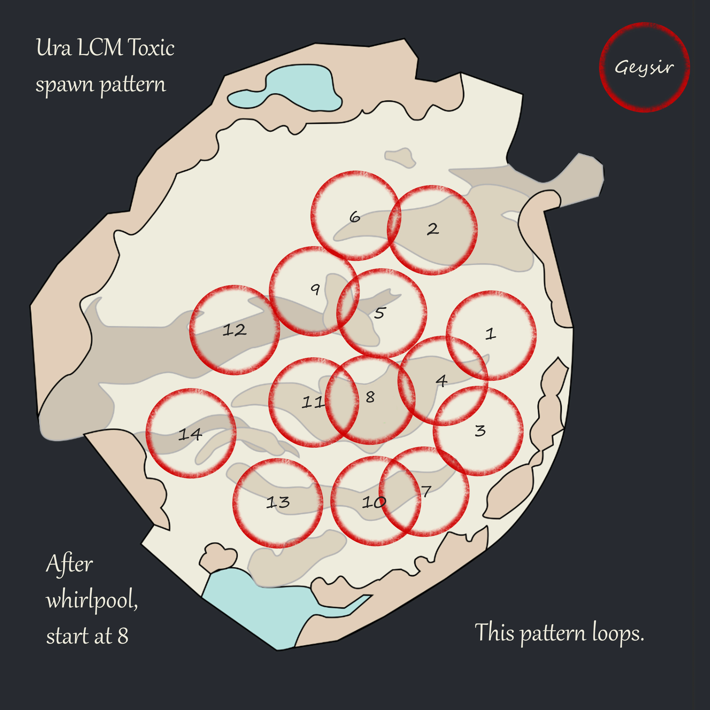

[Return to Home](../index.html){: .btn } [Return to Overview](./overview.html){: .btn } [Strategy Guide](./strategy.html){: .btn }

# Godscream Ura: Mechanics
{: .no_toc}

This section contains a detailed reference of the various attacks and mechanics present in the Godscream [Ura encounter]. 

The rest of this page is structured into the following sections:
1. **Overview** - basic description of the fight and its main points.
2. **Phases** - a description of the structure of the fight, with transitions and differences between phases.
3. **Mechanics** - a reference of every attack in the encounter.
4. **Effects** - a reference of all effects unique to the encounter.

### Table of Contents
{: .no_toc}

1. TOC
{:toc}

---

## Overview

The [Ura encounter] is split into 4 different phases, each characterised by a different set of mechanics that need to be dealt with. The phase transitions are %-based on Ura's health pool: 70%, 40%, 1% and for the final phase Ura heals back to 16% (CM), or 41% (LM) and this phase lasts until Ura is dead. Throughout the fight, the various mechanics require lots of breakbar damage, cleave damage, mobility and support in the form of  [Condition] cleanse and  [Stability].

### Enemy entities
{: .no_toc}

During the [Ura encounter] you will encounter different enemies. Next to Ura herself, who has increased health for Legendary Mode, there are three different types of Geysers, each requiring a unique way to be dealt with. [Titanspawn Geysers] also spawn extra enemies, [Champion Fumaroller] and [Legendary Ventshot], which also each require a unique way of dealing with them.

| **Enemy**                 | **Health**   | **Hitbox** | **Defiance Bar** |
| Godscream Ura (CM)        | 79,749,072   | 1,000      | 3000             |
| Godscream Ura (LM)        | 105,508,684  | 1,000      | 3000             |
| [Champion Fumaroller]     | 1,789,242    | 300        | 1000             |
| [Legendary Ventshot] (LM) | 23,594,400   | 300        | 2000             |
| [Toxic Geyser] (CM)       | 448,200      | 416        | 800              |
| [Toxic Geyser] (LM)       | 448,200      | 416        | 1000             |
| [Sulfuric Geyser]         | untargetable | 440 - 580  | -                |
| [Titanspawn Geyser]       | 448,200      | 210 - 416  | 2000             |

*Due to Ura regenerating at 1% health, her total health is 91,711,432 and 147,712,157 for the challenge and legendary modes (LM), respectively.*

### Table of Mechanics
{: .no_toc}

The following enemy attacks are used in the [Ura encounter] (more details in the mechanics section below):

| **Attack**      | **Common Name** | **Target**        | **Cooldown [s]** | **Brief Description** |
| [Scalding Aura] | -               | Inside her hitbox | -                | Deals damage applies  [Burning] |
| [Acid Spray]    | -               | Sprays targets in front of her | 1.5 | Used when her target is not in melee range. Applies  [Sulfuric Acid] |
| [Pressure Blast] | Bubbles, Friends  | Two random players  | ?                 | Traps two random players inside Bubbles who need to be freed by using  [Dispel] from a [Bloodstone Shard] |
| [Propel]        | Charge, Jump, Leap | Furthest player within 1500 range | 12 | Ura charges at the furthest player a fixed distance and dealing heavy damage when she lands |
| [Return]       | Toilet, Whirlpool | - | - | Swirls players around Ura and then teleports everyone and herself to a fixed location |
| [Steam Prison]  | Arena, Cage | Random | ~20 | Spawns a cage around a player that reflects projectiles. Need Stability/Blinks to get out |
| [Create Titanspawn Geyser]  |  Titanspawn | - | ~30 | Spawns a Titanspawn Geyser that will spawn enemies |
| Auto attacks | - | Tank | - | A series of 3 attacks, dealing damage and applying  [Vulnerability]. The third and final attack also does a  [Knockdown] |

---

## Phases

The fight starts when both [Bloodstone Shard]s are picked up and Ura will appear next to [Toxic Geyser] 11. The image below shows all Toxic Geyser spawnpoints ordered.

### Phase 1: 100% to 70%
{: .no_toc}

During Phase 1, Ura uses [Pressure Blast], [Propel], autoattacks, and [Acid Spray] (the last only if her target isn't in melee range). [Toxic Geyser]s start spawning every 12 seconds at spawnpoint 1 (refer to the image above for the order). The phase revolves around baiting Ura's [Propel] casts toward the [Toxic Geyser]s that spawn in order to minimize the needed movement for the supports to deal with the [Toxic Geyser]s. Once Ura hits 70% health, she will interrupt herself and cast [Return]. Note that if she interrupts herself while at the very beginning of a [Propel] cast, then she can bug out and not cast [Return]. Depending on her position, this can be fine, or essentially a wipe. During this transition, Ura's breakbar is locked.

### Phase 2: 70% to 40%
{: .no_toc}

Assuming a succesful [Return] cast from Ura, phase 2 starts after the cast has gone through and everyone is being ported to her new starting location (next to [Toxic Geyser] 11). The [Toxic Geyser] timer continues from phase 1, however, the next spawnpoint changes to 8 and will continue from there (9, 10, ...) in phase 2. Further, the spawntime between [Toxic Geyser] changes to 24s in CM, but it stays at 12s for LM.

Ura herself is stationary in phase 2 and will not move at all aka not cast [Propel]. Additionally, Ura also stops casting [Pressure Blast], but instead casts [Create Titanspawn Geyser], [Sulfuric Geyser] and [Steam Prison]. This phase continues until 40% at which point she self-interrupts any ongoing animation and immediately casts [Pressure Blast].

### Phase 3: 40% to 1%
{: .no_toc}

Phase 3 at 40% always starts with Ura self-interrupting and casting [Pressure Blast], which is included in her skillset during phase 3 again. Additionally, Ura can also cast [Propel] again. This requires that some players need to tank Ura, which means that they need to stand in her field of view, which is roughly a 150° cone. If no player is in Ura's field of view, Ura will use Propel. Furthermore, the [Toxic Geyser] timing immediately resets and a [Toxic Geyser] spawns at 7 and continues from there. All of this means that the 40% transition in particular can become very quickly and chaotic, so try to be prepared for it. This phase continues until Ura hits 1%, at which point she will become invulnerable and heal herself.

### Phase 4: Healed, 41%/15% to 0%
{: .no_toc}

When Ura reaches 1% health, Ura heals herself by 15% (CM), or 40% (LM) and the final phase starts with her doing an animation while being invulnerable and clearing all conditions. Ura's skillset is the same as in phase 3, which means Ura also needs to be tanked. The [Toxic Geyser] pattern continues from phase 3 without any timer/location resets. The only change in Ura's attacks is that [Sulfuric Geyser] now targets two players at once, instead of only one.

> Note: Ura will self-interrupt herself at 40% in phase 4 again due to the self-interrupt that happens from the transition of phase 2 into phase 3. This is an unfortunate bug that can lead to animations being cancelled and Ura incorrectly using Propel.

Right at the start of this phase, a [Titanspawn Geyser] will always spawn, independent of Ura's [Create Titanspawner Geyser] attack and cooldown. This [Titanspawn Geyser] is otherwise similar in that it will spawn enemies though. The difference between CM and LM is, that while during CM the [Titanspawn Geyser] will keep spawning [Champion Fumaroller] during phase 4, in LM all [Titanspawn Geyser]s spawn [Legendary Ventshot] during phase 4. This is a key difference that requires special strategic considertion, because [Legendary Ventshot]s have heavy hitting melee and ranged attacks. This phase continues until Ura is dead.

---

## Mechanics

Ura has a priority based system for her attacks. Depending on the phase, some attacks are not in Ura's skillset, but other then that Ura follows the following priority:
Ura has a priority rotation, and the skills she has available depend on the phase, but it'll always be in this order:
1. [Pressure Blast] (Phase 1, 3, 4)
2. [Create Titanspawn Geyser] (Phase 2, 3, 4)
3. [Sulfuric Geyser] (Phase 2, 3, 4)
4. [Steam Prison] (Phase 2, 3, 4)
5. [Propel] (Phase 1, 3, 4)
6. Autoattacks (Phase 1, 3, 4)
7. [Acid Spray] (all Phases)

### Ura's Breakbar and [Titanic Resistance]
{: .no_toc}

Ura has a breakbar of 3000. However, every time you break her bar, Ura gains one stack of  [Titanic Resistance]. This reduces any incoming breakbar damage by 5% and is additive. This means, once Ura has 10 stacks of  [Titanic Resistance], incoming CC is reduced by 50%, which effectively translates into Ura's breakbar being 6000 large. Additionally, Ura regenerates her breakbar in LM (not in CM) by 150/s, which is also effectively higher with more [Titanic Resistance] stacks. The table below shows the effective size of Ura's breakbar. [Titanic Resistance] essentially limits the amount of times the breakbar can be broken to roughly 13 to 15 times, depending on the squad composition and hence also dictates the timing of when to break the bar, which comes out to be roughly every 40 to 50 seconds, again depending on the squad composition. Once Ura's breakbar is broken, her animation will be interrupted and Ura will lose all [Rising Pressure] stacks.

| Stacks of [Titanic Resistance] | CC reduction |  Adjusted regen [1/s] | Adjusted CC bar |
| 0  | 1    | 150  | 3000  |
| 1  | 0,95 | 158  | 3158  |
| 2  | 0,9  | 167  | 3333  |
| 3  | 0,85 | 176  | 3529  |
| 4  | 0,8  | 188  | 3750  |
| 5  | 0,75 | 200  | 4000  |
| 6  | 0,7  | 214  | 4286  |
| 7  | 0,65 | 231  | 4615  |
| 8  | 0,6  | 250  | 5000  |
| 9  | 0,55 | 273  | 5455  |
| 10 | 0,5  | 300  | 6000  |
| 11 | 0,45 | 333  | 6667  |
| 12 | 0,4  | 375  | 7500  |
| 13 | 0,35 | 429  | 8571  |
| 14 | 0,3  | 500  | 10000 |
| 15 | 0,25 | 600  | 12000 |
| 16 | 0,2  | 750  | 15000 |
| 17 | 0,15 | 1000 | 20000 |
| 18 | 0,1  | 1500 | 30000 |
| 19 | 0,05 | 3000 | 60000 |
| 20 | 0,0  | inf  | inf   |

---

### [Toxic Geyser]
{: .no_toc}

[Toxic Geyse]r have a breakbar of 800 in CM, and 1000 in LM. Breakbar regeneration exists only in LM and is 150/s. [Toxic Geyser] spawn with a 580 radius AoE around them, applying an ever-increasing amount of  [Poison] every second and additionally  [Sulfuric Acid] when over 10x  [Poison] stacks. Furthermore, this AoE circle also increases every second by 10 units. CCing a [Toxic Geyser] disables the AoE field and resets its radius. [Toxic Geyser]s are immune to damage when spawning, but can be made vulnerable by using  [Dispel] from a player carrying a [Bloodstone Shard]. A [Toxic Geyser] that is vulnerable and has been CCd will disappear; instead of CCing, killing the [Toxic Geyser] also works. Because [Toxic Geyser]s are constructs, they have lower armor and thus Power based dps deals more damage to them.

### [Scalding Aura]
{: .no_toc}

This AoE aura is always active and hits players who step too far inside Ura's hitbox. Deals damage applies  [Burning].

---

### [Acid Spray]
{: .no_toc}

This attack is used when Ura's target is not in melee range and she has no other attack to cast that doesn't require a melee target. Ura shoots out many small projectiles that apply  [Sulfuric Acid] when hit.

---

### [Pressure Blast]
{: .no_toc}

This mechanic captures two random players inside bubbles which start floating upward. After some time, the captured players will drop down dead. They can be freed by using [Dispel] from a player holding a [Bloodstone Shard]. The cooldown of [Pressure Blast] starts ticking once all the captured players are freed and hence it's of highest importance to free the captured players always as fast as possible (to mitigate the chance of Ura casting [Propel] during Phase 3 and 4).

---

### [Propel]
{: .no_toc}

Ura can use [Propel] during Phase 1, 3, and 4. When it's used, Ura targets the furthest player and charges a fixed distance. Propel deals heavy damage when Ura lands on the ground, but this can be mitigated with any block, or evade.

---

### [Return]
{: .no_toc}

Ura swirls players around her and then teleports herself and all captured players to her spawnpoint. This attack happens when Ura hits 70%, but also if Ura hits the edge of the arena (e.g. during phase 1 if you make her jump out of the arena).

---

### [Steam Prison]
{: .no_toc}

Spawns an arena/cage around a randomly selected player. While being caught inside, all projectiles are reflected, so be extra careful to not down yourself. Players caught inside, can be given  [Stability] which allows them to walk through the wall to get outside. Skills like Blink also work to get out. When placing the arena, movement skills like Spear 2 on Engineer, Spear 3 on Thief can be used with the correct timing to not get caught. Superspeed also allows placing the arena and getting safely out by just running quickly enough before the arena spawns.

---

### [Create Titanspawn Geyser]
{: .no_toc}

When [Create Titanspawn Geyser] is used, Ura jumps into the air and lands on the ground, damaging everyone in the orange AoE centered around her. This attacks deals moderate damage and should be avoided (Aegis, Evade/Dodge), especially in later phases. After her cast, a [Titanspawn Geyser] will spawn, which immediately spawns a [Champion Fumaroller] (or a [Legendary Ventshot] in LM during phase 4). Another add will spawn every 15 seconds. Therefore, [Titanspawner Geyser] should be quickly killed. They spawn invulnerable, but can be made vulnerable by using  [Dispel] from a player carrying a [Bloodstone Shard] next to them. Because [Titanspawn Geyser]s are constructs, they have lower armor and thus Power based dps deals more damage to them.

### [Champion Fumaroller]
{: .no_toc}

[Champion Fumaroller] spawn from [Titanspawn Geyser] during the [Ura encounter]. They generally target players close to them and can be baited close to the boss in order to cleave and kill them. They have three notable attacks: 1) a "headbutt-charge" that does a  [Knockback], 2) a red star/snowflake pattern attack which deals heavy damage while standing on the lines of this pattern, and 3) an attack where they roll around in place, dealing damage and  [Knockback].

---

### [Legendary Ventshot]
{: .no_toc}

[Legendary Ventshot] only spawn in LM during phase 4 from [Titanspawn Geyser]s instead of [Champion Fumaroller]. They have over 20 million health and are therefore not meant to be killed. They have multiple attacks, giving [Rising Pressure] stacks to nearby titans and geysers, melee attacks dealing heavy damage and ranged projectile attacks dealing heavy damage. [Legendary Ventshot]s target nearby enemies, which means they can be kited by Mechanist, or Ranger pets. This is extremely beneficial to prevent them from coming to the squad and starting a lethal barrage of melee attacks. Furthermore, due to their ranged projectile attacks, once multiple [Legendary Ventshot] enemies are alive, it is essentially required to keep up projectile denial all the time, which needs to be reflected in the squad composition for LM.

---

### Ura's auto attack chain
{: .no_toc}

Ura uses her auto attacks during phase 1. This attack has three parts that deal damage and apply  [Vulnerability] when hit. The third and final part also does a  [Knockdown]. All attacks can be simply sidestepped, or mitigated by blocks, or evades.

---

### [Bloodstone Shard]
{: .no_toc}

For the [Ura encounter], two [Bloodstone Shard]s are available to use. Various mechanics require the use of them, so frequent dropping and pick-up is required. Whenever a [Bloodstone Shard] is dropped, the player who dropped the shard will get [Bloodstone Saturation], which is a 45 second debuff that deals 25% health pool damage to that player whenever holding a [Bloodstone Shard]. This essentially means that players cannot pick-up and hold [Bloodstone Shard]s repeatedly for long periods of time and hence, players need to rotate for using the shard.

Whenever a [Bloodstone Shard] is on the ground, after 4-5 seconds they start pulsing arena-wide AoE damage every 3 seconds ([Bloodstone Radiation]), which deals 10% health pool damage to every player and 30% health pool damage to downed players. Therefore, it's important to always quickly pick-up any dropped [Bloodstone Shard], which requires good coordination.

---

## List of Effects
Ura's encounter has various effects applied to players or enemies, which are listed below for reference purposes.

###  [Rising Pressure]
{: .no_toc}

Ura, [Champion Fumaroller] and [Legendary Ventshot] gain one stack of [Rising Pressure] every 8 seconds in LM and every 12 seconds in CM. This effect increases damage dealt and reduces incoming damage by 5% per stack (additively). Breaking the enemy entities defiance bar removes all [Rising Pressure] stacks.

---

###  [Bloodstone Saturation]
{: .no_toc}

A buff applied to players when they made use of a [Bloodstone Shard] that lasts for 45 seconds and can stack. Deals 25% health pool damage per stack to players while they hold a [Bloodstone Shard].

---

###  [Deterrence]
{: .no_toc}

A buff a player gets when holding a [Bloodstone Shard].

---

###  [Sulfuric Acid]
{: .no_toc}

A debuff applied by various mechanics during the [Ura encounter] that can stack. Can be cleansed by usual condition cleanse skills, but only ever one stack at a time, even if the skill used cleanses multiple conditions. Furthermore, condition transfer does cleanse the [Sulfuric Acid], but not transfer it to the enemy. [Sulfuric Acid] deals damage every second and applies one stack of [Exposed] every 5 seconds. Therefore, it is crucial to quickly cleanse all [Sulfuric Acid] stacks.

---

[Return to Home](../index.html){: .btn } [Return to Overview](overview.html){: .btn } [Return to Top](#ura-mechanical-reference){: .btn .fixed}

[Ura encounter]: https://wiki.guildwars2.com/wiki/Mount_Balrior#Challenge_and_legendary_mode
[Acid Spray]: https://wiki.guildwars2.com/wiki/Acid_Spray
[Pressure Blast]: https://wiki.guildwars2.com/wiki/Pressure_Blast_(Ura)
[Propel]: https://wiki.guildwars2.com/wiki/Propel
[Scalding Aura]: https://wiki.guildwars2.com/wiki/Scalding_Aura
[Sulfuric Acid]: https://wiki.guildwars2.com/wiki/Sulfuric_Acid
[Sulfuric Froth]: https://wiki.guildwars2.com/wiki/Sulfuric_Froth_(skill)
[Return]: https://wiki.guildwars2.com/wiki/Return
[Steam Prison]: https://wiki.guildwars2.com/wiki/Steam_Prison
[Create Titanspawn Geyser]: https://wiki.guildwars2.com/wiki/Create_Titanspawn_Geyser
[Eruption Vent]: https://wiki.guildwars2.com/wiki/Eruption_Vent
[Titanspawn Geyser]: https://wiki.guildwars2.com/wiki/Titanspawn_Geyser
[Toxic Geyser]: https://wiki.guildwars2.com/wiki/Toxic_Geyser
[Sulfuric Geyser]: https://wiki.guildwars2.com/wiki/Sulfuric_Geyser
[Champion Fumaroller]: https://wiki.guildwars2.com/wiki/Champion_Fumaroller
[Legendary Ventshot]: https://wiki.guildwars2.com/wiki/Legendary_Ventshot
[Rising Pressure]: https://wiki.guildwars2.com/wiki/Rising_Pressure
[Titanic Resistance]: https://wiki.guildwars2.com/wiki/Titanic_Resistance
[Dispel]: https://wiki.guildwars2.com/wiki/Dispel_(Mount_Balrior)
[Bloodstone Shard]: https://wiki.guildwars2.com/wiki/Bloodstone_Shard_(Mount_Balrior)
[Bloodstone Saturation]: https://wiki.guildwars2.com/wiki/Bloodstone_Saturation
[Deterrence]: https://wiki.guildwars2.com/wiki/Deterrence
[Bloodstone Radiation]: https://wiki.guildwars2.com/wiki/Bloodstone_Radiation

[Aegis]: https://wiki.guildwars2.com/wiki/Aegis
[Protection]: https://wiki.guildwars2.com/wiki/Protection
[Resolution]: https://wiki.guildwars2.com/wiki/Resolution
[Might]: https://wiki.guildwars2.com/wiki/Might
[Stability]: https://wiki.guildwars2.com/wiki/Stability
[Condition]: https://wiki.guildwars2.com/wiki/Condition
[Poison]: https://wiki.guildwars2.com/wiki/Poisoned
[Burning]: https://wiki.guildwars2.com/wiki/Burning
[Vulnerability]: https://wiki.guildwars2.com/wiki/Vulnerability
[Knockdown]: https://wiki.guildwars2.com/wiki/Knockdown
[Knockback]: https://wiki.guildwars2.com/wiki/Knockback
