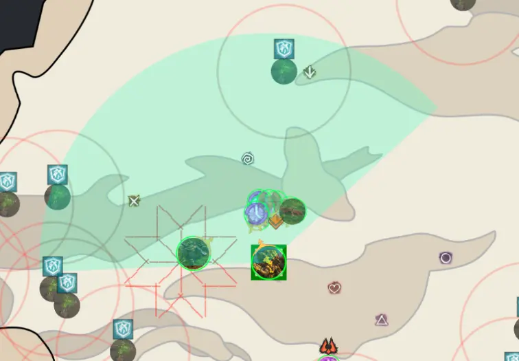
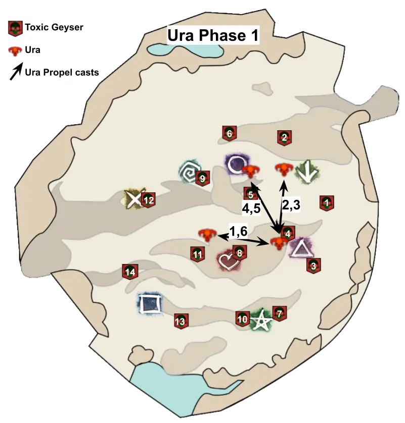
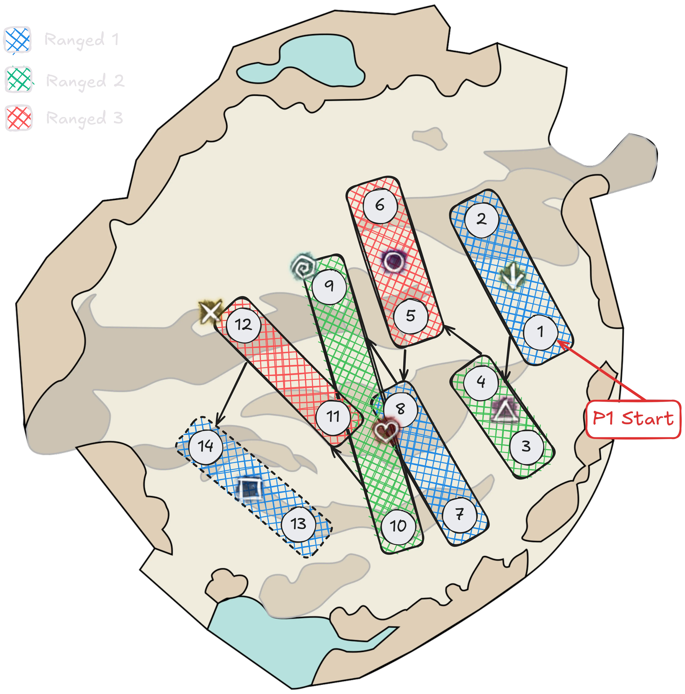
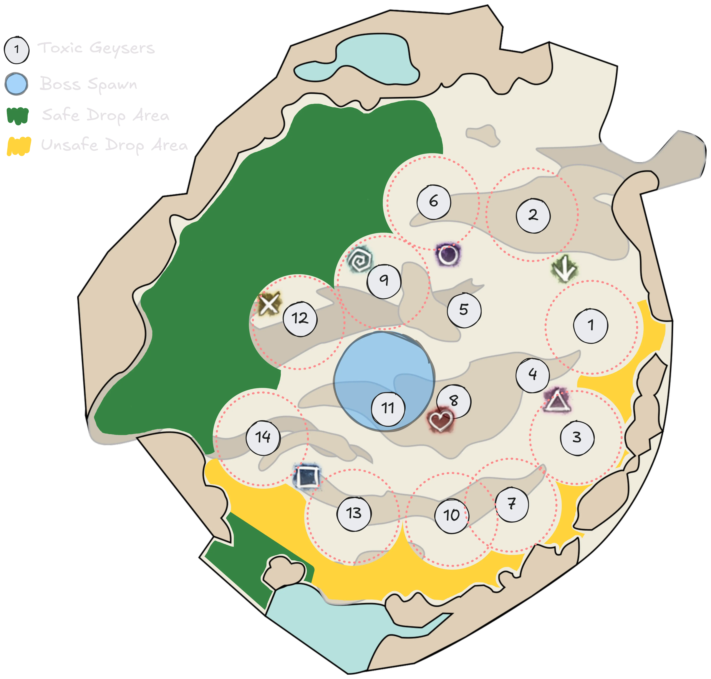

[Return to Home](../index.html){: .btn } [Return to Overview](./overview.html){: .btn } [Mechanical Reference](./mechanics.html){: .btn }

# Recommended Ura Strategy
{: .no_toc}

This strategy for Challenge Mode focuses on smoothing out communications regarding everything that has to do with [Bloodstone Shards] and  [Dispel]. This is often the hardest part of the encounter: making sure a shard is available, used, and then picked up as fast as possible every time it becomes necessary for a new mechanic.

This is achieved through a proper division of roles, where different parts of the squad circulate different shards to take care of specific threats, while also trying to provide good damage, boon uptime, and defensive utility.

---

#### General Points
- The squad divides into a _ranged group_ and a _melee group_. Each of these groups rotates a single [Bloodstone Shard] to take care of different mechanics.
- The ranged group takes care of [Toxic Geysers].
- The melee group takes care of [Bubbles] and [Titanspawners].
- Ura is tanked from the third phase onwards to prevent her from casting [Propel].
- Ura's  [Defiance Bar] must be broken only at specific intervals from the third phase onwards to prevent her from casting [Propel].

The rest of this page is structured into the following sections
1. [Composition](#composition) - commonly used classes, roles and subgroup structure.
2. [Group Division](#group-division) - information on the division between ranged and melee groups.
3. [Preventing Propel](#preventing-propel) - information on tanking and CC timings to avoid [Propel].
4. [Phase-by-Phase](#phase-1) - main explanation of the fight divided by phases.

## Composition

Ura CM is generally played with three healers, who must bring high amounts of crowd control to deal with [Toxic Geysers] and  [Titanic Resistance]. Furthermore, they benefit from high survivability and mobility to facilitate mechanics, and  [Stability] for their subgroups. For these reasons, the most commonly played specialization in this role is  [Chronomancer], followed by  [Druid],  [Scourge] (often with a Celestial build), and  [Specter].

[ Chronomancer Build](https://gw2skills.net/editor/?PigEQiWmBDhZxuYj4RPp26A-DSRYjR1VPSIFlRLpQ6VluvGCSo83S7bWQFA-e){: .btn} [ Scourge Build](https://en.gw2skills.net/editor/?PSAFw8laYZGMJ2DLiNip6V2rH-DSRYjRPV1HSI1ALkWigqLg0TBdvNEkQZP8aQwmFoC-e){: .btn} [ Druid Build](https://gw2skills.net/editor/?POwEYKNssBmC7gxwKxxXSvpVi37B-DSRYjRwHCSUjuLjqrq0TBfvOEkQ5vl23sgKA-e){: .btn}
{: .center}

BoonDPS can bring additional utility to the fight, such as extra CC and  [Stability], but this is not usually a limiting factor. Damage players can bring both  [Power] and  [Condition] builds, though it is beneficial to bring a couple of  [Power] builds to handle [Titanspawn Geysers], since they have lower overall toughness. The fight also benefits builds with high cleave damage for both Titanspawners and [Champion Fumarollers], and extra mobility for easily placing [Sulfuric Geysers].

Usually, one or two of the DPS players will have the additional responsibility of  _tanking_ Ura through the third and fourth phase of the fight. These should play a high damage build, since they will not participate in some mechanics and thus will have the greatest damage uptime on the boss. See [tanking Ura](#tanking-ura) for more information.

|       | Heal              | DPS/Hybrid Support | DPS       | DPS       | DPS       |
| Sub 1 |  [Chrono] | DPS Support        |  [Power] |  [Power] | Any DPS  |
| Sub 2 |  [Chrono] | Hybrid/Full Heal   | Any DPS   | Any DPS   | Any DPS   |

---

## Group Division

The most important concept underpinning this strategy is the way it manages [Bloodstone Shards] by dividing the squad into two groups:
- A _ranged group_ containing the three healers shares one shard (the _ranged shard_), using it to  [Dispel] all [Toxic Geysers] throughout the fight.
- A _melee group_ containing everyone else (except for the tank) shares the other shard (the _melee shard_), using it to  [Dispel] the [Pressure Blast] (aka Friends, Bubbles) and [Titanspawn Geysers].

Before the fight starts, it is common practice to set up the order in which players will use the shard, often called the "rotation". In this way, whenever a player is about to use a shard, they can call out the next person in the rotation and the location where it will be dropped, so that they can be prepared to pick it up. Having a rotation is extremely important for the ranged group, but confident squads often forgo an explicit melee rotation, instead trusting players to pick up the shard whenever their [Bloodstone Saturation] debuff runs out.

#### Marker Packs
{: .no_toc}

Especially for the ranged group, it is extremely beneficial to install [HasKha's Markers](https://github.com/HasKha/gw2-markers) for [Blish HUD](https://blishhud.com/)'s [Pathing Module](https://blishhud.com/modules/?module=bh.community.pathing). This pack will show an overlay for geysers, allowing players to use numbered [Toxic Geyser] spawn positions as shown [here](/mechanics.html#toxic-geysers) for callouts. The pack can be installed directly from the Pathing Module's marker repository.

Alternatively, groups can use in-game markers. This is an inferior option compared to the overlay, since there are 14 spawn locations and only 8 different markers available. The following marker pack (requires Blish HUD's [Commander Markers](https://blishhud.com/modules/?module=Manlaan.CommanderMarkers) module) makes the certain optimizations to manage this issue:

- Markers on geysers number 5, 8, 9, and 12.
- Markers between toxic geysers that are usually double dropped: 1 & 2, 3 & 4, 7 & 10, 13 & 14.
- No marker on 11 because it's in the boss anyways, so it's an easy one to remember, especially when you have the marker on 8 as reference point.

Click to view markers

<contents>

Paste the following code into Commander Markers to use this marker pack:

<code class="wrap">
eyJlbmFibGVkIjp0cnVlLCJuYW1lIjoiVXJhIENNL0xNIiwiZGVzY3JpcHRpb24iOiJUaGVzZSBtYXJrZXJzIHNob3cgdGhlIG1vc3QgaW1wb3J0YW50IFRveGljIEdleXNlcnMgYW5kIGFyZSBhbHNvIHVzZWZ1bCBmb3IgZ2VuZXJhbCBkaXJlY3Rpb24uIiwibWFwSWQiOjE1NjQsInRyaWdnZXIiOnsieCI6MTU3LjI0Njc1LCJ5IjoyMzkuOTE4MTgyLCJ6IjoyNjkuOTI4OTI1fSwibWFya2VycyI6W3siaSI6MSwiZCI6IlRveGljIEdleXNlciAxLzIiLCJ4IjoxODguOTI1NzIsInkiOjI2MS42MDE2ODUsInoiOjI2OS45MjkxNjl9LHsiaSI6MiwiZCI6IlRveGljIEdleXNlciAzLzQiLCJ4IjoxODguMDQ5OTQyLCJ5IjoyMjYuMTQwMDMsInoiOjI2OS45Mjg5MjV9LHsiaSI6MywiZCI6IlRveGljIEdleXNlciA4IiwieCI6MTYyLjA0NjYzMSwieSI6MjI4LjI3MTc0NCwieiI6MjY5Ljk5MDg3NX0seyJpIjo0LCJkIjoiVG94aWMgR2V5c2VyIDEzLzE0IiwieCI6MTI0LjM0Njc5NCwieSI6MjA5Ljg0OTY0LCJ6IjoyNjkuOTg2NDJ9LHsiaSI6NiwiZCI6IlRveGljIEdleXNlciA5IiwieCI6MTQ1LjgzMTc3MiwieSI6MjU4LjQ0MDgyNiwieiI6MjY5LjkzNDc4NH0seyJpIjo1LCJkIjoiVG94aWMgR2V5c2VyIDcvMTAiLCJ4IjoxNzAuOTA3MzY0LCJ5IjoyMDIuNDc5NTUzLCJ6IjoyNzAuMDYyOTU4fSx7ImkiOjcsImQiOiJUb3hpYyBHZXlzZXIgNSIsIngiOjE2NS43MjUyMzUsInkiOjI1Mi41NTQ5NjIsInoiOjI2OS45MzQ3ODR9LHsiaSI6OCwiZCI6IlRveGljIEdleXNlciAxMiIsIngiOjEyMi40NDU4MTYsInkiOjI0OS43ODIxMiwieiI6MjY5LjkyODkyNX1dfQ==
</code>
</contents>

## Preventing [Propel]
{: .no_toc}

In the third and fourth phase, Ura regains access to [Propel]. It is possible to prevent her entirely from casting this skill, which is extremely convenient since it keeps her stationary in a central position, from which it is easy to access [Titanspawn Geysers] and drop [Sulfuric Geysers]. Furthermore, this also increases damage uptime and prevents her from entering the area of [Toxic Geysers] and [Sulfuric Geysers].

The reason why this is possible is that Ura has many skills with a higher priority than [Propel]. Checking the table below, which contains rough times for several of Ura's skills:

|Skill                     |Priority|Cooldown [s]|Cast Time [s]|Aftercast [s]|
|[Pressure Blast]          |1       |25          |5            |1.5          |
|[Create Titanspawn Geyser]|2       |30          |5            |2            |
|[Sulfuric Geyser]         |3       |20          |5            |4            |
|[Steam Prison]            |4       |15          |7            |5            |
|[Propel]                  |5       |12          |4            |2            |

The total cast time for all of the higher priority skills comes down to around 34.5 seconds: enough for the first one cast to come off cooldown as the last ones are concluding. This means that there will always be a higher priority skill in Ura's queue, which will always be selected over [Propel].

Ura can still use her jump in two situations:
- If a higher priority skill is skipped due to having no valid targets.
- If a higher priority skill gets interrupted by breaking Ura's  [Defiance Bar], removing the skill's cast and aftercast from the queue.

To avoid these two situations, we need to take appropriate countermeasures by [tanking](#tanking-ura) Ura and [controlling when we break her defiance](#when-to-cc-ura).

---

#### Tanking Ura

This is necessary to always provide a target for Ura's high priority skills so that she does not skip them to cast [Propel]. The designated tank should stand in front of the boss, within a 400 range, 140° cone. A backup tank should also be designated, so that if the primary tank must do a mechanic there is always someone capturing Ura's aggro.

Whenever Ura chooses a random target for [Steam Prison] and [Sulfuric Geyser], she will rotate to track this target: the tank should always be ready to reposition accordingly. This can also be used to face the boss in certain directions. For example, facing her North-West places the stack the shortest possible distance from safe [Sulfuric Geyser] drop zones.

---

#### When to CC Ura

Breaking Ura's  [Defiance Bar] only in certain intervals avoids cancelling skills amd thus freeing up Ura's skill queue, which could lead to her using [Propel].

The best moments to CC Ura correspond with the following skills:
1. [Create Titanspawn Geyser] - once in the air, and up to 5 seconds after she lands. The safest moment to CC.

2. [Steam Prison] - once she lowers her arms and the arena becomes active, for 3 seconds.

3. [Sulfuric Geyser] - once the indicator starts, which is roughly when she has stretched her arm out front fully, for about 2-3 seconds.

Gifs by Elise

It is not recommended to CC during [Pressure Blast] as it is the most difficult timing.

## Phase 1

#### 100% - 70%
{: .no_toc}

The fight starts when both [Bloodstone Shards] are picked up. Usually a player from the melee group picks up the first one, then a player from the ranged group picks up the second when everyone is in position to start the fight.

Throughout this phase  [Dispel] must be used to manage [Pressure Blast] (aka Bubbles) and [Toxic Geysers].

---

#### Handling Bubbles
{: .no_toc}

The two players targeted by [Pressure Blast] should stack together separate from the rest of the group (possibly in melee range of the boss so as to upkeep DPS), so that the melee shard holder can save both of them with a single  [Dispel]. The shard holder will not be affected by [Pressure Blast], so they can stack on top of their affected teammates.

If there is a rotation, players should call out the next person after using their shard, who should then quickly pick it up. Since there is little other pressure for the melee players in this phase, groups progressing the fight should use it to practice their rotation and get it perfect for the following phases.

---

#### Baiting [Propel]
{: .no_toc}

Throughout this phase, Ura will usually use [Propel] after every [Pressure Blast] (though this can change). Players in the ranged group should be aware of this and try to bait the jump away from geysers into potentially advantageous positions. An example movement pattern is shown in the image below:

---

#### Double Sharding [Toxic Geysers]
{: .no_toc}

Throughout the first phase, the spawn rate of [Toxic Geysers] is doubled compared to the rest of the fight. This means that players in the ranged group must  [Dispel] _two_ [Toxic Geysers] every time it's their turn in the rotation. This is called "Double Sharding", and involves using  [Dispel] on a geyser, then quickly picking up the [Bloodstone Shard], moving to a second geyser, and using  [Dispel] again. In between the two uses, the shard holder must survive the ticking damage from  [Bloodstone Saturation], which inflicts 20% of their maximum HP per second.

To simplify double sharding, it is best to wait for both [Toxic Geysers] to spawn before using  [Dispel] on the first, so as to not have to wait between casts. Mobility skills are also extremely useful for quickly moving from one geyser to the other, though not strictly necessary.

{: .note}
As an alternative strategy, groups can "single shard" by assigning one subgroup to the ranged rotation and the other to the melee rotation. While this is much safer, as the ranged group will not take any damage from  [Bloodstone Saturation], it is also less common in kill runs as it does not provide the same role compression as double sharding. Furthermore, if you are interested in clearing the [Legendary Mode](../ura-lcm/overview.html), learning how to double shard will help you in the long run.

Once a geyser has been  [Dispelled], breaking its  [Defiance Bar] will kill it. Analogously, using  [Dispel] on a geyser with a broken  [Defiance Bar] will kill it. Since geysers do not regenerate defiance in Challenge Mode, as soon as one spawns the ranged group members can start doing some CC damage to it, so that it is more easily broken later on.

When double sharding, it is normal to CC whichever [Toxic Geyser] that you first pick the [Bloodstone Shard] from, and the first geyser in your double drop sequence.

---

#### Other Information
{: .no_toc}

After using [Propel], Ura will generally use her [Autoattack Chain], which requires  [Aegis] or  [Stability] for the last hit. Players should always try to sidestep this skill, as their healers will often be off-stack doing mechanics.

Ura should be CCd roughly whenever she gains 5 stacks of  [Rising Pressure]. This will help to keep the pace, while also not getting overwhelmed by the required amount of CC in the later phases.

## Phase 2
#### 70% - 40%
{: .no_toc}

Ura will begin this phase by casting [Return] and then trapping everyone in bubbles. This must be  [Dispelled] by the player holding the melee shard. If Ura used [Pressure Blast] just before this transition, this player should keep their shard and use it to save both the targeted players and the rest of the group.

---

#### Managing Titanspawners
{: .no_toc}

Ura will use [Create Titanspawn Geyser] immediately after [Return] and frequently thereafter. Players should try to dodge the knockback if possible, and as soon as the skill is done the squad should move to the geyser's location to quickly  [Dispel] it and burst it down (remembering to pick up the [Bloodstone Shard]!). After the geyser is dead, immediately return to stack at the boss, and try to kill the [Champion Fumaroller] on top of it.

Fumarollers target players and their allies, so it is beneficial to stack opposite Ura compared to it and recall pets so that it quickly moves on top of the boss to be cleaved. Future casts of [Create Titanspawn Geyser] should be handled in the same manner.

Ideally the titanspawner should be killed within 15 seconds, so that it doesn't spawn a second [Champion Fumaroller]. Since these adds inflict large amounts of crowd control and damage, having multiple can quickly snowball the fight out of control.

---

#### Placing Sulfurics
{: .no_toc}

[Sulfuric Geyser] casts will start in this phase, targeting random players. Depending on where the player is standing, they will want to run out and drop them at different locations. Below is a map that shows shaded purple areas, which are good locations to drop Sulfurics at. Alternatively, [HasKha's Marker Pack](#marker-packs) also has indicators for safe sulfuric drop zones which are extremely useful.

Players should try to avoid running out in the North-East direction as the Toxic Geysers #1 and #2 are so far out, that you cannot make the distance without movement skills. This can cause geysers to drop on top of #1 or #2, making the ranged group's unnecessarily harder.

Conversely, the most convenient position to drop sulfurics is to the North-West: there is a large area there beyond the spawning points of geysers #9 and #12 that is often close to the stack. This is further facilitated if the squad faces Ura in that direction (see [tanking Ura](#tanking-ura)).

If you have movement skills, always use them to get away from the boss and don't save them to get back quickly, because getting further away and placing the geysers in safe spots is more important.  [Chronomancers] should try to provide returning players with a  [Dimensional Aperture] (Rifle 5) to quickly bring them back to the stack.

Players will gain  [Superspeed] whenever they are targeted, which lasts right up until the final drop position is reached. The geyser will then spawn after a short time interval. Players can use this to know exactly when they can return to the stack.

---

#### Managing the Steam Prison
{: .no_toc}

Ura's [Steam Prison] should be placed far enough from the boss so that players can navigate around her without danger of going inside the arena. Furthermore, try and pay attention to not overlap it with any other mechanics, such as [Toxic Geysers]. For the most part, players can always turn around 180° degrees and run away from the boss immediately. Before arena becomes active, the position of it is already fixed. You can use this brief period to use a movement skill or  [Superspeed] in order to get out of its area before becoming trapped. This removes the need for  [Stability], but requires precise timing. Try to practice this, as being stuck inside the arena in phase 3 and onwards can quickly become fatal.

---

#### Other Important Information
{: .no_toc}

It can happen in this phase and the following that [Pressure Blast] overlaps with [Create Titanspawn Geyser] or [Sulfuric Geyser] cast and you have a bubble on the geyser and one on the boss (especially if the [tank](#tanking-ura) is one of the targets!). Each player who gets targeted should always look for the second one immediately and move to a convenient position. In the case of titanspawners, this is often on the geyser since this allows players to  [Dispel] both the bubbles and the geyser with one shard.

The [Toxic Geyser] order in this phase will restart from #8. If geyser #9 spawned in the previous phase, it can be convenient to reset it with CC so that you only have to  [Dispel] it once, 24 seconds after #8. The ranged group will overall have an easier time managing geysers in this phase, since their cooldown will increase from 12 to 24 seconds, no longer requiring double sharding. Players should keep up calling where they use their shard so as to maintain the rotation.

## Phase 3
#### 40% - 1%
{: .no_toc}

Once Ura hits 40%, she self-interrupts and will immediately cast [Pressure Blast]. This transition can be very hectic, especially if it occurs in proximity to [Create Titanspawn Geyser], as melee shard management becomes difficult. Calling it out in voice helps players prepare for the bubbles and not be caught off-guard. The transition also resets [Toxic Geyser] spawn patterns: #7 will spawn immediately and the timer will be reset. This means the ranged group may have to handle two geysers in rapid succession.

Starting from this phase, Ura has access to all mechanics from the two previous phases. This means that while the ranged group will continue using their  [Dispel] only on [Toxic Geysers], the melee group will have to handle both [Pressure Blast] and [Create Titanspawn Geyser] for the rest of the fight. In particular, managing the bubbles as soon as possible is important to make the skill to go on cooldown (see [Preventing Propel](#preventing-propel)).

From this phase onwards, Ura can use [Propel] again. Therefore it is necessary to tank her and only CC in specific intervals. See [Preventing Propel](#preventing-propel) for more information.

## Phase 4
#### Healed - 0%
{: .no_toc}

On reaching 1% health, Ura will become  [Invulnerable], clear all  [Conditions] from herself, and heal by 15% of her maximum HP.

Immediately after the transition, there will always be an additional [Titanspawn Geyser] independent of the [Create Titanspawn Geyser] skill. Groups in this phase may decide to kill only this titanspawner and additionally 1-2 others, while ignoring the rest, based on their distance from the boss. In case multiple [Champion Fumarollers] come to the stack, it's important to provide additional  [Stability] and move off of any damaging AoEs so that they do not destabilize the squad.

Additionally, Ura will start targeting two players with [Sulfuric Geysers] instead of only one per cast. It's best to drop the Sulfuric Geysers next to each other instead of in two different spots in order to use the space efficiently and depending on how close the squad is to killing.

The [Toxic Geyser] patterns simply continues from the previous phase without interruptions. The ranged group can continue doing the first few as usual, with the added option of ignoring geysers far from the boss as the group gets closer to a kill and they become less relevant.

With good DPS, confident groups can ignore all [Titanspawn Geysers] and only reset [Toxic Geysers] close to the boss.

[Return to Home](../index.html){: .btn } [Return to Overview](overview.html){: .btn } [Return to Top](#recommended-ura-strategy){: .btn .fixed}
{: .center}

[Bloodstone Shard]: mechanics.html#bloodstone-shards
[Bloodstone Shards]: mechanics.html#bloodstone-shards
[Toxic Geyser]: mechanics.html#toxic-geysers
[Toxic Geysers]: mechanics.html#toxic-geysers
[Sulfuric Geyser]: mechanics.html#sulfuric-geysers
[Sulfuric Geysers]: mechanics.html#sulfuric-geysers
[Dispel]: mechanics.html#-dispel
[Dispelled]: mechanics.html#-dispel
[Titanspawn Geyser]: mechanics.html#titanspawn-geysers
[Titanspawn Geysers]: mechanics.html#titanspawn-geysers
[Titanspawners]: mechanics.html#titanspawn-geysers
[Create Titanspawn Geyser]: mechanics.html#titanspawn-geysers
[Pressure Blast]: mechanics.html#pressure-blast
[Pressure Blasts]: mechanics.html#pressure-blast
[Bubbles]: mechanics.html#pressure-blast
[Titanic Resistance]: mechanics.html#-titanic-resistance
[Champion Fumaroller]: mechanics.html#champion-fumaroller
[Champion Fumarollers]: mechanics.html#champion-fumaroller
[Bloodstone Saturation]: mechanics.html#-bloodstone-saturation
[Propel]: mechanics.html#propel
[Autoattack Chain]: mechanics.html#autoattack-chain
[Rising Pressure]: mechanics.html#-rising-pressure
[Steam Prison]: mechanics.html#steam-prison
[Return]: mechanics.html#return

[Chrono]: https://wiki.guildwars2.com/wiki/Chronomancer
[Chronomancer]: https://wiki.guildwars2.com/wiki/Chronomancer
[Chronomancers]: https://wiki.guildwars2.com/wiki/Chronomancer
[Druid]: https://wiki.guildwars2.com/wiki/Druid
[Specter]: https://wiki.guildwars2.com/wiki/Specter
[Scourge]: https://wiki.guildwars2.com/wiki/Scourge
[Power]: https://wiki.guildwars2.com/wiki/Power
[Condition]: https://wiki.guildwars2.com/wiki/Condition_damage
[Conditions]: https://wiki.guildwars2.com/wiki/Condition_damage
[Defiance Bar]: https://wiki.guildwars2.com/wiki/Defiance_bar
[Aegis]: https://wiki.guildwars2.com/wiki/Aegis
[Stability]: https://wiki.guildwars2.com/wiki/Stability
[Dimensional Aperture]: https://wiki.guildwars2.com/wiki/Dimensional_Aperture
[Superspeed]: https://wiki.guildwars2.com/wiki/Superspeed
[Invulnerable]: https://wiki.guildwars2.com/wiki/Invulnerability