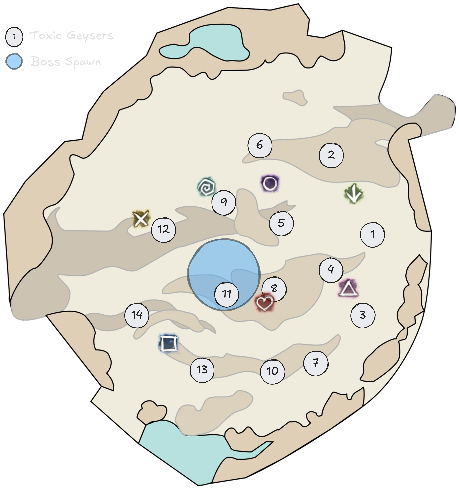

[Return to Home](../index.html){: .btn } [Return to Overview](./overview.html){: .btn } [Mechanical Reference](./mechanics.html){: .btn }

# Recommended Ura Strategy

> The following is a strategy that works in Legendary Mode. You can use the same strategy in Challenge Mode in order to already practice for transitioning to Legendary at some point.

There a few different ways to play Ura. This guide focuses on the following cornerstones:
- Using numbered Toxic Geysers,
- Supports doing as many double drops as feasable with Bloodstone Shards,
- Having at least 2-3 Power based dps for Titanspawn Geysers.

This means the squad composition will look roughly look like so:

|       | Heal              | DPS/Hybrid Support | dps       | dps       | dps       |
| Sub 1 |  [Chronomancer] | DPS Support        |  [Power] |  [Power] |  [Power] |
| Sub 2 |  [Chronomancer] | Hybrid/Full Heal   | Any dps   | Any dps   | Any dps   |

The two [Heal Chronomancers](https://gw2skills.net/editor/?PigEQiWmBDhZxcYj4RPp2+A-DSRYjR1VPSIFlRLpQ6VluvGCSo83S7bWQFA-e) typically run a build to be able to solo CC Toxic Geysers. This build maximises healing while being able to solo CC, which is good for LM. For CM where healing pressure is lower, you can also run a [different build](https://en.gw2skills.net/editor/?PigEQiWmBzhZxoYj4RPp26A-DSIYYUxXGtkCpXBO+aYICQxfZP0ALtvZBVA-e) that has more crowd control in exchange for less healing.

The two available [Bloodstone Shards] are split between two groups:
- The *Ranged Shard* group, composed of all four support players, that juggle their shard to  [Dispel] all the [Toxic Geysers].
- The *Melee Shard* group, composed of the other six DPS players, that juggle their shard to  [Dispel] all the [Titanspawn Geysers] and [Pressure Blasts].

> Note: having a blink skill is beneficial in some situations when dealing with shard drops for Toxic Geysers, especially in Legendary Mode. Therefore, you might also decide to use a dps player with a blink skill instead of a dps support that doesn't have a blink skill.

The three Power based dps focus and whoever carries the melee Bloodstone Shard at the time a Titanspawn Geyser spawns, quickly go to that Geyser and burst it down. Afterward they return to the boss and stack back up. The other three dps stay on the boss the whole time, but will be actively tanking, which means standing in the fron view of the boss such that Ura does not use Propel to charge away (Ura can still do that based on animation cancels, but this is another issue and unrelated to tanking).

> For clear communication, it is beneficial to e.g. call the Bloodstone Shard for Titanspawn Geysers and Bubbles "melee shard" and the other one for the Toxic Geysers "ranged shard" (or any other clear distinction that you prefer).

Markers can help for additional navigation, this is an examplary marker pack that can be useful:

```
eyJlbmFibGVkIjp0cnVlLCJuYW1lIjoiVXJhIENNIiwiZGVzY3JpcHRpb24iOiJkZWdlbnMiLCJtYXBJZCI6MTU2NCwidHJpZ2dlciI6eyJ4IjowLjAsInkiOjAuMCwieiI6MC4wfSwibWFya2VycyI6W3siaSI6MSwiZCI6Im1hcmtlciBuYW1lIiwieCI6MTU2LjYxODMsInkiOjI4MC41OTQxNDcsInoiOjI2OS45Mjg5MjV9LHsiaSI6MiwiZCI6bnVsbCwieCI6MTg5LjAxMDc1NywieSI6MjI4LjI5NTUzMiwieiI6MjY5LjkyODkyNX0seyJpIjozLCJkIjpudWxsLCJ4IjoxNjEuMjA5OTQ2LCJ5IjoyMjkuOTUxNjQ1LCJ6IjoyNzAuMDA3NzIxfSx7ImkiOjQsImQiOm51bGwsIngiOjEyNS40OTY0MTQsInkiOjIwOC42NDY4NjYsInoiOjI2OS45ODMwNjN9LHsiaSI6NiwiZCI6bnVsbCwieCI6MTQ1LjA0NDI1LCJ5IjoyNTkuMTkwNTIxLCJ6IjoyNjkuOTI4OTI1fSx7ImkiOjUsImQiOm51bGwsIngiOjE2OS43NDI3MjIsInkiOjE5Ni44NzcwNzUsInoiOjI2OS45Mjg5MjV9LHsiaSI6NywiZCI6bnVsbCwieCI6MTY1LjUzNDM2MywieSI6MjUwLjM3NzYsInoiOjI2OS45Mjg5MjV9LHsiaSI6OCwiZCI6bnVsbCwieCI6MTIyLjg4Mjk0MiwieSI6MjQ5LjQ1MDQ1NSwieiI6MjY5LjkyODkyNX1dfQ==
```


## 100% - 70%

Let one Heal Chronomancer pick up one of the Bloodstone Shards. The second shard is being picked up by any of the melee group. The Supports deal with all the Toxic Geysers and the dps players with the bubbles. Toxic Geyser spawn in order according to the following map:



The spawn pattern also dictates where you want to bait Ura's Propel such that the supports have to move as minimal as possible for Toxic Geysers. Therefore, always try to bait towards the next Toxic Geyser, but also in such a ways as to not make Ura charge on top of the Toxic Geyser, because then dropping and picking up the shard is more cumbersome.

Ura will alternate between her auto attacks, that can just be healed, stability'd, or aegis'd, bubbles, which are always placed left of the melee group and solved by having the melee group dropping and picking up the Bloodstone Shard and Propel, which just has to be baited as noted above. The baiting part can be done by one of the healers. Note that the furthest player is being targeted (within ~1500 range), so pay attention to that when doing Toxic Geysers.

For the bubbles, either let it melees do dynamically, or assign a rotation. If a rotation is used, you need to communicate in later phases in case the next person cannot pick it up though (e.g. in case they have a Sulfuric Geyser).

The two Heal Chronomancers will take care of CCing the Toxic Geysers. This can be done by simply alternating and solo CCing each Geyser. For example, one Heal Chrono can CC the uneven Toxic Geysers and the other the even ones. Going forward, The Heal Chrono in sub 1 (HC1) is assigned to do the uneven ones, and the Heal Chrono in sub 2 (HC2) the even ones. Solo CCing works by simply using either of the following 2 skill combos:

1. Well of Senility + Moa
1. Well og Senility + Spear 5 (Make sure that you have used Spear 2 for the buff beforehand) + Signet of Domination/Technobabble/Mantra of Distraction (the last only when running Mesmer Runes).

These suggested skills overcap the CC a little bit, which helps to give some leeway timing wise. The timing is only needed for LM though, because Toxic Geysers don't regenerate in CM.

The rough Propel pattern for phase 1 can be seen in the image below:


After these 6 Propel charges, Ura lands closely at her initial spot. Phasing like that is beneficial, because then you don't lose dps uptime while Ura casts Return and everyone swirls around. High enough dps phases before the sixth Propel use, in that case you can adapt the charge pattern to fit your squads needs.

Ideally you wann phase fast enough to get the Toxic Geyser 11 spawn. Having it spawn can be an indicator of lacking dps (for LM) anyways, so proceeding, we are going to assume 10 is the last Toxic Geyser that spawned in phase 1. Note though, that Toxic Geyser 10 can be ignored for now and will be dealt with later in phase 2.

The following table lists the Bloodstone Shard usages for Toxic Geysers in phase 1 (Heal Chrono sub 1 = HC1; Heal Chrono sub 2 = HC2; support from sub 1 = S1; support from sub 2 = S2):

| Toxic Geyser | Drop | Pickup |
| 1            | HC2  | HC2    |
| 2            | HC2  | HC1    |
| 3            | HC1  | HC1    |
| 4            | HC1  | S2     |
| 5            | S2   | S2     |
| 6            | S2   | HC2    |
| 7            | HC2  | HC2    |
| 8            | HC2  | S1     |
| 9            | S1   | HC1    |

Ura should be CCd roughly whenever Ura has 5 Rising Pressure stacks. This will help to keep the pace, while also not getting overwhelmed by the required CC amount in the later phases.

## 70% - 40%

After Ura casted Return everyone will be trapped in bubbles. The melee Bloodstone Shard frees everyone and another melee player picks it up. Next, Ura will immediately start casting Create Titanspawn Geyser. As previously mentioned, always the 3 designated Power dps and whoever has the Bloodstone Shard at that moment will go there, drop the Bloodstone Shard immediately and burst down the Titanspawn Geyser. After the Titanspawn Geyser is dead, immediately return to the stack at the boss.

New in phase 2 are also Sulfuric Geyser casts, which will target a random player. Depending on where you stand, you want to run out to different spots. Below is a map that shows shaded purple areas, which are good locations to drop Sulfurics to. The 5 circles near the boss and the associated arrows indicate the direction you should run out when standing on those sides of the boss. Notably, running out toward the North to East direction is always bad, because the Toxic Geysers 1 and 2 are so far out, that you cannot make the distance without movement skills. This can cause Sulfurics Geysers dropped at Toxic Geysers 1, or 2, which makes the Heal Chronos job unnecessarily harder. So always try and be aware of your positioning and take the shortest path to safety when getting a Sulfurics Geyser. Furthermore, always use your movement skills to get away from the boss and don't save them to get back quickly, because getting further away and placing them in safe spots is more important. Also, you will often have Rifle 5 ready from a Heal Chrono on the boss who will be able to use it and bring the player with Sulfuric Geyser quickly back to the stack.


The Heal Chronos will start with Toxic Geyser 8 in this phase. Toxic Geyser 10 might be up from phase 1, it is simply done after the Toxic Geyser 10 spawn from phase 2 happened. Because when the Toxic Geyser on that spot already exists, it will simply do nothing and hence you safe some CC and Bloodstone Shard drops.

Ura's Steam Prison (arena/cage) should be placed away from the boss always, such that you can navigate around Ura without danger of going inside the arena. Furthermore, try and pay attention to not overlap any other mechanics with the arena, e.g. Toxic Geysers that need to be done. For the most part, you can always turn around 180° degrees and run away from the boss immediately. Before arena becomes active, the position of it is already fixed. You can use this brief period to use a movement skill in order to get out of the arena before it becomes active. This removes the need to have Stability, but it requires precise timing. So especially in phase 2, try and practice this timing, because being caught inside the arena with no Stability in phase 3 can quickly become fatal.

While above it was stated that the Heal Chrono in sub 1 does CC all uneven Toxic Geysers and Heal Chrono in sub 2 all even ones, we deviate from this pattern in two specific cases. The first is the Toxic Geysers 1 and 2. Because they are so far away, we use Continuum Split from Heal Chrono in sub 1 to CC both. The easiest way to do this to make sure you have Heal Mantra ready when you run toward those Toxic Geysers. Use it on the way to generate 3 Clones. Once HC1 is at one of the Toxic Geysers, use CS and run to the other Toxic Geyser. Use Well of Senility and Moa to CC that one, drop and pickup the Bloodstone Shard and then CS back to the initial spot at the first Toxic Geyser. Use Well of Senility and Moa again to CC the second Toxic Geyser and drop the Bloodstone Shard. Call out the Support in sub 2 ahead of time so they quickly pick the Bloodstone Shard up. This process can be seen [in this timestamped PoV](https://youtu.be/HEz9N3Ivb_o?si=zYQBU2t9bouCHXhd&t=419). The second situation we deviated from the uneven/even split are the follow-up Toxic Geysers 3 and 4. For these it's the other way around, the Heal Chrono in sub 1 will use CS to CC both (just CC, because dropping the Bloodstone Shard is being done by the support in sub 2 who picked up the shard beforehand).

The following table shows the Toxic Geyser drops in phase 2:

| Toxic Geyser | Drop | Pickup |
| 8            | HC1  | HC1    |
| 9            | HC1  | S2     |
| 10           | S2   | S2     |
| 11           | S2   | S1     |
| 12           | S1   | HC2    |
| 13           | HC2  | HC2    |
| 14           | HC2  | HC1    |
| 1            | HC1  | HC1    |
| 2            | HC1  | S2     |
| 3            | S2   | S2     |
| 4            | S2   | S1     |
| 5            | S1   | HC2    |

Note that depending on dps, you might phase before Toxic Geyser 4 and/or 5. As long as Toxic Geyser 4 spawns, nothing changes too much and you can continue as planned. In the case of skipping also Toxic Geyser 4, you have to slightly deviate and adapt. More details are listed in the next phase about Toxic Geysers.

Second Note: These tables are only relevant for LM, because of the continued 12 seconds spawn timer of Toxic Geysers and hence, requiring continued efficient use of the Bloodstone Saturation debuff. In CM, because the spawn timer changes to 24 seconds, it's much more relaxed and instead of double drops, you can do single drops in order (e.g. HC1 > S2 > HC2 and have S1 as backup whenever needed).

## 40% - 1%

Once Ura hits 40%, Ura self-interrupts and will immediately cast Bubbles. Ideally this should not happen immediately next/before a Titanspawn Geyser, to make handling the melee Bloodstone Shard easier, but it depends on the squad dps. This transition is one of the more hectic situation, because phase 2 is very relaxed and the added Bubbles can catch players off-guard if not prepared. Calling it out in voice that players should be prepared about the transition and Bubbles helps as well.

For Bubbles, generally you want to place them right next to the stacking group. However, if it overlaps with a Titanspawn Geyser and you have a Bubble on the Titanspawn Geyser and one on the melee group on the boss, then try and meet in the middle if both Bubbles are far apart. Same when someone who is away doing Sulfuric Geyser, or Toxic Geysers. Both players who get the bubble should always look for the second one immediately, because breaking the Bubbles as soon as possible is important for the skill to go on cooldown, which in turn is relevant to minimise the chances of Ura using Propel in this phase (and phase 4). Another exception is when Champion Fumaroller are alive and close to the stack. In that case stack on the opposite side. For example if everyone is stacked on the boss and a Fumaroller is to the left-hand side of the stack, Bubbles should go to the right-hand side of the stack instead. This is because players caught in Bubbles can be knocked (by the Fumaroller) which will displace them and desync the player with the white indicator on the ground. If that happens, ignore the white indicator and drop the Bloodstone Shard under the displaced player.

The 40% transition also resets Toxic Geyser spawn patterns. Toxic Geyser 7 spawns immediately at 40% and the 12 seconds (LM), or 24 seconds (CM) timer resets. This means it can be hectic for the Heal Chronos and Toxic Geyser Shard droppers as well, so be prepared for the transition. The first few Toxic Geysers depend on the dps in phase 2 and if Toxic Geyser 3, 4, or 5, was the last to spawn. The following table shows the Toxic Geysers in phase 3:

| Toxic Geyser | Drop | Pickup |
| 7            | S1   | HC2    |
| 8            | HC2  | HC1 (late depending on phasing) |
| 9            | HC1  | S2 (late depending on phasing) |
| 10           | S2   | S2     |
| 11           | S2   | S1     |
| 12           | S1   | HC2    |
| 13           | HC2  | HC2    |
| 14           | HC2  | HC1    |
| 1            | HC1  | HC1    |
| 2            | HC1  | S2     |
| 3            | S2   | S2     |
| 4            | S2   | S1     |
| 5            | S1   | S1     |
| 6            | S1   | HC2    |
| 7            | HC2  | HC1    |

The small adaption you have to do comes when you phase before Toxic Geyser 4 spawns in phase 2. In this case S1 will already pick up from Toxic Geyser 3 and not 4, and will asap drop it on Toxic Geyser 7. Depending on how fast you phase, the Heal Chrono in sub 1 will still have 2x Bloodstone Saturation stacks and hence, cannot immediately pick up on Toxic Geyser 8. Hence, what you should do in this case is to immediately CC Toxic Geyser 8 (because it gives boons to the boss) and let HC2 drop the shard just before Toxic Geyser 8 regenerates its defiance bar. Then, HC1 pick it up as soon as the existing stacks run out. Note that this may still be a few seconds away, so be prepared to have the Bloodstone Shard tick once, or twice and heal your squad. Next, HC1 drops the shard on Toxic Geyser 9 and S2 needs to pick it up. Here it will be the same situation, where S2 will still have one Bloodstone Saturation stack. Do it the same way as before: CC Toxic Geyser 9, drop it toward the end of the regenerating defiance bar and S2 pick it up then as soon as the stacks drop. Be prepared to heal against one, or two Bloodstone Shard ticks.

Once Ura hits 1%, Ura will heal and become invulnerable for a short period of time.

## Healed - 0% (16% in CM, 41% in LM)

Immediately after the transition, there will always be an additional Titanspawn Geyser independent of the Create Titanspawn Geyser skill from Ura. Typically you focus this first Titanspawn Geyser and depending on the position also the second Titanspawn Geyser in both CM and LM and then ignore all other ones. If you do, or ignore the second one depends on the position of the stack and the Titanspawn Geyser. If it's a close one next to the boss, you can do it, but if it is one of the further away ones, you can ignore it.

Additionally in the last phase, Ura will inflict two players with Sulfuric Geysers per cast instead of only one. In order to use the space efficiently, it's best that both players drop the Sulfuric Geysers next to each other instead of in two different spots. But in particular for CM, since the fight will be over soon, this does not matter too much. It's more important for LM, where space is more limited.

The Toxic Geyser patterns simply continues from phase 3 into phase 4, so continue doing the first few Toxic Geysers as usual. In CM, because the fight will be over soon, only clear any Toxic Geysers that are close to the boss, but ignore the ones further away. For LM, you want to continue clearing all Toxic Geyser up until Toxic Geyser 14, but ignore the Toxic Geyser spawns from 1 onward. The following table shows those Toxic Geysers:

| Toxic Geyser | Drop | Pickup |
| 8            | HC1  | HC1    |
| 9            | HC1  | S2     |
| 10           | S2   | S2     |
| 11           | S2   | S1     |
| 12           | S1   | HC2    |
| 13           | HC2  | HC2    |
| 14           | HC2  | HC1    |

After Toxic Geyser 14, HC1 can use the Toxic Geyser for the Bubbles.

The following contains some further information for Legendary Mode for the last phase.

Projectile block for LM: Particularly important in the last phase for LM is that the Legendary Ventshots are dealing heavy damage from both melee and ranged attacks. Melee attacks can be baited away from the stack by having some pets standing between the stack and the Ventshots. So any Mechanist, or Ranger player in the squad, try and reposition your Pet such that it takes aggro from the Ventshots and tanks the melee hits. If multiple Ventshots melee attack the squad at the same time, it can wipe the entire squad in a second. That's why tanking them away with pets is crucial! Furthermore, the Ventshots continuously use ranged projectile attacks. These cannot be tanked which requires permanent projectile block around the squad, particularly once multiple Ventshots are alive. This needs to be reflected in the squad composition by having multiple sources of projectile reflect (for example, have a Vindicator with Ventari and Firebrand using F3-3/Sanctuary and a Scourge using Corrosive Poison Cloud). This also requires clear communication, so focus on keeping comms clear for correct projectile block callouts. One way to handle projectile blocks is e.g. to have the Ventari Vindicator dictate the timing. That is use Ventari bubble for ~10 seconds (and legend swap at the end), then have the Firebrand use F3-3, followed by the Scourge using CPC. The Ventari Vindicator swaps legend back to Ventari off cooldown and will have bubble up again after 10 seconds (legend swap cooldown). This means the Firebrand and Scourge (or any other projectile block you decide to have) needs to cover these periods of 10 seconds (or a little bit more to have some leeway; the combo written here provides 13 seconds) and have a cooldown of less than, or equal to 20 seconds (i.e. a full loop is ~10 seconds of Ventari and 10 seconds of the other projectile blocks). Ventari could in principle be kept up for longer, but we limit it to 10 seconds to line it up with CC timing (read the note below on CC timing).

CC timing and extra Rising Pressure stacks in LM: Ventshots have an ability that gives extra Rising Pressure stacks for 20 seconds to nearby Titans and Geysers. This cannot really be controlled in a good way, which means it just causes more stacks on Ura and thereby making Ura have higher damage reduction in this phase on average. But because there is not really a workaround to prevent this, it doesn't have an influence on the gameplay. You should plan out a specific CC timing and just follow that, while ignoring the extra Rising Pressure stacks. For example, in the PoV linked above, we CCd ever other time the Ventari Bubble ran out. The logic behind this is the following: Ventari bubble runs out => Ventari Vindicator swaps legend and uses Staff 5 for large CC. At the same time everyone else CCs as well. Because we want to CC every ~40 seconds roughly to keep the Rising Pressure stacks low enough on average, this therefore dictates the projectile block timing as well. With the composition used in the PoV, the CC was reliant on getting Staff 5 hits from the Ventari Vindicator (and Shiro Elite) and hence this needed to be timed with Legend swaps to have enough energy for the CC.

Positioning in LM: In LM the last phase will usually last 3 minutes or more and therefore the space toward the end will be limited because of expanding Toxic Geysers. Since we clear Toxic Geysers until 14, you want to position the squad in that South to South-West direction roughly. Note that the position needs to be dynamically adjusted based on Titanspawn Geyser spawnpoints, because you don't want to stand directly next to a Ventshot to mitigate melee attacks. Therefore, if you have a Titanspawn Geyser next to you, rotate the squad a little bit away and place a pet in between to tank melee aggro. If you anticipate Ura using Propel, you can bait the charge between Toxic Geyser 12 and 14, as long as there are no Sulfuric Geyser (drops from players, or from the naturally spawning ones) there and then rotate to stand toward the edge of the arena.

Further notes for LM:
- Melee attacks from Ventshots can CC players, therefore you want to upkeep Stability as much as possible. For the Heal Chronos this means using all charges of your Stab Mantra off cooldown and immediately start recharging it again once it's ready. The time between Stability running out and Mantra being recharged can be covered by Distort and by the other support using some Stability.
- Bubbles need to be placed next to the group, but because everyone also needs to stand inside the projectile block area, the space is quite limited. So be extra careful to not overlap any other players with Bubbles.
- Toward the very end of the fight, Toxic Geyser 8 might spawn and give boons to the boss. This should be CCd immediately via ranged CC and ideally also dropped. One way to do this is like so: a Scourge has the Bloodstone Shard and uses Sandswell Portal to Toxic Geyser 8, drops the shard and immediately takes the Portal back to the stack. One Heal Chrono can take the portal and immediately pick-up the shard. If available, you can use Distort to survive and bridge the gap until portal can be taken back. This sequence can be seen [here](https://youtu.be/HEz9N3Ivb_o?si=kpWERESLl0zuCUQn&t=810).

[Bloodstone Shard]: mechanics.html#bloodstone-shards
[Bloodstone Shards]: mechanics.html#bloodstone-shards
[Toxic Geyser]: mechanics.html#toxic-geysers
[Toxic Geysers]: mechanics.html#toxic-geysers
[Dispel]: mechanics.html#-dispel
[Titanspawn Geyser]: mechanics.html#titanspawn-geyser
[Titanspawn Geysers]: mechanics.html#titanspawn-geyser
[Pressure Blast]: mechanics.html#pressure-blast
[Pressure Blasts]: mechanics.html#pressure-blast

[Chronomancer]: https://wiki.guildwars2.com/wiki/Chronomancer
[Power]: https://wiki.guildwars2.com/wiki/Power
